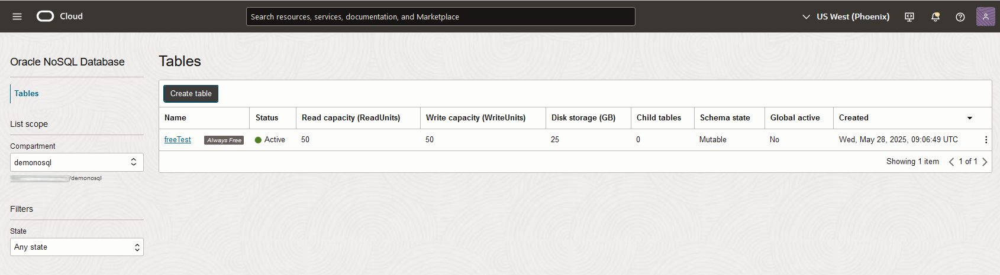
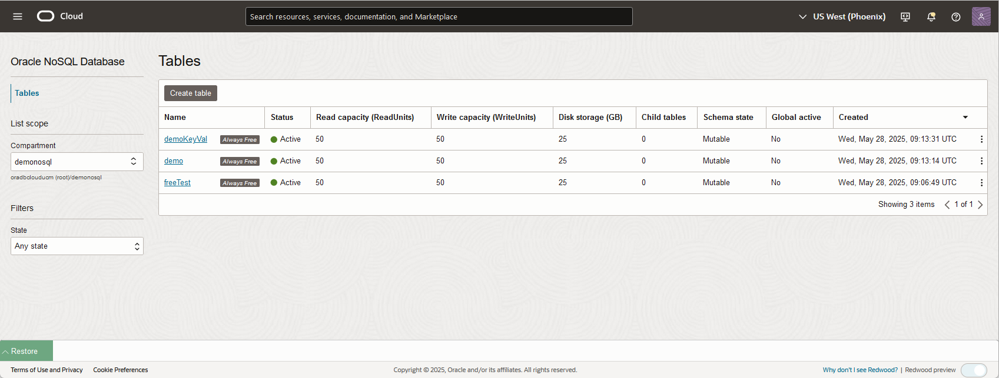
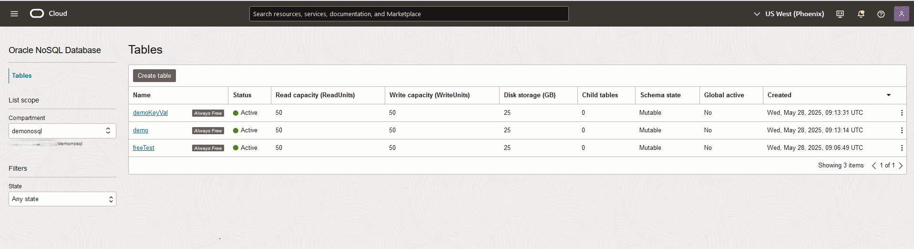
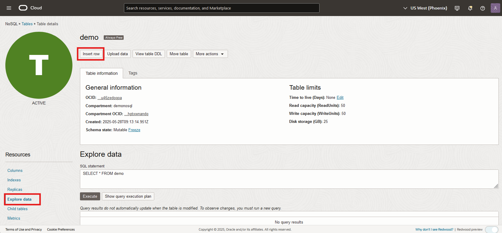

# Create Tables, Load Tables

## Introduction

This lab walks you through creating and loading NoSQL tables. This can be done a variety of different ways including using the Oracle Cloud Console, writing an application program, or triggering actions through a function. This lab will walk you through a couple of different approaches. Oracle NoSQL Database Cloud Service supports both schema-based and schema-less (JSON) modeling so we will create examples of both tables.

_Estimated Lab Time:_ 25 minutes

Watch the video below for a quick walk through of the lab.

[](youtube:V8tWMOXpgIA)

### Objectives

* Create 3 tables with provisioned reads/sec, writes/sec, and GB storage
* Write data to the table and read data from the table
* Look at the data in the tables with the Oracle Cloud Console

### Prerequisites

* An Oracle Free Tier, Paid Account or Green Button
* Connection to the Oracle NoSQL Database Cloud Service
* Working knowledge of bash shell

## Task 1: Create an Oracle NoSQL Table With the Console

<if type="paid">
1. Please verify you are in the Phoenix region.

  

</if>

<if type="freetier">
1. If you are in the Phoenix region, you will be able to create always Free tables. If you are in any other region, then you will create paid tables, however, they will be paid for with credits.

  
</if>

<if type="livelabs">
1. Please verify you are in the Phoenix region.

  

</if>

2. On the Oracle Cloud Infrastructure menu drop down on the left, go to **Databases** and then press **Tables** under Oracle NoSQL Database. This brings you to the 'Tables' screen where you can create a table from the console.

    

<if type="paid">
3. On the 'Tables' screen there is a **Compartment** field on the left. Please make sure **demonosql** compartment is selected.

  
</if>

<if type="freetier">
3. On the 'Tables' screen there is a **Compartment** field on the left. Please make sure **demonosql** compartment is selected.

  
</if>

<if type="livelabs">
3. On the 'Tables' screen there is a **Compartment** field on the left. Please make sure the compartment you were assigned is selected. In Lab 2, task 1 you identified your compartment. You will need to expand the root compartment, and then expand the **LiveLabs** compartment to find it. In this example, we are using **LL46279-COMPARTMENT**. Yours will be different. You will not be able to create tables in any other compartment.

  
</if>

4. Click **Create table** and the 'Create table' screen appears.

    

  This screen allows you to create tables in one of two different ways, either using simple input or using DDL input. For this Lab we are going to use the simple input method.

<if type="paid">
5. The first thing you want to do is click the **Always Free Configuration** toggle button. This will create an always free table. Each tenancy is allowed 3 always free tables. Always free tables have fixed provisioning at 50 read units, 50 write units and 25 GB of storage. NoSQL always free tables are available in the Phoenix region only and you need to be in the correct region to use them. The toggle button only shows up in the Phoenix region.

    

  Clicking the **Always Free Configuration** button grays out the boxes to input provisioning. Next enter a **name** for your table, a **primary key** and a **column** and click **Set as a shard key.** For this example, we used freeTest as the name, pkey with a type of integer as the primary key, and name with a type of string as an additional column.
</if>

<if type="freetier">
5. If you are in the Phoenix region, then the first thing you want to do is click the **Always Free Configuration** toggle button. If not, go to step 6. This will create an always free table. Each tenancy is allowed 3 always free tables. Always free tables have fixed provisioning at 50 read units, 50 write units and 25 GB of storage. NoSQL always free tables are available in the Phoenix region and the toggle button only shows up there.

    

  Clicking the **Always Free Configuration** button grays out the boxes to input provisioning. Next enter a **name** for your table, a **primary key** and a **column** and click **Set as a shard key.**  For this example, we used freeTest as the name, pkey with a type of integer as the primary key, and name with a type of string as an additional column. Proceed to step 7.

6. If not in Phoenix, then enter in values for **Read capacity**, **Write capacity**, and **Disk storage**. Enter in 10,10, and 5 respectively. The **Always Free Configuration** button is grayed out and cannot be used.

   

   Next enter a **name** for your table, a **primary key** and a **column** and click **Set as a shard key.** For this example, we used freeTest as the name, pkey with a type of integer as the primary key, and name with a type of string as an additional column.
</if>

<if type="livelabs">
5. The first thing you want to do is click the **Always Free Configuration** toggle button. This will create an always free table. Each tenancy is allowed 3 always free tables. Always free tables have fixed provisioning at 50 read units, 50 write units and 25 GB of storage. NoSQL always free tables are available in the Phoenix region only and you need to be in the correct region to use them. The toggle button only shows up in the Phoenix region.

    

  Clicking the **Always Free Configuration** button grays out the boxes to input provisioning. Next enter a **name** for your table, a **primary key** and a **column** and click **Set as a shard key.** For this example, we used freeTest as the name, pkey with a type of integer as the primary key, and name with a type of string as an additional column.
</if>


6. When done with inputs click **Create table** at the bottom.

   

  In summary, this screen allows to create a table with multiple columns for the primary key, as well as adding many additional columns. You can create simple or more complex tables with this interface.

7. After clicking **Create table** you will be brought to the 'Tables' screen. This screen shows you a list of tables you have created, as well as basic information about the table. One important thing to notice is that our table has a status of 'Active' which means we are ready to load data into our table. If you created an 'Always Free' table, then a tag that is attached to that table. This lets you know it is an always free table. Without the tag, then it is a paid table.

    


## Task 2: NoSQL Tables Deployment

In this task we are going to create tables using the Cloud Shell, and Oracle Cloud Infrastructure Command Line Interface (CLI). The CLI commands issued from the Cloud Shell make REST calls to the Oracle NoSQL Database Cloud Service (NDCS). Oracle Cloud Infrastructure offers several SDKs in different languages that you can use to make REST calls to NDCS. To make things a little simpler, we have created some shell scripts and files that will assist you in this Task. We need to download those to the Cloud Shell first.

1. Open the **Cloud Shell** from the top right menu.

    

  Execute the following in your Cloud Shell. This creates several JSON documents that will be used in future steps.

    ```
    <copy>
      sh ~/serverless-with-nosql-database/data.sh
    </copy>
    ```

2. Execute the following environment setup shell script in the Cloud Shell. If you close/open the Cloud Shell, please re-execute it.

    ```
    <copy>
    source ~/serverless-with-nosql-database/env.sh
    </copy>
    ```
<if type="paid">
3. Let's create NoSQL tables using the Oracle Cloud Infrastructure Command Line Interface (CLI). The CLI command for Oracle NoSQl is 'oci nosql <command>'. We will create two different tables and  echo the DDL statements so you can see what is being created. One of the tables is a fixed schema table and the other is a JSON document table. To create the always free table using the CLI, you set the '--is-auto-reclaimable' flag to true. The env.sh script run in step 2 detects the region your are in and sets a variable we can use.

    ```
    <copy>
    cd ~/serverless-with-nosql-database/objects
    DDL_TABLE=$(cat demo.nosql)
    echo $DDL_TABLE
    </copy>
    ```
    The echo command will show you the DDL statement that you will execute next.

    ```
    <copy>
    oci nosql table create --compartment-id "$COMP_ID"   \
    --name demo --ddl-statement "$DDL_TABLE" \
    --is-auto-reclaimable "$NOSQL_ALWAYS_FREE" \
    --table-limits="{\"maxReadUnits\": 50,  \"maxStorageInGBs\": 25,  \"maxWriteUnits\": 50 }" \
    --wait-for-state SUCCEEDED --wait-for-state FAILED
    </copy>
    ```
    At the end of this command you should see a "status": "SUCCEEDED" on your screen. Next we will create the second table.

    ```
    <copy>
    DDL_TABLE=$(cat demoKeyVal.nosql)
    echo $DDL_TABLE
    </copy>
    ```
    The echo command will show you the DDL statement that you will execute next.

    ```
    <copy>
    oci nosql table create --compartment-id "$COMP_ID"   \
    --name demoKeyVal  --ddl-statement "$DDL_TABLE" \
    --is-auto-reclaimable "$NOSQL_ALWAYS_FREE" \
    --table-limits="{\"maxReadUnits\": 50,  \"maxStorageInGBs\": 25,  \"maxWriteUnits\": 50 }" \
    --wait-for-state SUCCEEDED --wait-for-state FAILED
    </copy>
    ```
</if>

<if type="livelabs">
3. Let's create NoSQL tables using the Oracle Cloud Infrastructure Command Line Interface (CLI). The CLI command for Oracle NoSQl is 'oci nosql <command>'. We will create two different tables and  echo the DDL statements so you can see what is being created. One of the tables is a fixed schema table and the other is a JSON document table. To create the always free table using the CLI, you set the '--is-auto-reclaimable' flag to true. The env.sh script run in step 2 detects the region your are in and sets a variable we can use.

    ```
    <copy>
    cd ~/serverless-with-nosql-database/objects
    DDL_TABLE=$(cat demo.nosql)
    echo $DDL_TABLE
    </copy>
    ```
    The echo command will show you the DDL statement that you will execute next.

    ```
    <copy>
    oci nosql table create --compartment-id "$COMP_ID"   \
    --name demo --ddl-statement "$DDL_TABLE" \
    --is-auto-reclaimable "$NOSQL_ALWAYS_FREE" \
    --table-limits="{\"maxReadUnits\": 50,  \"maxStorageInGBs\": 25,  \"maxWriteUnits\": 50 }" \
    --wait-for-state SUCCEEDED --wait-for-state FAILED
    </copy>
    ```
    At the end of this command you should see a "status": "SUCCEEDED" on your screen. Next we will create the second table.

    ```
    <copy>
    DDL_TABLE=$(cat demoKeyVal.nosql)
    echo $DDL_TABLE
    </copy>
    ```
    The echo command will show you the DDL statement that you will execute next.

    ```
    <copy>
    oci nosql table create --compartment-id "$COMP_ID"   \
    --name demoKeyVal  --ddl-statement "$DDL_TABLE" \
    --is-auto-reclaimable "$NOSQL_ALWAYS_FREE" \
    --table-limits="{\"maxReadUnits\": 50,  \"maxStorageInGBs\": 25,  \"maxWriteUnits\": 50 }" \
    --wait-for-state SUCCEEDED --wait-for-state FAILED
    </copy>
    ```
</if>

<if type="freetier">
3. Let's create NoSQL tables using the Oracle Cloud Infrastructure Command Line Interface (CLI). The CLI command for Oracle NoSQl is 'oci nosql <command>'. We will create two different tables and  echo the DDL statements so you can see what is being created. One of the tables is a fixed schema table and the other is a JSON document table. To create the always free table using the CLI, you set the '--is-auto-reclaimable' flag to true. The env.sh script run in step 2 detects the region your are in and sets a variable we can use.

    ```
    <copy>
    cd ~/serverless-with-nosql-database/objects
    DDL_TABLE=$(cat demo.nosql)
    echo $DDL_TABLE
    </copy>
    ```
    The echo command will show you the DDL statement that you will execute next.

    ```
    <copy>
    oci nosql table create --compartment-id "$COMP_ID"   \
    --name demo --ddl-statement "$DDL_TABLE" \
    --is-auto-reclaimable "$NOSQL_ALWAYS_FREE" \
    --table-limits="{\"maxReadUnits\": 10,  \"maxStorageInGBs\": 5,  \"maxWriteUnits\": 10 }" \
    --wait-for-state SUCCEEDED --wait-for-state FAILED
    </copy>
    ```
    At the end of this command you should see a "status": "SUCCEEDED" on your screen. Next we will create the second table.

    ```
    <copy>
    DDL_TABLE=$(cat demoKeyVal.nosql)
    echo $DDL_TABLE
    </copy>
    ```
    The echo command will show you the DDL statement that you will execute next.

    ```
    <copy>
    oci nosql table create --compartment-id "$COMP_ID"   \
    --name demoKeyVal  --ddl-statement "$DDL_TABLE" \
    --is-auto-reclaimable "$NOSQL_ALWAYS_FREE" \
    --table-limits="{\"maxReadUnits\": 10,  \"maxStorageInGBs\": 5,  \"maxWriteUnits\": 10 }" \
    --wait-for-state SUCCEEDED --wait-for-state FAILED
    </copy>
    ```
</if>    

4. Minimize the Cloud Shell by clicking the **minimization button.**

    


## Task 3:  Adding Data From the Oracle Cloud Console

1. Make sure you see the 'Tables' screen. You should see 3 tables listed. You may or may not see the 'Always Free' tag, this displays depending on how you created the tables.  You may see different values for read units, write units and storage.

    

2. Let's start with the simple table we created in Task 1. Click **freeTest** table. The details screen that shows up, displays all the key information about the table. Explore that screen.

    

3. Click **Insert row**, and the 'Insert row' screen appears.

    

4. On the 'Insert row' screen, you will see two ways to input data - a simple and advanced. For our freeTest table we will use the simple method. Enter a value for the **Pkey** column and the **Name** column. When done, press **Insert row.**

    

5. Let's insert rows into another table. First we need to get back to the 'Tables' screen. Click **Tables** on top right.

    

6. Click **demo** table

    

7. Click **Insert row.** This opens up a new window. This time, choose **Advanced JSON Input.**

  Copy/Paste the JSON Baggage document below in the **JSON input** text box. Because this JSON document is complex, it is easiest to copy/paste into the field. However, you could have typed it all in.

    ```
    <copy>
    {
      "fullName" : "Abram Falls",
      "contactPhone" : "921-284-5378",
      "ticketNo" : "176233524485",
      "confNo" : "HP1D4H",
      "gender" : "F",
      "bagInfo" : [ {
        "id" : "79039899127071",
        "tagNum" : "17657806285185",
        "routing" : "SYD/SIN/LHR",
        "lastActionCode" : "OFFLOAD",
        "lastActionDesc" : "OFFLOAD",
        "lastSeenStation" : "LHR",
        "flightLegs" : [ {
          "flightNo" : "BM254",
          "flightDate" : "2019.02.28 at 22:00:00 AEDT",
          "fltRouteSrc" : "SYD",
          "fltRouteDest" : "SIN",
          "estimatedArrival" : "2019.03.01 at 03:00:00 SGT",
          "actions" : [ {
            "actionAt" : "SYD",
            "actionCode" : "ONLOAD to SIN",
            "actionTime" : "2019.02.28 at 22:09:00 AEDT"
          }, {
            "actionAt" : "SYD",
            "actionCode" : "BagTag Scan at SYD",
            "actionTime" : "2019.02.28 at 21:51:00 AEDT"
          }, {
            "actionAt" : "SYD",
            "actionCode" : "Checkin at SYD",
            "actionTime" : "2019.02.28 at 20:06:00 AEDT"
          } ]
        }, {
          "flightNo" : "BM272",
          "flightDate" : "2019.02.28 at 19:09:00 SGT",
          "fltRouteSrc" : "SIN",
          "fltRouteDest" : "LHR",
          "estimatedArrival" : "2019.03.01 at 03:10:00 GMT",
          "actions" : [ {
            "actionAt" : "LHR",
            "actionCode" : "Offload to Carousel at LHR",
            "actionTime" : "2019.03.01 at 03:01:00 GMT"
          }, {
            "actionAt" : "SIN",
            "actionCode" : "ONLOAD to LHR",
            "actionTime" : "2019.03.01 at 11:20:00 SGT"
          }, {
            "actionAt" : "SIN",
            "actionCode" : "OFFLOAD from SIN",
            "actionTime" : "2019.03.01 at 11:10:00 SGT"
          } ]
        } ],
        "lastSeenTimeGmt" : "2019.03.01 at 03:06:00 GMT",
        "bagArrivalDate" : "2019.03.01 at 03:06:00 GMT"
      } ]
    }
    </copy>
    ```


8. Click **Insert row** at bottom left of screen.

  To summarize, in this Lab you have seen two different ways to insert data into a table.

## Task 4:  Show Data From the Console

Starting with the demo table, we can go and look at the data we inserted for each of the tables.

1. On the left click **Explore data**

    

2. In the textbox **Query**, keep the text 'SELECT * FROM demo.'' This will select all the rows from our table. Click **Run query**

    

  You will see in the bottom of the screen the row that we inserted.

3. Go to the top left, press **Tables**, select the **freeTest** table, and look at the row inserted into that table.

You may now **proceed to the next lab.**

## Learn More

* [Oracle NoSQL Database Cloud Service page](https://www.oracle.com/database/nosql-cloud.html)
* [About Oracle NoSQL Database Cloud Service](https://docs.oracle.com/en/cloud/paas/nosql-cloud/dtddt/index.html)
* [About Cloud Shell](https://docs.oracle.com/en-us/iaas/Content/API/Concepts/cloudshellintro.htm)


## Acknowledgements
* **Author** - Dario Vega, Product Manager, NoSQL Product Management and Michael Brey, Director, NoSQL Product Development
* **Last Updated By/Date** - Michael Brey, Director, NoSQL Product Development, September 2021
