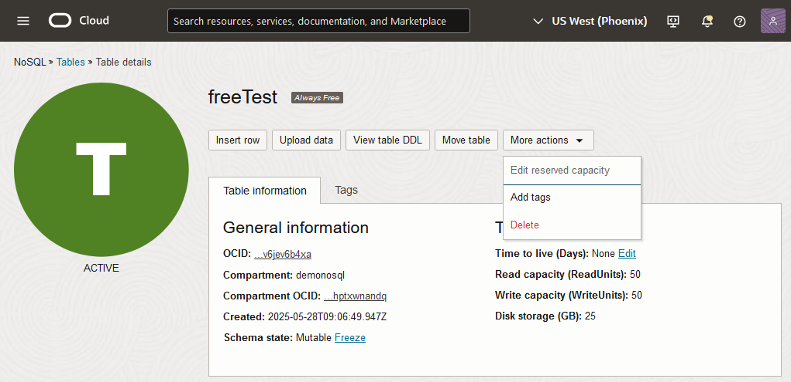
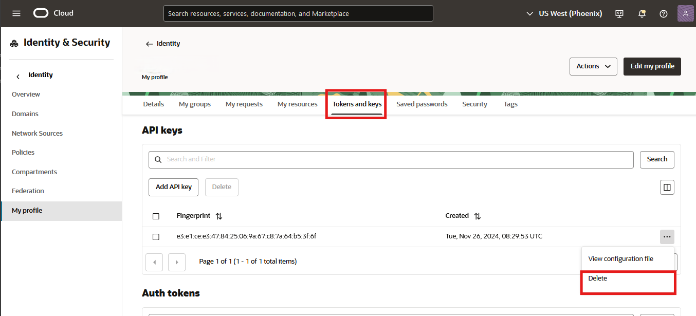

# Explore Data, Run Queries

## Introduction

This lab picks up where lab 3 left off. We are going to explore in more detail the tables we created, load data, and execute queries using a Python application.

_Estimated Lab Time:_ 25 minutes

Watch the video below for a quick walk through of the lab.

[](youtube:g1CATzd5wtg)

### Objectives

* Understand the different tables
* Read data with REST API
* Read data with a Python application

### Prerequisites

* An Oracle Free Tier, Paid Account or Green Button
* Connection to the Oracle NoSQL Database Cloud Service
* Working knowledge of bash shell
* Working knowledge of SQL language


## Task 1: Restart the Cloud Shell

1. Let's get back into the Cloud Shell. From the earlier lab, you may have minimized it in which case you need to enlarge it. It is possible it may have become disconnected and/or timed out. In that case, restart it.

    

2. Execute the following environment setup shell script in the Cloud Shell to set up your environment. If you close/open the Cloud Shell Console, please re-execute it.

    ```
    <copy>
    source ~/serverless-with-nosql-database/env.sh
    </copy>
    ```

## Task 2: Load Data and Examine It

The goal of this task is to understand the difference between the 2 data models used. The demoKeyVal table is a schema-less table, sometimes referred to as a JSON document, that contains a primary key and a JSON column. The demo table has a primary key, several fixed columns and a JSON column. This is sometimes referred to as a fixed-schema table. These tables are logically equivalent. Which data model you use depends on your business model. Oracle NoSQL Database Cloud Service is extremely flexible in how you can model your data. It is a true multi-model database service.

  

1. Install the Node.js application. Execute in the Cloud Shell.

    ```
    <copy>
    cd ~/serverless-with-nosql-database/express-nosql
    npm install
    npm install oracle-nosqldb --save
    node express-oracle-nosql.js &
    </copy>
    ```
    **Note:** This will start the "express-oracle-nosql" application in the background.

2. After you complete step 1, you will see a message in the shell saying 'application running'

    

    Press the **Enter** key on your keypad to get the command line prompt back.

3. Insert data into the demo table.

  This will be done using a curl command to transfer data over the network to the NoSQL store using the "express-oracle-nosql" application. Execute in Cloud Shell.

    ```
    <copy>
    FILE_NAME=`ls -1 ~/BaggageData/baggage_data_file99.json`
    curl -X POST -H "Content-Type: application/json" -d @$FILE_NAME http://localhost:3000/demo
    FILE_NAME=`ls -1 ~/BaggageData/baggage_data_file9.json`
    curl -X POST -H "Content-Type: application/json" -d @$FILE_NAME http://localhost:3000/demo
    FILE_NAME=`ls -1 ~/BaggageData/baggage_data_file103.json`
    curl -X POST -H "Content-Type: application/json" -d @$FILE_NAME http://localhost:3000/demo
    FILE_NAME=`ls -1 ~/BaggageData/baggage_data_file2.json`
    curl -X POST -H "Content-Type: application/json" -d @$FILE_NAME http://localhost:3000/demo
    FILE_NAME=`ls -1 ~/BaggageData/baggage_data_file84.json`
    curl -X POST -H "Content-Type: application/json" -d @$FILE_NAME http://localhost:3000/demo
    </copy>
    ```
4. Insert data into the demoKeyVal table. Execute in Cloud Shell.

    ```
    <copy>
    FILE_NAME=`ls -1 ~/BaggageData/baggage_data_file99.json`
    curl -X POST -H "Content-Type: application/json" -d @$FILE_NAME http://localhost:3000/demoKeyVal
    FILE_NAME=`ls -1 ~/BaggageData/baggage_data_file9.json`
    curl -X POST -H "Content-Type: application/json" -d @$FILE_NAME http://localhost:3000/demoKeyVal
    FILE_NAME=`ls -1 ~/BaggageData/baggage_data_file103.json`
    curl -X POST -H "Content-Type: application/json" -d @$FILE_NAME http://localhost:3000/demoKeyVal
    FILE_NAME=`ls -1 ~/BaggageData/baggage_data_file2.json`
    curl -X POST -H "Content-Type: application/json" -d @$FILE_NAME http://localhost:3000/demoKeyVal
    FILE_NAME=`ls -1 ~/BaggageData/baggage_data_file84.json`
    curl -X POST -H "Content-Type: application/json" -d @$FILE_NAME http://localhost:3000/demoKeyVal
    </copy>
    ```
5. Read back the data that we just entered. Execute in the Cloud Shell. In the second two queries, we use a limit clause which limits the number of rows returned. We also use an order by clause to sort the returned results.

    ```
    <copy>
    curl -X GET http://localhost:3000/demo  | jq
    </copy>
    ```

    This will display all the rows in the table currently.

    ```
    <copy>
    curl  "http://localhost:3000/demo?limit=3&orderby=ticketNo"  | jq
    </copy>
    ```

    This will display the 3 rows in the table ordered by ticket number.

    ```
    <copy>
    curl  "http://localhost:3000/demo?limit=12&orderby=fullName"  | jq
    </copy>
    ```
    This will display the 12 rows in the table ordered by full name. In our case, we only have 5 rows total, so it displays all existing rows.

6. Read data for a specific ticket number using GET command. Execute in Cloud Shell.

    ```
    <copy>
    curl -X GET http://localhost:3000/demo/1762322446040  | jq
    </copy>
    ```
7. In the baggage tracking demo from Lab 1, which is running live in all the regions, a Node.js application was running in the background. We can install that application, and run it on our data. It uses a different port number than the previous application we installed. It will also run in the background, press the **Enter** key like you did before to get the prompt back. Execute in Cloud Shell.

    ```
    <copy>
    cd ~/serverless-with-nosql-database/express-nosql
    npm install
    npm install oracle-nosqldb --save
    node express-baggage-demo-nosql.js &
    </copy>
    ```

8. We can run a few queries by ticket number and flight number. Execute in Cloud Shell.

    ```
    <copy>
    curl -X GET http://localhost:3500/getBagInfoByTicketNumber?ticketNo=1762322446040  | jq
    </copy>
    ```

    ```
    <copy>
    curl -X GET http://localhost:3500/getBagInfoByTicketNumber  | jq
    </copy>
    ```

    ```
    <copy>
    curl -X GET http://localhost:3500/getBagInfoByTicketNumber | jq '. | length'
    </copy>
    ```

    ```
    <copy>
    curl -X GET http://localhost:3500/getPassengersAffectedByFlight?flightNo=BM715  | jq
    </copy>
    ```
  Each of these produced slightly different results. The first one display the document with a specific ticket number, the second displayed all the records and the third gave a count of the records.

  For the last one,  you can see in the "message" field "getPassengersAffectedByFlight under construction." In other words the code for that endpoint has not been completed yet. Feel free to take a look at the code using below.

      ```
      <copy>
      cat express-baggage-demo-nosql.js
      </copy>
      ```

9. You can also execute sql statements using Oracle Cloud Infrastructure CLI commands. Going this route, you will be querying the data over REST. Execute in Cloud Shell.

    ```
    <copy>
    SQL_STATEMENT=$(cat ~/serverless-with-nosql-database/objects/query1.sql | tr '\n' ' ')
    echo "$SQL_STATEMENT"
    </copy>
    ```

    ```
    <copy>
    oci nosql query execute -c  $COMP_ID --statement "$SQL_STATEMENT"
    </copy>
    ```
  In this case, the data is formatted as a nice JSON document.


## Task 3: Read Data Using a Python CLI Application

1. Create the Python CLI application in the Cloud shell. Execute in Cloud Shell.

    ```
    <copy>
    source ~/serverless-with-nosql-database/env.sh
    cd ~/serverless-with-nosql-database/
    pip3 install borneo
    pip3 install cmd2  
    </copy>
    ```

    ```
    <copy>
    python3 nosql.py -s cloud -t $OCI_TENANCY -u $NOSQL_USER_ID -f $NOSQL_FINGERPRINT -k ~/NoSQLLabPrivateKey.pem -e https://nosql.${OCI_REGION}.oci.oraclecloud.com
    </copy>
    ```
2. This will create a Python NoSQL shell that you can load data or execute queries in.

   


3. Load additional data so we can run some queries. Execute in Cloud Shell.

    ```
    <copy>
    load ../BaggageData/load_multi_line.json demo
    </copy>
    ```

4. Execute the following queries. Execute in Cloud Shell.

    ```
    <copy>
    SELECT count(*) FROM demo d;
    </copy>
    ```
    This counts all the records in the table.

    ```
    <copy>
    SELECT *
    FROM demo d
    WHERE d.bagInfo.flightLegs.flightNo =ANY 'BM254';
    </copy>
    ```
    This will grab all records where a bag was on flight BM254.

    ```
    <copy>
    SELECT d.fullName, d.contactPhone, d.ticketNo , d.bagInfo.flightLegs.flightNo as bagInfo
    FROM demo d
    WHERE d.bagInfo.flightLegs.flightNo =ANY 'BM866';
    </copy>
    ```
    This will grab basic information for bags on flight BM866. We are also renaming a field in the output.

    ```
    <copy>
    SELECT d.fullName, d.contactPhone, d.ticketNo , d.bagInfo.flightLegs.flightNo as bagInfo
    FROM demo d
    WHERE d.bagInfo.flightLegs.flightNo =ANY "BM715"
    AND d.bagInfo.flightLegs.flightNo =ANY "BM204";
    </copy>
    ```
    This will grab basic information on bags that were on flight BM715 and BM204.

    ```
    <copy>
    SELECT d.fullName, d.contactPhone, d.ticketNo , d.bagInfo.flightLegs.flightNo as bagInfo
    FROM   demo d
    WHERE  d.bagInfo.flightLegs.flightNo =ANY "BM604"
    AND    d.bagInfo.flightLegs.flightNo =ANY "BM667"
    AND    size(d.bagInfo.flightLegs) = 2;
    </copy>
    ```
    This will grab basic information on bags that were on flight BM604 and BM667 and the total journey was 2 legs.

5. Write new queries to answer the following questions. This should give an appreciation of the types of queries that can be written against Oracle NoSQL Database Cloud Service.

      - Retrieve the names and phone numbers for passengers that had a bag with any action on any flight leg that occurred at the Sydney Airport(SYD). **Hint:** Every record has an actions array at: bagInfo.flightLegs.actions

      - Find the number of bags on flight BM715. **Hint:** The size of the bagInfo array represents the number of bags a passenger has checked.

      - Find the names of passengers that had their bags initially loaded in Chicago. **Hint:** Chicago Airport(ORD).

  **Note:** The Learn More contains a link to the SQL Reference Guide. Lab 3, Task 3 contains an example of the JSON record to look at.

6. Type in **exit** to exit from the Python application.

7. Minimize the Cloud Shell by pressing the **minimize** key.


## Task 4: Clean Up

This task deletes the tables and other OCI components that got created.

<if type="paid">
1. On the top left, go to menu, then **Databases**, then under Oracle NoSQL Database, press **Tables**
Set your compartment to 'demonosql'. Click the **freeTest** table, which will bring up the table details screen. Press **More Actions** and then **Delete** under that. This will bring up a new screen and you will need to press **Delete** again.

  

  Deleting tables is an async operation, so you will not immediately see the results on the Oracle Cloud Console. Eventually the status of the tables will get changed to deleted.
</if>

<if type="freetier">
1. On the top left, go to menu, then **Databases**, then under Oracle NoSQL Database, press **Tables**
Set your compartment to 'demonosql'. Click the **freeTest** table, which will bring up the table details screen. Press **More Actions** and then **Delete** under that. This will bring up a new screen and you will need to press **Delete** again.

  

  Deleting tables is an async operation, so you will not immediately see the results on the Oracle Cloud Console. Eventually the status of the tables will get changed to deleted.
</if>

<if type="livelabs">
1. On the top left, go to menu, then **Databases**, then under Oracle NoSQL Database, press **Tables**
Select your compartment. Click the **freeTest** table, which will bring up the table details screen. Press **More Actions** and then **Delete** under that. This will bring up a new screen and you will need to press **Delete** again.

  

  Deleting tables is an async operation, so you will not immediately see the results on the Oracle Cloud Console. Eventually the status of the tables will get changed to deleted.
</if>

2. Return to the 'Tables' screen and repeat the process for the **demo** and **demoKeyVal** tables.

<if type="paid">
3. If you created an API Key, delete that. It will show up as a fingerprint. Click your **Profile**, then **User Settings** and **Tokens and keys** . Click the 3 dots on the right of the fingerprint you created. Click **Delete**.

  

4. Remove the files added into your Cloud Shell. Open Cloud Shell and execute. Minimize Cloud Shell.

    ```
    <copy>
    cd ~
    rm -rf *
    </copy>
    ```

5. Remove the 'demonosql' compartment. From upper left hand menu, go to **Identity and Security** then **Compartments** under 'Identity.'

    

6. The 'Compartments' screen appears and click **demonosql**

    

7. Press the **Delete** button. This will fire off a job that runs asynchronously.

    
</if>

<if type="freetier">
3. If you created an API Key, delete that. It will show up as a fingerprint. Click your **Profile**, then **User Settings** and **API Key** on the left. Click the 3 dots on the right of the fingerprint you created. Click **Delete**.

    

4. Remove the files added into your Cloud Shell. Open Cloud Shell and execute. Minimize Cloud Shell.

    ```
    <copy>
    cd ~
    rm -rf *
    </copy>
    ```

5. Remove the 'demonosql' compartment. From upper left hand menu, go to **Identity and Security** then **Compartments** under 'Identity.'

    

6. The 'Compartments' screen appears and click **demonosql**

    

7. Press the **Delete** button. This will fire off a job that runs asynchronously.

    
</if>

## Learn More


* [Oracle NoSQL Database Cloud Service page](https://www.oracle.com/database/nosql-cloud.html)
* [About Oracle NoSQL Database Cloud Service](https://docs.oracle.com/en/cloud/paas/nosql-cloud/dtddt/index.html)
* [Java API Reference Guide](https://oracle.github.io/nosql-java-sdk/)
* [Node API Reference Guide](https://oracle.github.io/nosql-node-sdk/)
* [Python API Reference Guide](https://nosql-python-sdk.readthedocs.io/en/latest/index.html)
* [NoSQL SQL Reference Manual](https://docs.oracle.com/en/database/other-databases/nosql-database/22.3/sqlreferencefornosql/index.html)
* [About Cloud Shell](https://docs.oracle.com/en-us/iaas/Content/API/Concepts/cloudshellintro.htm)


## Acknowledgements
* **Author** - Dario Vega, Product Manager, NoSQL Product Management and Michael Brey, Director, NoSQL Product Development
* **Last Updated By/Date** - Michael Brey, Director, NoSQL Product Development, September 2021
