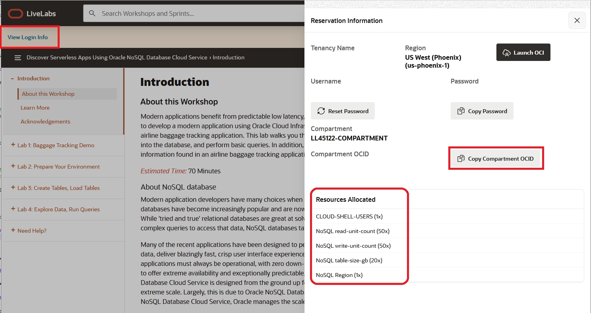
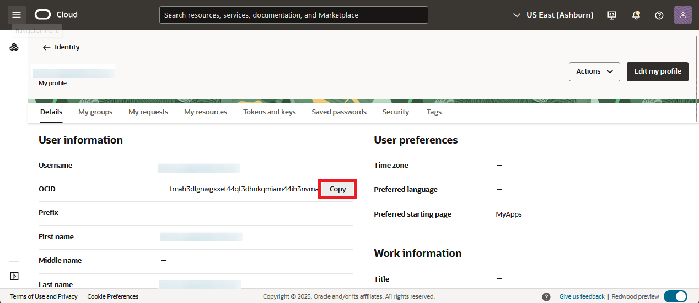
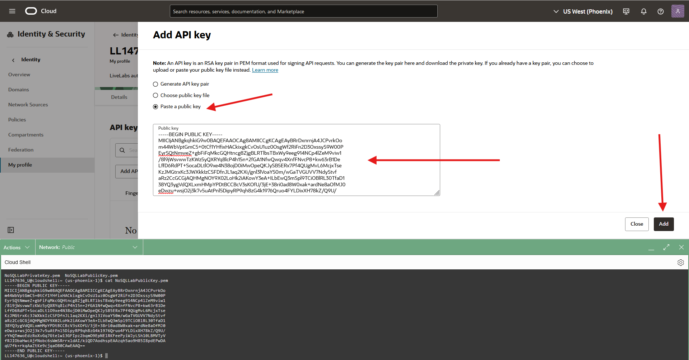

# Prepare Your Environment

## Introduction

This lab walks you through the steps necessary to create a proper operating environment.

_Estimated Lab Time:_ 5 minutes

### Objectives

In this lab you will:
* Use Compartment Created by Green Button
* Create API Key
* Learn about Credentials, and Policies
* Set up Cloud Shell

### Prerequisites

This lab assumes you have:

* An Oracle Free Tier, Paid Account or Green Button
* Knowledge of vi, vim or emacs

## Task 1: Get Compartment OCID

Once you LiveLabs test environment was set up, you should have clicked on a button saying to 'Attend the Workshop.'This will take you to a screen that looks similar to this.

  

This environment does not allow you to create any compartments. Please take note of the compartment assigned. Under the **Compartment** is the **Compartment OCID.** Copy your **Compartment OCID** with the copy button and save for step 10 in Task 2. Paste it into notepad or some text file for use.

Please make note of the **Region** you are assigned. If you are assigned Phoenix, then you will be able to create Always Free NoSQL tables. If you are in another region, then you will be creating paid tables. This information is important for Lab 3. There are no costs to HOL users when creating and using paid tables.

## Task 2: Create an API Key For Your User

1. Top right, click your **Profile**, then **User Settings.**

  

2. Copy your OCID. Make sure to **save your OCID** for future steps. Paste it into notepad or some text file for use in step 10.

    

3. In this step we need to execute a few commands in the Cloud Shell. To start the Cloud Shell, we have to select our compartment first. Click on the 'hamburger' menu on the top left. Click on **Databases** and then click on **Tables**.

    

4. In the **Compartment** drop down on the left, pick you compartment. In Task 1, you should have taken note of your compartment. To find it, expand the root node (**c4u04**), then expand the **Livelabs** node. Your compartment should be listed under there. In this example we are using **LL11090-COMPARTMENT**.

    

5. Open the **Cloud Shell** in the top right menu. It can take about 2 minutes to get the Cloud Shell started.

    

  **Note:** Your **Home Region** may be different than the region you are currently connected to. In the example screen below, you are connected to Phoenix but the **Home Region** is Ashburn. You can create Always Free NoSQL tables when connected to Phoenix.

    

6. Execute these commands in your Cloud Shell to create a private and a public key.

    ````
    <copy>
    openssl genrsa -out NoSQLLabPrivateKey.pem  4096        
    openssl rsa -pubout -in NoSQLLabPrivateKey.pem -out NoSQLLabPublicKey.pem
    </copy>
    ````

7. Grab you a copy of your public key. Execute in Cloud Shell.

        ````
        <copy>
        cat NoSQLLabPublicKey.pem
        </copy>
        ````
      This will print out your public key to the screen. Grab a copy of the entire key, including the "BEGIN/END PUBLIC KEY" lines. Paste it into notepad or some text file for use in step 10.

      Minimize the Cloud shell.

8. Top right, click your **Profile**, then **User Settings.**

    


9. On the left, click **API Keys**, then click **Add API Key.**

    

10. Click on **Paste Public Key**

    

   Paste your public key into the **Public Key** text box. Click **Add** at the bottom.

   

11. Copy your fingerprint and paste it into notepad or some text file for use in step 12. Click **Close** when done.

  

12. You should have saved 3 pieces of information, the compartment OCID, your user OCID and your fingerprint. This step requires you to edit a shell script and insert that information into the script. We will use vi for this but if you are comfortable with vim or emacs then use either. Expand your Cloud Shell and execute.

    ````
    <copy>
      cd $HOME
      rm -rf serverless-with-nosql-database BaggageData serverless-with-nosql-database.zip demo-lab-nosql-main
      curl https://objectstorage.us-ashburn-1.oraclecloud.com/p/VEKec7t0mGwBkJX92Jn0nMptuXIlEpJ5XJA-A6C9PymRgY2LhKbjWqHeB5rVBbaV/n/c4u04/b/livelabsfiles/o/data-management-library-files/demo-lab-nosql-main.zip -o serverless-with-nosql-database.zip
      unzip serverless-with-nosql-database.zip
      mv demo-lab-nosql-main serverless-with-nosql-database
      cp ~/NoSQLLabPrivateKey.pem  ~/serverless-with-nosql-database/express-nosql
      cp ~/serverless-with-nosql-database/env-livelab.sh ~/serverless-with-nosql-database/env.sh
      cd serverless-with-nosql-database
    </copy>
    ````

  Let's use vi to edit env.sh. Once you go into vi, you will hit 'i' to go into insert mode. You will see 3 variables that need to be set correctly based on real data. Replace **your\_compartment\_ocid**, **your\_user\_ocid**, and **your\_fingerprint** with the actual values that you save from previous steps.

      ````
      <copy>
        vi env.sh
      </copy>
      ````

      

  Copy and paste one at a time. We recommend using Right Click and selecting 'Paste' from the menu. Using Ctrl-V can drop characters.

  When completed it should look something like this.

  

  To exit out of vi, click esc, then type in ":wq" and your changes will be saved.

13. Exit Cloud Shell  

## Task 3: Understand Credentials, and Policies

**Oracle NoSQL Database Cloud Service uses Oracle Cloud Infrastructure Identity and Access Management to provide secure access to Oracle Cloud.** Oracle Cloud Infrastructure Identity and Access Management enables you to create user accounts and give users permission to inspect, read, use, or manage tables. Credentials are used for connecting your application to the service and are associated with a specific user. The credentials consist of the tenancy ID, the user ID, an API signing key, a fingerprint and optionally a passphrase for the signing key. These got created in Task 2 of this lab and are stored in the info.json file in your Cloud Shell.

The Oracle NoSQL Database SDKs allow you to provide the credentials to an application in multiple ways. The SDKs support a configuration file as well as one or more interfaces that allow direct specification of the information. You can use the SignatureProvider API to supply your credentials to NoSQL Database. Oracle NoSQL has SDKs in the following languages:  Java, Node.js, Python, Go, Spring and C#.

In this node.js snippet, we used similiar credential information created in Task 2 of this Lab and specified the credentials directly as part of auth.iam property in the initial configuration. The tenancy ID, the user ID, an API signing key, a fingerprint are all supplied. The tenancy iD and the user ID are referred to as OCIDs.

````
       return new NoSQLClient({
            region: Region.EU_FRANKFURT_1,
			compartment:'demonosql',
            auth: {
                iam: {
                    tenantId: 'ocid1.tenancy.oc1..aaaaaaaahrs4avamaxisc...........slpsdb2d2xe2kp2q',
                    userId: 'ocid1.user.oc1..aaaaaaaaq.......co3ssybmexcu4ba',
                    fingerprint: 'e1:4f:7f:e7:b5:7c:11:38:ed:e5:9f:6d:92:bb:ae:3d',
                    privateKeyFile: 'NoSQLprivateKey.pem'
                }
            }
        });
````

  Another way to handle authentication is with Instance and Resource Principals. The Oracle NoSQL SDKs support both of them. Resource principals are primarily used when authenticating from functions. We will show you an example of using Resource Principals.

  Instance Principals is a capability in Oracle Cloud Infrastructure Identity and Access Management (IAM) that lets you make service calls from an instance. With instance principals, you don’t need to configure user credentials or rotate the credentials. Instances themselves are a principal type in IAM and are set up in IAM. You can think of them as an IAM service feature that enables instances to be authorized actors (or principals) to perform actions on service resources.

  Oracle NoSQL Database Cloud service has three different resource types, namely, nosql-tables, nosql-rows, and nosql-indexes. It also has one aggregate resource called nosql-family. Policies are created that allow a group to work in certain ways with specific types of resources such as nosql-tables in a particular compartment. All NoSQL tables belong to a defined compartment. In Task 1 of this Lab, we created the demonosql compartment and this is where we will create our tables.

  You can use **Resource Principals** to do the connection to NoSQL Cloud Service as shown below in the Node.js and Python examples instead of specifying the credentials. Once they are set up, they are simple to use because all you need to do is call the appropriate authorization constructor.

In this snippet, there are hard-coded references (for example, REGION).

**NoSQL Database Node.js SDK**
```
function createClientResource() {
  return  new NoSQLClient({
    region: Region.EU_FRANKFURT_1,
    compartment:'demonosql',
    auth: {
        iam: {
            useResourcePrincipal: true
        }
    }
  });
}
```
If you wanted to use **Instance Principals** instead of Resource Principals, then replace "useResourcePrincipal: true"  with "useInstancePrincipal: true" to switch.

**NoSQL Database Python SDK**
```
def get_handle():
     provider = borneo.iam.SignatureProvider.create_with_resource_principal()
     config = borneo.NoSQLHandleConfig('eu-frankfurt-1', provider).set_logger(None)
     return borneo.NoSQLHandle(config)
```

A similar switch can be made here to use **Instance Principals**, replace "create\_with\_resource\_principal()" with "create\_with\_instance\_principal()" and you are all set.

In the next labs we are going to be running application code and we need an instance to run that from. In Task 2 we started the Cloud Shell and we will run the application from that instance. Currently, Cloud Shell does not support Instance Principals so in those labs we will be using credentials.

You may now **proceed to the next lab.**

## Learn More

* [About Identity and Access Management](https://docs.oracle.com/en-us/iaas/Content/Identity/Concepts/overview.htm)
* [About Managing User Credentials](https://docs.oracle.com/en-us/iaas/Content/Identity/Tasks/managingcredentials.htm)
* [About Cloud Shell](https://docs.oracle.com/en-us/iaas/Content/API/Concepts/cloudshellintro.htm)


## Acknowledgements
* **Author** - Dario Vega, Product Manager, NoSQL Product Management and Michael Brey, Director, NoSQL Product Development
* **Last Updated By/Date** - Michael Brey, Director, NoSQL Product Development, September 2021
