# Explore RAFT Replication Topology

## Introduction   
Oracle Sharding is a scalability and availability feature for custom-designed OLTP applications that enables the distribution and replication of data across a pool of Oracle databases that do not share hardware or software. The pool of databases is presented to the application as a single logical database.

This workshop is configured with a custom image having all the required podman containers for Sharding using 23c GSM and 23c SIDB Beta Images.

In this workshop, we attempt to use minimal resources to show the demonstration, and in the process we chose a single compute instance to install all of the Oracle Sharding components and appclient.


*Estimated Time*:  1 hour


### Objectives
In this lab, you will:
* Explore RAFT Replication environment.
* Testing the use-cases

### Prerequisites
This lab assumes you have:
- A Free Tier, Paid or LiveLabs Oracle Cloud account
- You have completed:
    - Lab: Prepare Setup (*Free-tier* and *Paid Tenants* only)
    - Lab: Environment Setup
    - Lab: Initialize Environment


## Task 1: Check for containers in your VM

1. Open a terminal window and execute below as **opc** user.

    ```
    <copy>
    sudo podman ps -a
    </copy>
    ```

     

## Task 2: Explore the RAFT configuration

When Raft replication is enabled, a sharded database contains multiple replication units. A replication unit (RU) is a set of chunks that have the same replication topology. Each RU has three replicas placed on different shards. The Raft consensus protocol is used to maintain consistency between the replicas in case of failures, network partitioning, message loss, or delay.

Replicas of an RU make up a Raft group, which consists of an elected leader and a number of followers. In Oracle Sharding the number of followers is limited to two. All DMLs for a particular subset of data are executed in the leader and then are replicated to its followers.

Changes to data made by a DML are recorded in the Raft log. A commit record is also recorded at the end of each user transaction. Raft logs are maintained independently from redo logs and contain logical changes to rows. The logical replication reduces failover time because followers are open to incoming transactions and can quickly become the leader.

For more details check [Configuring and Managing Raft Replication] (https://docs-uat.us.oracle.com/en/database/oracle/oracle-database/23/shard/oracle-sharding-raft-replication.html#GUID-34651C7B-7799-4797-9A47-495B984A06CD)

1. Run in the terminal as **oracle** user and connect to the shard director server.
    ```
    <copy>
    sudo podman exec -i -t gsm1 /bin/bash
    </copy>
    ```

    

2. Verify sharding topology using the  **CONFIG** command.

    ```
    <copy>
    gdsctl config shard
    </copy>
    ```

    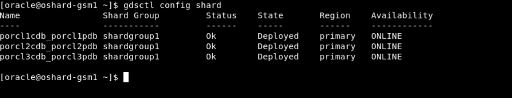

3. Lists all of the database shards and the chunks that they contain.

    ```
    <copy>
    gdsctl config chunks
    </copy>
    ```

    

4. Display run time for replication units, specifically to view chunk distribution across all RUs.

    ```
    <copy>
    gdsctl status ru -show_chunks
    </copy>
    ```

    

5. Display the replication type.

    ```
    <copy>
    gdsctl config sdb
    </copy>
    ```

    

 6.   Exit from GSM1.

## Task 3: Changing the Replication Unit Leader

Using SWITCHOVER RU, you can change which replica is the leader for the specified replication unit. The -db option makes the specified database the new leader of the given RU. 

1. Run the below command on GSM1 to view the status of all the leaders

    ```
    <copy>
    gdsctl status ru -leaders
    </copy>
    ```

    

2. Change the leader of the RU 1 to Shard2:

    ```
    <copy>
    gdsctl switchover ru -ru 1 -database porcl2cdb_porcl2pdb
    </copy>
    ```
    


3. Check the status after the change:

    ```
    <copy>
    gdsctl status ru -leaders
    </copy>
    ``` 
    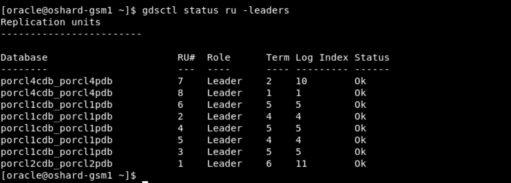

## Task 4: Run the workload

Please use the below steps to run the workload using the "app_schema" account with the available configuration files on the "appclient" container:

1.  Switch to the "appclient" container

    ```
    <copy>
    sudo podman exec -it appclient /bin/bash
    </copy>
    ```

2. Switch to the "oracle" user

    ```
    <copy>
    su - oracle
    </copy>
    ```


3. Change the path to $DEMO_MASTER location

    ```
    <copy>
    cd $DEMO_MASTER
    pwd
    ls -rlt
    </copy>
    ```

    

4. Run the workload using the below command

    ```
    <copy>
    sh run.sh demo
    </copy>
    ```
    

    

5. During this time, you can continue to check the RU details from another session on the "gsm1" container from "gdsctl" prompt.
Notice that the log index is increasing as there are read and write operations are going on.

    ```
    <copy>
    gdsctl status ru -show_chunks
    </copy>
    ```

    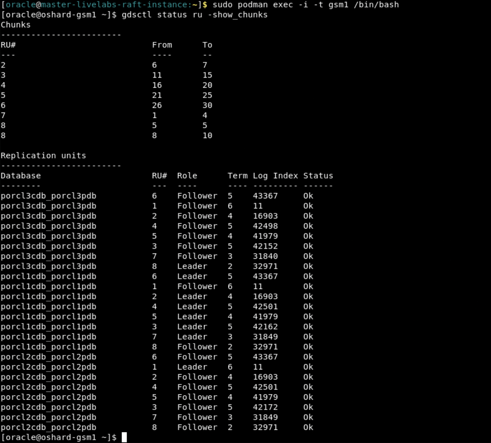

6. You can stop the workload using ctrl+c.


## Task 5: Test High Availability 

What happens when one of the available shard databases goes down or is taken down for maintenance? 
Failover test by stopping shard1  to create shard1 down situation. 

1. Before starting the failover test, lets connect to the catalog database as schema, app_shard and create a sharded table  and insert some data

   ```
    <copy>
    sudo podman exec -it pcatalog /bin/bash
    </copy>
    ```
2. connect to sqlplus and run this command to enable the following parameter on catalog.
   Re-start the catalog & all the 3 shards (cdb level).

    ```
    <copy>
     alter system set shard_enable_raft_follower_read = TRUE scope=both;
    </copy>
    ```
   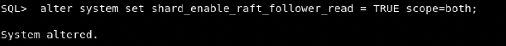  

2. Connect to catalog and run sqlplus to set the container=PCAT1PDB.

    ```
    <copy>
    alter session set container=PCAT1PDB;
    </copy>
    ```
    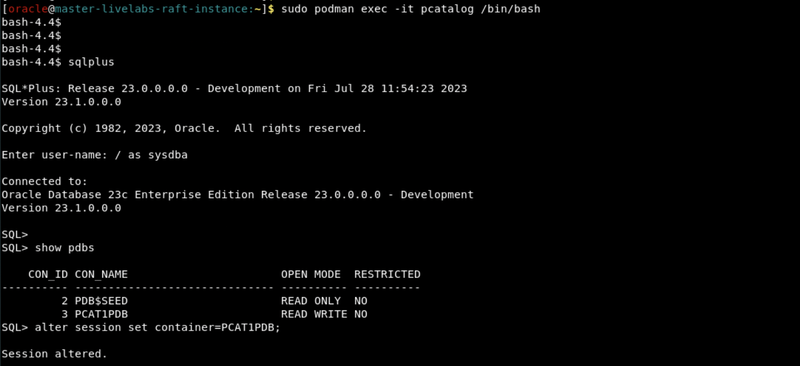  

3. Enable shard DDL on PCAT1PDB

   ```
    <copy>
    alter session enable shard ddl;
    </copy>
    ```


4. Connect to app_shard schema  and create customers table 

   ```
    <copy>
    conn app_shard/app_shard@PCAT1PDB
    </copy>
    ```

   ```
    <copy>
     create sharded table Customers
  (
    CustId      varchar2(100) NOT NULL,
    FirstName   varchar2(100),
    LastName    varchar2(100),
    Passwd      raw(60),
    CONSTRAINT pk_customers PRIMARY KEY (CustId)
  ) tablespace SET TPS_SET_1
  partition by CONSISTENT HASH (CustId) partitions AUTO;
   </copy>
    ```

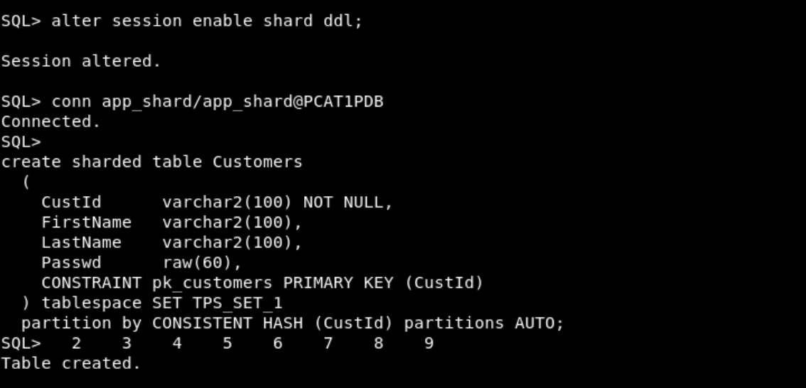  

5. Insert the data into app_shard.customers table

    ```
    <copy>
    insert into Customers values(1,'moody','ragi',utl_raw.cast_to_raw('hello world')); 
    insert into Customers values(2,'randy','Beridze',utl_raw.cast_to_raw('hello world1'));
    insert into Customers values(3,'ravi','Bettle',utl_raw.cast_to_raw('hello world2'));
    insert into Customers values(4,'zach','boron',utl_raw.cast_to_raw('hello world3'));
    insert into Customers values(5,'laura','crain',utl_raw.cast_to_raw('hello world4'));
    insert into Customers values(6,'shreya','sharma',utl_raw.cast_to_raw('hello world6'));
    insert into Customers values(7,'trish','jackson',utl_raw.cast_to_raw('hello world7'));
    insert into Customers values(8,'ilena','samme',utl_raw.cast_to_raw('hello world8'));
    insert into Customers values(9,'brad','crusee',utl_raw.cast_to_raw('hello world9'));
    insert into Customers values(10,'tom','peats',utl_raw.cast_to_raw('hello world20'));
    commit;

   </copy>
    ```
    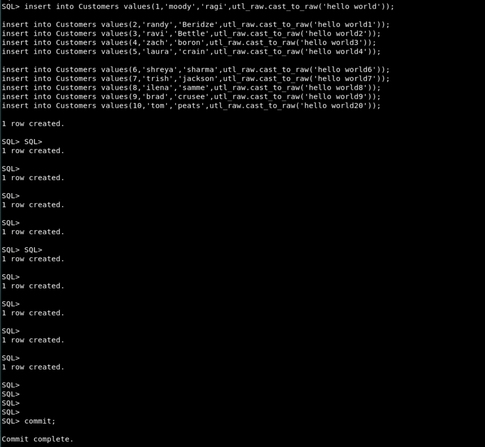  


6.  Run the below command as **oracle** user to check the status for all the containers.

    ```
    <copy>
    sudo podman ps -a
    </copy>
    ```

      

7.  Run the below command as **oracle** user to stop shard1.

    ```
    <copy>
    sudo podman exec -it shard1 /bin/bash
    </copy>
    ```

8.  Connect to shard1 "sqlplus / as sysdba" and shutdown the shard1

    ```
    <copy>
    shutdown immediate
    </copy>
    ```

      

9. Check the status for RU's on another session and you will see that database porcl1cdb_porcl1pdb is not present.

    ```
    <copy>
    gdsctl config shard
    </copy>
    ```

    ```
    <copy>
    gdsctl status ru -show_chunks
    </copy>
    ```

      

10. If we run the same select statement either by connecting the catalog or to the one of available shard, it will return the same set of data.

    ```
    <copy>
    sudo podman exec -it shard2 /bin/bash
    </copy>
    ```

Connect to "sqlplus / as sysdba" and set the PDB (container=PORCL2PDB)and run the select statement for the table app_shard.customers.
    ```
    <copy>
    alter session set container=PORCL2PDB;
    </copy>
    ```

 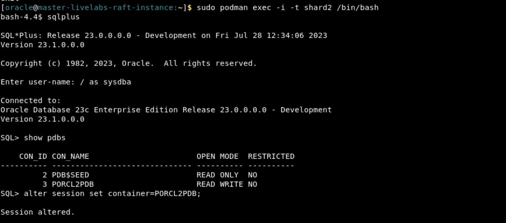

  
    <copy>
    select * from app_shard.customers order by 1;
    </copy>


   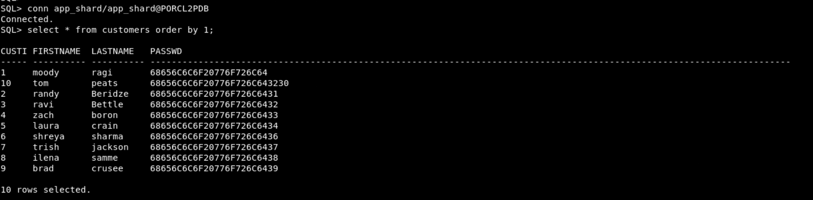  

You will see that shard down situation has no affect on the availability of the data.

11. Start the shard1 using the startup command from sqlplus, to create situation of shard1 joining back

    ```
    <copy>
   startup
    </copy>
    ```

    


12. Check the status of shard and RU's and see that shard1 has joined back


    ```
    <copy>
    gdsctl config shard
    </copy>
    ```

      

    ```
    <copy>
    gdsctl status ru -show_chunks
    </copy>
    ```

      


## Task 6: Scaling UP with Raft Replication

To scale up, you can run ADD SHARD, and Raft replication automatically splits the replication units (RUs), distributes relevant RUs to the new shard, and merges relevant RUs.

After scaling up you can run CONFIG TASK to view the ongoing rebalancing tasks.

The same is true for scaling down using REMOVE SHARD and load balancing using MOVE RU. 


1. We will add another shard named SHARD4 to this setup and see the redistribution happens for the RUs.
Run in the terminal as **oracle** user to Create SHARD4 database container

    ```
    <copy>
    sudo podman run -d --hostname pshard4-0  --dns-search=example.com  --network=shard_pub1_nw  --ip=10.0.20.156 -e ORACLE_EDITION="enterprise"  -e DOMAIN=example.com  -e ORACLE_SID=PORCL4CDB  -e ORACLE_PDB=PORCL4PDB  -e OP_TYPE=primaryshard  -e COMMON_OS_PWD_FILE=common_os_pwdfile.enc  -e PWD_KEY=pwd.key  -e SHARD_SETUP="true"  -e TMPDIR="/var/tmp"  -e ENABLE_ARCHIVELOG=true -e INIT_SGA_SIZE=5000 -e INIT_PGA_SIZE=2000 -v /oradata/PODMAN_TEST/dbfiles/PORCL4CDB:/opt/oracle/oradata  -v /opt/containers/shard_host_file:/etc/hosts  --volume /opt/.secrets:/run/secrets:ro  --privileged=false  --name shard4 localhost/oracle/database:23.3.0-rdbms-may2-label0428-ext_sidb-database-23c-beta
    </copy>
    ```

    
    

2. Open another terminal session to check if the Shard4 database container creation is completed. Run the below command as **oracle** user.

    ```
    <copy>
    sudo podman logs -f shard4
    </copy>
    ```

    


You have to wait until GSM shard set up is completed. Please refer the below screenshot:


3. Once the DB is up and running, complete the below commands to   complete the GSM configuration to deploy the new SHARD4:

    ```
    <copy>
    sudo podman exec -it gsm1 python3 /opt/oracle/scripts/sharding/scripts/main.py --addshard="shard_host=pshard4-0;shard_db=PORCL4CDB;shard_pdb=PORCL4PDB;shard_port=1521;shard_group=shardgroup1"
    </copy>
    ```
    

     ```
    <copy>
    sudo podman exec -it gsm1 python3 /opt/oracle/scripts/sharding/scripts/main.py --deployshard=true
    </copy>
    ```
     

4. Connect to GSM1, run in the terminal as **oracle** user and connect to the shard director server and run the below command to view the ongoing rebalancing tasks. 

    ```
    <copy>
    sudo podman exec -i -t gsm1 /bin/bash
    </copy>
    ```

    

     ```
    <copy>
    gdsctl config task
    </copy>
    ```

    

    

5. Exit from GSM1 and Run the below command as **oracle** user to validate the database shard4 container is healthy.

    ```
    <copy>
    sudo podman ps -a
    </copy>
    ```

     

6. Connect to GSM1, run in the terminal as **oracle** user and connect to the shard director server.

    ```
    <copy>
    sudo podman exec -i -t gsm1 /bin/bash
    </copy>
    ```


 7. Run below command to verify that, shard4 has been deployed.

    ```
    <copy>
    gdsctl config shard
    </copy>
    ```

    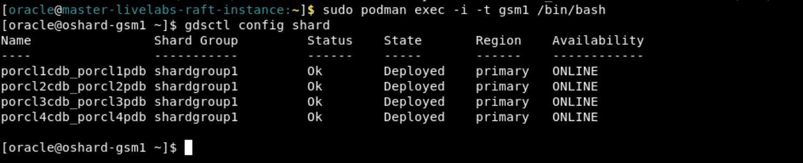

8. Run below command to check the configuration of chunks.

    ```
    <copy>
    gdsctl config chunks
    </copy>
    ```

    

9. Run below the check the status of chunks and RUs after scale up

    ```
    <copy>
    gdsctl status ru -show_chunks
    </copy>
    ```

    

10. Run below command to view all of the leaders

    ```
    <copy>
    gdsctl status ru -leaders
    </copy>
    ```

    


## Task 7: Move Replication Unit Replicas

Use MOVE RU to move a follower replica of a replication unit from one shard database to another.

1.  Run below command to the check the status of chunks and RUs 

    ```
    <copy>
    gdsctl status ru -show_chunks
    </copy>
    ```

    


2. Choose the RU with the role follower  associated with the respective shard and move to a shard which is NOT having that RU Replica. 

    ```
    <copy>
    gdsctl move ru -ru 1 -source porcl2cdb_porcl2pdb -target porcl4cdb_porcl4pdb
    </copy>
    ```
    

3. Check Status after the move:

    ```
    <copy>
   gdsctl status ru -show_chunks
    </copy>
    ```
    

## Task 8: Copy Replication Units

Copy a replication unit from one shard database to another using COPY RU. This allows you to instantiate or repair a replica of a replication unit on the target shard database. 


1. If the target database doesn't contain the specified replication unit then the total number of replicas for the given replication unit should be below replication factor (3), unless -replace is specified.
 
When we use the replace option, the copy is done and also the replica is removed from the shard which is specified with the replace option thus keeping the replica count to be 3.

Connect to GSM1, run in the terminal as **oracle** user and connect to the shard director server.
    ```
    <copy>
    sudo podman exec -i -t gsm1 /bin/bash
    </copy>
    ```

Connect with GSM1 and run the below command to check the status.
    ```
    <copy>
    gdsctl status ru -show_chunks
    </copy>
    ```

    
Run the below command to copy the RU. Choose the RU (follower) in the source shard and copy it to one of the shard where that RU doesn't exist. Use replace option with the shard from where you would like to remove that RU.
    ```
    <copy>
    gdsctl copy ru -ru 1 -source porcl3cdb_porcl3pdb -target porcl2cdb_porcl2pdb -replace porcl4cdb_porcl4pdb
    </copy>
    ```


2. You can check the status of the replication unit after the copy command is completed
    ```
    <copy>
    gdsctl status ru -show_chunks
    </copy>
    ```
   


## Task 9: Scale Down with Raft Replication

Scaling down can be done using REMOVE SHARD and load balancing using MOVE RU.

1.  Run below command to the check the status of chunks and RUs 

    ```
    <copy>
    gdsctl status ru -show_chunks
    </copy>
    ```

    

2. We want to Scale Down by removing the SHARD4.
We will first change the replication unit leaders from shard4 to other shards and move the RUs from the SHARD4 to other shards

Move the RUs from SHARD4 to other shards:
We perform move ru until all the RU are moved from shard4 to other shards.
    ```
    <copy>
    gdsctl switchover ru -ru 7 -database porcl1cdb_porcl1pdb
    </copy>
    ```
    ```
    <copy>
    gdsctl switchover ru -ru 8 -database porcl3cdb_porcl3pdb
    </copy>
    ```

     

  check the status of chunks after switchover
    
    ```
    <copy>
    gdsctl status ru -show_chunks
    </copy>
    ```
 

    ```
    <copy>
    gdsctl move ru -ru 7 -source porcl4cdb_porcl4pdb -target porcl2cdb_porcl2pdb
    </copy>
    ```
    ```
    <copy>
    gdsctl move ru -ru 8 -source porcl4cdb_porcl4pdb -target porcl2cdb_porcl2pdb
    </copy>
    ```
  


3. Check the status after the move.

    ```
    <copy>
    gdsctl status ru -show_chunks
    </copy>
    ```

       

4. Move the chunks out of the SHARD4 before we can delete this SHARD:
  Run this command from GSM1.
    ```
    <copy>
    python3 /opt/oracle/scripts/sharding/scripts/main.py --movechunks="shard_db=PORCL4CDB;shard_pdb=PORCL4PDB"
    </copy>
    ```
5. Check the status for the chunks across all the RU's again and and make sure no DDL error is seen.
    ```
    <copy>
    gdsctl status ru -show_chunks
    </copy>
    ```

    ```
    <copy>
    gdsctl show ddl -failed_only
    </copy>
    ```
   
    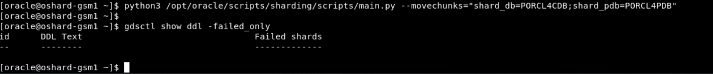

6. Complete the SHARD4 delete operation.

    ```
    <copy>
    python3 /opt/oracle/scripts/sharding/scripts/main.py --deleteshard="shard_host=oshard4-0;shard_db=PORCL4CDB;shard_pdb=PORCL4PDB;shard_port=1521;shard_group=shardgroup1"
    </copy>
    ```

7. Check the status after scale down operation is completed.

    ```
    <copy>
    gdsctl config chunks
    </copy>
    ```

    ```
    <copy>
    gdsctl status ru -show_chunks
    </copy>
    ```
    
    
8. Stop and remove the shard4 container

    ```
    <copy>
    sudo podman stop shard4
    </copy>
    ```

    ```
    <copy>
    sudo podman rm shard4
    </copy>
    ```

   


This is the end of the Oracle Sharding RAFT Replication Workshop.


## **Appendix 1**: RAFT Replication Overview

**RAFT Replication** 

 - [RAFT Replication documentation for internal purposes] (https://docs-uat.us.oracle.com/en/database/oracle/oracle-database/23/shard/oracle-sharding-raft-replication.html#GUID-AB5D3A4B-51BD-456C-B03E-4C6B3EDB4C2B)


## Rate this Workshop
When you are finished don't forget to rate this workshop!  We rely on this feedback to help us improve and refine our LiveLabs catalog.  Follow the steps to submit your rating.

1.  Go back to your **workshop homepage** in LiveLabs by searching for your workshop and clicking the Launch button.
2.  Click on the **Brown Button** to re-access the workshop  

    

3.  Click **Rate this workshop**

    

If you selected the **Green Button** for this workshop and still have an active reservation, you can also rate by going to My Reservations -> Launch Workshop.

## Acknowledgements
* **Authors** - Deeksha Sehgal, Oracle Database Sharding Product Management, Senior Product Manager
* **Contributors** - Pankaj Chandiramani, Shefali Bhargava, Param Saini, Jyoti Verma
* **Last Updated By/Date** - Deeksha Sehgal, Database Sharding PM , Senior Product Manager - July 2023
