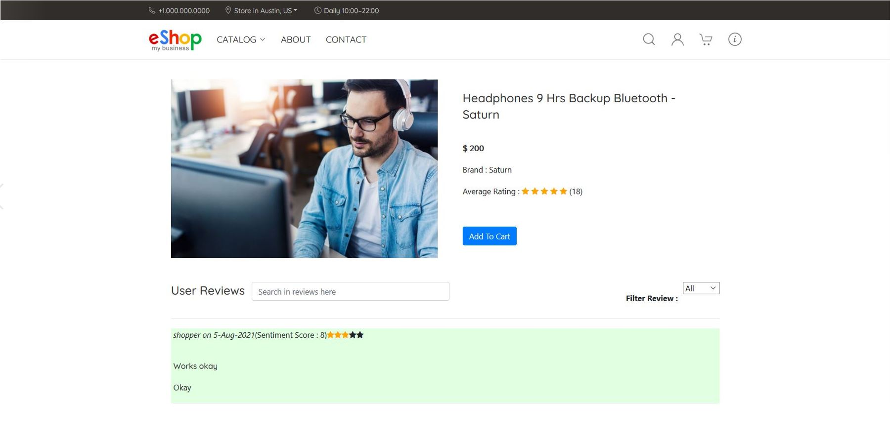
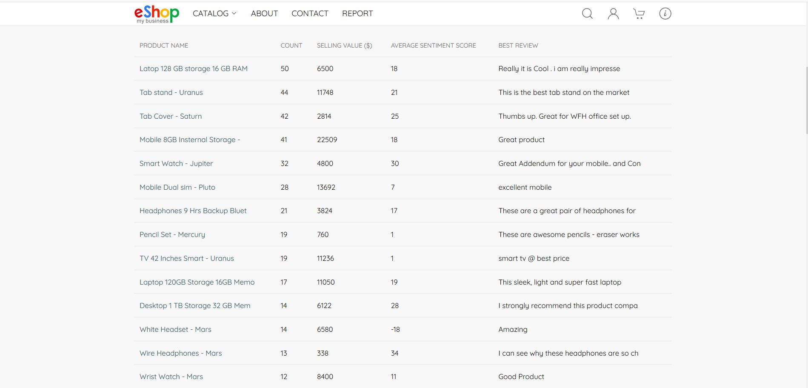
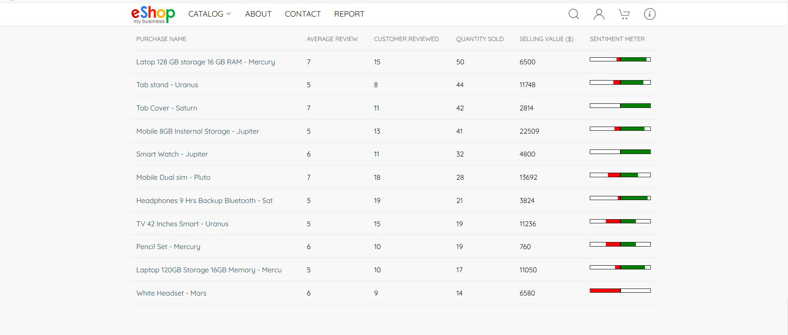

# Build Applications with Oracle Sharding

## Introduction   
eShop is an example web-based, e-commerce retail application, built for an online electronics retailer.

We developed this application to demonstrate Oracle Sharding (a hyperscale globally distributed converged database) with OLTP and Analytics (in a massively parallel processing (MPP) architecture). Oracle Cloud infrastructure (OCI) hosts the application.

- The application can support billions of users and products.

-  We used Oracle Database Sharding (with 3 shards) with different types of data stored in a single database platform, which includes structured and unstructured data, relational, JSON and text.

-  Multiple capabilities, like the Simple Oracle Document Access (SODA) API + Text Search for JSON, joins, transactions, and ACID properties for relational queries, fuzzy match, type ahead, free-form text search, and sentiment analysis for text.


*Estimated Time*: 10 Minutes


Typically, multiple technologies and products are required to develop such an application. For example, you would need a JSON database, a Text Index application, a relational database, and an Analytics engine, which makes it difficult to query data across multiple data stores. Further, using the traditional methods, you could spend several years and millions of dollars in licensing and development.

The entire eShop application, including database configuration, front-end UI, and application logic, was developed within a two-week time frame.


[](youtube:CAXepxXPC7Q)

### Objectives
In this lab, you will:
* Setup the environment for Sharding lab.
* Connect the putty.
* Learn about Sharding capabilities with Eshop.
* Understand application code.
* Understand application connectivity.

### Prerequisites
This lab assumes you have:
- A Free Tier, Paid or LiveLabs Oracle Cloud account
- SSH Private Key to access the host via SSH
- You have completed:
    - Lab: Generate SSH Keys (*Free-tier* and *Paid Tenants* only)
    - Lab: Prepare Setup (*Free-tier* and *Paid Tenants* only)
    - Lab: Environment Setup
    - Lab: Initialize Environment

## Task 1: Eshop Demonstration
1. **eShop URL Access:** When you access the application using the URL  (**`http://localhost:3000/`**), the application's home page opens.

  

  **Note:** Demo application can also be accessed directly from your browser using public IP with the URL (**`http://public-ip:3000/`**), you can get it as below highlighted in red.

  


2. **Log In and Sign Up:** The application has **login** and new user **signup** features, but it allows access to a non-logged in application user to some extent. It allows you to search for a product in the catalog and make a purchase based on the product's reviews, sentiment score, and rating.

  To log in, go to the top right of the navigation bar, click the user profile icon, and select Log In. On the login page, you can log in to an existing account or sign up for a new account.

  You can use the default login email and password for this LiveLab.


  **Login email** = demo@eshop.com and **password** = demo

  

  After a successful login you are brought back to the home page.

3. **Browse and Search Products:** Click **CATALOG** in the navigation bar to browse the product list. This page lists all of the products in the store by fetching all of the rows from the Product JSON tables, which are partitioned among the three database shards, along with a picture and price.

  

  Any of the product tiles on this page can be clicked to take you to the product information tab.
  Use the Filter options by selecting from the Price and/or Brand filters to get a list of specific products.

   Alternatively, you can perform a text search. Access the search bar by clicking the Search icon, then directly type the product information in the search bar. Here, Oracle fuzzy matching is the method used, and it provides an improved ability to process word-based matching queries to find matching phrases or sentences from a database.

   You can click on a selected product to view its details, or you can choose to add the product directly to the cart by clicking on the cart symbol.


  

   The product search functionality is flexible enough to autocorrect any misspelled search text and provide you with a suggestion list of what you might be looking for.

  For better performance and faster loading of the product list, we have proper indexing on SODA collections and pagination logic using limit and skip functions.

4. **Select a Product:** Select a specific product to go to the product information page, where you can find more information about the product and read the reviews and ratings.

  

  On the product information screen the reviews are sorted by sentiment ratings. You can search for reviews based on the content or keyword.

  On the product information page, click the **Add To Cart** button to add the product to your cart. If you want to add more item to the cart, you can repeat the procedure.

5. **Go To the Cart:**  Click the Go To Cart button on a product page.

  

  In the cart you can alter the number of a specific product and click **Proceed to Checkout**.
  When you change the product quantity, the cart updates the total price per product calculation. In addition, total value of the cart contents is updated using a query to a table which is sharded across all (3) shard databases.

  

6. **Place Your Order:** In the Review Order page, look over the order and click **Place your order**.
You can change the address shown in Saved Address if you want to ship products to a location different from your default address.

  

7. **Submit a Review:** You can submit the review and rating for the purchased item. When your order is placed, eShop populates the LINE_ITEM and allows you to enter a product review.

 

  Your order workflow goes from Placed to Shipped, then OFD (out for delivery), and finally Delivered.
 

 **Note: Repeat above steps for 5 times and order 5 different items. This is required for the next set of labs.**


## Task 2: View Reports

The application can create reports by emulating two large data sets from relational tables (customers, orders, line items) and non-relational tables (Products and Reviews - JSON, Text, sentiment analysis). And these Analytics reports are built from a single query spanning multiple data types from multiple shard databases.

1.	Dollar value sale by month: A single query from LINE_ITEM accessing multiple shard databases.
2.	Sentiment Percentage: A single query from Reviews accessing multiple shard databases.


  

3.	Best Selling Product In last two months: A single query from multiple tables, both relational and non-relational, accessing multiple shard databases.

  

4. The Analytics report is made with a Java table with multiple SQL queries (These queries are on multiple tables both relational and non-relational across all of the shard databases).

  

## Task 3: Application Schema & Code Snippet (read-only)
eShop application is server side rendered web application hosted on a NodeJS web server. Application is designed on MVC (Model, View and Controller) architecture pattern, with view as HTML 5 pages, controllers written in NodeJS to handle user http request and model to access database objects.

It utilizes different types of tables (relational, non-relational) in Oracle database to persist application data.

Relational table stores data related to **Customer** and their **Orders** while the **Product Catalog** and **Customer Reviews** data are stored as JSON in SODA collections.

**Application Schema and Code Snippet**

1. User makes a valid http request to server using a rest call from browser.

2. Application validates the route and map it to a proper controller as shown below:

    ```
    app.route("/shop/product/:key").get(shopController.fetchProductById);
    ```

3. Controller function pull out the provided details from the request and make pass it to model layer, as shown below in the code snippet:

    ```
    exports.fetchProductById = function(req,res,next)
        {
            let item = req.params.key;
            dbService.getProductByKey(item)
        }
    ```
dbService.getProductByKey(item) – calling model layer function with “item” as parameter.

4. Model layer which interacts with database, makes a no-SQL SODA API call or SQL call to access data from SODA Collections or Relational tables/SODA Collections respectively.

   **Connect to database shard using sharding key**

    ```
    connection = await oracledb.getConnection({

    user: 'SHARDUSERTEST',
    password: 'oracle',
    connectString: 'xxx.xxx.xx.xxx:1522/oltp_rw_products.orasdb.oradbcloud',
    shardingKey:[id]

    });
    ```

	**Query the SODA Collection or Table (In this case PRODUCTS is a SODA Collection)**

	```
    const soda = connection.getSodaDatabase();
    const collection = await soda.openCollection("PRODUCTS");
    const doc = await collection.find().key(id).getOne();
    const content = doc.getContent();

    ```

5. Views (HTML page) get created using the data returned to controller from model layer, as show below and then sent to client as response.

    ```
   dbService.getProductByKey(item)
    	.then(
        (data)=>{
            res.render('productInfo',{product:data});
            res.end();
        },
        err=>{
            return next(err);
        }
    	)
    ```
  **Application Connection Details**

 In Oracle Sharding, database query and DML requests are routed to the shards in two main ways, depending on whether a sharding key is supplied with the request. These two routing methods are called **proxy routing** and **direct routing.**

 **Proxy Routing:** Queries that need data from multiple shards, and queries that do not specify a sharding key, cannot be routed directly by the application. Those queries require a proxy to route requests between the application and the shards. Proxy routing is handled by the shard catalog query coordinator.

 Example: Database connection details:

			module.exports =
			{
               sharding: {
      			  user: 'SHARDUSERTEST',
       			  password: 'oracle',
      			  connectString: 'xx.x.xx.xxx:1521/cat1pdb',
        				poolMin: 10,
        				poolMax: 10,
        				poolIncrement: 0
  			  }

 **Direct Routing:** You can connect directly to the shards to execute queries and DML by providing a sharding key with the database request. Direct routing is the preferred way of accessing shards to achieve better performance, among other benefits.

 Example: Database connection details by passing a sharding key:

			connection = await oracledb.getConnection({
            			user: 'SHARDUSERTEST',
             			password: 'oracle',
             			connectString: 'xx.x.xx.xxx:1521/oltp_rw_products.shardcatalog1.oradbcloud',
              			shardingKey:[docmt.PRODUCT_ID]
            			  });

 For more details for the eShop code snippet click [here] (https://github.com/nishakau/ShardingSampleCode.git)


 You may now [proceed to the next lab](#next).

## Learn More

- [Oracle Sharding Documentation] (https://docs.oracle.com/en/database/oracle/oracle-database/19/shard/sharding-overview.html#GUID-0F39B1FB-DCF9-4C8A-A2EA-88705B90C5BF)
- [Oracle JSON Developers Guide 19c] (https://docs.oracle.com/en/database/oracle/oracle-database/19/adjsn/index.html)
- [Introduction to SODA] (https://docs.oracle.com/en/database/oracle/simple-oracle-document-access/adsdi/overview-soda.html#GUID-BE42F8D3-B86B-43B4-B2A3-5760A4DF79FB)

## Rate this Workshop
When you are finished don't forget to rate this workshop!  We rely on this feedback to help us improve and refine our LiveLabs catalog.  Follow the steps to submit your rating.

1.  Go back to your **workshop homepage** in LiveLabs by searching for your workshop and clicking the Launch button.
2.  Click on the **Brown Button** to re-access the workshop  

    

3.  Click **Rate this workshop**

    

If you selected the **Green Button** for this workshop and still have an active reservation, you can also rate by going to My Reservations -> Launch Workshop.

## Acknowledgements
* **Authors** - Shailesh Dwivedi, Database Sharding PM , Vice President
* **Contributors** - Balasubramanian Ramamoorthy , Alex Kovuru, Nishant Kaushik, Ashish Kumar, Priya Dhuriya, Richard Delval, Param Saini,Jyoti Verma, Virginia Beecher, Rodrigo Fuentes
* **Last Updated By/Date** - Priya Dhuriya, Staff Solution Engineer - July 2021
