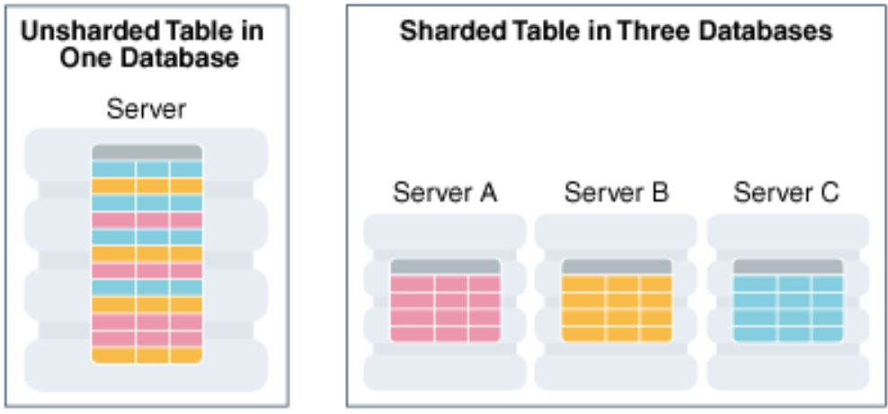
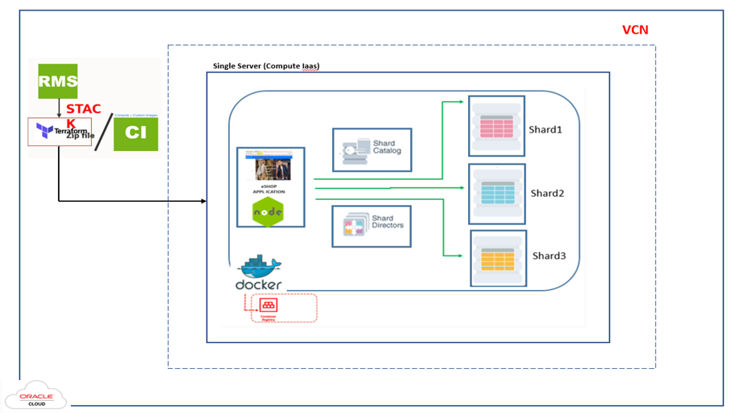

# Introduction

## About Oracle Database Sharding
Oracle Database Sharding enables globally distributed, linearly scalable, multi-model databases. It distributes segments of a data set —**a shard**— across lots of databases on lots of different computers on-premises or in cloud. It requires no specialized hardware or software. Oracle Sharding does all this while rendering the strong consistency, full power of SQL, support for structured and unstructured data and the Oracle Database ecosystem. It allows you to support applications that require low latency, high availability, and meet data sovereignty requirements.

*Estimated Workshop Time:*  1 hour

It is built on shared-nothing architecture, in which data is horizontally partitioned across databases that share no hardware or software. To learn more, see this [blog](https://blogs.oracle.com/database/sharding-oracle-database-cloud-service-v2).

<if type="odbw">If you would like to watch us do the workshop, click [here](https://youtu.be/MGGXnjVrLzI).</if>

**Workshop Architecture**

### Objectives
In this workshop, you will gain first-hand experience of how Oracle Database can store structured and unstructured data in same database with ten’s of petabytes of data.

Once you complete your setup, the next lab will cover:

- About Eshop
- Exploring Sharding Topology
- Eshop Application schema & Code Snippet
- Application queries on Sharded Database

We will use Docker containers and demonstrate multiple use cases with a Node.js application.

### Prerequisites
- An Oracle Cloud Account - Please view this workshop's LiveLabs landing page to see which environments are supported

*Note: If you have a **Free Trial** account, when your Free Trial expires your account will be converted to an **Always Free** account. You will not be able to conduct Free Tier workshops unless the Always Free environment is available. **[Click here for the Free Tier FAQ page.](https://www.oracle.com/cloud/free/faq.html)***

You may now proceed to the next lab.

## Learn More
- [Oracle Sharding 19c: New Features (PDF)](https://www.oracle.com/a/tech/docs/sharding-19c-new-features.pdf)
- [Linear Scalability Demonstration on a Sharded Database Running on Oracle Bare Metal Cloud](https://www.oracle.com/technetwork/database/availability/oraclesharding-200-3588532.mp4)

## Acknowledgements
* **Authors** - Shailesh Dwivedi, Database Sharding PM , Vice President
* **Contributors** - Balasubramanian Ramamoorthy, Alex Kovuru, Nishant Kaushik, Ashish Kumar, Priya Dhuriya, Richard Delval, Param Saini,Jyoti Verma, Virginia Beecher, Rodrigo Fuentes
* **Last Updated By/Date** - Priya Dhuriya, Staff Solution Engineer - July 2021
