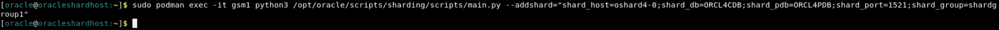
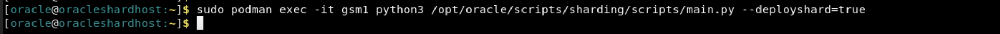
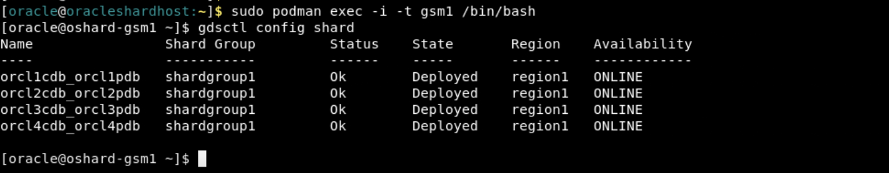
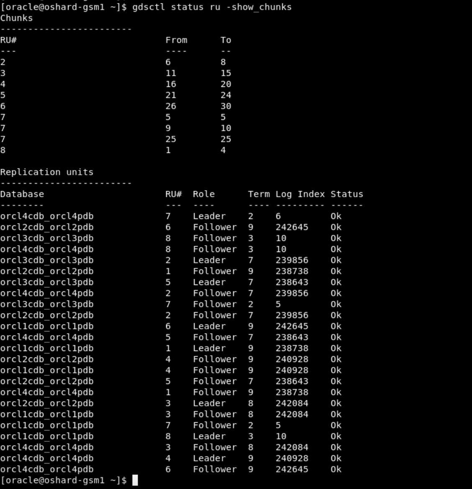
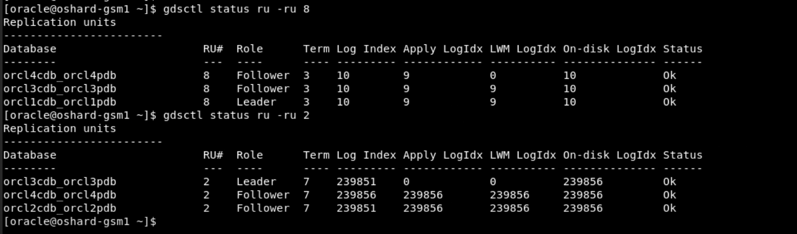
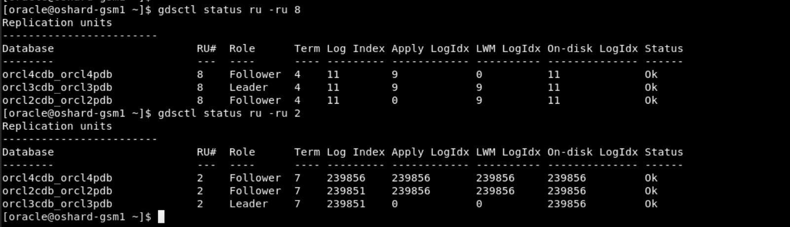
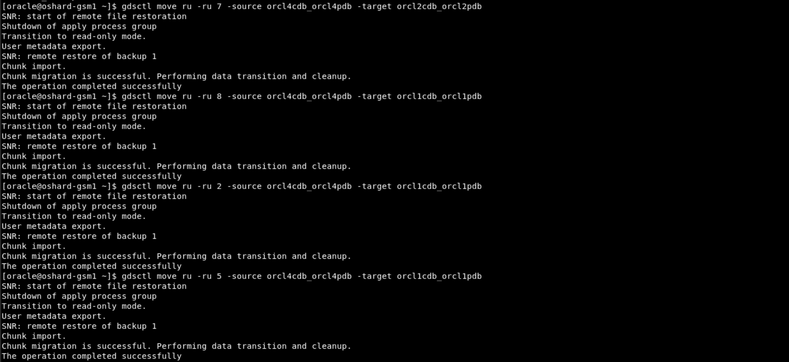
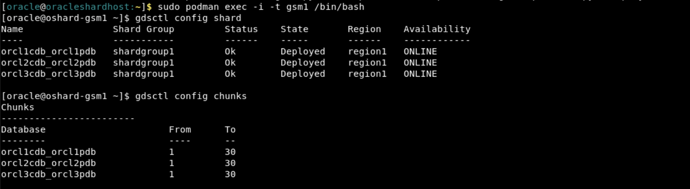
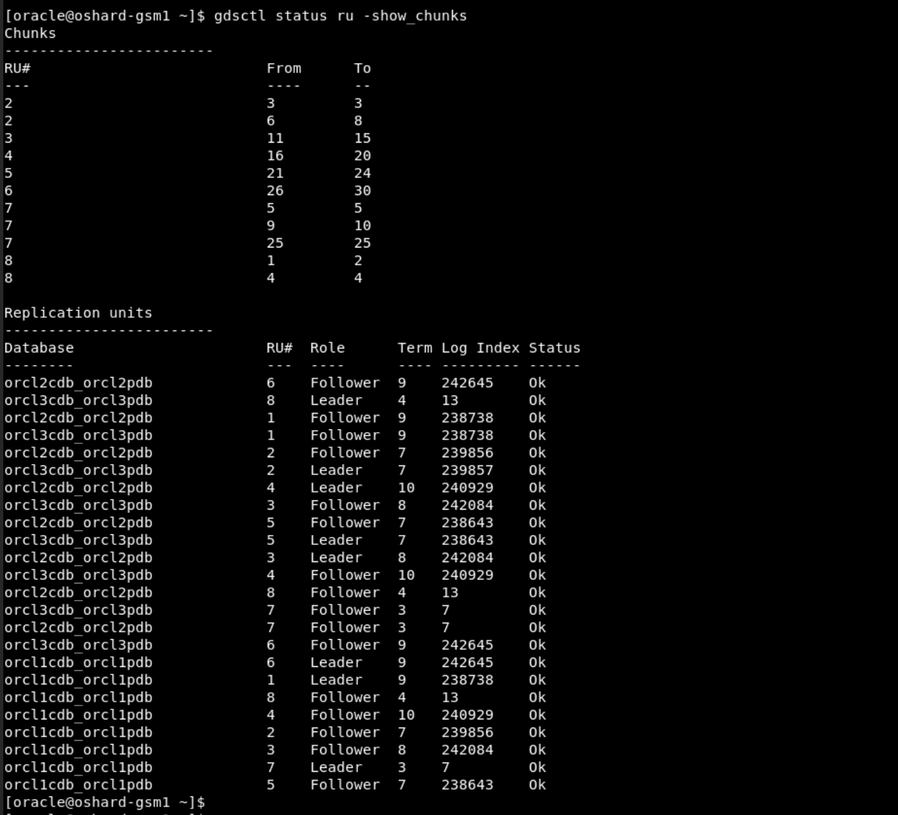

# Explore Raft Replication Advanced Use-Cases

## Introduction   

This lab will guide you through an advanced set of Raft replication use cases, including scaling up, moving replication unit replicas, copying replication units, moving a chunk to another replication unit, and scaling down operations.

*Estimated Time*:  30 minutes


### Objectives
In this lab, you will:
* Explore Raft Replication environment with advanced level use-cases

### Prerequisites
This lab assumes you have:
- A Free Tier, Paid or LiveLabs Oracle Cloud account
- You have completed:
    - Lab: Prepare Setup (*Free-tier* and *Paid Tenants* only)
    - Lab: Environment Setup
    - Lab: Initialize Environment
    - Lab: Explore Raft Replication Topology


## Task 1: Scaling UP with Raft Replication

To scale up, you can run ADD SHARD, and Raft replication automatically splits the replication units (RUs), distributes relevant RUs to the new shard, and merges relevant RUs.

After scaling up you can run CONFIG TASK to view the ongoing rebalancing tasks.

The same is true for scaling down using REMOVE SHARD and load balancing using MOVE RU. 


1. We will add another shard named SHARD4 to this setup and see the redistribution happens for the RUs.
Run in the terminal window logged in as **oracle** user to Create SHARD4 database container

    ```
    <copy>
        sudo podman run -d --hostname oshard4-0 \
        --dns-search=example.com \
        --network=shard_pub1_nw \
        --ip=10.0.20.106 \
        -e DOMAIN=example.com \
        -e ORACLE_SID=FREE \
        -e ORACLE_PDB=FREEPDB1 \
        -e ORACLE_FREE_PDB=ORCL4PDB \
        -e DB_UNIQUE_NAME=ORCL4CDB \
        -e INIT_SGA_SIZE=5000 \
        -e INIT_PGA_SIZE=2000 \
        -e OP_TYPE=primaryshard \
        -e COMMON_OS_PWD_FILE=pwdsecret \
        -e PWD_KEY=keysecret \
        -e SHARD_SETUP="true" \
        -e ENABLE_ARCHIVELOG=true \
        --secret pwdsecret \
        --secret keysecret \
        -v /oradata/dbfiles/ORCL4CDB:/opt/oracle/oradata \
        -v /opt/containers/shard_host_file:/etc/hosts \
        --privileged=false \
        --name shard4 localhost/oracle/database-ext-sharding:23.8.0-free
    </copy>
    ```

   
    

2. Open another terminal session to check if the Shard4 database container creation is completed. Run the below command as **oracle** user.

    ```
    <copy>
    sudo podman logs -f shard4
    </copy>
    ```

    


   You have to wait until GSM shard set up is completed. Please refer the below screenshot:

   


3. Once the DB is up and running, run the below commands to complete the GSM configuration to deploy the new SHARD4:
Run the below commands in a terminal window logged in as **oracle**.

    ```
    <copy>
    sudo podman exec -it gsm1 python3 /opt/oracle/scripts/sharding/scripts/main.py --addshard="shard_host=oshard4-0;shard_db=ORCL4CDB;shard_pdb=ORCL4PDB;shard_port=1521;shard_group=shardgroup1"
    </copy>
    ```
    

     ```
    <copy>
    sudo podman exec -it gsm1 python3 /opt/oracle/scripts/sharding/scripts/main.py --deployshard=true
    </copy>
    ```
    
    


4. You can run below command as **oracle** to switch to **GSM**, if you are using a new terminal window.

    ```
    <copy>
    sudo podman exec -i -t gsm1 /bin/bash
    </copy>
    ```

    

    Run in ther terminal window switched to **GSM** to view the ongoing rebalancing tasks. You have to wait until the rebalancing task completes.

     ```
    <copy>
    gdsctl config task
    </copy>
    ```

    

    

5. Run the below command in terminal window logged in as **oracle** user to validate the database shard4 container is healthy.

    ```
    <copy>
    sudo podman ps -a
    </copy>
    ```

    

6. Run the below command as **oracle** to switch to **GSM**, if you are using a new terminal window.
    ```
    <copy>
    sudo podman exec -i -t gsm1 /bin/bash
    </copy>
    ```


 7. Run the below command in a terminal window that is switched to **GSM** to verify that, shard4 has been deployed.

    ```
    <copy>
    gdsctl config shard
    </copy>
    ```

    

8. Run below command to check the configuration of chunks.

    ```
    <copy>
    gdsctl config chunks
    </copy>
    ```

    

9. Run below the check the status of chunks and RUs after scale up

    ```
    <copy>
    gdsctl status ru -show_chunks
    </copy>
    ```

    

10. Run below command to view all of the leaders

    ```
    <copy>
    gdsctl status ru -leaders
    </copy>
    ```

    

11. Run below command to auto rebalance the leaders.

    ```
    <copy>
    gdsctl switchover ru -rebalance
    </copy>
    ```

    

12. Run below command to view again all of the leaders

    ```
    <copy>
    gdsctl status ru -leaders
    </copy>
    ```

    

## Task 2: Move Replication Unit Replicas

Use MOVE RU to move a follower replica of a replication unit from one shard database to another.

1.  Run below command to the check the status of chunks and RUs 

    ```
    <copy>
    gdsctl status ru -show_chunks
    </copy>
    ```

    

2. Please check the status of the RU that you want to move.

    ```
    <copy>
    gdsctl status ru -ru 1
    </copy>
    ```

    

3. Choose the RU with the role follower associated with the respective shard and move to a shard which is NOT having that RU Replica. 
Following is the example used in the live labs environment.
User has to substitute values as per their environment.

    ```
    gdsctl move ru -ru 1 -source orcl4cdb_orcl4pdb -target orcl3cdb_orcl3pdb
    ```

    

4.  Please check the status of the RU that you just moved.

    ```
    <copy>
    gdsctl status ru -ru 1
    </copy>
    ```

    

4. Check Status after the move:

    ```
    <copy>
   gdsctl status ru -show_chunks
    </copy>
    ```

    


## Task 3: Copy Replication Units

Copy a replication unit from one shard database to another using COPY RU. This allows you to instantiate or repair a replica of a replication unit on the target shard database. 


1. If the target database doesn't contain the specified replication unit then the total number of replicas for the given replication unit should be below replication factor (3), unless -replace is specified.
 
    When we use the replace option, the copy is done and also the replica is removed from the shard which is specified with the replace option thus keeping the replica count to be 3.

    Connect to GSM1, run in the terminal as **oracle** user and connect to the **GSM**, if you a are using a new terminal.
   
    ```
    <copy>
    sudo podman exec -i -t gsm1 /bin/bash
    </copy>
    ```

2.  Run the below command to check the status.
    
    ```
    <copy>
    gdsctl status ru -show_chunks
    </copy>
    ```
    
    


3. Please check the status of the RU that you want to copy.

    ```
    <copy>
    gdsctl status ru -ru 1
    </copy>
    ```
   
    


4. Run the below command to copy the RU. Choose the RU (follower) in the source shard and copy it to one of the shard where that RU doesn't exist. Use replace option with the shard from where you would like to remove that RU.

    ```
    <copy>
    gdsctl copy ru -ru 1 -source orcl2cdb_orcl2pdb -target orcl4cdb_orcl4pdb -replace orcl3cdb_orcl3pdb
    </copy>
    ```

    


5. Please check the status of the RU that you just copied

    ```
    <copy>
    gdsctl status ru -ru 1
    </copy>
    ```
   
    

6. You can check the status of the replication unit after the copy command is completed
    ```
    <copy>
    gdsctl status ru -show_chunks
    </copy>
    ```
   
    

## Task 4: Moving A Chunk to Another Replication Unit

1. Please check the status of the chunks and RU:
    
    ```
    <copy>
    gdsctl status ru -show_chunks
    </copy>
    ```

    

2. To move a chunk from one Raft replication unit to another  replication unit, use the GDSCTL RELOCATE CHUNK command.

   To use RELOCATE CHUNK, the source and target replication unit leaders must be located on the same shard, and their followers must also be on the same shards. If they are not on the same shard, use SWITCHOVER RU to move the leader and MOVE RU to move the followers to co-located shards.

   When moving chunks, specify the chunk ID numbers, the source RU ID from which to move them, and the target RU ID to move them to
 
   Suppose we want to relocate chunk 3 from RU 8 to RU 2, RU 8 and 2 leaders must on same shards and RU 8 and 2 followers must be on same shards, if required; use SWITCHOVER RU to move the leader and MOVE RU to move the followers to co-located shards.

   Check the status of RU's from which you are trying to relocate:

   ```
   <copy>
   gdsctl status ru -ru 8
   </copy>
   ```

   ```
   <copy>
   gdsctl status ru -ru 2
   </copy>
   ```

   

   Change the RU leader using below command, if required.

   ```
   <copy>
   gdsctl switchover ru -ru 8 -shard orcl3cdb_orcl3pdb
   </copy>
   ```

   

   Check the status for RU's again, after switchover completes:

   ```
   <copy>
   gdsctl status ru -ru 8
   </copy>
   ```

   ```
   <copy>
   gdsctl status ru -ru 2
   </copy>
   ```

   

   Move the RU follower using below command, if required.
   This is an example command based on the current environment.
   User has to substitute values basis their environment.

   ```
   gdsctl move ru -ru 8 -source orcl1cdb_orcl1pdb -target orcl2cdb_orcl2pdb 
   ```

   

   Check the status for RU's again, after move completes, to verify:

  ```
  <copy>
  gdsctl status ru -ru 8
  </copy>
  ```

  ```
  <copy>
  gdsctl status ru -ru 2
  </copy>
  ```

  


2. Run the below command to relocate the chunk from GSM1:
  This is an example command based on the current live labs environment.
  User has to substitute values basis their environment.

   ```
   gdsctl relocate chunk -chunk 3 -sourceru 8 -targetru 2 
   ```

   


3. Please check the status of the chunks and RU, after relocate completes.

   ```
   <copy>
   gdsctl status ru -show_chunks
   </copy>
   ```

   

## Task 5: Scale Down with Raft Replication

Scaling down can be done using REMOVE SHARD and load balancing using MOVE RU.

1. Run below command to the check the status of chunks and RUs 

  ```
  <copy>
  gdsctl status ru -show_chunks
  </copy>
  ```

  

2. We want to Scale Down by removing the SHARD4.
We will first change the replication unit leaders from shard4 to other shards and move the RUs from the SHARD4 to other shards
These are commands based on the current environment.
User has to substitute values basis their environment.

   ```
   <copy>
   gdsctl switchover ru -ru 7 -shard orcl1cdb_orcl1pdb
   </copy>
   ```

   

   ```
   <copy>
   gdsctl switchover ru -ru 4 -shard orcl2cdb_orcl2pdb
   </copy>
   ```

   


   Check the status of chunks after switchover.
    
   ```
   <copy>
   gdsctl status ru -show_chunks
   </copy>
   ```

   

   We perform move ru until all the RU followers are moved from shard4 to other shards.
   Source database shouldn't contain the replica leader
   Target database should not already contain another replica of the replication unit.

   ```
   <copy>
   gdsctl move ru -ru 7 -source orcl4cdb_orcl4pdb -target orcl2cdb_orcl2pdb
   </copy>
   ```

   ```
   <copy>
   gdsctl move ru -ru 8 -source orcl4cdb_orcl4pdb -target orcl1cdb_orcl1pdb
   </copy>
   ```

   ```
   <copy>
   gdsctl move ru -ru 2 -source orcl4cdb_orcl4pdb -target orcl1cdb_orcl1pdb
   </copy>
   ```

   ```
   <copy>
   gdsctl move ru -ru 5 -source orcl4cdb_orcl4pdb -target orcl1cdb_orcl1pdb
   </copy>
   ```

   

   ```
   <copy>
   gdsctl move ru -ru 1 -source orcl4cdb_orcl4pdb -target orcl3cdb_orcl3pdb
   </copy>
   ```

   ```
   <copy>
   gdsctl move ru -ru 3 -source orcl4cdb_orcl4pdb -target orcl3cdb_orcl3pdb
   </copy>
   ```

   ```
   <copy>
   gdsctl move ru -ru 4 -source orcl4cdb_orcl4pdb -target orcl3cdb_orcl3pdb
   </copy>
   ```

   ```
   <copy>
   gdsctl move ru -ru 6 -source orcl4cdb_orcl4pdb -target orcl3cdb_orcl3pdb
   </copy>
   ```

   


3. Check the status after the move.

   ```
   <copy>
   gdsctl status ru -show_chunks
   </copy>
   ```

      

4. Move the chunks out of the SHARD4 before we can delete this SHARD:
  Run this command from **GSM**.

  ```
  <copy>
  python3 /opt/oracle/scripts/sharding/scripts/main.py --movechunks="shard_db=ORCL4CDB;shard_pdb=ORCL4PDB"
  </copy>
  ```

  

5. Check the status for the chunks across all the RU's again and and make sure no DDL error is seen.

   ```
   <copy>
   gdsctl status ru -show_chunks
   </copy>
   ```

   ```
   <copy>
   gdsctl show ddl -failed_only
   </copy>
   ```

   

6. Complete the SHARD4 delete operation.

   ```
   <copy>
   python3 /opt/oracle/scripts/sharding/scripts/main.py --deleteshard="shard_host=oshard4-0;shard_db=ORCL4CDB;shard_pdb=ORCL4PDB;shard_port=1521;shard_group=shardgroup1"
   </copy>
   ```

   


7. Check the status after scale down operation is completed.

   ```
   <copy>
   gdsctl config shard
   </copy>
   ```

   ```
   <copy>
   gdsctl config chunks
   </copy>
   ```

   

   ```
   <copy>
   gdsctl status ru -show_chunks
   </copy>
   ```

   
    
8. Run the below command in a terminal window logged in as **oracle** to stop and remove the shard4 container. Shard4 container is up before stop and remove.

  

  ```
  <copy>
  sudo podman stop shard4
  </copy>
  ```

   ```
   <copy>
   sudo podman rm shard4
   </copy>
   ```

9. Check if the shard4 has been removed.

   ```
   <copy>
   sudo podman ps -a
   </copy>
   ```

   

10. Run the below command in terminal that is switched to **GSM**,to  auto rebalance the leaders.

    ```
    <copy>
    gdsctl switchover ru -rebalance
    </copy>
    ```

    

This is the end of the Raft Replication Workshop.


## **Appendix 1**: Raft Replication Overview

**Raft Replication** 

- [Raft Replication documentation] (https://docs.oracle.com/en/database/oracle/oracle-database/23/shard/raft-replication.html#GUID-AF14C34B-4F55-4528-8B28-5073A3BFD2BE)


## Rate this Workshop
When you are finished don't forget to rate this workshop!  We rely on this feedback to help us improve and refine our LiveLabs catalog.  Follow the steps to submit your rating.

1.  Go back to your **workshop homepage** in LiveLabs by searching for your workshop and clicking the Launch button.
2.  Click on the **Brown Button** to re-access the workshop  

    

3.  Click **Rate this workshop**

    

If you selected the **Green Button** for this workshop and still have an active reservation, you can also rate by going to My Reservations -> Launch Workshop.

## Acknowledgements
* **Authors** - Deeksha Sehgal, Ajay Joshi, Oracle Globally Distributed Database Database, Product Management
* **Contributors** - Pankaj Chandiramani, Shefali Bhargava, Param Saini, Jyoti Verma
* **Last Updated By/Date** - Ajay Joshi, Oracle Globally Distributed Database, Product Management, July 2025