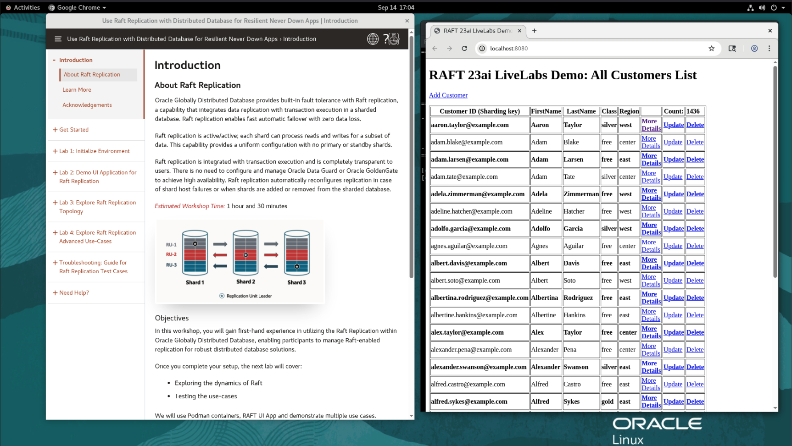
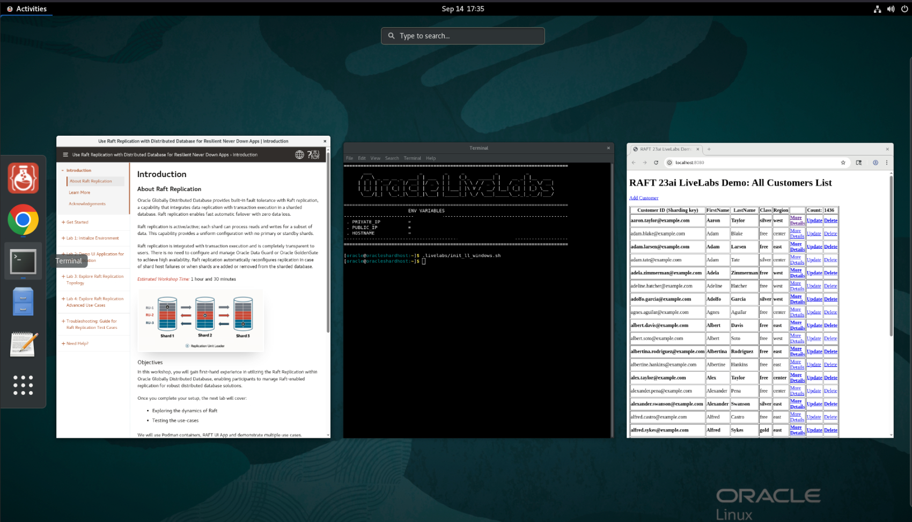
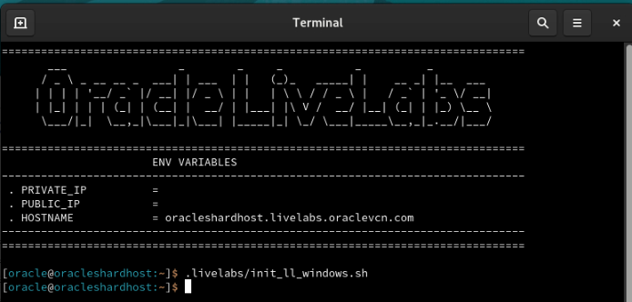
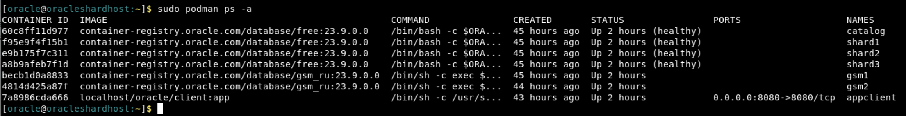

# Initialize Environment

## Introduction

In this lab we will review and startup all components required to successfully run this workshop.

*Estimated Lab Time:* 10 Minutes.

### Objectives
- Verify and Initialize the workshop environment at anytime.

### Prerequisites
This lab assumes you have:
- A Free Tier, Paid or LiveLabs Oracle Cloud account
- You have completed:
    - Lab: Prepare Setup (*Free-tier* and *Paid Tenants* only)
    - Lab: Environment Setup (*Free-tier* and *Paid Tenants* only)
    - Lab: Get started (*Login to the LiveLabs Sandbox Environment* only)

## Task 1: Verify default browser windows.

1. By default, two browser windows are shown. On the left, "Introduction" About Raft Replication and on the right, "RAFT 23ai LiveLabs Demo: All Customers List" like below:

 

    You can skip the below stpes if both browser windows are shown.

2. If both browser windows are shown for some reason, reload the browser windows at anytime with steps as below:

    a. Click on Activities (shown on top left corner) >> Terminal icon (shown on the bottom of the screen which is next to Chrome icon) to Launch the Terminal.
    
    

    b. Enter ".livelabs/init\_ll\_windows.sh" like below:

    

    This would re-display the two browser windows as shown above in the step 1.

## Task 2: Validate That Required Processes are Up and Running from a terminal window.
1. Now with access to your remote desktop session, proceed as indicated below to validate your environment before you start executing the subsequent labs. The following Processes should be up and running:

    - Oracle Sharding GSM1 Container
    - Oracle Sharding GSM2 Container
    - Oracle Sharding Catalog container
    - Three Oracle shard Database containers
    - Appclient Container

2.  Click on Activities (shown on top left) >> Terminal icon (shown on center of the screen which is next to Chrome icon) to Launch the Terminal when its not already opened. Proceed as indicated below to validate the services.

    - Oracle Sharding container Details

        ```
        <copy>
        sudo podman ps -a
        </copy>
        ```
        

    - If a container is stopped and not in running state then try to restart it by using podman command.

        ```
        <copy>
        sudo podman stop <container ID/NAME>
        </copy>
        <copy>
        sudo podman start <container ID/NAME>
        </copy>
        ```
    - For multiple containers, run the following to restart all at once when needed:

        ```
        <copy>
        sudo podman container stop $(sudo podman container list -qa)
        </copy>
        <copy>
        sudo podman container start $(sudo podman container list -qa)
        </copy>
        ```

You may now proceed to the next lab.

## Acknowledgements
* **Authors** - Deeksha Sehgal, Ajay Joshi, Oracle Globally Distributed Database, Product Management
* **Contributors** - Pankaj Chandiramani, Shefali Bhargava, Param Saini, Jyoti Verma
* **Last Updated By/Date** - Ajay Joshi, Oracle Globally Distributed Database, Product Management, September 2025
