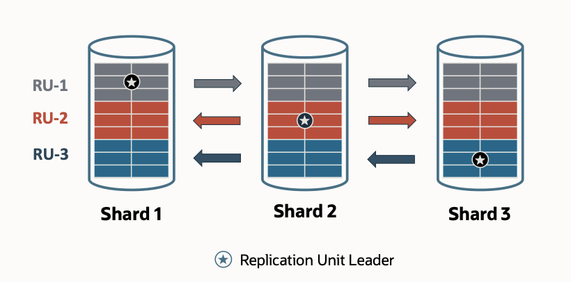

# Introduction

## About Raft Replication

Oracle Globally Distributed Database provides built-in fault tolerance with Raft replication, a capability that integrates data replication with transaction execution in a sharded database. Raft replication enables fast automatic failover with zero data loss.

Raft replication is active/active; each shard can process reads and writes for a subset of data. This capability provides a uniform configuration with no primary or standby shards.

Raft replication is integrated with transaction execution and is completely transparent to users. There is no need to configure and manage Oracle Data Guard or Oracle GoldenGate to achieve high availability. Raft replication automatically reconfigures replication in case of shard host failures or when shards are added or removed from the sharded database.

*Estimated Workshop Time:*  1 hour and 30 minutes

### Objectives
In this workshop, you will gain first-hand experience in utilizing the Raft Replication within Oracle Globally Distributed Database, enabling participants to manage Raft-enabled replication for robust distributed database solutions.

Once you complete your setup, the next lab will cover:

- Exploring the dynamics of Raft
- Testing the use-cases

We will use Podman containers, RAFT UI App and demonstrate multiple use cases.

### Prerequisites
- An Oracle Cloud Account - Please view this workshop's LiveLabs landing page to see which environments are supported

You may now proceed to the next lab.

## Learn More
- [Raft Replication Documentation](https://docs.oracle.com/en/database/oracle/oracle-database/23/shard/raft-replication.html#GUID-AF14C34B-4F55-4528-8B28-5073A3BFD2BE)

## Acknowledgements
* **Authors** - Deeksha Sehgal, Ajay Joshi, Oracle Globally Distributed Database Database, Product Management
* **Contributors** - Pankaj Chandiramani, Shefali Bhargava, Param Saini, Jyoti Verma
* **Last Updated By/Date** - Ajay Joshi, Oracle Globally Distributed Database, Product Management, July 2025