# Explore Raft Replication Topology

## Introduction   
Oracle Globally Distributed Database is a scalability and availability feature for custom-designed OLTP applications that enables the distribution and replication of data across a pool of Oracle databases that do not share hardware or software. The pool of databases is presented to the application as a single logical database.

Oracle Globally Distributed Database provides built-in fault tolerance with Raft replication, a capability that integrates data replication with transaction execution in a sharded database. Raft replication enables fast automatic failover with zero data loss.

The Raft replication feature creates smaller replication units and distributes them automatically among the shards to handle chunk assignment, chunk movement, workload distribution, and balancing upon scaling (addition or removal of shards), including planned or unplanned shard availability changes.

Raft replication provides a consensus-based, high-performance, low-overhead availability solution, with distributed replicas and fast failover with zero data loss, while automatically maintaining the replication factor if shards fail. With Raft replication management overhead does not increase with the number of shards.

This workshop is configured with a custom image having all the required podman containers for Oracle Globally Distributed Database using 23ai RDBMS and GSM Images.

In this workshop, we attempt to use minimal resources to show the demonstration, and in the process we chose a single compute instance to install all of the Oracle Globally Distributed Database components and appclient.


*Estimated Time*:  30 minutes

[Explore Raft Replication Topology](videohub:1_wgjpojgc)

### Objectives
In this lab, you will:
* Explore Raft Replication environment.
* Testing the use-cases

### Prerequisites
This lab assumes you have:
- A Free Tier, Paid or LiveLabs Oracle Cloud account
- You have completed:
    - Lab: Prepare Setup (*Free-tier* and *Paid Tenants* only)
    - Lab: Environment Setup (*Free-tier* and *Paid Tenants* only)
    - Lab: Get started (*Login to the LiveLabs Sandbox Environment* only)
    - Lab: Initialize Environment


## Task 1: Check for containers in your VM

1. To open a new terminal (if not opened it already), Click on Activities (shown on top left corner) >> Terminal icon (shown on the bottom of the screen which is next to Chrome icon) to Launch the Terminal.

    From podman container Details, verify all containers are running:
    
    ```
    <copy>
    sudo podman ps -a
    </copy>
    ```
    
    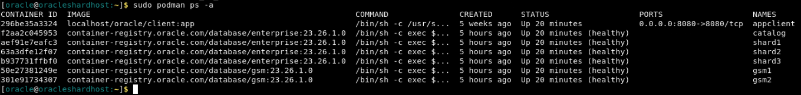

   From top left corner of the Terminal, Click on the "File" and choose first option "New Tab" to open a new tab on the same terminal window: 

    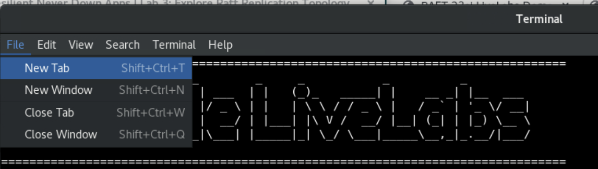
   
    Go inside **gsm1** podman container:

    ```
    <copy>
    sudo podman exec -it gsm1 /bin/bash
    </copy>
    ```

   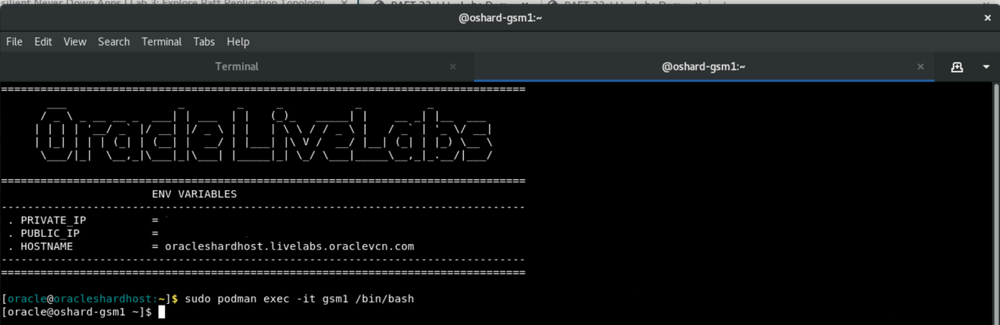

   Similarly, open one more tab (from top left corner of the Terminal, Click on the "File" and choose first option "New Tab") and switched to **appclient** container.

    ```
    <copy>
    sudo podman exec -it appclient /bin/bash
    </copy>
    ```
   
   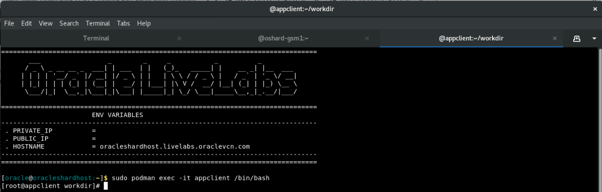

    Alternatively, you can open multiple terminals for different tasks from each terminals.

## Task 2: Explore the Raft configuration

When Raft replication is enabled, a sharded database contains multiple replication units. A replication unit (RU) is a set of chunks that have the same replication topology. Each RU has three replicas placed on different shards. The Raft consensus protocol is used to maintain consistency between the replicas in case of failures, network partitioning, message loss, or delay.

Replicas of an RU make up a Raft group, which consists of an elected leader and a number of followers. In Oracle Sharding the number of followers is limited to two. All DMLs for a particular subset of data are executed in the leader and then are replicated to its followers.

Changes to data made by a DML are recorded in the Raft log. A commit record is also recorded at the end of each user transaction. Raft logs are maintained independently from redo logs and contain logical changes to rows. The logical replication reduces failover time because followers are open to incoming transactions and can quickly become the leader.

For more details check [Raft Replication Configuration and Management] (https://docs.oracle.com/en/database/oracle/oracle-database/23/shard/raft-replication.html#GUID-AF14C34B-4F55-4528-8B28-5073A3BFD2BE)


1. Use the terminal tab (2nd tab) that is switched to **gsm1** container. Verify sharding topology using the  **gdsctl config shard** command.

    ```
    <copy>
    gdsctl config shard
    </copy>
    ```

    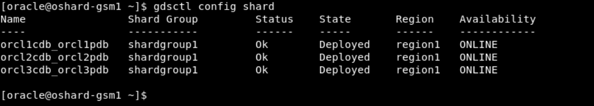

3. Lists all of the database shards and the chunks that they contain.

    ```
    <copy>
    gdsctl config chunks
    </copy>
    ```

    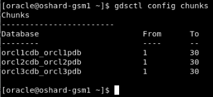

4. Check the status of replication units and chunk distribution across all RUs.

    ```
    <copy>
    gdsctl status ru -show_chunks
    </copy>
    ```

    

5. Display the replication type.

    ```
    <copy>
    gdsctl config sdb
    </copy>
    ```

    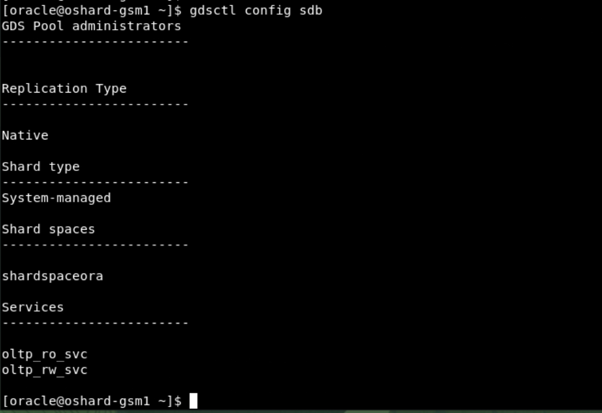


## Task 3: Changing the Replication Unit Leader

Using SWITCHOVER RU, you can change which replica is the leader for the specified replication unit.

The -shard option makes the replication unit member on the specified shard database the new leader of the given RU. 

1. Run the below command on **GSM** terminal's 2nd tab to view the status of all the leaders

    ```
    <copy>
    gdsctl status ru -leaders
    </copy>
    ```

    

2. You can auto rebalance the leaders, if required:

    ```
    <copy>
    gdsctl switchover ru -rebalance
    </copy>
    ```
    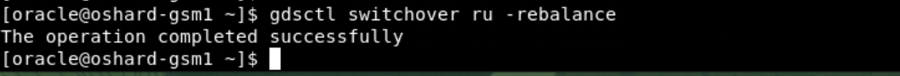

3. Run the below command on GSM1 to view the status of all the leaders again after switchover
    
    ```
    <copy>
    gdsctl status ru -leaders
    </copy>
    ```
    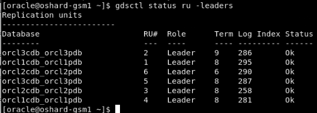

4. Change the leader of the RU 1 to Shard2:

    ```
    <copy>
    gdsctl switchover ru -ru 1 -shard orcl2cdb_orcl2pdb
    </copy>
    ```
    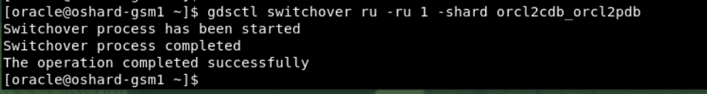

5. Check the status after the change:

    ```
    <copy>
    gdsctl status ru -leaders
    </copy>
    ``` 
    

6. Check the RU#s in sorted order after the change:

    ```
    <copy>
    gdsctl ru -sort
    </copy>
    ``` 
    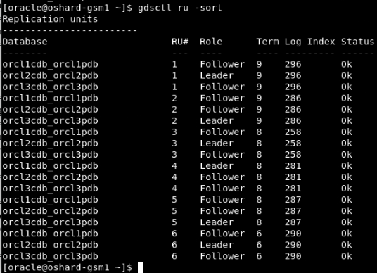


## Task 4: Run the workload

Please use the below steps to run the workload using the "app_schema" account with the available configuration files on the "appclient" container:

1. Use the terminal's 3rd tab that is switched to the "appclient" container. Switch to the "oracle" user.

    ```
    <copy>
    su - oracle
    </copy>
    ```


2. Change the path to $DEMO_MASTER location

    ```
    <copy>
    cd $DEMO_MASTER
    pwd
    ls -lrt
    </copy>
    ```

    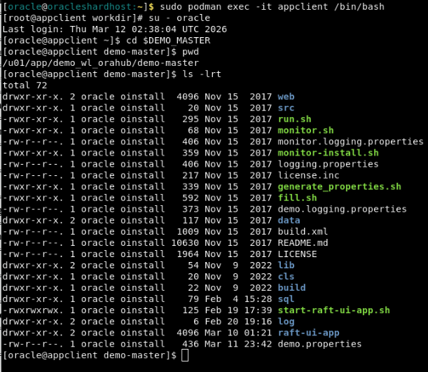

3. Run the workload using the below command and to exit press Ctrl + C

    ```
    <copy>
    sh run.sh demo
    </copy>
    ```
    
    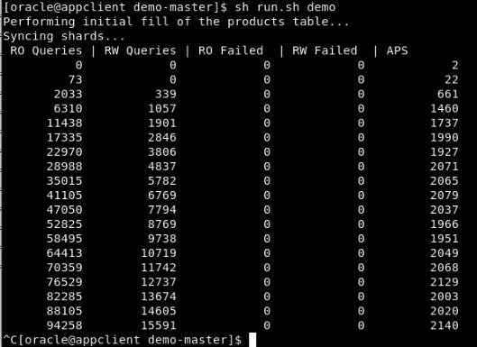

4. Now check the RU details from terminal's 2nd tab which is switched to  **gsm1**.
Notice that for each RU#s, the values is "Log Index" columns are increased due to read and write operations are performed while running the workload.

    ```
    <copy>
    gdsctl status ru -show_chunks
    </copy>
    ```

    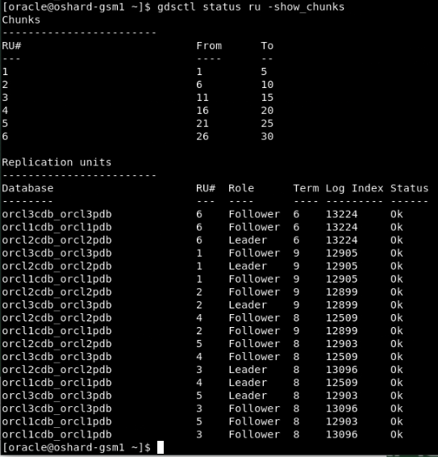

5. From the browser check the increased value of the count on the demo application ( if not running you can rerun using http://localhost:8080).

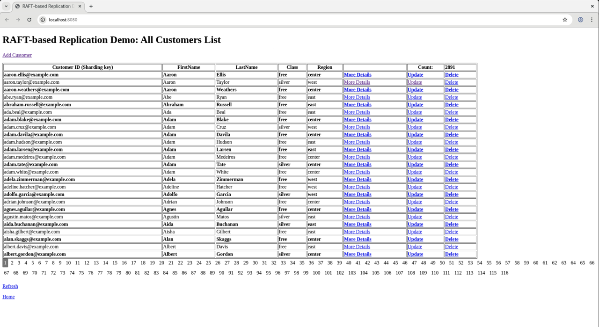


6. You can enter CTRL-C to stop the workload if not already and check the RAFT UI Demo main page to confirm the count is increased. You can also restart this workload as in step 3 and keep running during the next task "Perform Failover Test".


## Task 5: Perform Failover Test

What happens when one of the available shard databases goes down or is taken down for maintenance? 
Failover test by stopping shard1 to create shard1 down situation. 

1. From the terminal window make sure all containers are running. You can run the below command in a terminal window logged in as **oracle** user to check the status for all the containers.

    ```
    <copy>
    sudo podman ps -a
    </copy>
    ```

    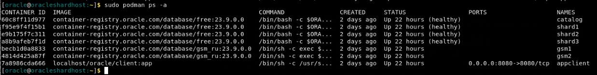  


2.  Run the below command as **oracle** to stop shard1.

    ```
    <copy>
    sudo podman stop shard1
    </copy>
    ```

    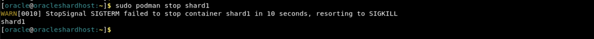  


3. From the 2nd tab of the terminal window connected to **gsm1** ( Below command can be used to switch to **gsm1**, if you are using a new terminal/tab).

    ```
    <copy>
    sudo podman exec -i -t gsm1 /bin/bash
    </copy>
    ```

   Run below in the terminal window that is switched to **gsm1** and check the status of shards, RU's and you will see that database orcl1cdb_orcl1pdb is not present.

    ```
    <copy>
    gdsctl config shard
    </copy>
    ```

    ```
    <copy>
    gdsctl status ru -show_chunks
    </copy>
    ```

    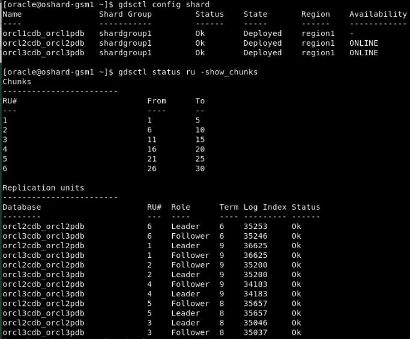  

    You can verify that shard1 down situation has no impact on either the demo ui application or running the workload.

4. On a terminal window logged in as **oracle**.
Start the shard1 using the podman start command, to reflect that shard1 is joining back.

    ```
    <copy>
    sudo podman start shard1
    </copy>
    ```

    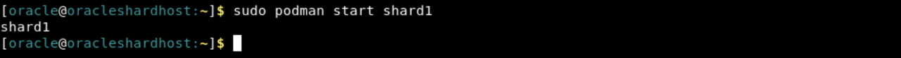


5. On a terminal window switched to the tab for **gsm1** container, check the status of shard, RU's and see that shard1 has joined back.

    ```
    <copy>
    gdsctl config shard
    </copy>
    ```

    ```
    <copy>
    gdsctl status ru -show_chunks
    </copy>
    ```

    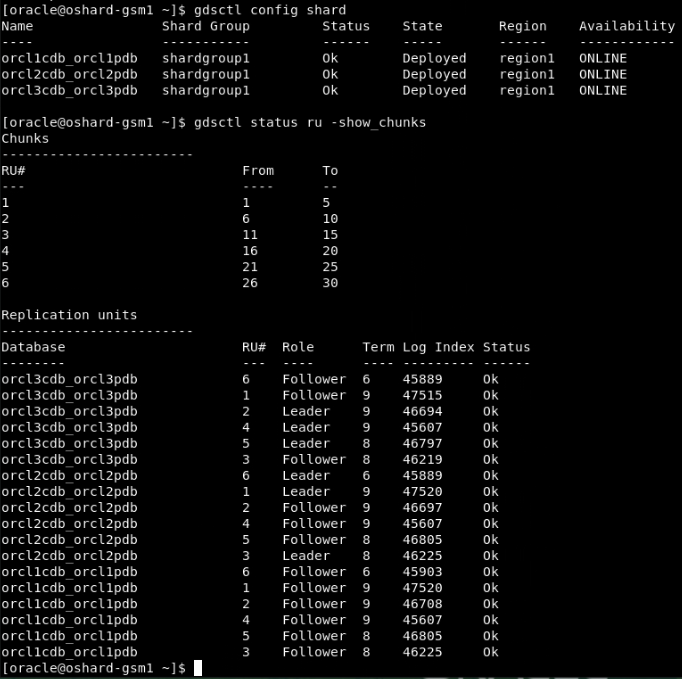  
    
    Navigate to the third tab ( using appclient container) where the workload is running and enter CTRL-C to stop the workload.

6. Run the below command in terminal that is switched to **GSM** to auto rebalance the leaders.

    ```
    <copy>
    gdsctl switchover ru -rebalance
    </copy>
    ```
    

7. Verify the RU# and its leaders after rebalancing the RUs on the shards.

    ```
    <copy>
    gdsctl ru -sort
    </copy>
    ```
    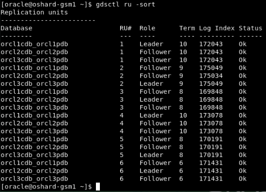

You may now proceed to the next lab.

## Acknowledgements
* **Authors** - Deeksha Sehgal, Ajay Joshi, Oracle Globally Distributed Database, Product Management
* **Contributors** - Pankaj Chandiramani, Shefali Bhargava, Param Saini, Jyoti Verma
* **Last Updated By/Date** - Ajay Joshi, Oracle Globally Distributed Database, Product Management, September 2025