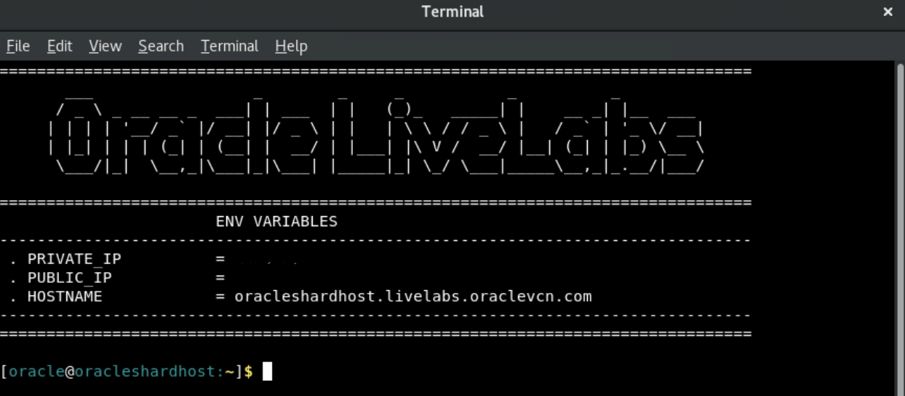
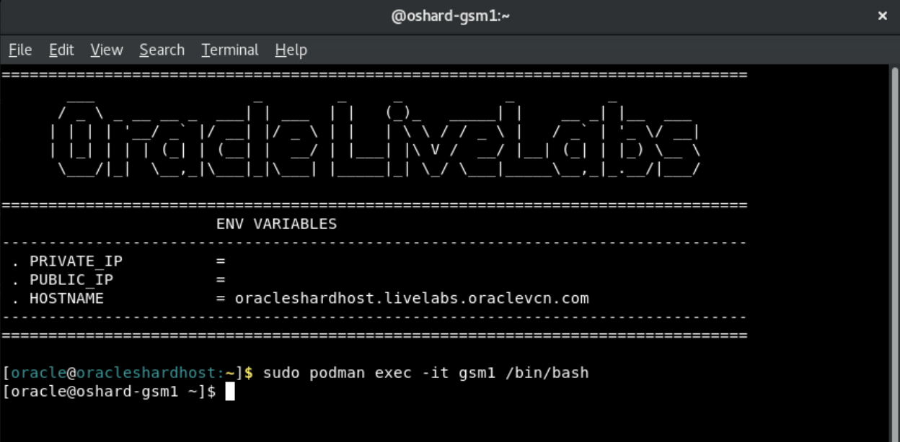
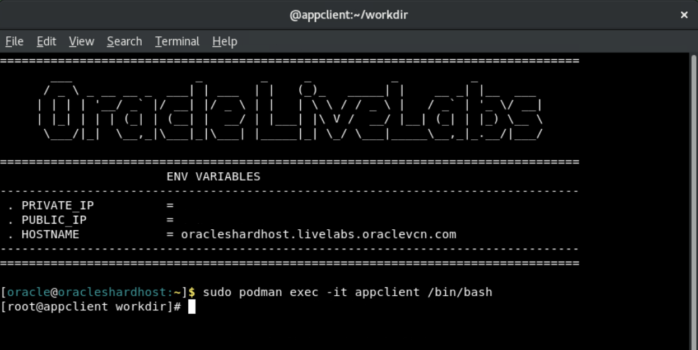
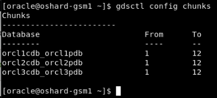
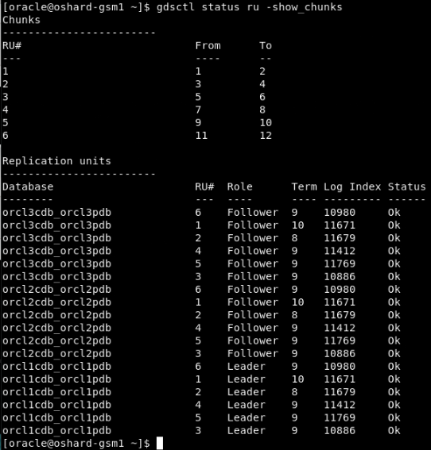
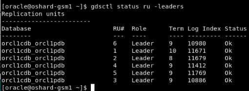
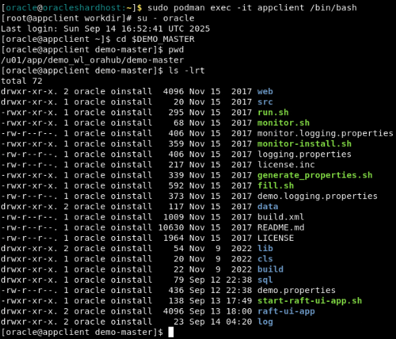
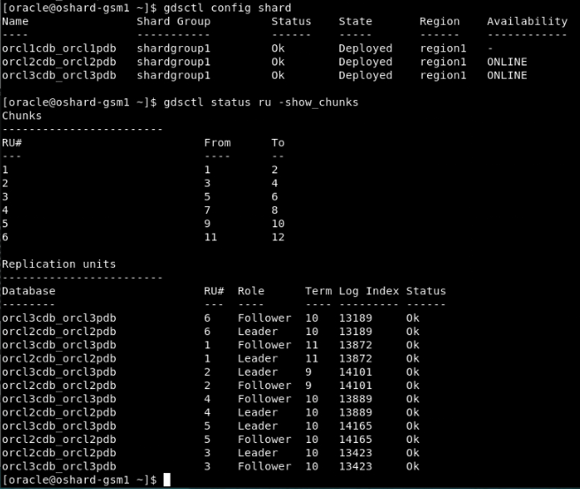
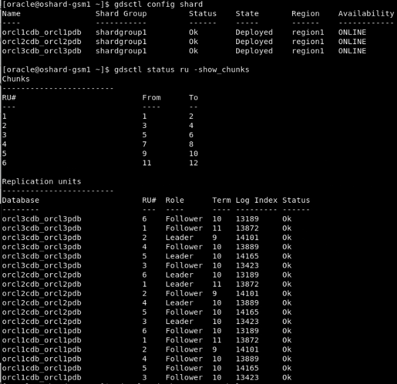

# Explore Raft Replication Topology

## Introduction   
Oracle Globally Distributed Database is a scalability and availability feature for custom-designed OLTP applications that enables the distribution and replication of data across a pool of Oracle databases that do not share hardware or software. The pool of databases is presented to the application as a single logical database.

Oracle Globally Distributed Database provides built-in fault tolerance with Raft replication, a capability that integrates data replication with transaction execution in a sharded database. Raft replication enables fast automatic failover with zero data loss.

The Raft replication feature creates smaller replication units and distributes them automatically among the shards to handle chunk assignment, chunk movement, workload distribution, and balancing upon scaling (addition or removal of shards), including planned or unplanned shard availability changes.

Raft replication provides a consensus-based, high-performance, low-overhead availability solution, with distributed replicas and fast failover with zero data loss, while automatically maintaining the replication factor if shards fail. With Raft replication management overhead does not increase with the number of shards.

This workshop is configured with a custom image having all the required podman containers for Oracle Globally Distributed Database using 23ai RDBMS and GSM Images.

In this workshop, we attempt to use minimal resources to show the demonstration, and in the process we chose a single compute instance to install all of the Oracle Globally Distributed Database components and appclient.


*Estimated Time*:  30 minutes


### Objectives
In this lab, you will:
* Explore Raft Replication environment.
* Testing the use-cases

### Prerequisites
This lab assumes you have:
- A Free Tier, Paid or LiveLabs Oracle Cloud account
- You have completed:
    - Lab: Prepare Setup (*Free-tier* and *Paid Tenants* only)
    - Lab: Environment Setup
    - Lab: Initialize Environment


## Task 1: Check for containers in your VM

1. Please open three terminal windows.

   First terminal logged in as **oracle** user.

    

   Second Terminal switched to **GSM** level.

   ```
   <copy>
   sudo podman exec -i -t gsm1 /bin/bash
   </copy>
   ```

   

   Third Terminal switched to **appclient** container.

   ```
   <copy>
   sudo podman exec -it appclient /bin/bash
   </copy>
   ```
   
   

2. Run the below command on terminal window that is logged in as  as **oracle** user.

    ```
    <copy>
    sudo podman ps -a
    </copy>
    ```

    

## Task 2: Explore the Raft configuration

When Raft replication is enabled, a sharded database contains multiple replication units. A replication unit (RU) is a set of chunks that have the same replication topology. Each RU has three replicas placed on different shards. The Raft consensus protocol is used to maintain consistency between the replicas in case of failures, network partitioning, message loss, or delay.

Replicas of an RU make up a Raft group, which consists of an elected leader and a number of followers. In Oracle Sharding the number of followers is limited to two. All DMLs for a particular subset of data are executed in the leader and then are replicated to its followers.

Changes to data made by a DML are recorded in the Raft log. A commit record is also recorded at the end of each user transaction. Raft logs are maintained independently from redo logs and contain logical changes to rows. The logical replication reduces failover time because followers are open to incoming transactions and can quickly become the leader.

For more details check [Raft Replication Configuration and Management] (https://docs.oracle.com/en/database/oracle/oracle-database/23/shard/raft-replication.html#GUID-AF14C34B-4F55-4528-8B28-5073A3BFD2BE)

1. Run the below command to switch to **GSM**, if you are using a new terminal.

    ```
    <copy>
    sudo podman exec -i -t gsm1 /bin/bash
    </copy>
    ```

    

2. Use the terminal window that is switched to **GSM**. Verify sharding topology using the  **CONFIG** command.

    ```
    <copy>
    gdsctl config shard
    </copy>
    ```

    

3. Lists all of the database shards and the chunks that they contain.

    ```
    <copy>
    gdsctl config chunks
    </copy>
    ```

    

4. Check the status of replication units and chunk distribution across all RUs.

    ```
    <copy>
    gdsctl status ru -show_chunks
    </copy>
    ```

    

5. Display the replication type.

    ```
    <copy>
    gdsctl config sdb
    </copy>
    ```

    


## Task 3: Changing the Replication Unit Leader

   Using SWITCHOVER RU, you can change which replica is the leader for the specified replication unit.

   The -shard option makes the replication unit member on the specified shard database the new leader of the given RU. 

1. Run the below command on **GSM** terminal window to view the status of all the leaders

    ```
    <copy>
    gdsctl status ru -leaders
    </copy>
    ```

    

2. You can auto rebalance the leaders, if required:

    ```
    <copy>
    gdsctl switchover ru -rebalance
    </copy>
    ```
    

3. Run the below command on GSM1 to view the status of all the leaders again after switchover
    
    ```
    <copy>
    gdsctl status ru -leaders
    </copy>
    ```
    

4. Change the leader of the RU 1 to Shard2:

    ```
    <copy>
    gdsctl switchover ru -ru 1 -shard orcl2cdb_orcl2pdb
    </copy>
    ```
    

5. Check the status after the change:

    ```
    <copy>
    gdsctl status ru -leaders
    </copy>
    ``` 
    

## Task 4: Run the workload

Please use the below steps to run the workload using the "app_schema" account with the available configuration files on the "appclient" container:

1.  You can use the below command if you need to switch to appclient container in a new terminal window.

    ```
    <copy>
    sudo podman exec -it appclient /bin/bash
    </copy>
    ```

   

2. Use the terminal window that is switched to the "appclient" container. Switch to the "oracle" user.

    ```
    <copy>
    su - oracle
    </copy>
    ```


3. Change the path to $DEMO_MASTER location

    ```
    <copy>
    cd $DEMO_MASTER
    pwd
    ls -lrt
    </copy>
    ```

    

4. Run the workload using the below command

    ```
    <copy>
    sh run.sh demo
    </copy>
    ```
    

    

5. During this time, you can continue to check the RU details from another terminal window switched to  **gsm** .
Notice that the log index is increasing as read and write operations are going on.

    ```
    <copy>
    gdsctl status ru -show_chunks
    </copy>
    ```

    

6. You can keep running the workload for some time while you perform the next task.


## Task 5: Perform Failover Test

What happens when one of the available shard databases goes down or is taken down for maintenance? 
Failover test by stopping shard1 to create shard1 down situation. 

1.  You can run the below command in a terminal window logged in as **oracle** user to check the status for all the containers.

    ```
    <copy>
    sudo podman ps -a
    </copy>
    ```

      


2.  Run the below command as **oracle** to stop shard1.

    ```
    <copy>
    sudo podman stop shard1
    </copy>
    ```

      


3. Below command can be used to switch to **GSM**, if you are using a new terminal.

    ```
    <copy>
    sudo podman exec -i -t gsm1 /bin/bash
    </copy>
    ```

   Run below in the terminal window that is switched to **GSM** and check the status of shards, RU's and you will see that database orcl1cdb_orcl1pdb is not present.

    ```
    <copy>
    gdsctl config shard
    </copy>
    ```

    ```
    <copy>
    gdsctl status ru -show_chunks
    </copy>
    ```

      

You will see that shard1 down situation has no impact on the running workload.

4. On a terminal window logged in as **oracle**.
Start the shard1 using the podman start command, to reflect that shard1 is joining back.

    ```
    <copy>
    sudo podman start shard1
    </copy>
    ```

    


5. You can use the below command as **oracle** to switch to **GSM**.

    ```
    <copy>
    sudo podman exec -i -t gsm1 /bin/bash
    </copy>
    ```

    On a terminal window switched to **GSM**, check the status of shard, RU's and see that shard1 has joined back.

    ```
    <copy>
    gdsctl config shard
    </copy>
    ```

    ```
    <copy>
    gdsctl status ru -show_chunks
    </copy>
    ```

      
    
You can stop the workload that ran in the previous task using Ctrl+C.

6. Run the below command in terminal that is switched to **GSM** to  auto rebalance the leaders.

    ```
    <copy>
    gdsctl switchover ru -rebalance
    </copy>
    ```
    


You may now proceed to the next lab.

## Acknowledgements
* **Authors** - Deeksha Sehgal, Ajay Joshi, Oracle Globally Distributed Database Database, Product Management
* **Contributors** - Pankaj Chandiramani, Shefali Bhargava, Param Saini, Jyoti Verma
* **Last Updated By/Date** - Ajay Joshi, Oracle Globally Distributed Database, Product Management, July 2025