# Explore RAFT Replication Topology

## Introduction   
Oracle Globally Distributed Database is a scalability and availability feature for custom-designed OLTP applications that enables the distribution and replication of data across a pool of Oracle databases that do not share hardware or software. The pool of databases is presented to the application as a single logical database.

Raft Replication is a built-in Oracle Sharding capability that integrates data replication with transaction execution in a sharded database. Raft replication enables fast automatic failover with zero data loss.

The Raft replication feature in Oracle Globally Distributed Database creates smaller replication units and distributes them automatically among the shards to handle chunk assignment, chunk movement, workload distribution, and balancing upon scaling (addition or removal of shards), including planned or unplanned shard availability changes.

Raft replication is built into Oracle Globally Distributed Database to provide a consensus-based, high-performance, low-overhead availability solution, with distributed replicas and fast failover with zero data loss, while automatically maintaining the replication factor if shards fail. With Raft replication management overhead does not increase with the number of shards.

This workshop is configured with a custom image having all the required podman containers for Sharding using 23ai GSM and 23ai SIDB Beta Images.

In this workshop, we attempt to use minimal resources to show the demonstration, and in the process we chose a single compute instance to install all of the Oracle Globally Distributed Database components and appclient.


*Estimated Time*:  1 hour


### Objectives
In this lab, you will:
* Explore RAFT Replication environment.
* Testing the use-cases

### Prerequisites
This lab assumes you have:
- A Free Tier, Paid or LiveLabs Oracle Cloud account
- You have completed:
    - Lab: Prepare Setup (*Free-tier* and *Paid Tenants* only)
    - Lab: Environment Setup
    - Lab: Initialize Environment


## Task 1: Check for containers in your VM

1. Open a terminal window and execute below as **opc** user.

    ```
    <copy>
    sudo podman ps -a
    </copy>
    ```

     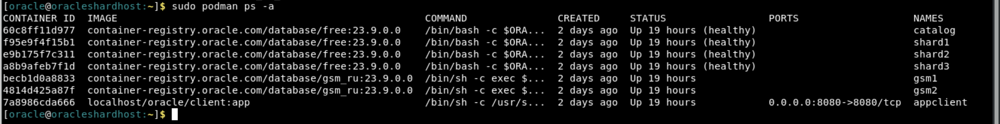

## Task 2: Explore the RAFT configuration

When Raft replication is enabled, a sharded database contains multiple replication units. A replication unit (RU) is a set of chunks that have the same replication topology. Each RU has three replicas placed on different shards. The Raft consensus protocol is used to maintain consistency between the replicas in case of failures, network partitioning, message loss, or delay.

Replicas of an RU make up a Raft group, which consists of an elected leader and a number of followers. In Oracle Sharding the number of followers is limited to two. All DMLs for a particular subset of data are executed in the leader and then are replicated to its followers.

Changes to data made by a DML are recorded in the Raft log. A commit record is also recorded at the end of each user transaction. Raft logs are maintained independently from redo logs and contain logical changes to rows. The logical replication reduces failover time because followers are open to incoming transactions and can quickly become the leader.

For more details check [Raft Replication Configuration and Management] (https://docs.oracle.com/en/database/oracle/oracle-database/23/shard/raft-replication.html#GUID-AF14C34B-4F55-4528-8B28-5073A3BFD2BE)

1. Run in the terminal as **oracle** user and connect to the shard director server.
    ```
    <copy>
    sudo podman exec -i -t gsm1 /bin/bash
    </copy>
    ```

    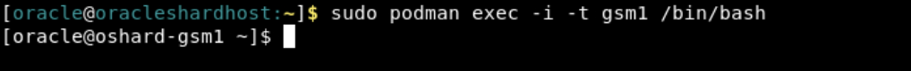

2. Verify sharding topology using the  **CONFIG** command.

    ```
    <copy>
    gdsctl config shard
    </copy>
    ```

    

3. Lists all of the database shards and the chunks that they contain.

    ```
    <copy>
    gdsctl config chunks
    </copy>
    ```

    

4. Display run time for replication units, specifically to view chunk distribution across all RUs.

    ```
    <copy>
    gdsctl status ru -show_chunks
    </copy>
    ```

    

5. Display the replication type.

    ```
    <copy>
    gdsctl config sdb
    </copy>
    ```

    

 6.   Exit from GSM1.

## Task 3: Changing the Replication Unit Leader

Using SWITCHOVER RU, you can change which replica is the leader for the specified replication unit. The -db option makes the specified database the new leader of the given RU. 

1. Run the below command on GSM1 to view the status of all the leaders

    ```
    <copy>
    gdsctl status ru -leaders
    </copy>
    ```

    

2. You can auto rebalance the leaders, if required:

    ```
    <copy>
    gdsctl switchover ru -rebalance
    </copy>
    ```
    

3. Run the below command on GSM1 to view the status of all the leaders again after switchover
    
    ```
    <copy>
    gdsctl status ru -leaders
    </copy>
    ```
    

4. Change the leader of the RU 1 to Shard2:

    ```
    <copy>
    gdsctl switchover ru -ru 1 -shard orcl2cdb_orcl2pdb
    </copy>
    ```
    

5. Check the status after the change:

    ```
    <copy>
    gdsctl status ru -leaders
    </copy>
    ``` 
    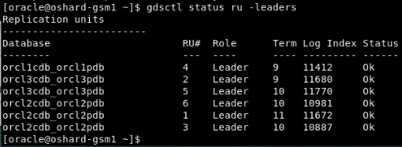

## Task 4: Run the workload

Please use the below steps to run the workload using the "app_schema" account with the available configuration files on the "appclient" container:

1.  Switch to the "appclient" container

    ```
    <copy>
    sudo podman exec -it appclient /bin/bash
    </copy>
    ```
   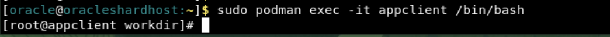

2. Switch to the "oracle" user

    ```
    <copy>
    su - oracle
    </copy>
    ```


3. Change the path to $DEMO_MASTER location

    ```
    <copy>
    cd $DEMO_MASTER
    pwd
    ls -rlt
    </copy>
    ```

    

4. Run the workload using the below command

    ```
    <copy>
    sh run.sh demo
    </copy>
    ```
    

    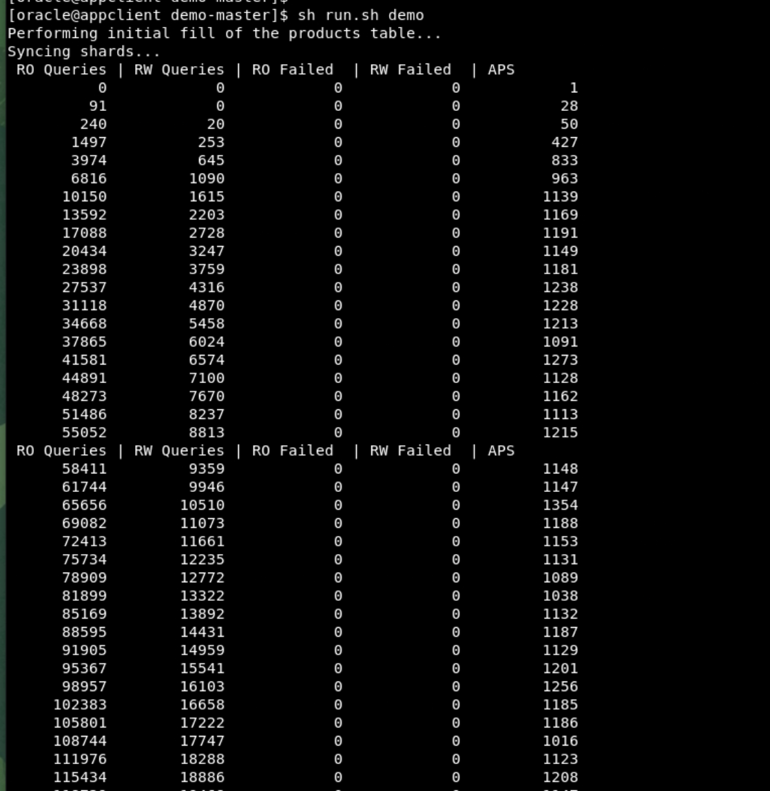

5. During this time, you can continue to check the RU details from another session on the "gsm1" container from "gdsctl" prompt.
Notice that the log index is increasing as there are read and write operations are going on.

    ```
    <copy>
    gdsctl status ru -show_chunks
    </copy>
    ```


6. You can keep running the workload while you perform the next task.


## Task 5: Perform Failover Test

What happens when one of the available shard databases goes down or is taken down for maintenance? 
Failover test by stopping shard1 to create shard1 down situation. 

1.  Run the below command as **oracle** user to check the status for all the containers.

    ```
    <copy>
    sudo podman ps -a
    </copy>
    ```

      


2.  Run the below command as **oracle** to stop shard1.

    ```
    <copy>
    sudo podman stop shard1
    </copy>
    ```

      


3. Switch to GSM1 on another terminal session and check the status for RU's and you will see that database orcl1cdb_orcl1pdb is not present.

    ```
    <copy>
    sudo podman exec -i -t gsm1 /bin/bash
    </copy>
    ```

    ```
    <copy>
    gdsctl config shard
    </copy>
    ```

    ```
    <copy>
    gdsctl status ru -show_chunks
    </copy>
    ```

      

You will see that shard1 down situation has no impact on the running workload.

4. Start the shard1 using the podman start command, to reflect that shard1 is joining back.

    ```
    <copy>
    sudo podman start shard1
    </copy>
    ```

    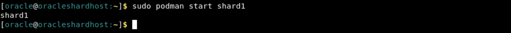


5. On a parallel session switch to GSM1, check the status of shard, RU's and see that shard1 has joined back.

    ```
    <copy>
    sudo podman exec -i -t gsm1 /bin/bash
    </copy>
    ```

    ```
    <copy>
    gdsctl config shard
    </copy>
    ```

    ```
    <copy>
    gdsctl status ru -show_chunks
    </copy>
    ```

      
    
You can stop the workload that ran in the previous task using Ctrl+C.


## Task 6: Scaling UP with Raft Replication

To scale up, you can run ADD SHARD, and Raft replication automatically splits the replication units (RUs), distributes relevant RUs to the new shard, and merges relevant RUs.

After scaling up you can run CONFIG TASK to view the ongoing rebalancing tasks.

The same is true for scaling down using REMOVE SHARD and load balancing using MOVE RU. 


1. We will add another shard named SHARD4 to this setup and see the redistribution happens for the RUs.
Run in the terminal as **oracle** user to Create SHARD4 database container

    ```
    <copy>
   sudo podman run -d --hostname oshard4-0 --dns-search=example.com --network=shard_pub1_nw --ip=10.0.20.106 -e DOMAIN=example.com -e ORACLE_SID=ORCL4CDB -e ORACLE_PDB=ORCL4PDB -e OP_TYPE=primaryshard -e COMMON_OS_PWD_FILE=pwdsecret -e PWD_KEY=keysecret -e SHARD_SETUP="true" -e ENABLE_ARCHIVELOG=true -e INIT_SGA_SIZE=5000 -e INIT_PGA_SIZE=2000 --secret pwdsecret --secret keysecret -v /oradata/dbfiles/ORCL4CDB:/opt/oracle/oradata -v /opt/containers/shard_host_file:/etc/hosts --privileged=false --name shard4 localhost/oracle/database-ext-sharding:23.4.0-ee
    </copy>
    ```

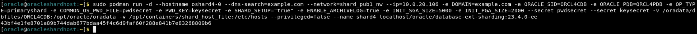
    

2. Open another terminal session to check if the Shard4 database container creation is completed. Run the below command as **oracle** user.

    ```
    <copy>
    sudo podman logs -f shard4
    </copy>
    ```

    


You have to wait until GSM shard set up is completed. Please refer the below screenshot:


3. Once the DB is up and running, complete the below commands to   complete the GSM configuration to deploy the new SHARD4:

    ```
    <copy>
    sudo podman exec -it gsm1 python3 /opt/oracle/scripts/sharding/scripts/main.py --addshard="shard_host=oshard4-0;shard_db=ORCL4CDB;shard_pdb=ORCL4PDB;shard_port=1521;shard_group=shardgroup1"
    </copy>
    ```
    

     ```
    <copy>
    sudo podman exec -it gsm1 python3 /opt/oracle/scripts/sharding/scripts/main.py --deployshard=true
    </copy>
    ```
     

4. Connect to GSM1, run in the terminal as **oracle** user and connect to the shard director server and run the below command to view the ongoing rebalancing tasks. You have to wait until the rebalancing task completes.

    ```
    <copy>
    sudo podman exec -i -t gsm1 /bin/bash
    </copy>
    ```

    

     ```
    <copy>
    gdsctl config task
    </copy>
    ```

    

    

5. Exit from GSM1 and Run the below command as **oracle** user to validate the database shard4 container is healthy.

    ```
    <copy>
    sudo podman ps -a
    </copy>
    ```

     

6. Connect to GSM1, run in the terminal as **oracle** user and connect to the shard director server.

    ```
    <copy>
    sudo podman exec -i -t gsm1 /bin/bash
    </copy>
    ```


 7. Run below command to verify that, shard4 has been deployed.

    ```
    <copy>
    gdsctl config shard
    </copy>
    ```

    

8. Run below command to check the configuration of chunks.

    ```
    <copy>
    gdsctl config chunks
    </copy>
    ```

    

9. Run below the check the status of chunks and RUs after scale up

    ```
    <copy>
    gdsctl status ru -show_chunks
    </copy>
    ```

    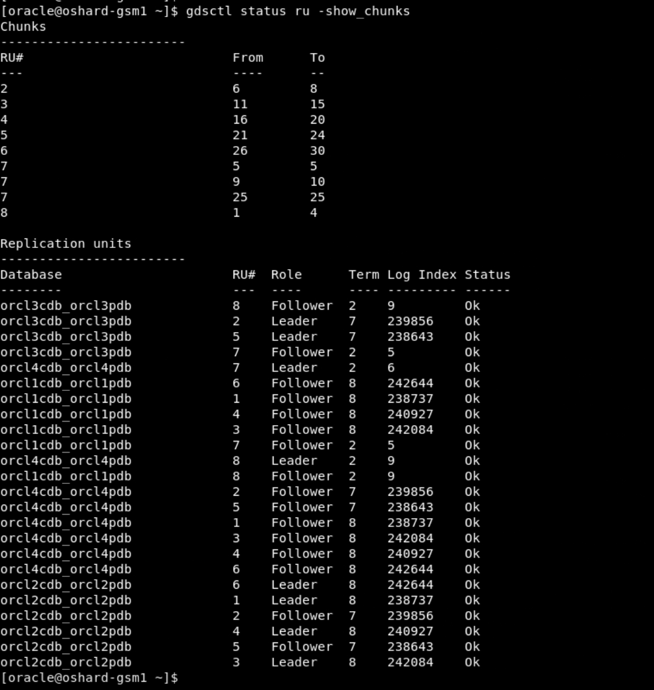

10. Run below command to view all of the leaders

    ```
    <copy>
    gdsctl status ru -leaders
    </copy>
    ```

    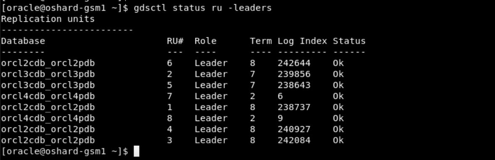

11. Run below command to auto rebalance the leaders.

    ```
    <copy>
    gdsctl switchover ru -rebalance
    </copy>
    ```

    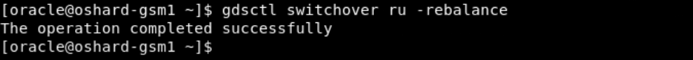

12. Run below command to view again all of the leaders

    ```
    <copy>
    gdsctl status ru -leaders
    </copy>
    ```

    

## Task 7: Move Replication Unit Replicas

Use MOVE RU to move a follower replica of a replication unit from one shard database to another.

1.  Run below command to the check the status of chunks and RUs 

    ```
    <copy>
    gdsctl status ru -show_chunks
    </copy>
    ```

    

2. Please check the status of the RU that you want to move.

    ```
    <copy>
    gdsctl status ru -ru 1
    </copy>
    ```

    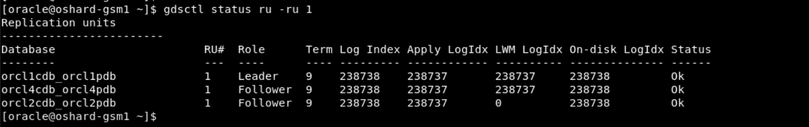

3. Choose the RU with the role follower  associated with the respective shard and move to a shard which is NOT having that RU Replica. 

    ```
    <copy>
    gdsctl move ru -ru 1 -source orcl4cdb_orcl4pdb -target orcl3cdb_orcl3pdb
    </copy>
    ```
    

4.  Please check the status of the RU that you just moved.

    ```
    <copy>
    gdsctl status ru -ru 1
    </copy>
    ```

    

4. Check Status after the move:

    ```
    <copy>
   gdsctl status ru -show_chunks
    </copy>
    ```
    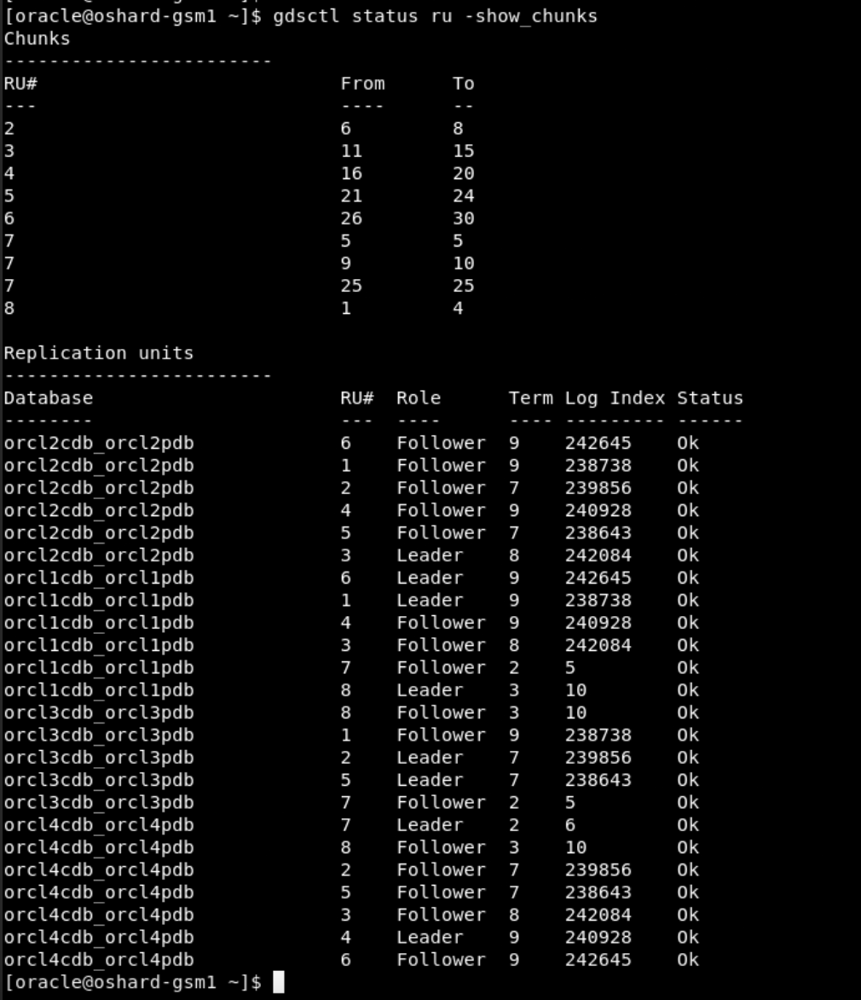

## Task 8: Copy Replication Units

Copy a replication unit from one shard database to another using COPY RU. This allows you to instantiate or repair a replica of a replication unit on the target shard database. 


1. If the target database doesn't contain the specified replication unit then the total number of replicas for the given replication unit should be below replication factor (3), unless -replace is specified.
 
    When we use the replace option, the copy is done and also the replica is removed from the shard which is specified with the replace option thus keeping the replica count to be 3.

    
Connect to GSM1, run in the terminal as **oracle** user and connect to the shard director server.
   
 ```
 <copy>
 sudo podman exec -i -t gsm1 /bin/bash
 </copy>
 ```

2. Connect with GSM1 and run the below command to check the status.
    
    ```
    <copy>
    gdsctl status ru -show_chunks
    </copy>
    ```
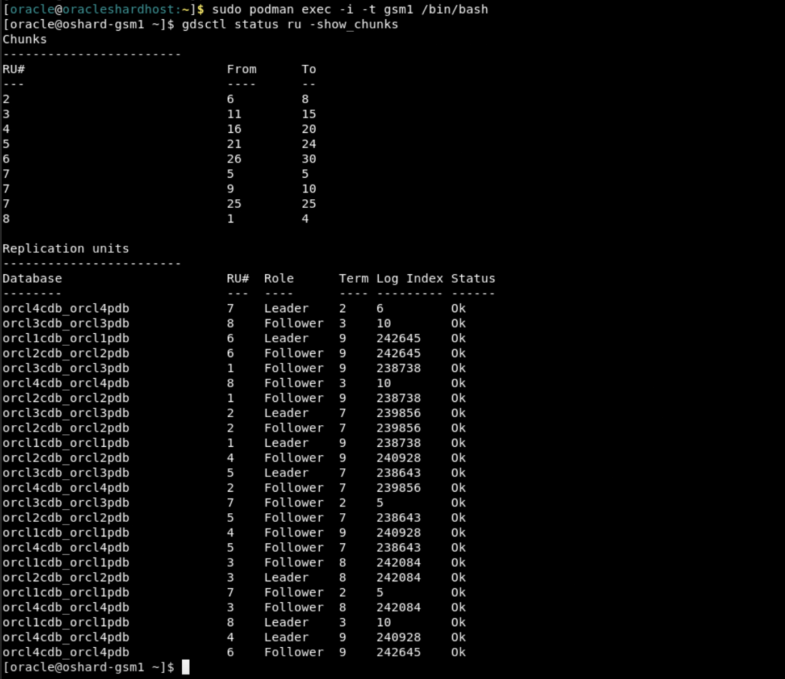
    


3. Please check the status of the RU that you want to copy.

    ```
    <copy>
    gdsctl status ru -ru 1
    </copy>
    ```
   
    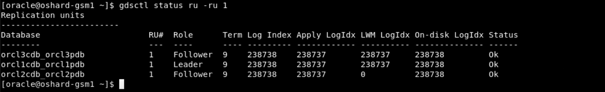


4. Run the below command to copy the RU. Choose the RU (follower) in the source shard and copy it to one of the shard where that RU doesn't exist. Use replace option with the shard from where you would like to remove that RU.


 
    ```
    <copy>
    gdsctl copy ru -ru 1 -source orcl2cdb_orcl2pdb -target orcl4cdb_orcl4pdb -replace orcl3cdb_orcl3pdb
    </copy>
    ```

    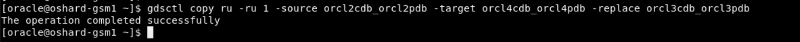


5. Please check the status of the RU that you just copied

    ```
    <copy>
    gdsctl status ru -ru 1
    </copy>
    ```
   
    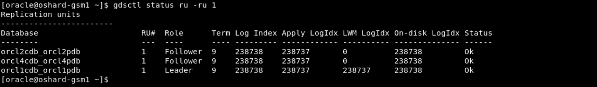

6. You can check the status of the replication unit after the copy command is completed
    ```
    <copy>
    gdsctl status ru -show_chunks
    </copy>
    ```
   
    

## Task 9: Moving A Chunk to Another Replication Unit

1. Please check the status of the chunks and RU:
    
    ```
    <copy>
    gdsctl status ru -show_chunks
    </copy>
    ```

  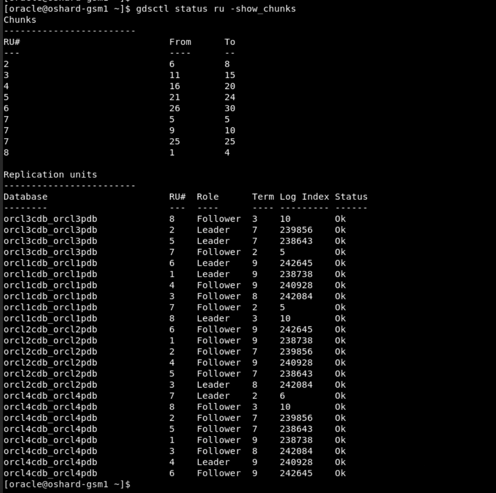

2. To move a chunk from one Raft replication unit to another replication unit, use the GDSCTL RELOCATE CHUNK command.

To use RELOCATE CHUNK, the source and target replication unit leaders must be located on the same shard, and their followers must also be on the same shards. If they are not on the same shard, use SWITCHOVER RU to move the leader and MOVE RU to move the followers to co-located shards.

When moving chunks, specify the chunk ID numbers, the source RU ID from which to move them, and the target RU ID to move them to
 
Suppose we want to relocate chunk 3 from RU 1 to RU 7, RU 1 and 7 leaders must on same shards and RU 1 and 7 followers must be on same shards, if required; use SWITCHOVER RU to move the leader and MOVE RU to move the followers to co-located shards.

Check the status of RU's from which you are trying to relocate:


 ```
 <copy>
 gdsctl status ru -ru 1
 </copy>
 ```

  

  
Change the RU leader using below command, if required.

 ```
 <copy>
 gdsctl switchover ru -ru 1 -shard orcl2cdb_orcl2pdb
 </copy>
 ```

  


Move the RU follower using below command, if required

 ```
 <copy>
 gdsctl move ru -ru 7 -source orcl3cdb_orcl3pdb -target orcl2cdb_orcl2pdb 
 </copy>
 ```

  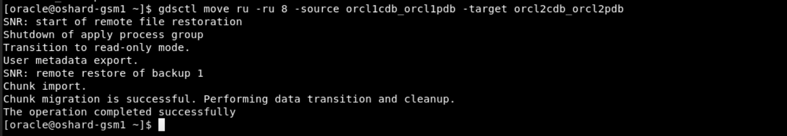


2. Run the below command to relocate the chunk from GSM1:

    ```
    <copy>
    gdsctl relocate chunk -chunk 3 -sourceru 1 -targetru 7 
    </copy>
    ```

  


3. Please check the status of the chunks and RU, after relocate completes.
    
    ```
    <copy>
    gdsctl status ru -show_chunks
    </copy>
    ```

  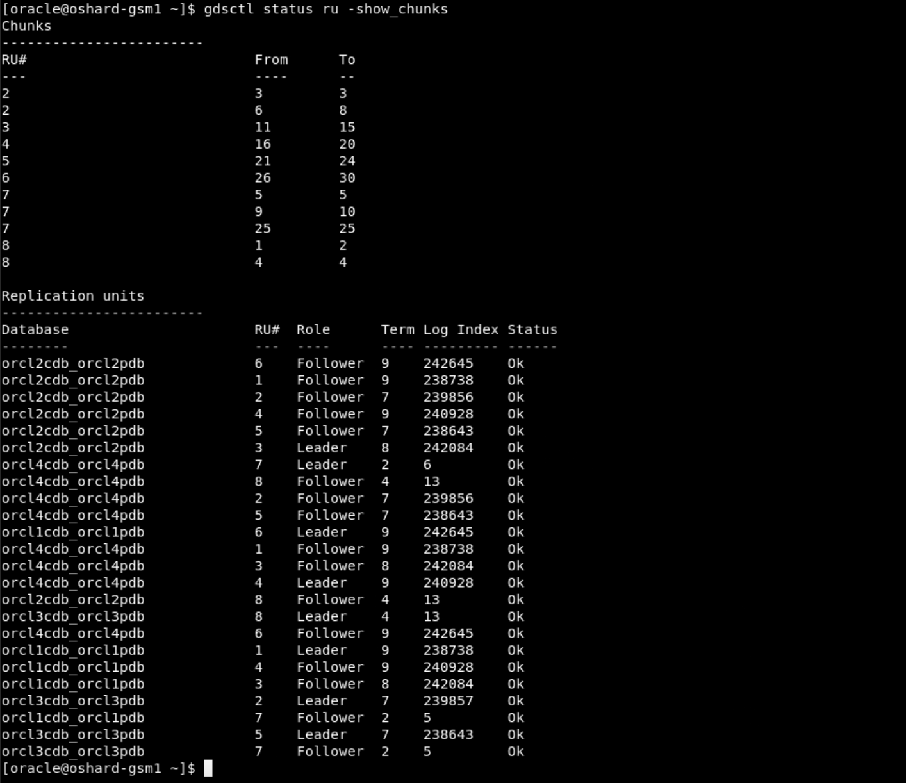

## Task 10: Scale Down with Raft Replication

Scaling down can be done using REMOVE SHARD and load balancing using MOVE RU.

1.  Run below command to the check the status of chunks and RUs 

    ```
    <copy>
    gdsctl status ru -show_chunks
    </copy>
    ```

    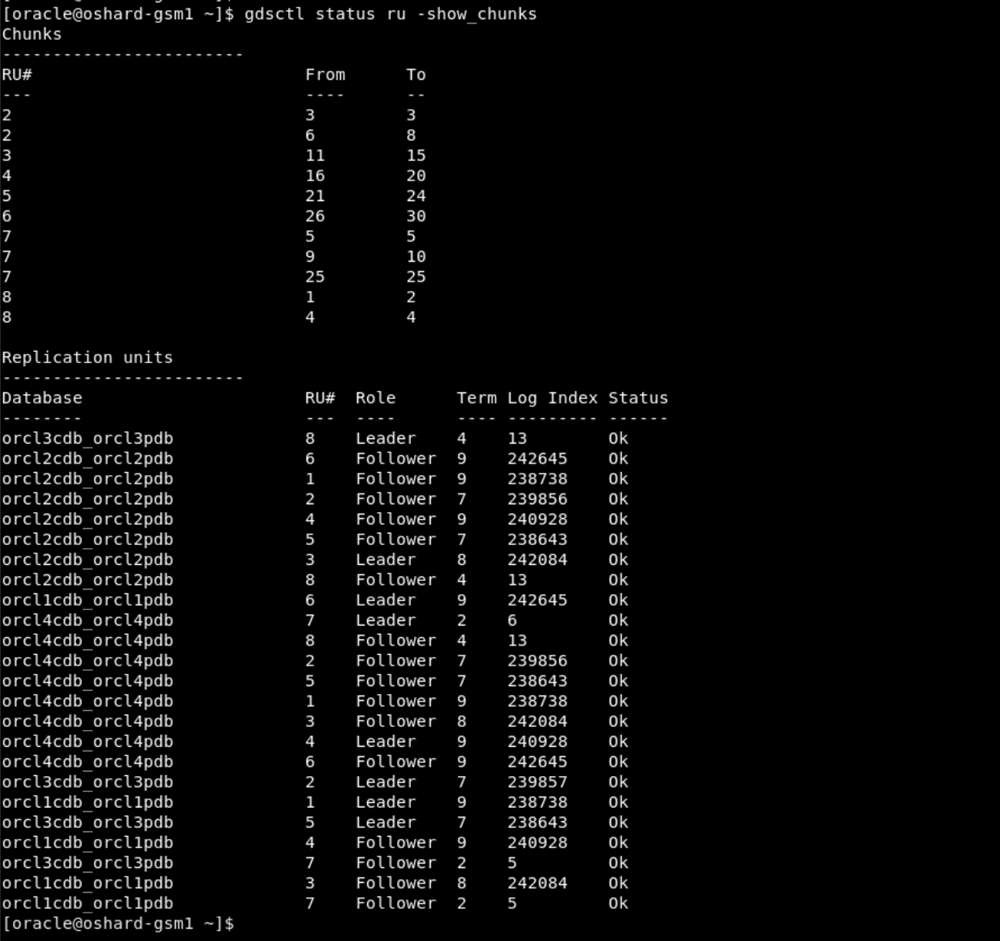

2. We want to Scale Down by removing the SHARD4.
We will first change the replication unit leaders from shard4 to other shards and move the RUs from the SHARD4 to other shards

    ```
    <copy>
    gdsctl switchover ru -ru 7 -shard orcl1cdb_orcl1pdb
    </copy>
    ```
    ```
    <copy>
    gdsctl switchover ru -ru 8 -shard orcl1cdb_orcl1pdb
    </copy>
    ```

     


  Check the status of chunks after switchover.
    
    ```
    <copy>
    gdsctl status ru -show_chunks
    </copy>
    ```
 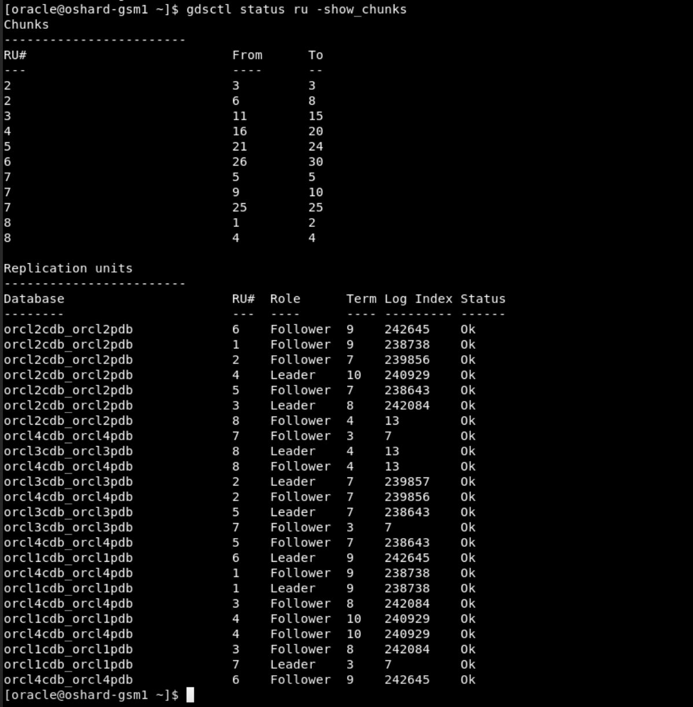


We perform move ru until all the RU followers are moved from shard4 to other shards.
Source database shouldn't contain the replica leader
Target database should not already contain another replica of the replication unit


 ```
 <copy>
 gdsctl move ru -ru 7 -source orcl4cdb_orcl4pdb -target orcl2cdb_orcl2pdb
 </copy>
 ```

 ```
 <copy>
 gdsctl move ru -ru 8 -source orcl4cdb_orcl4pdb -target orcl2cdb_orcl2pdb
 </copy>
 ```

   ```
  <copy>
  gdsctl move ru -ru 6 -source orcl4cdb_orcl4pdb -target orcl3cdb_orcl3pdb
  </copy>
  ```


3. Check the status after the move.

    ```
    <copy>
    gdsctl status ru -show_chunks
    </copy>
    ```

    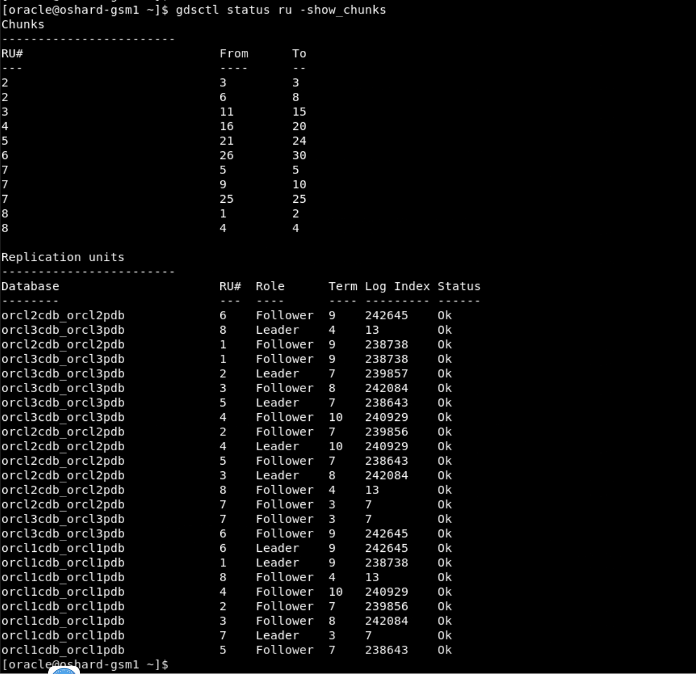   

4. Move the chunks out of the SHARD4 before we can delete this SHARD:
  Run this command from GSM1.
    ```
    <copy>
    python3 /opt/oracle/scripts/sharding/scripts/main.py --movechunks="shard_db=ORCL4CDB;shard_pdb=ORCL4PDB"
    </copy>
    ```

   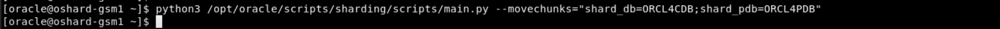

5. Check the status for the chunks across all the RU's again and and make sure no DDL error is seen.
    ```
    <copy>
    gdsctl status ru -show_chunks
    </copy>
    ```

    ```
    <copy>
    gdsctl show ddl -failed_only
    </copy>
    ```
   
    

6. Complete the SHARD4 delete operation.

    ```
    <copy>
    python3 /opt/oracle/scripts/sharding/scripts/main.py --deleteshard="shard_host=oshard4-0;shard_db=ORCL4CDB;shard_pdb=ORCL4PDB;shard_port=1521;shard_group=shardgroup1"
    </copy>
    ```
    

7. Check the status after scale down operation is completed.

    ```
    <copy>
    gdsctl config shard
    </copy>
    ```

    ```
    <copy>
    gdsctl config chunks
    </copy>
    ```

    ```
    <copy>
    gdsctl status ru -show_chunks
    </copy>
    ```

    
    
8. Stop and remove the shard4 container 

    ```
    <copy>
    sudo podman stop shard4
    </copy>
    ```

    ```
    <copy>
    sudo podman rm shard4
    </copy>
    ```

   

9. Check if the shard4 has been removed.

   ```
    <copy>
    sudo podman ps -a
    </copy>
    ```

     


This is the end of the Oracle Sharding RAFT Replication Workshop.


## **Appendix 1**: RAFT Replication Overview

**RAFT Replication** 

 - [RAFT Replication documentation] (https://docs.oracle.com/en/database/oracle/oracle-database/23/shard/raft-replication.html#GUID-AF14C34B-4F55-4528-8B28-5073A3BFD2BE)


## Rate this Workshop
When you are finished don't forget to rate this workshop!  We rely on this feedback to help us improve and refine our LiveLabs catalog.  Follow the steps to submit your rating.

1.  Go back to your **workshop homepage** in LiveLabs by searching for your workshop and clicking the Launch button.
2.  Click on the **Brown Button** to re-access the workshop  

    

3.  Click **Rate this workshop**

    

If you selected the **Green Button** for this workshop and still have an active reservation, you can also rate by going to My Reservations -> Launch Workshop.

## Acknowledgements
* **Authors** - Deeksha Sehgal, Oracle Globally Distributed Database Database, Product Management, Senior Product Manager
* **Contributors** - Pankaj Chandiramani, Param Saini, Jyoti Verma
* **Last Updated By/Date** - Deeksha Sehgal, Oracle Globally Distributed Database Database, Product Management, Senior Product Manager - May 2024
