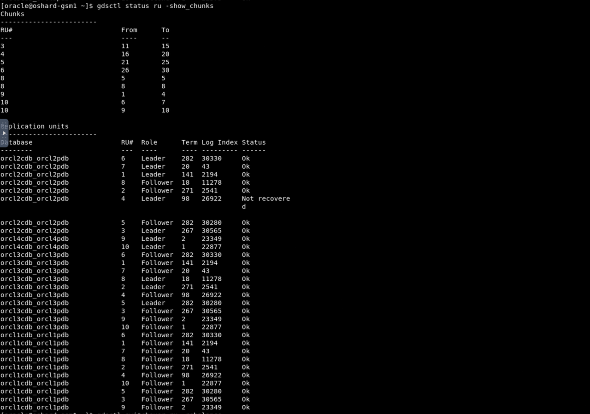
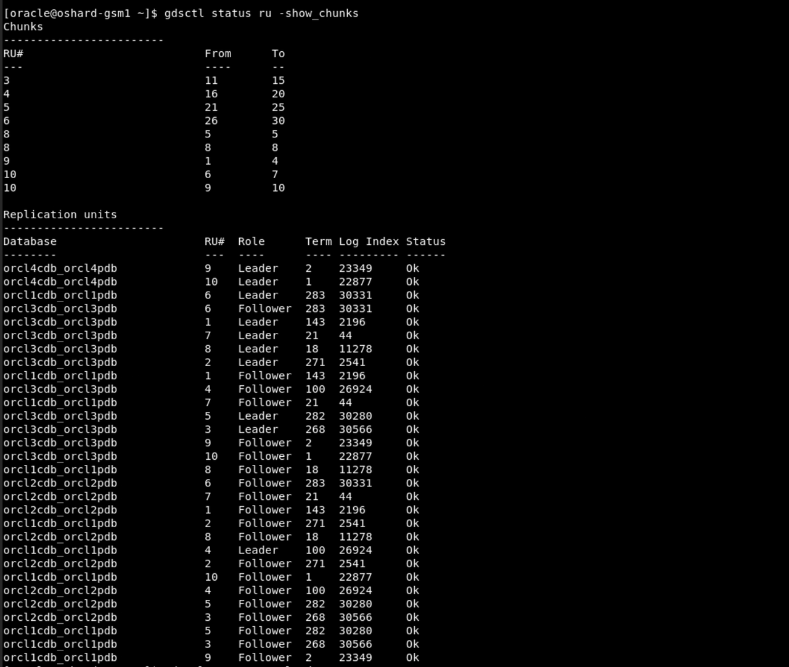
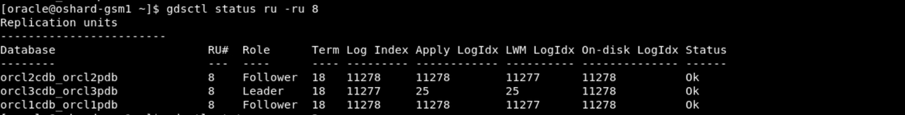
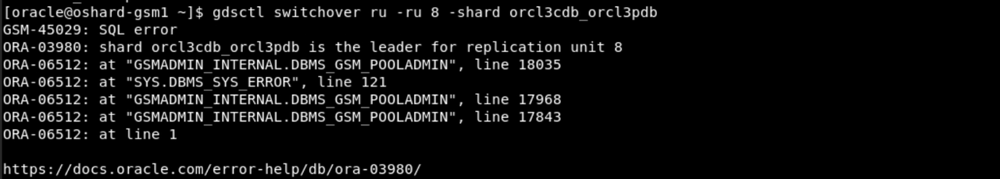
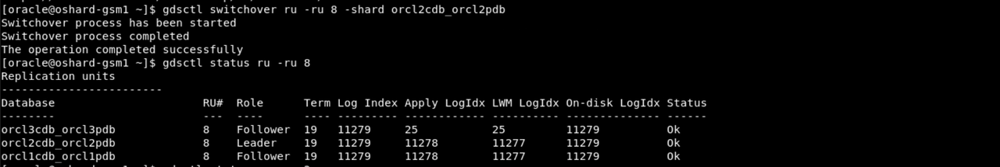
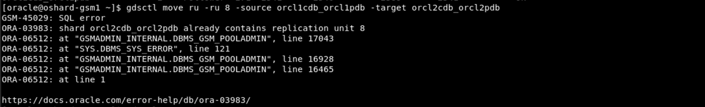
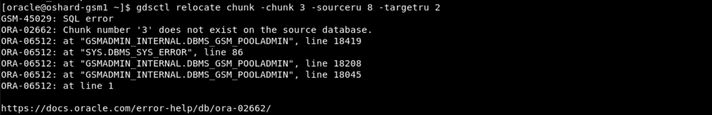
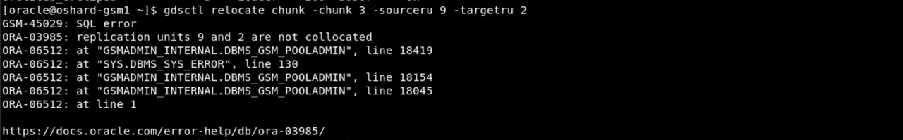
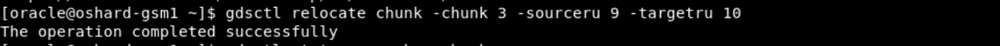
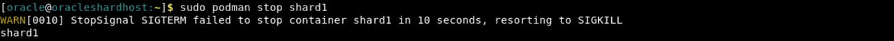

# Troubleshooting Guide

## Introduction   
This section is designed to guide you in troubleshooting any issues that may arise while performing the Raft Replication test cases in this Live Labs environment. It provides assistance to help you resolve common challenges effectively.

*Estimated Time*:  30 minutes


### Objectives
In this troubleshooting section, you will:
* Identify and resolve common issues encountered during the Raft Replication test cases.
* Gain a deeper understanding of the Raft Replication environment by troubleshooting various scenarios.

### Prerequisites
This lab assumes you have:
- A Free Tier, Paid or LiveLabs Oracle Cloud account
- You have completed:
    - Lab: Prepare Setup (*Free-tier* and *Paid Tenants* only)
    - Lab: Environment Setup
    - Lab: Initialize Environment

## Scenarios: Guide for Raft Replication Test Cases

1. If you encounter a 'Not Recovered' status for any of the shards.

    

   You need to restart that shard.

    ```
    <copy>
    sudo podman stop shard2
    </copy>
    ```

    ```
    <copy>
    sudo podman start shard2
    </copy>
    ```

    Use the terminal window that is switched to **GSM**. You can now check the status again and it will show as ok.

    ```
    <copy>
    gdsctl status ru -show_chunks
    </copy>
    ```

    


2. If you receive an error indicating that background tasks are pending, you need to check which tasks are still pending. To do this, view the ongoing rebalancing tasks.

    ```
    <copy>
    gdsctl config task
    </copy>
    ```

    To cancel a particular task:

    ```
    <copy>
    gdsctl alter task -task <task id> -cancel
    </copy>
    ```

    Please put the task id as per the current environment.

    


3. If you get the error mentioned in below screenshot during switchover RU:


    

    

    The specified shard was the leader for the given replication unit.
    Please validate parameter values and retry command.

    


4. If you get error shown in below screenshot during MOVE RU.
   You need to substitute the values according to the current environment. 
   Use MOVE RU to move a follower replica of a replication unit from one shard database to another. 

    Notes:

    - Source database shouldn't contain the replica leader

    - Target database should not already contain another replica of the replication unit


    


5. If you get errors shown in below two screenshots during relocate chunk

    


    

    Please follow these guidelines while relocating chunk.

    To move a chunk from one Raft replication unit to another replication unit, use the GDSCTL RELOCATE CHUNK command.

    To use RELOCATE CHUNK, the source and target replication unit leaders must be located on the same shard, and their followers must also be on the same shards. If they are not on the same shard, use SWITCHOVER RU to move the leader and MOVE RU to move the followers to co-located shards.

    When moving chunks, specify the chunk ID numbers, the source RU ID from which to move them, and the target RU ID to move them to, as shown here.

    The specified chunks must be in the same source replication unit.


     


6. If you see a warning while stopping the shard, it's just informational. Checking the shards from the **GSM** terminal will confirm that the shard has stopped.

    


7. While performing a delete operation through the Demo UI Application.

   If the delete operation is slow and you click the button multiple times, you may encounter the following error in the browser:

    ```
    Whitelabel Error Page
    This application has no explicit mapping for /error, so you are seeing this as a fallback.
    ```

   Please wait and go slow with the delete process. Rapid clicks can cause errors, so allow the operation to complete before clicking again.


## Acknowledgements
* **Authors** - Deeksha Sehgal, Oracle Globally Distributed Database Database, Product Management, Senior Product Manager
* **Contributors** - Pankaj Chandiramani, Shefali Bhargava, Ajay Joshi, Jyoti Verma
* **Last Updated By/Date** - Ajay Joshi, Oracle Globally Distributed Database, Product Management, Consulting Member of Technical Staff, August 2024