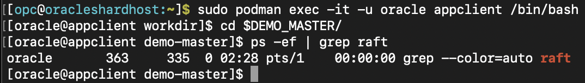
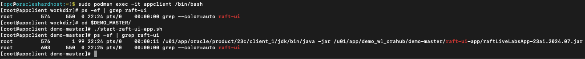
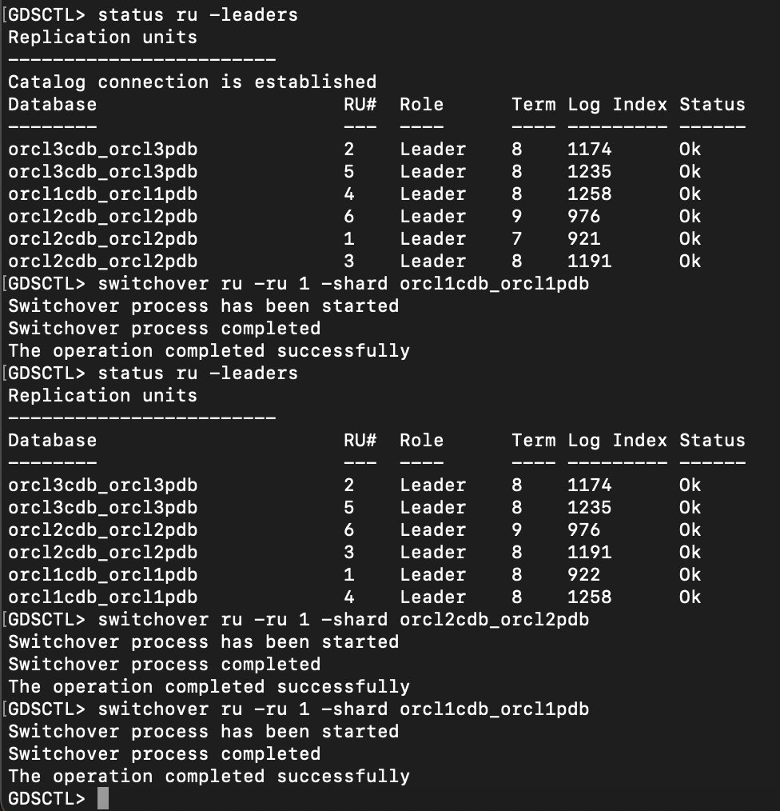
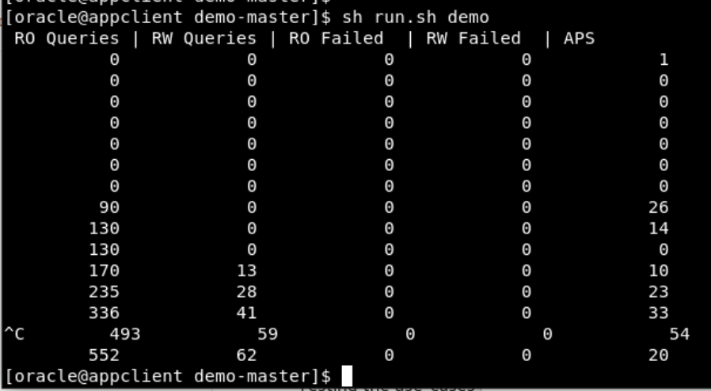
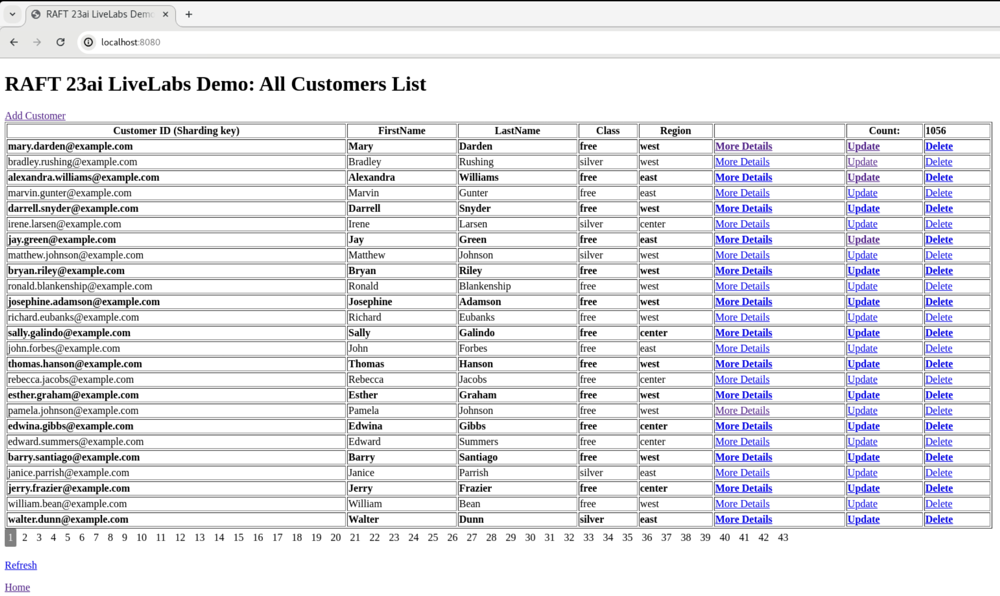
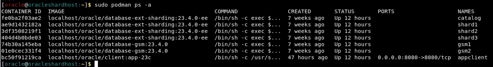
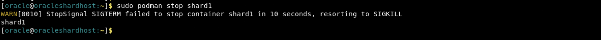
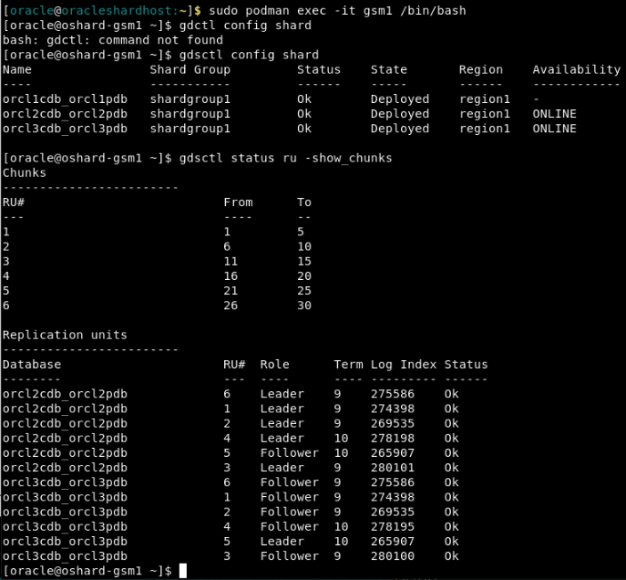
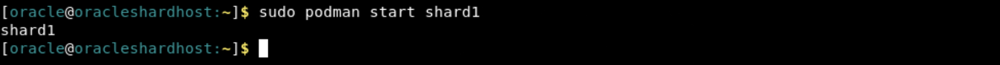

# Raft Replication Demo UI Application: To verify Raft Replication Topology in Oracle 23ai

## Introduction

Raft Replication Demo UI Application to verify Raft Replication Topology in Oracle 23ai with sample Customers Data.
This Demo app is to give a feel of a simple CRUD application based on Oracle 23ai RAFT replication features. Similar database operations can be performed from various GDSCTL or SQL*Plus command.  

Data can be populated by two different ways in Customers and its child tables:         
        a) Run the workload (Same as in the previous Lab: Explore Raft Replication Topology's Task 4: Run the workload).         
        b) Add Customers from Demo UI.

"More details" link on the Home page opens a new page which shows the shard database name and Replication Unit(RU#) of the particular customer with matching customerId (which is the sharding key). There are optional links to "Update" (or just want to view ) or  "Delete" a record.

Here is the Home page of the Raft Replication Demo UI Application after running initial workload to view some sample customers data:


_Estimated Time_: 30 minutes

### Objectives

In this lab, you will:

- Explore Raft Replication Demo UI Application for CRUD(Create, Update, Delete) operations and getting More Details.
- Testing the UI App use-cases.

### Prerequisites

This lab assumes you have:

- A Free Tier, Paid or LiveLabs Oracle Cloud account
- You have completed:
  - Lab: Prepare Setup (_Free-tier_ and _Paid Tenants_ only)
  - Lab: Environment Setup
  - Lab: Initialize Environment
  - Lab: Topology

## Task 1: Start/stop/restart RAFT Demo UI application

1. How to check if RAFT Demo UI is running?

    ```
    <copy>
    ps -ef | grep raft
    </copy>
    ```
   
 2.  When RAFT Demo UI needs start?
   
   

 3.  When RAFT Demo UI is already running?

    


4. How to start RAFT Demo UI?

    ```
    <copy>
    sudo podman exec -it --user oracle appclient /bin/bash
    cd $DEMO_MASTER
    ./start-raft-ui-app.sh
    Enter return to come back to [oracle@appclient demo-master]$
    </copy>
    ```

    

5. For some reasons if you want to restart the RAFT Demo UI, it can be performed by steps as below:
    ```
    <copy>
    ps -ef | grep raft
    kill -9 <pid of process resulting from above command>
    ./start-raft-ui-app.sh
    Enter return to come back to [oracle@appclient demo-master]$
    </copy>
    ```

    


## Task 2: Access the Demo UI application to verify the switchover from More Details page

1. View All Customers List from the Catalog Database from the browser with http://localhost:/8080
   This will open a home page as shown in introduction section of Raft Replication Demo UI Application. It retrieves All Customers List from the Catalog Database using GDS$CATALOG service. Home Page shows 25 Customer's data with pagination, count of All customers, More Details, Add new customer, Update customer and Delete customer links. To view the customers listed on a specific page number, click the link for the page number.

2. More Details Page: When you click on More Details link shown of the Home Page, it will show shard database name and Replication Unit(RU#) to which this particular customerId belongs to as of now. This page also shows Refresh List which can be useful to view More details after any event which moves the record for this customerId to some other shard database name and RU. There are multiple events e.g., rebalance data manually by performing switchover/copy manually, shutdown shard, failover, scale up /scale-down etc which can allow shard db and RU# changed automatically by RAFT topology. Home Page link is shown in the bottom of the page.

3. Below are switchover steps performed via gsm1 container at GDSCTL and after each step, output is verified from the UI:

    


4. On More Details page verify that before switchover of RU#1 from shard1 to shard2, leader is shard1 for this RU#1:

    


5. After switchover of RU#1 from shard1 to shard2, shard2 becomes the leader of RU#1:

    


6. After switchover of RU#1 from shard2 back to shard1, new leader of RU#1 is shard1 as it was originally:

    


## Task 3: Access the Demo UI application to view pre-loaded Customers List and perform CRUD operations

1. Add Customer: A customer can be added either using link "Add Customer" on top section of the home page "RAFT 23ai LiveLabs Demo: All Customers List" or API call in a browser http://localhost:/8080/addcustomer/

   

   After adding customer, it brings back to the All-Customers List page. Total Customers count gets increased after adding a customer by 1. The customer details can be viewed with Api call format http://localhost:/8080/updateCustomer/<customerId> for given value of customerId.

2. Update Customer: A customer can be edited either by using link "Update" link from the Home Page or directly using Api call format http://localhost:/8080/updateCustomer/<customerId>

   

   After updating customer, it brings back to the All-Customers List page. You can verify the updated customer details shown in UI or manually using Api call format http://localhost:/8080/updateCustomer/<customerId>

3. Delete Customer: A customer can delete either using link "Delete" or manually using api call from the browser in the format http://localhost:8080/deleteCustomer/<customerId>.
   After deleting customer, it brings back to the All-Customers List page. Total count on the All-Customers List page is reduce by 1.

4. To Refresh the data on the "Home Page", you can use the Refresh link from the bottom section of the Home Page. Alternatively, reload the page either from the browser's default refresh icon.

5. "Home" Page link at the bottom the page brings to the first page and useful when you are at any higher page# and want to return to the first page of RAFT UI application.


## Task 4: Run the workload to view newly added customers from UI App

1. You can use the below steps to run the additional workload and view those in UI after refreshing the page:

    ```
    <copy>
    sudo podman exec -it --user oracle appclient /bin/bash
    cd $DEMO_MASTER
    sh run.sh demo
    </copy>
    ```

    

2. Monitor the load from UI app: After additional demo data load, count will increase and all customers including recently will be shown like below

    


3. You can check the RU details from another session on the "gsm1" container from "gdsctl" prompt. Notice that the log index is increasing as there are read and write operations are going on similar to you have verified in Lab4's task 5.

    ```
    <copy>
    gdsctl status ru -show_chunks
    </copy>
    ```

4. You can keep running the workload while you perform the next task or exit workload using Ctrl+C. Keep observing All customers page via http://localhost:8080 to view the Total count is increasing accordingly after refreshing the Home Page.


## Task 4: Verify data from UI during Failover Test

What's effect on Application UI when one of the available shard databases goes down or is taken down for maintenance? Since RU leadership will changes from shard1 to any competing shards, UI will keep showing data from the catalog without any this UI application downtime.

Run the similar steps from Lab 3 Explore Raft Replication Topology - Task 5: Perform Failover Test.

1.  Run the below command as **oracle** user to check the status for all the containers.

    ```
    <copy>
    sudo podman ps -a
    </copy>
    ```

      


2.  Run the below command as **oracle** to stop shard1.

    ```
    <copy>
    sudo podman stop shard1
    </copy>
    ```

      


3. Switch to GSM1 on another terminal session and check the status for RU's and you will see that database orcl1cdb_orcl1pdb is not present.

    ```
    <copy>
    sudo podman exec -i -t gsm1 /bin/bash
    </copy>
    ```

    ```
    <copy>
    gdsctl config shard
    </copy>
    ```

    ```
    <copy>
    gdsctl status ru -show_chunks
    </copy>
    ```

      

You will see that shard1 stop situation has no impact on the running UI application and workload if it’s still keep on running. UI can show the newly added records and counts also increase when we refresh the page by click the Refresh link or browser's refresh icon. Records and counts can be verified from sqlplus client as well after connecting to the catalog DB from the catalog container.

4. Start the shard1 using the podman start command, to reflect that shard1 is joining back.

    ```
    <copy>
    sudo podman start shard1
    </copy>
    ```

    


5. On a parallel session switch to GSM1, check the status of shard, RU's and see that shard1 has joined back.

    ```
    <copy>
    sudo podman exec -i -t gsm1 /bin/bash
    </copy>
    ```

    ```
    <copy>
    gdsctl config shard
    </copy>
    ```

    ```
    <copy>
    gdsctl status ru -show_chunks
    </copy>
    ```

      
    
You can stop the workload that ran in the previous task using Ctrl+C.

In summary, Lab "Explore Raft Replication Topology" actions e.g., for Raft Replication failovers, Scale UP or Scale Down, Move Replication Unit Replicas etc. can be verified from Raft Demo UI.

## Rate this Workshop
When you are finished, don't forget to rate this workshop!  We rely on this feedback to help us improve and refine our LiveLabs catalog.  Follow the steps to submit your rating.

## Acknowledgements
* **Authors** - Ajay Joshi, Oracle Globally Distributed Database, Product Management, Consulting Member of Technical Staff
* **Contributors** - Pankaj Chandiramani, Shefali Bhargava, Deeksha Sehgal, Jyoti Verma
* **Last Updated By/Date** - Ajay Joshi, Oracle Globally Distributed Database, Product Management, Consulting Member of Technical Staff, July 2024