# Raft Replication Demo UI Application

## Introduction
Raft Demo UI application is to showcase the Raft replication features.
On right side of browser window, by default a single page application with titled "Raft Replication Dashboard" is shown.
It can be opened anytime on the Chrome browser tab by typing http://localhost:8080

Raft Replication Demo UI Application is to verify Raf Replication Topology in Oracle Globally Distributed AI Database with sample CRUD application for Customers Data.

The Raft Replication Dashboard shows one of the sample customer ID's Shard Database and Replication Unit (RU), Selected RU's Placement, Database Operations and All Replication Units on each of the three shards with Leader and Follower details:

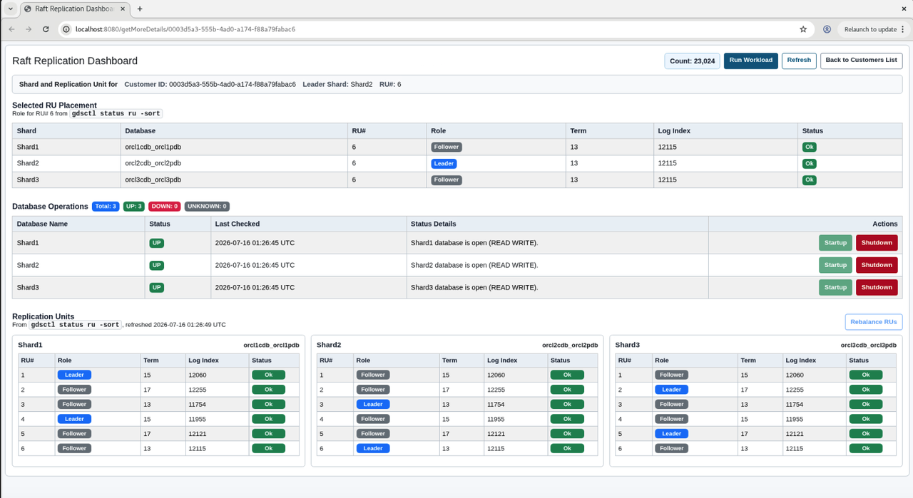


_Estimated Time_: 30 minutes

<if type="nonsandbox">
Watch the video for a quick walk through of the Demo Application for Raft Replication.

[Demo App for Raft Replication](videohub:1_pvsd15at)
</if>

### Objectives

In this lab, you will:

- Explore Raft Replication Demo UI Application for getting More Details for a customer record including its Replication Unit and leader shard.
- Shutdown a shard for Switchover of a Replication Unit(RU#) to another shard as soon as its leader shard is shutdown and observer application is kept of running.
- Run the Workload.
- Start the previously shut downed shard.
- Rebalance RUs to distribute leadership to all shards.
- CRUD (Create, Update, Delete) operations with the UI Application to get a feel of zero data loss and never down scenarios while using Raft replication.

### Prerequisites

This lab assumes you have:

- A Free Tier, Paid or LiveLabs Oracle Cloud account
- You have completed:
    - Lab: Prepare Setup (*Free-tier* and *Paid Tenants* only)
    - Lab: Environment Setup (*Free-tier* and *Paid Tenants* only)
    - Lab: Get started (*Login to the LiveLabs Sandbox Environment* only)
    - Lab: Initialize Environment


## Task 1: Navigate to "Raft Replication Dashboard" and shutdown a shard to perform switchover of its RUs to another shard(s)

1. By default, application shows "Raft Replication Dashboard" which is same as the result of clicking "More Details" button from All-Customers List. if you are already on the "Raft Replication Dashboard", skip step 2 and step 3.

2. All Customers List query is retrieved from the Catalog Database using the proxy-routing query via GDS$CATALOG service. The All-Customers List shows Customer's data with pagination along with "Add customer", "More Details", "Update" customer, "Delete" customer links and "Count" of all the customers.

    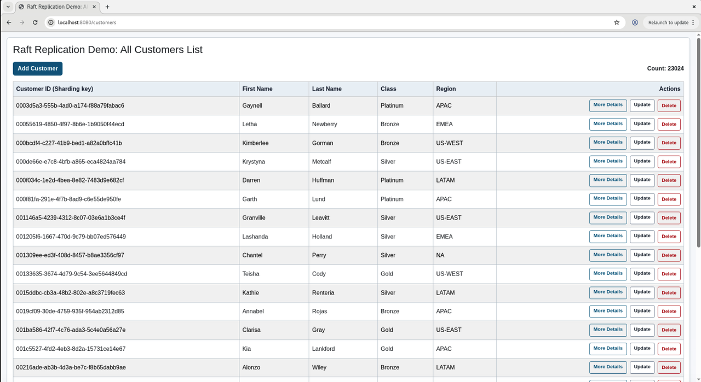

3. From "All Customers List" page, right click on the "More Details" link and click "Open link in new tab", it will open a page titled with "Raft Replication LiveLabs Demo: More Details".

    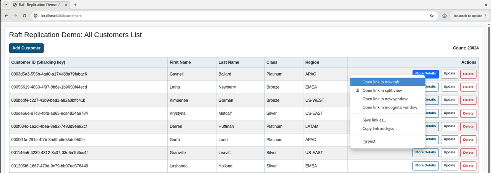

    If you just click on the "More Details" link, it'll open in the same tab. Clicking "Back to Customers List" from "Raft Replication Dashboard" page brings back to the main page.

4. Raft Replication Dashboard's first section shows "Shard Database and Replication Unit (RU#)" of a customer record with matching customerId (which is the sharding key). here, "Shard" can be either Shard1 or Shard2 or Shard3.

     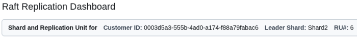


5. From next section "Database Operations" shows Total number of shards and Up/Down counts of the shards. You can Shutdown a Shard based on the "Shard Database Name" value displayed in "Select RU Placement" section with Role as "Leader". "Select RU Placement" shows results from gsm(Global Service Manager)'s "gdsctl status ru -sort" result. In this example since Shard2 is with "Leader" Role, click "Shutdown" from the  shard2's details.

    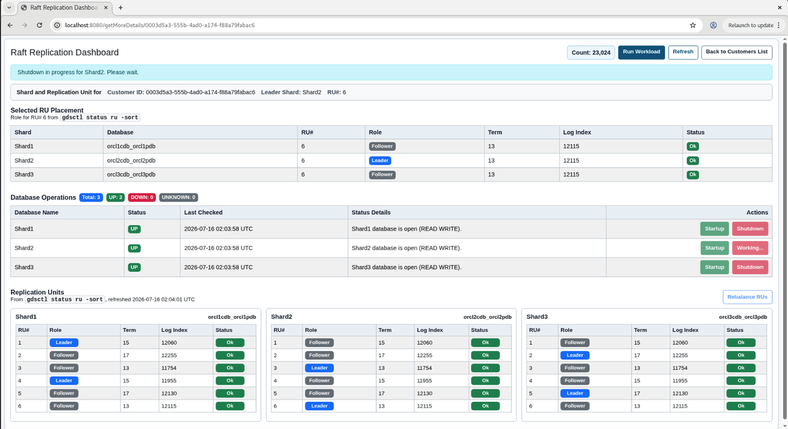

    Note: Only one of the shard shutdown is allowed from UI demo.

6. While Shutdown a shard is happening, you can observe that this application and customer details still showing details. Now you can click "Run Workload". This workload is run with 4 Threads for 60 seconds and show TPS, counts prior the workload, running count etc details.

    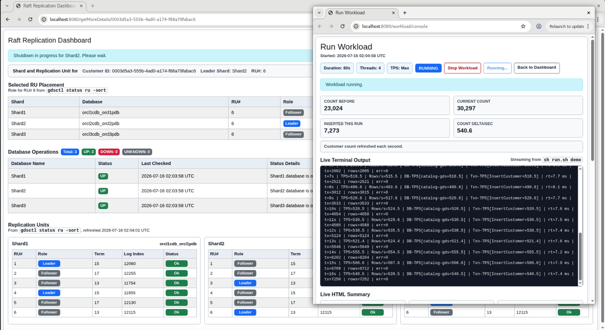
      

7. Observe shutdown shard (here, Shard2) gets complete, leader role change for RU gets complete and workload also gets completed.

    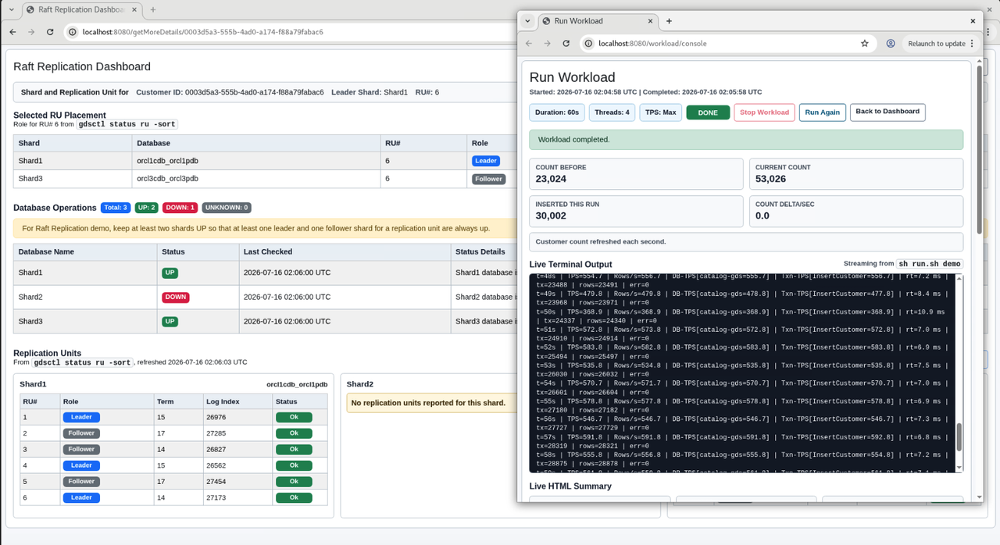

   The leadership has automatically moved to another shard, indicating re-routing of the request and switchover of RU to another shard is completed.

8. Scroll down to see "GDD Workload Report" which has visual chart for TPS during the workload and additional details.

    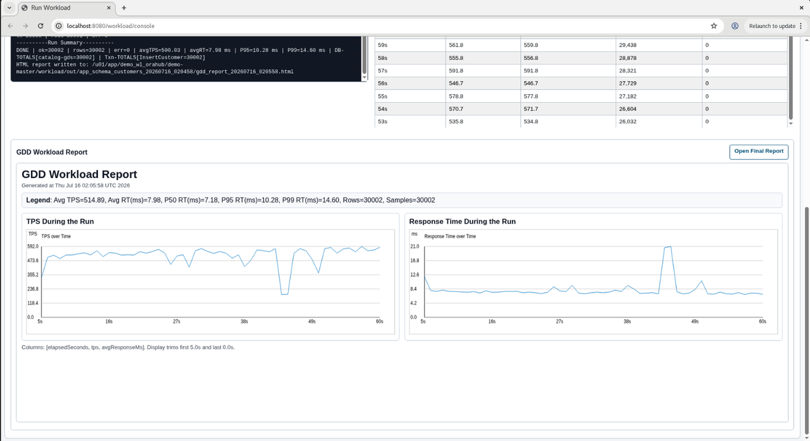

    To confirm that there is no impact to the application even when one of the shards is down, you can continue to next task.


## Task 2: Access the Demo UI application to view pre-loaded Customers List and perform CRUD operations

1. Add Customer: A customer can be added either using link "Add Customer" on top section of the home page "Raft Replication LiveLabs Demo: All Customers List" or by an API call in a browser "http://localhost:8080/addcustomer"

    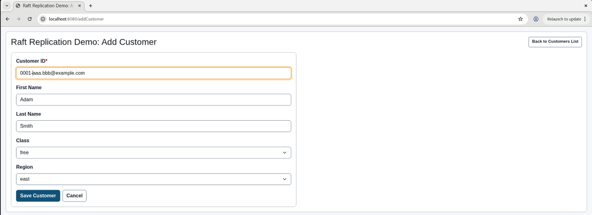

2. After adding customer, it brings back to the All-Customers List page. Total Customers count increased by 1.

    

    Data can also be populated by Run the workload (as in the next Lab: Explore Raft Replication Topology's Task 4: Run the workload).

3. Update Customer: To Update a customer, click on the link "Update" from the Home Page. "Update" link is next to the "More Details" link. Alternatively, update can be performed using an API call with following the format "http://localhost:8080/updateCustomer/[customerId]".

    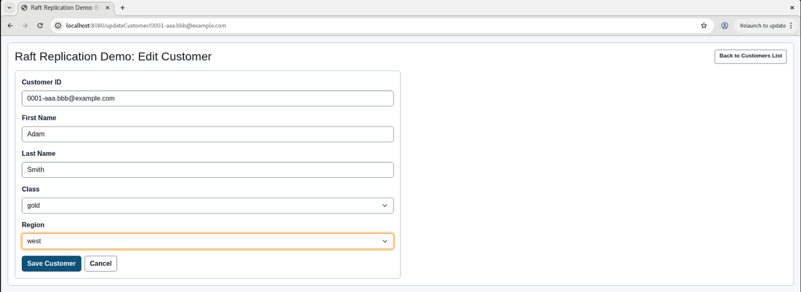

4. After updating customer, it brings back to the All-Customers List page

    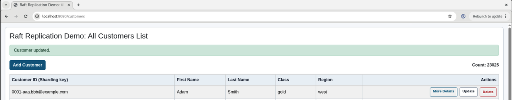

5. Delete Customer: To Delete a customer, click on the link "Delete" from the Home Page. "Delete" link is next to the "More Details" link. Alternatively, delete can be performed using an API call with following the format "http://localhost:8080/deleteCustomer/[customerId]".

6. After deleting customer, it brings back to the All-Customers List page. Total count on the All-Customers List page is reduced by 1.

    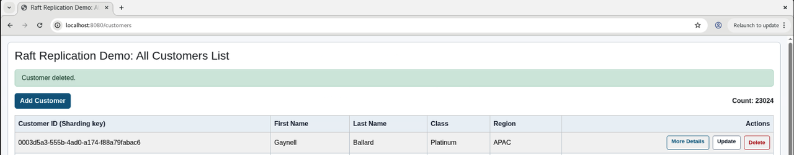

7. Data gets refresh automatically on the page but to Refresh the data on the "Home Page" at anytime manually, you can use the Refresh link from the bottom section of the Home Page. Alternatively, reload the page from the browser's default refresh icon.

8. "Home" Page link at the bottom the page brings to the first page and useful when you are at any higher page# and want to return to the first page of Raft UI application.

    Similar CRUD operations and database shutdown/startup can be performed using SQL*Plus command from within a podman container of a specific database.


## Task 3: Startup the previously shutdown shard

1. As you verified that application kept running while one of the shards was down, now bring that shard back.
   For example, since shard3 was shutdown in a previous Task 1's step 3 earlier, now to bring it back, click the "Start Shard1" link.

    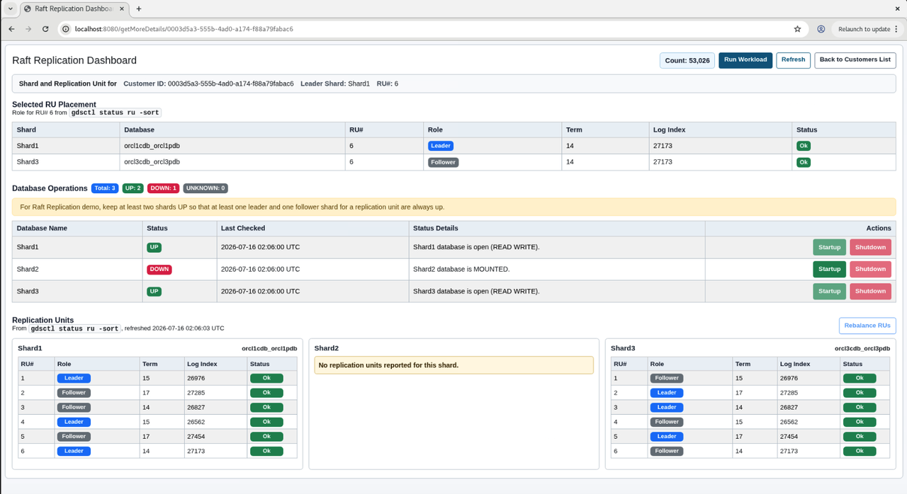

2. Run the workload again while a shard is starting

     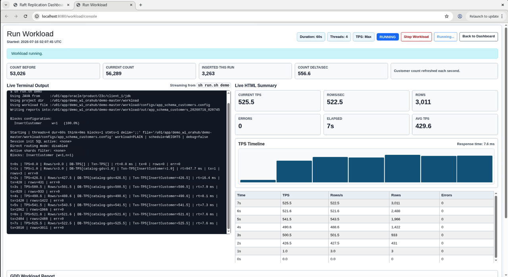

3. Validate Raft Replication Dashboard after a shard is re-started for all shards are up, counts, RU placements:
    
    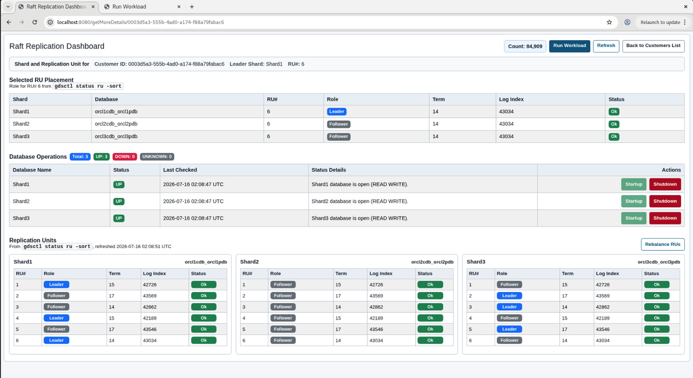


4. Sometimes you need to rebalance RUs manually after a shard is re-started. in this case click "Rebalance RUs" button.

    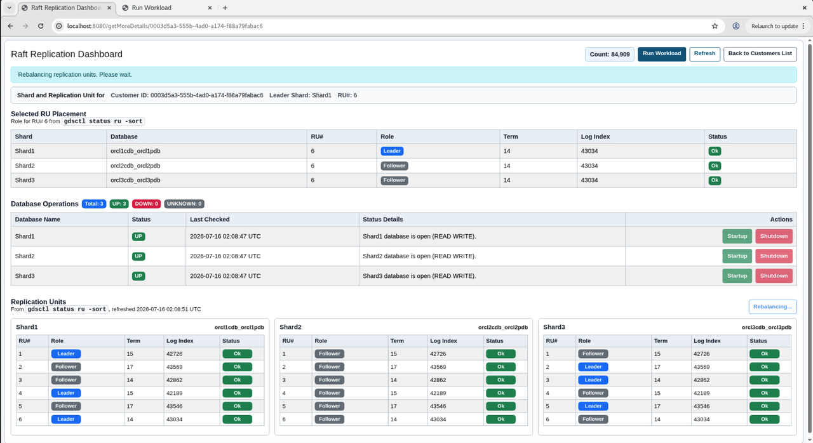

5. Validate after "Rebalance RUs" task is completed:

    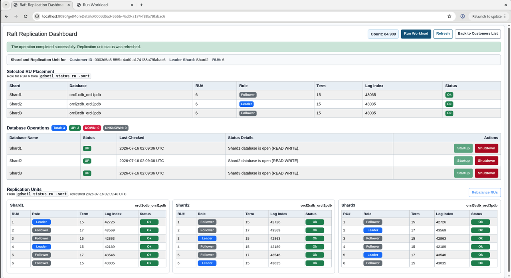

    Now all three shards are up with "Rebalance RUs" and application is running.

    You can keep the Application UI page running to verify the results from next Labs "Explore Raft Replication Topology" or any other activities affecting application data. If you have closed UI browser session, you can open it anytime in a browser session by http://localhost:8080 or from a terminal window entering 

    ```
    <copy>
    .livelabs/init_ll_windows.sh
    </copy>
    ```
    As similar to the Initialize Environment Lab's Task 1 step 2.

You may now proceed to the next lab.

## Acknowledgements
* **Authors** - Ajay Joshi, Lead Principal Data Systems Engineer, Oracle Globally Distributed Database
* **Contributors** - Pankaj Chandiramani, Shefali Bhargava, Deeksha Sehgal, Param Saini, Jyoti Verma
* **Last Updated By/Date** - Ajay Joshi, Lead Principal Data Systems Engineer, Oracle Globally Distributed Database, September 2026