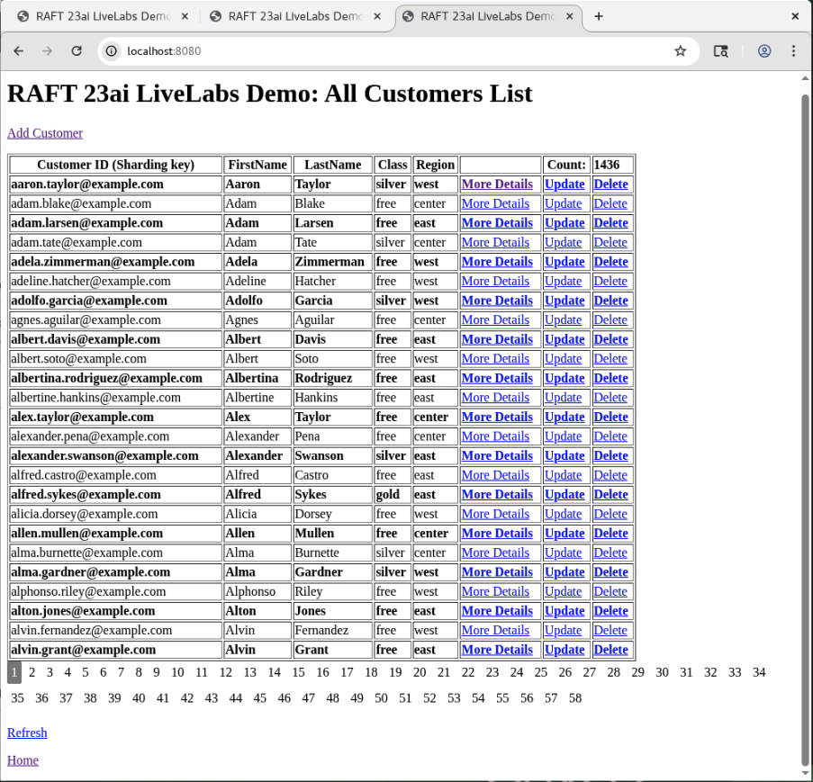

# RAFT Replication Demo UI Application

## Introduction
RAFT Demo UI application is to showcase the Raft replication features.
On right side of browser window, by default a single page application with titled "RAFT 23ai LiveLabs Demo: All Customers List" is shown.
It can be opened anytome on the chorme browser tab by typing http://localhost:8080.

Raft Replication Demo UI Application is to verify Raft Replication Topology in Oracle 23ai with sample Customers Data.
This demo application is to give a feel of a simple CRUD application based on Oracle 23ai RAFT replication features.

The Home page of the Raft Replication Demo UI Application to view sample customers data populated via running the initial workload:

All Customers List query is retrieved from the Catalog Database using the proxy-routing query via GDS$CATALOG service. The Home Page shows 25 Customer's data with pagination along with "Add customer", "More Details", "Update" customer, "Delete" customer links and "Count" of all the customers. In the bottom section of the application, multiple page numbers are shown starting with page number "1". You can click any of the page number to view the max 25 customers listed on a specific page number.

_Estimated Time_: 30 minutes

[Demo App for Raft Replication](videohub:1_147isows)

### Objectives

In this lab, you will:

- Explore Raft Replication Demo UI Application for getting More Details for a customer record including its Replication Unit and leader shard.
- Shutdown a shard for Switchover of a Replication Unit(RU#) to another shard as soon as its leader shard is shutdown and observer application is keep of running.
- Start the previously shutdowned shard.
- CRUD (Create, Update, Delete) operations with the UI Application to get a feel of zero data loss and never down scenarios while using RAFT replication.

### Prerequisites

This lab assumes you have:

- A Free Tier, Paid or LiveLabs Oracle Cloud account
- You have completed:
    - Lab: Prepare Setup (*Free-tier* and *Paid Tenants* only)
    - Lab: Environment Setup (*Free-tier* and *Paid Tenants* only)
    - Lab: Get started (*Login to the LiveLabs Sandbox Environment* only)
    - Lab: Initialize Environment

## Task 1: Navigate to "More Details" page and shutdown a shard to perform switchover of its RUs to another shard(s)

1. From "All Customers List" page, right click on the "More Details" link and click "Open link in new tab", it will open a page titled with "RAFT 23ai LiveLabs Demo: More Details".

    

    If you just click on the "More Details" link, it'll open in the same tab. Clicking "Back to Customers List" from "More Details" page brings back to the main page.

2. "More Details" tab shows the "Shard Database Name" and Replication Unit (RU#) of the customer record with matching customerId (which is the sharding key). here, "Shard Database Name" can be either "orcl1cdborcl1pdb" (Shard1) or "orcl2cdborcl2pdb" (Shard2) or "orcl3cdb_orcl3pdb" (Shard3).

    

3. You can Shutdown a Shard based on the "Shard Database Name" value. Click only one of the matching shard's links for example, either "Shutdown Shard1" or "Shutdown Shard2" or "Shutdown Shard3". Please **do not shutdown more than one Shard from the UI Application** otherwise those shards may need to bring back up from the terminal window for which steps will be provided later in the next Lab "Explore Raft Replication Topology".

    When Shard2 is the leader for Replucation Unit (RU#1), click "Shutdown Shard2" link as below:

    

4. Wait until the shutdown a shard completes (it can take around a minute or a few seconds sometime). You will notice that the hovering icon of the "more Details" tab stops and the shard leadership automatically changes. "Shard Database Name" will show new leader shard. For Example, When "orcl1cdb_orcl1pdb" (Shard1) is the new leader for Replucation Unit (RU#1) in the screenshot as below.

    

    You can observe that the leadership has automatically moved to another shard, indicating re-routing of the request and switchover of RU to another shard is completed.

    To confirm that there is no impact to the application even when one of the shard is down, you can continue to next task.

## Task 2: Access the Demo UI application to view pre-loaded Customers List and perform CRUD operations

1. Add Customer: A customer can be added either using link "Add Customer" on top section of the home page "RAFT 23ai LiveLabs Demo: All Customers List" or by an API call in a browser "http://localhost:8080/addcustomer"

    

2. After adding customer, it brings back to the All-Customers List page. Total Customers count increased by 1.

    

    Data can also be populated by Run the workload (as in the next Lab: Explore Raft Replication Topology's Task 4: Run the workload).

3. Update Customer: To Update a customer, click on the link "Update" from the Home Page. "Update" link is next to the "More Details" link. Alternatively, update can be performed using an API call with following the format "http://localhost:8080/updateCustomer/[customerId]".

    

4. After updating customer, it brings back to the All-Customers List page

    

5. Delete Customer: To Delete a customer, click on the link "Delete" from the Home Page. "Delete" link is next to the "More Details" link. Alternatively, delete can be performed using an API call with following the format  "http://localhost:8080/deleteCustomer/[customerId]".

6. After deleting customer, it brings back to the All-Customers List page. Total count on the All-Customers List page is reduce by 1.

    
7. Data gets refresh automatically on the page but to Refresh the data on the "Home Page" at anytime manually, you can use the Refresh link from the bottom section of the Home Page. Alternatively, reload the page from the browser's default refresh icon.

8. "Home" Page link at the bottom the page brings to the first page and useful when you are at any higher page# and want to return to the first page of RAFT UI application.

    Similar CRUD operations and database shutdown/startup can be performed using SQL*Plus command from within a podman container of a specific database.

## Task 3: Startup the previously shutdown shard

1. As you verified that application kept running while one of the shard was down, now bring that shard back.
   For example, since shard2 was shutdown in a previous Task 1's step 3 earlier, now to bring it back, click the "Start Shard2" link.

    

    Now all three shards are up and application is running.

    You can keep the Application UI page running to verify the results from next Labs "Explore Raft Replication Topology" or any other activities affecting application data. If you have closed UI browser session, you can open it anytime in a browser session by http://localhost:8080 or from a terminal window entering ".livelabs/init\_ll\_windows.sh" as shown earlier in the Initialize Environment Lab's Task 1 step 2.

You may now proceed to the next lab.

## Acknowledgements
* **Authors** - Ajay Joshi, Oracle Globally Distributed Database, Product Management
* **Contributors** - Pankaj Chandiramani, Shefali Bhargava, Deeksha Sehgal, Param Saini, Jyoti Verma
* **Last Updated By/Date** - Ajay Joshi, Oracle Globally Distributed Database, Product Management, September 2025