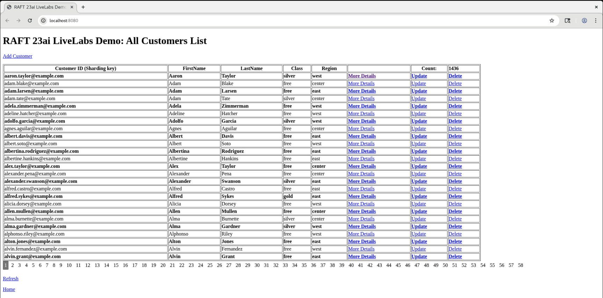

# Raft Replication Demo UI Application: To verify Raft Replication Topology in Oracle 23ai

## Introduction

Raft Replication Demo UI Application to verify Raft Replication Topology in Oracle 23ai with sample Customers Data.
This Demo app is to give a feel of a simple CRUD application based on Oracle 23ai RAFT replication features. Similar database operations can be performed from various GDSCTL or SQL*Plus command.  

Data can be populated by two different ways in Customers and its child tables:         
        a) Run the workload (Same as in the previous Lab: Explore Raft Replication Topology's Task 4: Run the workload).         
        b) Add Customers from Demo UI.

"More details" link on the Home page opens a new page which shows the shard database name and Replication Unit (RU#) of the customer with matching customerId (which is the sharding key). There are optional links to "Update" (or just want to view) or "Delete" a record.

Here is the Home page of the Raft Replication Demo UI Application after running initial workload to view some sample customers data:



_Estimated Time_: 30 minutes

### Objectives

In this lab, you will:

- Explore Raft Replication Demo UI Application for CRUD (Create, Update, Delete) operations and getting More Details.
- Testing the UI App use-cases.

### Prerequisites

This lab assumes you have:

- A Free Tier, Paid or LiveLabs Oracle Cloud account
- You have completed:
  - Lab: Prepare Setup (_Free-tier_ and _Paid Tenants_ only)
  - Lab: Environment Setup
  - Lab: Initialize Environment
  - Lab: Topology

## Task 1: Verify RAFT Demo UI application is running

1. How to check if RAFT Demo UI is running?

    ```
    <copy>
    ps -ef | grep raft-ui
    </copy>
    ```

   

2. For some reasons if you want to restart the RAFT Demo UI, it can be stopped then started:
    ```
    <copy>
    sudo podman exec -it appclient /bin/bash
    ps -ef | grep raft-ui
    kill -9 <pid of process resulting from above command>
    ps -ef | grep raft-ui
    cd $DEMO_MASTER
    ./start-raft-ui-app.sh
    ps -ef | grep raft-ui
    </copy>
    ```

    

## Task 2: Demo UI application page flow

1. On right side of browser window by default page "RAFT 23ai LiveLabs Demo: All Customers List" is shown by http://localhost:/8080.
   It retrieves All Customers List from the Catalog Database using GDS$CATALOG service. Home Page shows 25 Customer's data with pagination, count of All customers, More Details, add new customer, update customer and Delete customer links. To view the customers listed on a specific page number, you can click the page number displayed below the All-Customers List.

2. More Details Page: When you click on "More Details" link shown on the Home Page, it will show shard database name and Replication Unit (RU#) to which this particular customerId belongs to as of now. This page also shows Refresh link which can be useful to view "More details" after any event which moves the record for this customerId to some other RU on a different shard database.

## Task 3: Perform switchover and verify results from "More Details" page and Terminal window
 
1. On "More Details" page, for a customer record, its Shard database name is shown as orcl1cdb_orcl1pdb (which is shard1) for RU#1. It’s because Leader is shard1 for this RU#1:

    

   This can also be verified from the terminal:

    ```
    <copy>
    sudo podman exec -it gsm1 /bin/bash
    gdsctl ru -sort
    </copy>
    ```

    


2. Switchover RU#1 from shard1 to shard2 from the terminal:

    ```
    <copy>
    gdsctl switchover ru -ru 1 -shard orcl2cdb_orcl2pdb
    </copy>
    ```

    After switchover of RU#1 from shard1 to shard2, once you refresh the "More Details" page for same customer record, its Shard Database Name changes to orcl2cdb_orcl2pdb (which is shard2) because the new Leader of RU#1 is shard2:

    

    Switchover verification from the Terminal:

    
    

3. Switchover RU#1 back to orcl1cdb_orcl1pdb (which is shard1) as it was originally:

    ```
    <copy>
    gdsctl switchover ru -ru 1 -shard orcl1cdb_orcl1pdb
    </copy>
    ```

    It shows Shard Database Name orcl1cdb_orcl1pdb which is the new leader of RU#1:

    

    Switchover verification from the Terminal:

    

Similarly, there are other multiple RU movement commands, rebalance data manually, perform failover test, scale up /scale-down by stop/start shard(s) etc. as detailed in Lab "Explore Raft Replication Topology" tasks can be performed and verified from "More Details" page.
In the bottom of the "More Details" page a link to Home Page is shown to return back to view "RAFT 23ai LiveLabs Demo: All Customers List".

## Task 3: Access the Demo UI application to view pre-loaded Customers List and perform CRUD operations

1. Add Customer: A customer can be added either using link "Add Customer" on top section of the home page "RAFT 23ai LiveLabs Demo: All Customers List" or API call in a browser http://localhost:/8080/addcustomer/

   

   After adding customer, it brings back to the All-Customers List page. Total Customers count gets increased after adding a customer by 1. The customer details can be viewed with Api call format http://localhost:/8080/updateCustomer/<customerId> for given value of customerId.


2. Update Customer: A customer can be edited either by using link "Update" link from the Home Page or directly using Api call format http://localhost:/8080/updateCustomer/<customerId>

   

   After updating customer, it brings back to the All-Customers List page. You can verify the updated customer details shown in UI or manually using Api call format http://localhost:/8080/updateCustomer/<customerId>


3. Delete Customer: A customer can delete either using link "Delete" or manually using Api call from the browser in the format http://localhost:8080/deleteCustomer/<customerId>.
   After deleting customer, it brings back to the All-Customers List page. Total count on the All-Customers List page is reduce by 1.


4. To Refresh the data on the "Home Page", you can use the Refresh link from the bottom section of the Home Page. Alternatively, reload the page from the browser's default refresh icon.


5. "Home" Page link at the bottom the page brings to the first page and useful when you are at any higher page# and want to return to the first page of RAFT UI application.


In addition to above information, the results from previous Labs "Explore Raft Replication Topology and "Explore Raft Replication Advanced Use-Cases" tasks e.g., for Raft Replication failovers, Scale UP or Scale Down, Move or Copy Replication Unit Replicas etc. all can be verified from Raft Demo UI.


## Acknowledgements
* **Authors** - Ajay Joshi, Oracle Globally Distributed Database, Product Management, Consulting Member of Technical Staff
* **Contributors** - Pankaj Chandiramani, Shefali Bhargava, Deeksha Sehgal, Jyoti Verma
* **Last Updated By/Date** - Ajay Joshi, Oracle Globally Distributed Database, Product Management, Consulting Member of Technical Staff, August 2024