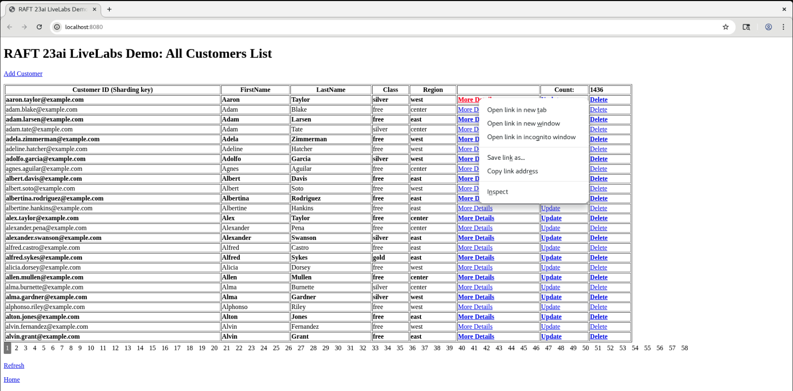
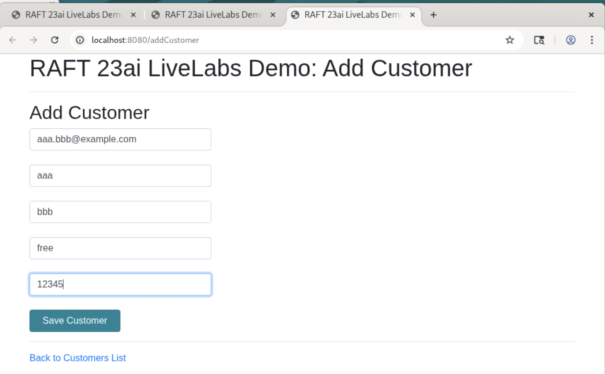
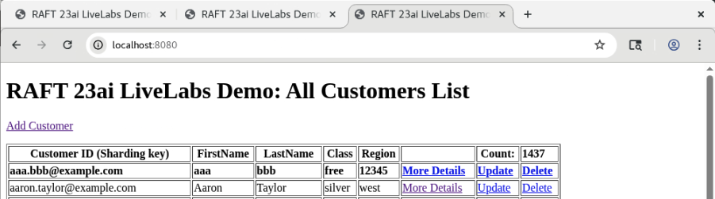
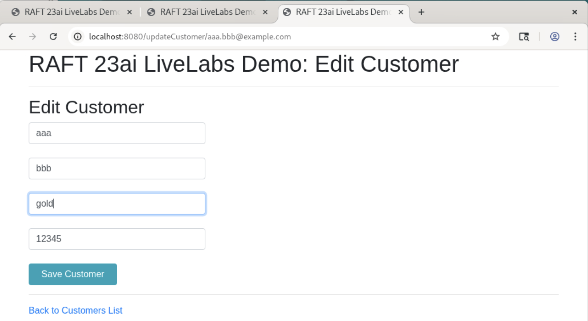
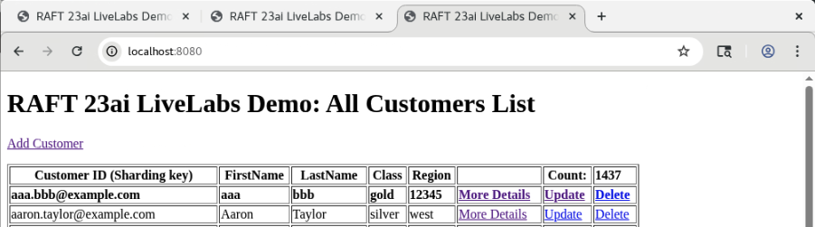

# RAFT Replication Demo UI Application

## Introduction

On right side of browser window, by default a single page application with titled "RAFT 23ai LiveLabs Demo: All Customers List" is shown.
Raft Replication Demo UI Application is to verify Raft Replication Topology in Oracle 23ai with sample Customers Data.
This demo application is to give a feel of a simple CRUD application based on Oracle 23ai RAFT replication features.

The Home page of the Raft Replication Demo UI Application to view sample customers data populated via running the initial workload:

All Customers List query is retrieved from the Catalog Database using the proxy-routing query via GDS$CATALOG service. The Home Page shows 25 Customer's data with pagination along with "Add customer", "More Details", "Update" customer, "Delete" customer links and "Count" of all the customers. In the bottom section of the application, multiple page numbers are shown starting with page number "1". You can click any of the page number to view the max 25 customers listed on a specific page number.

_Estimated Time_: 30 minutes

### Objectives

In this lab, you will:

- Explore Raft Replication Demo UI Application for getting More Details for a customer record including its Replication Unit and leader shard.
- Switchover of a Replication Unit(RU#) to another shard as soon as its leader shard is shutdown.
- CRUD (Create, Update, Delete) operations with the UI Application to get a feel of zero data loss and never down scenarios while using RAFT replication.

### Prerequisites

This lab assumes you have:

- A Free Tier, Paid or LiveLabs Oracle Cloud account
- You have completed:
  - Lab: Prepare Setup (_Free-tier_ and _Paid Tenants_ only)
  - Lab: Environment Setup
  - Lab: Initialize Environment

## Task 1: Navigate to "More Details" page and shutdown a shard to perform switchover of its RUs to another shard(s)

1. From "All Customers List" page, right click on the "More Details" link, it will open a page titled with "RAFT 23ai LiveLabs Demo: More Details".

    

    If you just click on the "More Details" link, it'll open in the same tab. Clicking "Back to Customers List" brings back to the main page.

2. "More Details" tab shows the "Shard Database Name" and Replication Unit (RU#) of the customer record with matching customerId (which is the sharding key). here, "Shard Database Name" can be either "orcl1cdborcl1pdb" (Shard1) or "orcl2cdborcl2pdb" (Shard2) or "orcl3cdb_orcl3pdb" (Shard3).

    This page shows "Refresh" link which can be useful to view "More details" after any event which moves the record for this customerId to some other RU on a different shard database.

    

3. You can Shutdown a Shard based on the "Shard Database Name" value. Click only one of the matching shard's links for example, either "Shutdown Shard1" or "Shutdown Shard2" or "Shutdown Shard3". Please **do not shutdown more than one Shard from the UI Application** otherwise those shards may need to bring back up from the terminal window for which steps will be provided later in the next Lab "Explore Raft Replication Topology".

    When Shard2 is the leader for Replucation Unit (RU#1), click "Shutdown Shard2" link as below:

    

4. Wait until the shutdown a shard completes. You will notice that the hovering icon of the "more Details" tab stops and the shard leadership automatically changes. "Shard Database Name" will show new leader shard. For Example, "orcl3cdb_orcl3pdb" (Shard3) is the new leader for Replucation Unit (RU#1) in the screenshot as below.

    

    You can observe that the leadership has automatically moved to another shard, indicating re-routing of the request and switchover of RU to another shard is completed. To confirm that no impact to the application even one of the shard is down, you can continue to next task.

## Task 2: Access the Demo UI application to view pre-loaded Customers List and perform CRUD operations

1. Add Customer: A customer can be added either using link "Add Customer" on top section of the home page "RAFT 23ai LiveLabs Demo: All Customers List" or API call in a browser http://localhost:8080/addcustomer

    

2. After adding customer, it brings back to the All-Customers List page. Total Customers count increased by 1.

    

    Data can be also be populated by Run the workload (as in the next Lab: Explore Raft Replication Topology's Task 4: Run the workload).

3. Update Customer: A customer can be edited either by using link "Update" link from the Home Page or directly using API call format http://localhost:8080/updateCustomer/[customerId]

    

4. After updating customer, it brings back to the All-Customers List page

    

5. Delete Customer: A customer can delete either using link "Delete" or manually using API call from the browser in the format http://localhost:8080/deleteCustomer/[customerId].
   After deleting customer, it brings back to the All-Customers List page. Total count on the All-Customers List page is reduce by 1.

    

6. To Refresh the data on the "Home Page", you can use the Refresh link from the bottom section of the Home Page. Alternatively, reload the page from the browser's default refresh icon.

7. "Home" Page link at the bottom the page brings to the first page and useful when you are at any higher page# and want to return to the first page of RAFT UI application.

Similar CRUD operations and database shutdown/startup can be performed using SQL*Plus command from within podman containers. Database status can be verfied from gsm containers using GDSCTL.

## Task 3: Startup the previously shutdown shard

1. As you verified that application kept running while one of the shard was down, now bring that shard back.
   For example, click "Start Shard2" since it was shutdown in a previous Task 1.3 as above

    

    Now all three shards are up and application is running.

    The results from next Labs "Explore Raft Replication Topology and "Explore Raft Replication Advanced Use-Cases" tasks e.g., for Raft Replication switchover ru rebalance, Scale UP or Scale Down, Move or Copy Replication Unit Replicas etc. all can be verified from Raft Demo UI. Therefore, keep the Application UI page running. If you have closed UI, you can open a new browser session and use http://localhost:8080 to view UI page.

You may now proceed to the next lab.

## Acknowledgements
* **Authors** - Ajay Joshi, Oracle Globally Distributed Database Database, Product Management
* **Contributors** - Pankaj Chandiramani, Shefali Bhargava, Deeksha Sehgal, Param Saini, Jyoti Verma
* **Last Updated By/Date** - Ajay Joshi, Oracle Globally Distributed Database, Product Management, July 2025