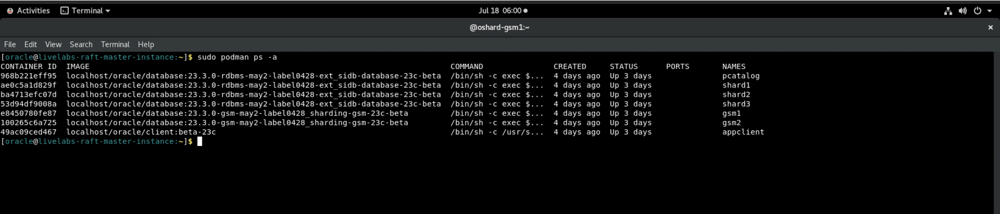

# Initialize Environment

## Introduction

In this lab we will review and startup all components required to successfully run this workshop.

*Estimated Time:* 10 Minutes.

Watch the video for a quick walk through of the Initialize Environment lab.

[Initialize Environment lab](youtube:e3EXx3BMhec)

### Objectives
- Initialize the workshop environment.

### Prerequisites
This lab assumes you have:
- An Oracle Cloud account
- You have completed:
    - Lab: Prepare Setup 
    - Lab: Environment Setup

## Task 1: Validate That Required Processes are Up and Running.
1. Now with access to your remote desktop session, proceed as indicated below to validate your environment before you start executing the subsequent labs. The following Processes should be up and running:

    - Oracle Sharding GSM1  Container
    - Oracle Sharding GSM2  Container
    - Oracle Sharding Catalog container
    - Three Oracle shard Database containers
    - Appclient Container

2.  Open a terminal session and proceed as indicated below to validate the services.

    - Oracle Sharding container Details

        ```
        <copy>
        sudo podman ps -a
        </copy>
        ```
        

    - If a container is stopped and not in running state then try to restart it by using below docker command.

        ```
        <copy>
        sudo podman stop <container ID/NAME>
        </copy>
        <copy>
        sudo podman start <container ID/NAME>
        </copy>
        ```
    - For multiple containers, run the following to restart all at once:

        ```
        <copy>
        sudo podman container stop $(sudo podman container list -qa)
        </copy>
        <copy>
        sudo podman container start $(sudo podman container list -qa)
        </copy>
        ```

You may now proceed to the next lab.

## Acknowledgements
* **Authors** - Deeksha Sehgal, Oracle Database Sharding Product Management, Senior Product Manager
* **Contributors** - Pankaj Chandiramani, Shefali Bhargava, Param Saini, Jyoti Verma
* **Last Updated By/Date** - Deeksha Sehgal, Oracle Database Sharding Product Management, Senior Product Manager, July 2023

