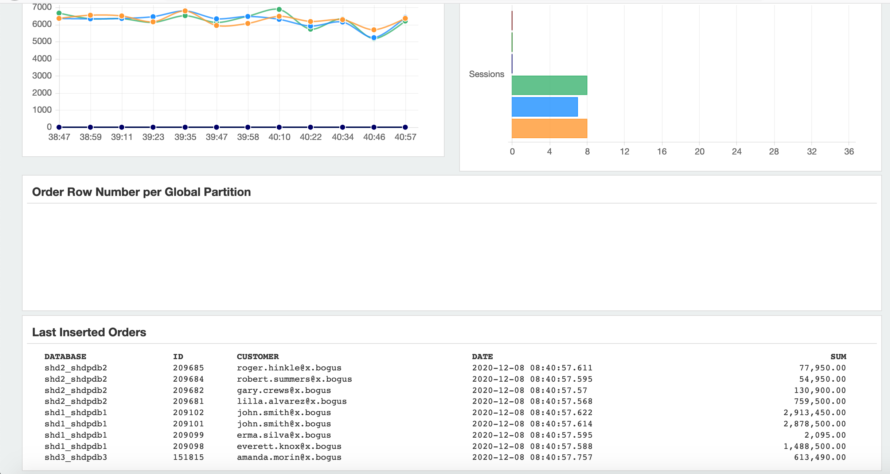

# Elastic Scaling

## Introduction

Now, we will add the shard (on shd3) to the Shard Database and thus elastically scale the SDB. Make sure you have done all steps in the shard3 host according to the lab 2 "Shard Database Deployment" to configure the shard host, setup shard database and validate without any error.

*Estimated Lab Time:* 30 minutes.

Watch the video below for a quick walk through of the lab.
[Elastic Scaling](videohub:1_gz6r23yf)

### Objectives

In this lab, you will perform the following steps:
- Add the New Shard.
- Deploy and Verify the New Shard.
- Run the demo application again with 3 shards.

### Prerequisites
This lab assumes you have:
- An Oracle Cloud account
- You have completed:
    - Lab: Prepare Setup (*Free-tier* and *Paid Tenants* only)
    - Lab: Environment Setup
    - Lab: Initialize Environment
    - Lab: Oracle Shard Database Deployment
    - Lab: Setup a Non-Sharded Application.
    - Lab: Migrate Application to Sharded Database

## Task 1: Add the New Shard

1. Switch to your browser's remote desktop session connected to host cata as user oracle, open a Terminal session

2. Switch to the GSM environment.

    ```
    [oracle@cata ~]$ <copy>. ./gsm.sh</copy>
    [oracle@cata ~]$
    ```


3. Launch `GDSCTL`.

    ```
    [oracle@cata ~]$ <copy>gdsctl</copy>
    GDSCTL: Version 19.0.0.0.0 - Production on Tue Dec 01 01:55:50 GMT 2020

    Copyright (c) 2011, 2019, Oracle.  All rights reserved.

    Welcome to GDSCTL, type "help" for information.

    Current GSM is set to SHARDDIRECTOR1
    GDSCTL>
    ```


4. Show current shard configuration.

    ```
    GDSCTL> <copy>config shard</copy>
    Catalog connection is established
    Name                Shard Group         Status    State       Region    Availability
    ----                -----------         ------    -----       ------    ------------
    shd1_shdpdb1        shardgroup_primary  Ok        Deployed    region1   ONLINE       
    shd2_shdpdb2        shardgroup_primary  Ok        Deployed    region1   ONLINE       

    GDSCTL>
    ```


5. Add the third shard CDB.

    ```
    GDSCTL> <copy>add cdb -connect shd3:1521/shd3 -pwd Ora_DB4U</copy>
    DB Unique Name: shd3
    The operation completed successfully
    GDSCTL>
    ```


6. List of current CDBs in the catalog.

    ```
    GDSCTL> <copy>config cdb</copy>
    shd1                          
    shd2                          
    shd3                          

    GDSCTL>
    ```


7. Add the third shard information to the shard catalog.

    ```
    GDSCTL> <copy>add shard -connect shd3:1521/shdpdb3 -pwd Ora_DB4U -shardgroup shardgroup_primary -cdb shd3</copy>
    INFO: Data Guard shard validation requested.
    INFO: Database role is PRIMARY.
    INFO: Database name is SHD3.
    INFO: Database unique name is shd3.
    INFO: Database ID is 1363280829.
    INFO: Database open mode is READ WRITE.
    INFO: Database in archivelog mode.
    INFO: Flashback is on.
    INFO: Force logging is on.
    INFO: Database platform is Linux x86 64-bit.
    INFO: Database character set is AL32UTF8. This value must match the character set of the catalog database.
    INFO: 'compatible' initialization parameter validated successfully.
    INFO: Database is a multitenant container database.
    INFO: Current container is SHDPDB3.
    INFO: Database is using a server parameter file (spfile).
    INFO: db_create_file_dest set to: '/opt/oracle/oradata'
    INFO: db_recovery_file_dest set to: '/opt/oracle/fast_recovery_area'
    INFO: db_files=1024. Must be greater than the number of chunks and/or tablespaces to be created in the shard.
    INFO: dg_broker_start set to TRUE.
    INFO: remote_login_passwordfile set to EXCLUSIVE.
    INFO: db_file_name_convert set to: '/SHDSTB3/, /SHD3/'
    INFO: GSMUSER account validated successfully.
    INFO: DATA_PUMP_DIR is '/opt/oracle/admin/shd3/dpdump/B550C2996B1F2C04E0530500000A6D1D'.
    DB Unique Name: shd3_shdpdb3
    The operation completed successfully
    GDSCTL>
    ```


8. View the shard metadata on the shard catalog.

    ```
    GDSCTL> <copy>config shard</copy>
    Name                Shard Group         Status    State       Region    Availability
    ----                -----------         ------    -----       ------    ------------
    shd1_shdpdb1        shardgroup_primary  Ok        Deployed    region1   ONLINE       
    shd2_shdpdb2        shardgroup_primary  Ok        Deployed    region1   ONLINE       
    shd3_shdpdb3        shardgroup_primary  U         none        region1   -            

   GDSCTL>
   ```


9. View a list of trusted hosts.

    ```
    GDSCTL> <copy>config vncr</copy>
    Name                          Group ID                      
    ----                          --------                      
    10.0.1.2                                                    
    10.0.1.4                                                    
    10.0.1.5                                                    
    127.0.0.1                                                   
    cata                                                        
    shd1                                                        
    shd2                                                        
    shd3                                                        

    GDSCTL>
    ```


10. The host name of shard3 is already there. Manually add shard3 private IP addresses to the shard catalog metadata.

    ```
    GDSCTL> <copy>add invitednode 10.0.1.3</copy>
    GDSCTL>
    ```


11. View the list of trusted hosts again.

    ```
    GDSCTL> <copy>config vncr</copy>
    Name                          Group ID                      
    ----                          --------                      
    10.0.1.2                                                    
    10.0.1.3                                                    
    10.0.1.4                                                    
    10.0.1.5                                                    
    127.0.0.1                                                   
    cata                                                        
    shd1                                                        
    shd2                                                        
    shd3                                                        

    GDSCTL>
    ```


## Task 2: Deploy and Verify the New Shard.

1. Run the deploy command to add the new shard.

    ```
    GDSCTL> <copy>deploy</copy>
    deploy: examining configuration...
    deploy: requesting Data Guard configuration on shards via GSM
    deploy: shards configured; background operations in progress
    The operation completed successfully
    GDSCTL>
    ```


2. Observe the newly added shard.

    ```
    GDSCTL> <copy>config shard</copy>
    Name                Shard Group         Status    State       Region    Availability
    ----                -----------         ------    -----       ------    ------------
    shd1_shdpdb1        shardgroup_primary  Ok        Deployed    region1   ONLINE       
    shd2_shdpdb2        shardgroup_primary  Ok        Deployed    region1   ONLINE       
    shd3_shdpdb3        shardgroup_primary  Ok        Deployed    region1   ONLINE       

    GDSCTL>
    ```


3. Run the following command every minute or two to see the progress of automatic rebalancing of chunks. You can see there are 4 chunks need to move to the third shard.

    ```
    GDSCTL> <copy>config chunks -show_reshard</copy>
    Chunks
    ------------------------
    Database                      From      To        
    --------                      ----      --        
    shd1_shdpdb1                  1         5         
    shd2_shdpdb2                  7         12        
    shd3_shdpdb3                  6         6         

    Ongoing chunk movement
    ------------------------
    Chunk     Source                        Target                        status    
    -----     ------                        ------                        ------    
    5         shd1_shdpdb1                  shd3_shdpdb3                  scheduled
    6         shd1_shdpdb1                  shd3_shdpdb3                  Running   
    11        shd2_shdpdb2                  shd3_shdpdb3                  scheduled
    12        shd2_shdpdb2                  shd3_shdpdb3                  scheduled

    GDSCTL>
    ```


4. If you encounter some issues, the chunk movement status is **Suspended**. You can run the following command to resume the chunk movement.

    ```
    GDSCTL> <copy>alter move -resume -chunk all -shard shd1_shdpdb1,shd2_shdpdb2,shd3_shdpdb3</copy>
    ```


5. Observe that the chunks are automatically rebalanced upon the addition of new shard.

    ```
    GDSCTL> <copy>config chunks -show_reshard</copy>
    Chunks
    ------------------------
    Database                      From      To        
    --------                      ----      --        
    shd1_shdpdb1                  1         4         
    shd2_shdpdb2                  7         10        
    shd3_shdpdb3                  5         6         
    shd3_shdpdb3                  11        12        

    Ongoing chunk movement
    ------------------------
    Chunk     Source                        Target                        status    
    -----     ------                        ------                        ------    

    GDSCTL>
    ```


6. Observe that the “databases” are automatically registered.

    ```
    GDSCTL> <copy>databases</copy>
    Database: "shd1_shdpdb1" Registered: Y State: Ok ONS: N. Role: PRIMARY Instances: 1 Region: region1
       Service: "oltp_rw_srvc" Globally started: Y Started: Y
                Scan: N Enabled: Y Preferred: Y
       Registered instances:
         orasdb%1
    Database: "shd2_shdpdb2" Registered: Y State: Ok ONS: N. Role: PRIMARY Instances: 1 Region: region1
       Service: "oltp_rw_srvc" Globally started: Y Started: Y
                Scan: N Enabled: Y Preferred: Y
       Registered instances:
         orasdb%11
    Database: "shd3_shdpdb3" Registered: Y State: Ok ONS: N. Role: PRIMARY Instances: 1 Region: region1
       Service: "oltp_rw_srvc" Globally started: Y Started: Y
                Scan: N Enabled: Y Preferred: Y
       Registered instances:
         orasdb%21

    GDSCTL>
    ```


7. Observe that the “services” are automatically brought up on the newly added shard.

    ```
    GDSCTL> <copy>services</copy>
    Service "oltp_rw_srvc.orasdb.oradbcloud" has 3 instance(s). Affinity: ANYWHERE
       Instance "orasdb%1", name: "shd1", db: "shd1_shdpdb1", region: "region1", status: ready.
       Instance "orasdb%11", name: "shd2", db: "shd2_shdpdb2", region: "region1", status: ready.
       Instance "orasdb%21", name: "shd3", db: "shd3_shdpdb3", region: "region1", status: ready.

    GDSCTL>
    ```

8. Exit GDSCTL.

    ```
    GDSCTL> <copy>exit</copy>
    [oracle@cata ~]$
    ```


## Task 3: Run the Demo Application Again

1. Switch to catalog environment.

    ```
    [oracle@cata ~]$ <copy>. ./cata.sh</copy>
    [oracle@cata ~]$
    ```


2. Login to the sqlplus as sysdba, switch to the pdb.

    ```
    [oracle@cata ~]$ <copy>sqlplus / as sysdba</copy>

    SQL*Plus: Release 19.0.0.0.0 - Production on Tue Dec 1 03:27:17 2020
    Version 19.11.0.0.0

    Copyright (c) 1982, 2020, Oracle.  All rights reserved.


    Connected to:
    Oracle Database 19c Enterprise Edition Release 19.0.0.0.0 - Production
    Version 19.11.0.0.0

    SQL> <copy>alter session set container=catapdb;</copy>

    Session altered.

    SQL>
    ```


3. Manually update the monitored shard list. The package `dbms_global_views` is used by the monitor tools to monitor the status of shards. It will create a public `shard_dblinks_view` and a public dblink to each shard. If you skip this step, the monitor tools will not show the status of the latest added shard database.

    ```
    SQL> <copy>exec dbms_global_views.create_all_database_links();</copy>

    PL/SQL procedure successfully completed.

    SQL>
    ```


4. Exit Sqlplus.

    ```
    SQL> <copy>exit</copy>
    Disconnected from Oracle Database 19c Enterprise Edition Release 19.0.0.0.0 - Production
    Version 19.11.0.0.0
    [oracle@cata ~]$
    ```


5. Change the directory to `sdb_demo_app`.

    ```
    [oracle@cata ~]$ <copy>cd sdb_demo_app</copy>
    [oracle@cata sdb_demo_app]$
    ```


6. Start the workload by executing command using the sdbdemo.properties parameter file:

    ```
    [oracle@cata sdb_demo_app]$ <copy>./run.sh demo sdbdemo.properties</copy>
    ```


7. The result likes the following. Wait several minutes, compare the APS values with non-shard database and 2 sharded database.

    ```
     RO Queries | RW Queries | RO Failed  | RW Failed  | APS
          72868        14071            0            0         2019
          76868        14821            0            0         1981
          80852        15552            0            0         1989
          84645        16309            0            0         1932
          88555        17086            0            0         1976
          92539        17878            0            0         1980
          96498        18672            0            0         1966
         100329        19472            0            0         1921
         104601        20249            0            0         2140
         108849        21022            0            0         2135
         112633        21712            0            0         1921
         116694        22483            0            0         2037
         120721        23263            0            0         2043
         124795        23998            0            0         2056
         128772        24725            0            0         1967
    ```


8. Open another Terminal session on host cata. Change the directory to `sdb_demo_app`.

    ```
    [oracle@cata ~]$ <copy>cd ~/sdb_demo_app</copy>
    [oracle@cata sdb_demo_app]$
    ```

9. Start the monitoring tool via the following command using the sdbdemo.properties parameter file. (Note: due to the resource limit, start monitor may impact the application performance).

    ```
    [oracle@cata sdb_demo_app]$ <copy>./run.sh monitor sdbdemo.properties</copy>
    @oracle.monitor.Main.registerDatabase : INFO 2020-12-01T03:30:41.501 : Context : /db/demo/info
    @oracle.monitor.DatabaseMonitor$BackgroundStatusCheck.run : java.lang.ArrayIndexOutOfBoundsException : 3
    @oracle.monitor.DatabaseMonitor$BackgroundStatusCheck.run : java.lang.ArrayIndexOutOfBoundsException : 4
    @oracle.monitor.DatabaseMonitor$BackgroundStatusCheck.run : java.lang.ArrayIndexOutOfBoundsException : 5
    ```


10. Within your remote desktop on cata, launch a chrome browser and use the URL: `http://localhost:8081`.

    


11. Scroll down the screen, you can see the last inserted orders:

    


12. Press `Ctrl+C` to cancel the demo in both of the terminal.

## Acknowledgements
* **Author** - Minqiao Wang, DB Product Management, Dec 2020
* **Contributors** - Shefali Bhargava, DB Sharding Product Management
* **Last Updated By/Date** - Shefali Bhargava, DB Sharding Product Management, October 2022
