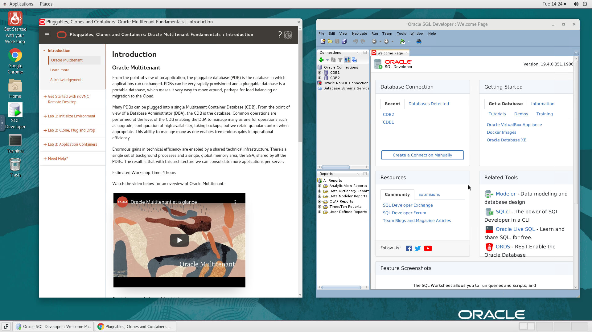
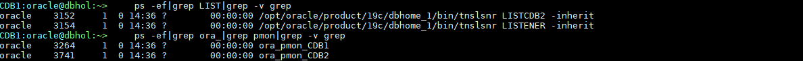
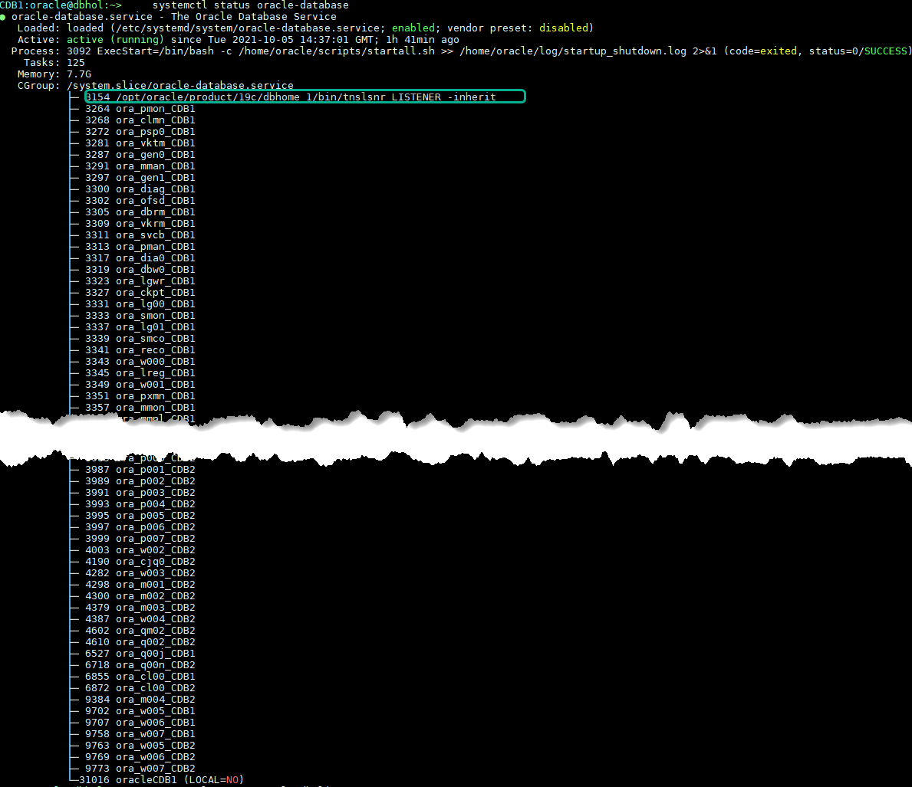
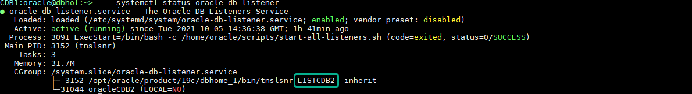

# Initialize Environment

## Introduction

In this lab we will review and startup all components required to successfully run this workshop.

*Estimated Lab Time:* 30 Minutes.

### Objectives
- Initialize the workshop environment.

### Prerequisites
This lab assumes you have:
- An Oracle Cloud account
- You have completed:
    - Lab: Prepare Setup (*Free-tier* and *Paid Tenants* only)
    - Lab: Environment Setup

**NOTE:** *When doing Copy/Paste using the convenient* **Copy** *function used throughout the guide, you must hit the* **ENTER** *key after pasting. Otherwise the last line will remain in the buffer until you hit* **ENTER!**

## Task 1: Validate That Required Processes are Up and Running.

**NOTE:** NoVNC remote desktop is active on all 4 hosts that are part of your environment. While you are provided with a single remote desktop URL for *cata*, you can access other hosts with the same URL after replacing the IP address in the URL with the respective Public IP of the target host.   

1. Now with access to your remote desktop session(s), proceed as indicated below to validate your environment before you start executing the subsequent labs. The following Processes should be up and running:

    - Database Listeners
        - LISTENER (1521)
    - Database Server Instances

| Public IP       | Private IP   | Hostname | CDB Name | PDB Name |Listener port|
| --------------- |  :--------:  | -------- | -------- | -------- |  :-------:  |
| xxx.xxx.xxx.xxx | 10.0.0.151   | cata     | cata     | catapdb  | 1521        |
| xxx.xxx.xxx.xxx | 10.0.0.152   | shd1     | shd1     | shdpdb1  | 1521        |
| xxx.xxx.xxx.xxx | 10.0.0.153   | shd2     | shd2     | shdpdb2  | 1521        |
| xxx.xxx.xxx.xxx | 10.0.0.154   | shd3     | shd3     | shdpdb3  | 1521        |
{: title="Summary of Databases and Listeners by Host"}


    

2. Click the *Terminal* icon on the desktop to launch a session, then run the following to validate that expected processes are up.

    ```
    <copy>
    ps -ef|grep LIST|grep -v grep
    ps -ef|grep ora_|grep pmon|grep -v grep
    systemctl status oracle-database
    </copy>
    ```

    
    
    

    If all expected processes are shown in your output as seen above, then your environment is ready for the next task.  

3. If you see questionable output(s), failure or down component(s), restart the service accordingly

    ```
    <copy>
    sudo systemctl restart oracle-database
    sudo systemctl restart oracle-db-listener
    </copy>
    ```
4. Repeat [2-3] on shd1, shd2, and shd3 hosts respectively


You may now proceed to the next lab

## Appendix 1: Managing Startup Services

1. Database service (All databases and Standard Listener).

    - Start

    ```
    <copy>
    sudo systemctl start oracle-database
    </copy>
    ```
    - Stop

    ```
    <copy>
    sudo systemctl stop oracle-database
    </copy>
    ```

    - Status

    ```
    <copy>
    systemctl status oracle-database
    </copy>
    ```

    - Restart

    ```
    <copy>
    sudo systemctl restart oracle-database
    </copy>
    ```

2. Database service (Non-Standard Listeners).

    - Start

    ```
    <copy>
    sudo systemctl start oracle-db-listener
    </copy>
    ```
    - Stop

    ```
    <copy>
    sudo systemctl stop oracle-db-listener
    </copy>
    ```

    - Status

    ```
    <copy>
    systemctl status oracle-db-listener
    </copy>
    ```

    - Restart

    ```
    <copy>
    sudo systemctl restart oracle-db-listener
    </copy>
    ```

## Acknowledgements
* **Author** - Rene Fontcha, LiveLabs Platform Lead, NA Technology
* **Contributors** -
* **Last Updated By/Date** - Rene Fontcha, LiveLabs Platform Lead, NA Technology, October 2021
