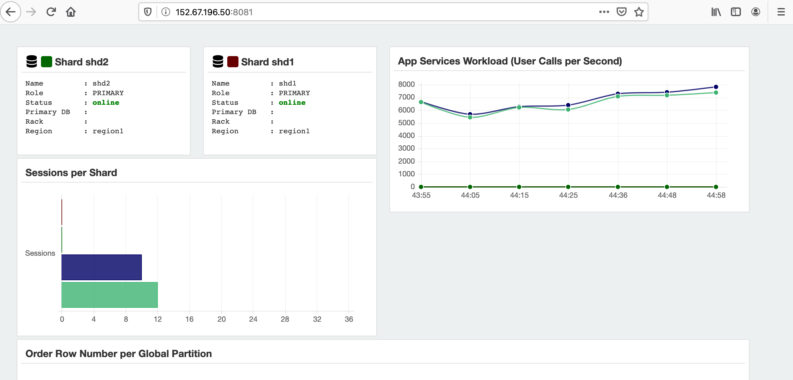

# Migrate Application to Sharded Database

## Introduction

When you want to migrate the application from the non-shard database to the shard database, you need re-design the schema, migrate the data and modify the application.

Estimated Lab Time: 30 minutes.

Watch the video below for a quick walk through of the lab.
[](youtube:KgOFEm7x414)

### Objectives

In this lab, you will perform the following steps:

- Re-design and create the demo schema.
- Verify the shard demo schema.

- Migrate data to the sharded database.
- Setup and Run the demo applications


### Prerequisites

This lab assumes you have already completed the following:

- Sharded database deployment.
- Setup a non-shard database.


## Task 1: Re-Design and Create the Demo Schema

Before the existing database can be migrated to the sharded database, you must decide how to organize the sharded database. You must decide which tables in the application are sharded and which tables are duplicated tables. In this lab, we have already created a scripts for the sharded demo schema. It creates a sharded table family: `Customers-->Orders-->LineItems` using the sharding key `CustId`, and the `Products` is the duplicated table.

1. Login to the catalog database host, switch to oracle user.

    ```
    $ <copy>ssh -i labkey opc@xxx.xxx.xxx.xxxx</copy>
    Last login: Sun Nov 29 01:26:28 2020 from 59.66.120.23
    -bash: warning: setlocale: LC_CTYPE: cannot change locale (UTF-8): No such file or directory
    
    [opc@cata ~]$ <copy>sudo su - oracle</copy>
    Last login: Sun Nov 29 02:49:51 GMT 2020 on pts/0
    
    [oracle@cata ~]$ 
    ```

    

2. Download the sharded demo schema SQL scripts `sdb-app-schema.sql`.

    ```
    [oracle@cata ~]$ <copy>wget https://objectstorage.us-ashburn-1.oraclecloud.com/p/VEKec7t0mGwBkJX92Jn0nMptuXIlEpJ5XJA-A6C9PymRgY2LhKbjWqHeB5rVBbaV/n/c4u04/b/livelabsfiles/o/data-management-library-files/Oracle%20Sharding/sdb-app-schema.sql</copy>
    ```

    

3. Review the content in the sql scripts file. Make sure the connect string is correct.

    ```
    [oracle@cata ~]$ <copy>cat sdb-app-schema.sql</copy> 
    set echo on 
    set termout on
    set time on
    spool /home/oracle/sdb_app_schema.lst
    REM
    REM Connect to the Shard Catalog and Create Schema
    REM
    connect / as sysdba
    alter session set container=catapdb;
    alter session enable shard ddl;
    create user app_schema identified by app_schema;
    grant connect, resource, alter session to app_schema;
    grant execute on dbms_crypto to app_schema;
    grant create table, create procedure, create tablespace, create materialized view to app_schema;
    grant unlimited tablespace to app_schema;
    grant select_catalog_role to app_schema;
    grant all privileges to app_schema;
    grant gsmadmin_role to app_schema;
    grant dba to app_schema;
    
    
    REM
    REM Create a tablespace set for SHARDED tables
    REM
    CREATE TABLESPACE SET  TSP_SET_1 using template (datafile size 100m autoextend on next 10M maxsize unlimited extent management  local segment space management auto );
    
    REM
    REM Create a tablespace for DUPLICATED tables
    REM
    CREATE TABLESPACE products_tsp datafile size 100m autoextend on next 10M maxsize unlimited extent management local uniform size 1m; 
    
    REM
    REM Create Sharded and Duplicated tables
    REM
    connect app_schema/app_schema@catapdb
    alter session enable shard ddl;
    REM
    REM Create a Sharded table for Customers  (Root table)
    REM
    CREATE SHARDED TABLE Customers
    (
      CustId      VARCHAR2(60) NOT NULL,
      FirstName   VARCHAR2(60),
      LastName    VARCHAR2(60),
      Class       VARCHAR2(10),
      Geo         VARCHAR2(8),
      CustProfile VARCHAR2(4000),
      Passwd      RAW(60),
      CONSTRAINT pk_customers PRIMARY KEY (CustId),
      CONSTRAINT json_customers CHECK (CustProfile IS JSON)
    ) TABLESPACE SET TSP_SET_1
    PARTITION BY CONSISTENT HASH (CustId) PARTITIONS AUTO;
    
    REM
    REM Create a Sharded table for Orders
    REM
    CREATE SHARDED TABLE Orders
    (
      OrderId     INTEGER NOT NULL,
      CustId      VARCHAR2(60) NOT NULL,
      OrderDate   TIMESTAMP NOT NULL,
      SumTotal    NUMBER(19,4),
      Status      CHAR(4),
      constraint  pk_orders primary key (CustId, OrderId),
      constraint  fk_orders_parent foreign key (CustId) 
        references Customers on delete cascade
    ) partition by reference (fk_orders_parent);
    
    REM
    REM Create the sequence used for the OrderId column
    REM
    CREATE SEQUENCE Orders_Seq;
    
    REM
    REM Create a Sharded table for LineItems
    REM
    CREATE SHARDED TABLE LineItems
    (
      OrderId     INTEGER NOT NULL,
      CustId      VARCHAR2(60) NOT NULL,
      ProductId   INTEGER NOT NULL,
      Price       NUMBER(19,4),
      Qty         NUMBER,
      constraint  pk_items primary key (CustId, OrderId, ProductId),
      constraint  fk_items_parent foreign key (CustId, OrderId)
        references Orders on delete cascade
    ) partition by reference (fk_items_parent);
    
    REM
    REM Create Duplicated table for Products
    REM
    CREATE DUPLICATED TABLE Products
    (
      ProductId  INTEGER GENERATED BY DEFAULT AS IDENTITY PRIMARY KEY,
      Name       VARCHAR2(128),
      DescrUri   VARCHAR2(128),
      LastPrice  NUMBER(19,4)
    ) TABLESPACE products_tsp;
    
    REM
    REM Create functions for Password creation and checking – used by the 
    REM demo loader application
    REM
    
    CREATE OR REPLACE FUNCTION PasswCreate(PASSW IN RAW)
      RETURN RAW
    IS
      Salt RAW(8);
    BEGIN
      Salt := DBMS_CRYPTO.RANDOMBYTES(8);
      RETURN UTL_RAW.CONCAT(Salt, DBMS_CRYPTO.HASH(UTL_RAW.CONCAT(Salt, PASSW), DBMS_CRYPTO.HASH_SH256));
    END;
    /
    
    CREATE OR REPLACE FUNCTION PasswCheck(PASSW IN RAW, PHASH IN RAW)
      RETURN INTEGER IS
    BEGIN
      RETURN UTL_RAW.COMPARE(
          DBMS_CRYPTO.HASH(UTL_RAW.CONCAT(UTL_RAW.SUBSTR(PHASH, 1, 8), PASSW), DBMS_CRYPTO.HASH_SH256),
          UTL_RAW.SUBSTR(PHASH, 9));
    END;
    /
    
    REM
    REM
    select table_name from user_tables;
    REM
    REM
    spool off
    ```

   

4. Use SQLPLUS to run this sql scripts

    ```
    [oracle@cata ~]$ <copy>sqlplus /nolog</copy>
    
    SQL*Plus: Release 19.0.0.0.0 - Production on Mon Nov 30 01:26:03 2020
    Version 19.14.0.0.0
    
    Copyright (c) 1982, 2020, Oracle.  All rights reserved.
    
    
    SQL> <copy>@sdb-app-schema.sql</copy>
    ```

   

5. The result screen like the following. 

    ```
    SQL> set termout on
    SQL> set time on
    01:26:37 SQL> spool /home/oracle/sdb_app_schema.lst
    01:26:37 SQL> REM
    01:26:37 SQL> REM Connect to the Shard Catalog and Create Schema
    01:26:37 SQL> REM
    01:26:37 SQL> connect / as sysdba
    Connected.
    01:26:37 SQL> alter session set container=catapdb;
    
    Session altered.
    
    01:26:37 SQL> alter session enable shard ddl;
    
    Session altered.
    
    01:26:37 SQL> create user app_schema identified by app_schema;
    
    User created.
    
    01:26:37 SQL> grant connect, resource, alter session to app_schema;
    
    Grant succeeded.
    
    01:26:37 SQL> grant execute on dbms_crypto to app_schema;
    
    Grant succeeded.
    
    01:26:37 SQL> grant create table, create procedure, create tablespace, create materialized view to app_schema;
    
    Grant succeeded.
    
    01:26:37 SQL> grant unlimited tablespace to app_schema;
    
    Grant succeeded.
    
    01:26:37 SQL> grant select_catalog_role to app_schema;
    
    Grant succeeded.
    
    01:26:37 SQL> grant all privileges to app_schema;
    
    Grant succeeded.
    
    01:26:37 SQL> grant gsmadmin_role to app_schema;
    
    Grant succeeded.
    
    01:26:37 SQL> grant dba to app_schema;
    
    Grant succeeded.
    
    01:26:37 SQL> 
    01:26:37 SQL> 
    01:26:37 SQL> REM
    01:26:37 SQL> REM Create a tablespace set for SHARDED tables
    01:26:37 SQL> REM
    01:26:37 SQL> CREATE TABLESPACE SET  TSP_SET_1 using template (datafile size 100m autoextend on next 10M maxsize unlimited extent management	local segment space management auto );
    
    Tablespace created.
    
    01:26:39 SQL> 
    01:26:39 SQL> REM
    01:26:39 SQL> REM Create a tablespace for DUPLICATED tables
    01:26:39 SQL> REM
    01:26:39 SQL> CREATE TABLESPACE products_tsp datafile size 100m autoextend on next 10M maxsize unlimited extent management local uniform size 1m;
    
    Tablespace created.
    
    01:26:40 SQL> 
    01:26:40 SQL> REM
    01:26:40 SQL> REM Create Sharded and Duplicated tables
    01:26:40 SQL> REM
    01:26:40 SQL> connect app_schema/app_schema@catapdb
    Connected.
    01:26:40 SQL> alter session enable shard ddl;
    
    Session altered.
    
    01:26:40 SQL> REM
    01:26:40 SQL> REM Create a Sharded table for Customers	(Root table)
    01:26:40 SQL> REM
    01:26:40 SQL> CREATE SHARDED TABLE Customers
    01:26:40   2  (
    01:26:40   3  	CustId	    VARCHAR2(60) NOT NULL,
    01:26:40   4  	FirstName   VARCHAR2(60),
    01:26:40   5  	LastName    VARCHAR2(60),
    01:26:40   6  	Class	    VARCHAR2(10),
    01:26:40   7  	Geo	    VARCHAR2(8),
    01:26:40   8  	CustProfile VARCHAR2(4000),
    01:26:40   9  	Passwd	    RAW(60),
    01:26:40  10  	CONSTRAINT pk_customers PRIMARY KEY (CustId),
    01:26:40  11  	CONSTRAINT json_customers CHECK (CustProfile IS JSON)
    01:26:40  12  ) TABLESPACE SET TSP_SET_1
    01:26:40  13  PARTITION BY CONSISTENT HASH (CustId) PARTITIONS AUTO;
    
    Table created.
    
    01:26:41 SQL> 
    01:26:41 SQL> REM
    01:26:41 SQL> REM Create a Sharded table for Orders
    01:26:41 SQL> REM
    01:26:41 SQL> CREATE SHARDED TABLE Orders
    01:26:41   2  (
    01:26:41   3  	OrderId     INTEGER NOT NULL,
    01:26:41   4  	CustId	    VARCHAR2(60) NOT NULL,
    01:26:41   5  	OrderDate   TIMESTAMP NOT NULL,
    01:26:41   6  	SumTotal    NUMBER(19,4),
    01:26:41   7  	Status	    CHAR(4),
    01:26:41   8  	constraint  pk_orders primary key (CustId, OrderId),
    01:26:41   9  	constraint  fk_orders_parent foreign key (CustId)
    01:26:41  10  	  references Customers on delete cascade
    01:26:41  11  ) partition by reference (fk_orders_parent);
    
    Table created.
    
    01:26:41 SQL> 
    01:26:41 SQL> REM
    01:26:41 SQL> REM Create the sequence used for the OrderId column
    01:26:41 SQL> REM
    01:26:41 SQL> CREATE SEQUENCE Orders_Seq;
    
    Sequence created.
    
    01:26:41 SQL> 
    01:26:41 SQL> REM
    01:26:41 SQL> REM Create a Sharded table for LineItems
    01:26:41 SQL> REM
    01:26:41 SQL> CREATE SHARDED TABLE LineItems
    01:26:41   2  (
    01:26:41   3  	OrderId     INTEGER NOT NULL,
    01:26:41   4  	CustId	    VARCHAR2(60) NOT NULL,
    01:26:41   5  	ProductId   INTEGER NOT NULL,
    01:26:41   6  	Price	    NUMBER(19,4),
    01:26:41   7  	Qty	    NUMBER,
    01:26:41   8  	constraint  pk_items primary key (CustId, OrderId, ProductId),
    01:26:41   9  	constraint  fk_items_parent foreign key (CustId, OrderId)
    01:26:41  10  	  references Orders on delete cascade
    01:26:41  11  ) partition by reference (fk_items_parent);
    
    Table created.
    
    01:26:41 SQL> 
    01:26:41 SQL> REM
    01:26:41 SQL> REM Create Duplicated table for Products
    01:26:41 SQL> REM
    01:26:41 SQL> CREATE DUPLICATED TABLE Products
    01:26:41   2  (
    01:26:41   3  	ProductId  INTEGER GENERATED BY DEFAULT AS IDENTITY PRIMARY KEY,
    01:26:41   4  	Name	   VARCHAR2(128),
    01:26:41   5  	DescrUri   VARCHAR2(128),
    01:26:41   6  	LastPrice  NUMBER(19,4)
    01:26:41   7  ) TABLESPACE products_tsp;
    
    Table created.
    
    01:26:41 SQL> 
    01:26:41 SQL> REM
    01:26:41 SQL> REM Create functions for Password creation and checking – used by the REM demo loader application
    01:26:41 SQL> REM
    01:26:41 SQL> 
    01:26:41 SQL> CREATE OR REPLACE FUNCTION PasswCreate(PASSW IN RAW)
    01:26:41   2  	RETURN RAW
    01:26:41   3  IS
    01:26:41   4  	Salt RAW(8);
    01:26:41   5  BEGIN
    01:26:41   6  	Salt := DBMS_CRYPTO.RANDOMBYTES(8);
    01:26:41   7  	RETURN UTL_RAW.CONCAT(Salt, DBMS_CRYPTO.HASH(UTL_RAW.CONCAT(Salt, PASSW), DBMS_CRYPTO.HASH_SH256));
    01:26:41   8  END;
    01:26:41   9  /
    
    Function created.
    
    01:26:41 SQL> 
    01:26:41 SQL> CREATE OR REPLACE FUNCTION PasswCheck(PASSW IN RAW, PHASH IN RAW)
    01:26:41   2  	RETURN INTEGER IS
    01:26:41   3  BEGIN
    01:26:41   4  	RETURN UTL_RAW.COMPARE(
    01:26:41   5  	    DBMS_CRYPTO.HASH(UTL_RAW.CONCAT(UTL_RAW.SUBSTR(PHASH, 1, 8), PASSW), DBMS_CRYPTO.HASH_SH256),
    01:26:41   6  	    UTL_RAW.SUBSTR(PHASH, 9));
    01:26:41   7  END;
    01:26:41   8  /
    
    Function created.
    
    01:26:41 SQL> 
    01:26:41 SQL> REM
    01:26:41 SQL> REM
    01:26:41 SQL> select table_name from user_tables;
    
    TABLE_NAME
    --------------------------------------------------------------------------------
    CUSTOMERS
    ORDERS
    LINEITEMS
    PRODUCTS
    MLOG$_PRODUCTS
    RUPD$_PRODUCTS
    
    6 rows selected.
    
    01:26:41 SQL> REM
    01:26:41 SQL> REM
    01:26:41 SQL> spool off
    01:26:41 SQL> 
    ```

   

6. The shard app demo schema is created. Exit the sqlplus.

    ```
    01:26:41 SQL> <copy>exit</copy>
    Disconnected from Oracle Database 19c Enterprise Edition Release 19.0.0.0.0 - Production
    Version 19.14.0.0.0
    [oracle@cata ~]$
    ```

    

## Task 2: Verify the Sharded Demo Schema

Now, we can verify the sharded demo schema which created in the previous step. 

1. Switch to the GSM environment, run GDSCTL.

    ```
    [oracle@cata ~]$ <copy>. ./gsm.sh</copy> 
    [oracle@cata ~]$ 
    ```
    
    
    
2. Launch GDSCTL.

    ```
    [oracle@cata ~]$ <copy>gdsctl</copy>
    GDSCTL: Version 19.0.0.0.0 - Production on Mon Nov 30 01:41:47 GMT 2020
    
    Copyright (c) 2011, 2019, Oracle.  All rights reserved.
    
    Welcome to GDSCTL, type "help" for information.
    
    Current GSM is set to SHARDDIRECTOR1
    GDSCTL> 
    ```

    

3. Run the following commands to observe that there are no failures during the creation of tablespaces.

    ```
    GDSCTL> <copy>show ddl</copy>
    Catalog connection is established
    id      DDL Text                                 Failed shards 
    --      --------                                 ------------- 
    9       grant dba to app_schema                                
    10      CREATE TABLESPACE SET  TSP_SET_1 usin...               
    11      CREATE TABLESPACE products_tsp datafi...               
    12      CREATE SHARDED TABLE Customers (   Cu...               
    13      CREATE SHARDED TABLE Orders (   Order...               
    14      CREATE SEQUENCE Orders_Seq                             
    15      CREATE SHARDED TABLE LineItems (   Or...               
    16      CREATE MATERIALIZED VIEW "APP_SCHEMA"...               
    17      CREATE OR REPLACE FUNCTION PasswCreat...               
    18      CREATE OR REPLACE FUNCTION PasswCheck...               
    
    GDSCTL> 
    ```

    

4. Run the config commands as shown below for each of the shards and verify if there are any DDL error.

    ```
    GDSCTL> <copy>config shard -shard shd1_shdpdb1</copy>
    Name: shd1_shdpdb1
    Shard Group: shardgroup_primary
    Status: Ok
    State: Deployed
    Region: region1
    Connection string: shd1:1521/shdpdb1
    SCAN address: 
    ONS remote port: 0
    Disk Threshold, ms: 20
    CPU Threshold, %: 75
    Version: 19.0.0.0
    Failed DDL: 
    DDL Error: ---
    Failed DDL id: 
    Availability: ONLINE
    Rack: 
    
    
    Supported services
    ------------------------
    Name                                                            Preferred Status    
    ----                                                            --------- ------    
    oltp_rw_srvc                                                    Yes       Enabled   
    
    GDSCTL> <copy>config shard -shard shd2_shdpdb2</copy>
    Name: shd2_shdpdb2
    Shard Group: shardgroup_primary
    Status: Ok
    State: Deployed
    Region: region1
    Connection string: shd2:1521/shdpdb2
    SCAN address: 
    ONS remote port: 0
    Disk Threshold, ms: 20
    CPU Threshold, %: 75
    Version: 19.0.0.0
    Failed DDL: 
    DDL Error: ---
    Failed DDL id: 
    Availability: ONLINE
    Rack: 
    
    
    Supported services
    ------------------------
    Name                                                            Preferred Status    
    ----                                                            --------- ------    
    oltp_rw_srvc                                                    Yes       Enabled   
    
    GDSCTL> 
    ```

   

5. Show the created chunks.

    ```
    GDSCTL> <copy>config chunks</copy>
    Chunks
    ------------------------
    Database                      From      To        
    --------                      ----      --        
    shd1_shdpdb1                  1         6         
    shd2_shdpdb2                  7         12        
    
    GDSCTL> 
    ```

    

6. Exit GDSCTL.

    ```
    GDSCTL> <copy>exit</copy>
    [oracle@cata ~]$ 
    ```

   

7. Connect to the shard pdb1.

    ```
    [oracle@cata ~]$ <copy>sqlplus sys/Ora_DB4U@shd1:1521/shdpdb1 as sysdba</copy>
    
    SQL*Plus: Release 19.0.0.0.0 - Production on Mon Nov 30 02:01:17 2020
    Version 19.3.0.0.0
    
    Copyright (c) 1982, 2019, Oracle.  All rights reserved.
    
    
    Connected to:
    Oracle Database 19c Enterprise Edition Release 19.0.0.0.0 - Production
    Version 19.14.0.0.0
    
    SQL> 
    ```

    

8. Check the created tablespace set.

    ```
    SQL> <copy>select TABLESPACE_NAME, BYTES/1024/1024 MB from sys.dba_data_files order by tablespace_name;</copy>
    
    TABLESPACE_NAME 		       MB
    ------------------------------ ----------
    C001TSP_SET_1			      100
    C002TSP_SET_1			      100
    C003TSP_SET_1			      100
    C004TSP_SET_1			      100
    C005TSP_SET_1			      100
    C006TSP_SET_1			      100
    PRODUCTS_TSP			      100
    SYSAUX				      420
    SYSTEM				      310
    TSP_SET_1			      100
    UNDOTBS1			      165
    
    TABLESPACE_NAME 		       MB
    ------------------------------ ----------
    USERS					5
    
    12 rows selected.
    
    SQL> 
    ```

    

9. Verify that the chunks and chunk tablespaces are created.

    ```
    SQL> <copy>set linesize 140</copy>
    SQL> <copy>column table_name format a20</copy>
    SQL> <copy>column tablespace_name format a20</copy>
    SQL> <copy>column partition_name format a20</copy>
    SQL> <copy>select table_name, partition_name, tablespace_name from dba_tab_partitions where tablespace_name like 'C%TSP_SET_1' order by tablespace_name;</copy>
    
    TABLE_NAME	     PARTITION_NAME	  TABLESPACE_NAME
    -------------------- -------------------- --------------------
    ORDERS		     CUSTOMERS_P1	  C001TSP_SET_1
    CUSTOMERS	     CUSTOMERS_P1	  C001TSP_SET_1
    LINEITEMS	     CUSTOMERS_P1	  C001TSP_SET_1
    CUSTOMERS	     CUSTOMERS_P2	  C002TSP_SET_1
    LINEITEMS	     CUSTOMERS_P2	  C002TSP_SET_1
    ORDERS		     CUSTOMERS_P2	  C002TSP_SET_1
    CUSTOMERS	     CUSTOMERS_P3	  C003TSP_SET_1
    ORDERS		     CUSTOMERS_P3	  C003TSP_SET_1
    LINEITEMS	     CUSTOMERS_P3	  C003TSP_SET_1
    ORDERS		     CUSTOMERS_P4	  C004TSP_SET_1
    CUSTOMERS	     CUSTOMERS_P4	  C004TSP_SET_1
    
    TABLE_NAME	     PARTITION_NAME	  TABLESPACE_NAME
    -------------------- -------------------- --------------------
    LINEITEMS	     CUSTOMERS_P4	  C004TSP_SET_1
    CUSTOMERS	     CUSTOMERS_P5	  C005TSP_SET_1
    LINEITEMS	     CUSTOMERS_P5	  C005TSP_SET_1
    ORDERS		     CUSTOMERS_P5	  C005TSP_SET_1
    CUSTOMERS	     CUSTOMERS_P6	  C006TSP_SET_1
    LINEITEMS	     CUSTOMERS_P6	  C006TSP_SET_1
    ORDERS		     CUSTOMERS_P6	  C006TSP_SET_1
    
    18 rows selected.
    
    SQL> 
    ```

   

10. Connect to the shard pdb2.

    ```
    SQL> <copy>connect sys/Ora_DB4U@shd2:1521/shdpdb2 as sysdba</copy>
    Connected.
    SQL>
    ```

    

11. Check the created tablespace set.

    ```
    SQL> <copy>select TABLESPACE_NAME, BYTES/1024/1024 MB from sys.dba_data_files order by tablespace_name;</copy>
    
    TABLESPACE_NAME 		       MB
    ------------------------------ ----------
    C007TSP_SET_1			      100
    C008TSP_SET_1			      100
    C009TSP_SET_1			      100
    C00ATSP_SET_1			      100
    C00BTSP_SET_1			      100
    C00CTSP_SET_1			      100
    PRODUCTS_TSP			      100
    SYSAUX				      440
    SYSTEM				      310
    TSP_SET_1			      100
    UNDOTBS1			      165
    
    TABLESPACE_NAME 		       MB
    ------------------------------ ----------
    USERS					5
    
    12 rows selected.
    
    SQL> 
    ```

    

12. Verify that the chunks and chunk tablespaces are created.

    ```
    SQL> <copy>set linesize 140</copy>
    SQL> <copy>column table_name format a20</copy>
    SQL> <copy>column tablespace_name format a20</copy>
    SQL> <copy>column partition_name format a20</copy>
    SQL> <copy>select table_name, partition_name, tablespace_name from dba_tab_partitions where tablespace_name like 'C%TSP_SET_1' order by tablespace_name;</copy>
    
    TABLE_NAME	     PARTITION_NAME	  TABLESPACE_NAME
    -------------------- -------------------- --------------------
    ORDERS		     CUSTOMERS_P7	  C007TSP_SET_1
    CUSTOMERS	     CUSTOMERS_P7	  C007TSP_SET_1
    LINEITEMS	     CUSTOMERS_P7	  C007TSP_SET_1
    CUSTOMERS	     CUSTOMERS_P8	  C008TSP_SET_1
    LINEITEMS	     CUSTOMERS_P8	  C008TSP_SET_1
    ORDERS		     CUSTOMERS_P8	  C008TSP_SET_1
    CUSTOMERS	     CUSTOMERS_P9	  C009TSP_SET_1
    ORDERS		     CUSTOMERS_P9	  C009TSP_SET_1
    LINEITEMS	     CUSTOMERS_P9	  C009TSP_SET_1
    ORDERS		     CUSTOMERS_P10	  C00ATSP_SET_1
    CUSTOMERS	     CUSTOMERS_P10	  C00ATSP_SET_1
    
    TABLE_NAME	     PARTITION_NAME	  TABLESPACE_NAME
    -------------------- -------------------- --------------------
    LINEITEMS	     CUSTOMERS_P10	  C00ATSP_SET_1
    CUSTOMERS	     CUSTOMERS_P11	  C00BTSP_SET_1
    LINEITEMS	     CUSTOMERS_P11	  C00BTSP_SET_1
    ORDERS		     CUSTOMERS_P11	  C00BTSP_SET_1
    CUSTOMERS	     CUSTOMERS_P12	  C00CTSP_SET_1
    LINEITEMS	     CUSTOMERS_P12	  C00CTSP_SET_1
    ORDERS		     CUSTOMERS_P12	  C00CTSP_SET_1
    
    18 rows selected.
    
    SQL> 
    ```

    

13. Connect to the shardcatalog.

    ```
    SQL> <copy>connect sys/Ora_DB4U@cata:1521/catapdb as sysdba</copy>
    Connected.
    SQL> 
    ```

    

14. Query the `gsmadmin_internal.chunk_loc` table to observe that the chunks are uniformly distributed.

    ```
    SQL> <copy>column shard format a40</copy>
    SQL> <copy>select a.name Shard,count( b.chunk_number) Number_of_Chunks from gsmadmin_internal.database a, gsmadmin_internal.chunk_loc b where a.database_num=b.database_num group by a.name;</copy>
    
    SHARD					 NUMBER_OF_CHUNKS
    ---------------------------------------- ----------------
    shd1_shdpdb1						6
    shd2_shdpdb2						6
    
    SQL> 
    ```

    

15. Connect into the app_schema/app_schema on the catadb, shard1, shard2 databases and verify that the sharded and duplicated tables are created.

    ```
    SQL> <copy>connect app_schema/app_schema@cata:1521/catapdb</copy>
    Connected.
    SQL> <copy>select table_name from user_tables;</copy>
    
    TABLE_NAME
    --------------------------------------------------------------------------------
    CUSTOMERS
    ORDERS
    LINEITEMS
    PRODUCTS
    MLOG$_PRODUCTS
    RUPD$_PRODUCTS
    
    6 rows selected.
    
    SQL> <copy>connect app_schema/app_schema@shd1:1521/shdpdb1</copy>
    Connected.
    SQL> <copy>select table_name from user_tables;</copy>
    
    TABLE_NAME
    --------------------------------------------------------------------------------
    CUSTOMERS
    ORDERS
    LINEITEMS
    PRODUCTS
    USLOG$_PRODUCTS
    
    SQL> <copy>connect app_schema/app_schema@shd2:1521/shdpdb2</copy>
    Connected.
    SQL> <copy>select table_name from user_tables;</copy>
    
    TABLE_NAME
    --------------------------------------------------------------------------------
    CUSTOMERS
    ORDERS
    LINEITEMS
    PRODUCTS
    USLOG$_PRODUCTS
    
    SQL> 
    ```

    

16. Exit the sqlplus.

    ```
    SQL> <copy>exit</copy>
    Disconnected from Oracle Database 19c Enterprise Edition Release 19.0.0.0.0 - Production
    Version 19.14.0.0.0
    [oracle@cata ~]$
    ```


## Task 3: Migrate Data to the Sharded Tables

Now, we will load data into sharded database using the dump file which created in the previous lab. 

The duplicated tables reside in the shard catalog, they are always loaded into the shard catalog database using any of available data loading utilities, or plain SQL. 

When loading a sharded table, each database shard accommodates a distinct subset of the data set, so the data in each table must be split (partitioned) across shards during the load. You can use the Oracle Data Pump utility to load the data across database shards in subsets. Data from the source database can be exported into a Data Pump dump file. Then Data Pump import can be run on each shard concurrently by using the same dump file.

Loading the data directly into the database shards is much faster, because each shard is loaded separately. The Data Pump Import detects that you are importing into a shard and only load rows that belong to that shard.  

1. Use SQLPLUS, connect to the catalog pdb with `app_schema` user.

    ```
    [oracle@cata ~]$ <copy>sqlplus app_schema/app_schema@cata:1521/catapdb</copy>
    
    SQL*Plus: Release 19.0.0.0.0 - Production on Sat Dec 5 03:21:31 2020
    Version 19.14.0.0.0
    
    Copyright (c) 1982, 2020, Oracle.  All rights reserved.
    
    
    Connected to:
    Oracle Database 19c Enterprise Edition Release 19.0.0.0.0 - Production
    Version 19.14.0.0.0
    
    SQL> 
    ```
    
    
    
2. Create a data pump directory. When shard ddl enabled, it will be created in catalog db and each of the sharded db. Exit the SQLPLUS.

    ```
    SQL> <copy>alter session enable shard ddl;</copy>
    Session altered.
    
    SQL> <copy>create directory demo_pump_dir as '/home/oracle';</copy>
    
    Directory created.
    
    SQL> <copy>exit</copy>
    Disconnected from Oracle Database 19c Enterprise Edition Release 19.0.0.0.0 - Production
    Version 19.14.0.0.0
    [oracle@cata ~]$ 
    ```

    

3. From the catalog host, run the following command to import the public table data.

    ```
    [oracle@cata ~]$ <copy>impdp app_schema/app_schema@cata:1521/catapdb directory=demo_pump_dir \
          dumpfile=original.dmp logfile=imp.log \
          tables=Products \
          content=DATA_ONLY</copy>
    ```

    

4. The result screen like the following.

    ```
    Import: Release 19.0.0.0.0 - Production on Mon Dec 7 02:14:07 2020
    Version 19.14.0.0.0
    
    Copyright (c) 1982, 2019, Oracle and/or its affiliates.  All rights reserved.
    
    Connected to: Oracle Database 19c Enterprise Edition Release 19.0.0.0.0 - Production
    Master table "APP_SCHEMA"."SYS_IMPORT_TABLE_01" successfully loaded/unloaded
    Starting "APP_SCHEMA"."SYS_IMPORT_TABLE_01":  app_schema/********@cata:1521/catapdb directory=demo_pump_dir dumpfile=original.dmp logfile=imp.log tables=Products content=DATA_ONLY 
    Processing object type SCHEMA_EXPORT/TABLE/TABLE_DATA
    . . imported "APP_SCHEMA"."PRODUCTS"                     27.25 KB     480 rows
    Job "APP_SCHEMA"."SYS_IMPORT_TABLE_01" successfully completed at Mon Dec 7 02:14:22 2020 elapsed 0 00:00:10
    
    [oracle@cata ~]$ 
    ```

    

5. Run the following command to import data into the shard1 tables.

    ```
    [oracle@cata ~]$ <copy>impdp app_schema/app_schema@shd1:1521/shdpdb1 directory=demo_pump_dir \
          dumpfile=original.dmp logfile=imp.log \
          tables=Customers, Orders, LineItems \
          content=DATA_ONLY</copy>
    ```

    

6. The result likes the following. You may notes the only part of the rows are imported into the sharded tables.

    ```
    Import: Release 19.0.0.0.0 - Production on Mon Dec 7 02:15:32 2020
    Version 19.14.0.0.0
    
    Copyright (c) 1982, 2019, Oracle and/or its affiliates.  All rights reserved.
    
    Connected to: Oracle Database 19c Enterprise Edition Release 19.0.0.0.0 - Production
    Master table "APP_SCHEMA"."SYS_IMPORT_TABLE_01" successfully loaded/unloaded
    Starting "APP_SCHEMA"."SYS_IMPORT_TABLE_01":  app_schema/********@shd1:1521/shdpdb1 directory=demo_pump_dir dumpfile=original.dmp logfile=imp.log tables=Customers, Orders, LineItems content=DATA_ONLY 
    Processing object type SCHEMA_EXPORT/TABLE/TABLE_DATA
    . . imported "APP_SCHEMA"."CUSTOMERS"                    5.475 MB   11995 out of 24343 rows
    . . imported "APP_SCHEMA"."ORDERS"                       1.864 MB   18390 out of 37280 rows
    . . imported "APP_SCHEMA"."LINEITEMS"                    2.651 MB   32662 out of 66524 rows
    Job "APP_SCHEMA"."SYS_IMPORT_TABLE_01" successfully completed at Mon Dec 7 02:16:03 2020 elapsed 0 00:00:26
    
    [oracle@cata ~]$
    ```

    

7. Run the following command to load data into shard2 tables.

    ```
    [oracle@cata ~]$ <copy>impdp app_schema/app_schema@shd2:1521/shdpdb2 directory=demo_pump_dir \
          dumpfile=original.dmp logfile=imp.log \
          tables=Customers, Orders, LineItems \
          content=DATA_ONLY</copy>
    ```

    

8. The result like the following.

    ```
    Import: Release 19.0.0.0.0 - Production on Mon Dec 7 02:18:56 2020
    Version 19.14.0.0.0
    
    Copyright (c) 1982, 2019, Oracle and/or its affiliates.  All rights reserved.
    
    Connected to: Oracle Database 19c Enterprise Edition Release 19.0.0.0.0 - Production
    Master table "APP_SCHEMA"."SYS_IMPORT_TABLE_01" successfully loaded/unloaded
    Starting "APP_SCHEMA"."SYS_IMPORT_TABLE_01":  app_schema/********@shd2:1521/shdpdb2 directory=demo_pump_dir dumpfile=original.dmp logfile=imp.log tables=Customers, Orders, LineItems content=DATA_ONLY 
    Processing object type SCHEMA_EXPORT/TABLE/TABLE_DATA
    . . imported "APP_SCHEMA"."CUSTOMERS"                    5.475 MB   12348 out of 24343 rows
    . . imported "APP_SCHEMA"."ORDERS"                       1.864 MB   18890 out of 37280 rows
    . . imported "APP_SCHEMA"."LINEITEMS"                    2.651 MB   33862 out of 66524 rows
    Job "APP_SCHEMA"."SYS_IMPORT_TABLE_01" successfully completed at Mon Dec 7 02:19:28 2020 elapsed 0 00:00:28
    
    [oracle@cata ~]$ 
    ```

    

## Task 4: Setup and Run the Demo Application

Migrate application to the sharded database a slight change to the application code.  In this workshop, the demo application is designed for sharded database. You need to create additional objects needed by the demo application.

1. From the catalog host, make sure your are in the catalog environment.

    ```
    [oracle@cata ~]$ <copy>. ./cata.sh</copy>
    [oracle@cata ~]$
    ```

    

2. Change to the `sdb_demo_app/sql` directory.

    ```
    [oracle@cata ~]$ <copy>cd ~/sdb_demo_app/sql</copy>
    [oracle@cata sql]$
    ```

    

3. View the content of the `sdb_demo_app_ext.sql`. Make sure the connect string is correct.

    ```
    [oracle@cata sql]$ <copy>cat sdb_demo_app_ext.sql</copy> 
    -- Create catalog monitor packages
    connect / as sysdba
    alter session set container=catapdb;
    @catalog_monitor.sql
    
    connect app_schema/app_schema@cata:1521/catapdb;
    
    alter session enable shard ddl;
    
    CREATE OR REPLACE VIEW SAMPLE_ORDERS AS
      SELECT OrderId, CustId, OrderDate, SumTotal FROM
        (SELECT * FROM ORDERS ORDER BY OrderId DESC)
          WHERE ROWNUM < 10;
    
    alter session disable shard ddl;
    
    -- Allow a special query for dbaview
    connect / as sysdba
    alter session set container=catapdb;
    
    -- For demo app purposes
    grant shard_monitor_role, gsmadmin_role to app_schema;
    
    alter session enable shard ddl;
    
    create user dbmonuser identified by TEZiPP4MsLLL;
    grant connect, alter session, shard_monitor_role, gsmadmin_role to dbmonuser;
    
    grant all privileges on app_schema.products to dbmonuser;
    grant read on app_schema.sample_orders to dbmonuser;
    
    alter session disable shard ddl;
    -- End workaround
    
    exec dbms_global_views.create_any_view('SAMPLE_ORDERS', 'APP_SCHEMA.SAMPLE_ORDERS', 'GLOBAL_SAMPLE_ORDERS', 0, 1);
    [oracle@cata sql]$ 
    ```

    

4. Using SQLPLUS to run the script.

    ```
    [oracle@cata sql]$ <copy>sqlplus /nolog</copy>
    
    SQL*Plus: Release 19.0.0.0.0 - Production on Mon Nov 30 05:54:14 2020
    Version 19.14.0.0.0
    
    Copyright (c) 1982, 2020, Oracle.  All rights reserved.
    
    
    Connected to:
    Oracle Database 19c Enterprise Edition Release 19.0.0.0.0 - Production
    Version 19.14.0.0.0
    
    SQL> <copy>@sdb_demo_app_ext.sql</copy>
    ```

    

5. The result likes the following.

    ```
    Connected.
    
    Session altered.
    
    
    Session altered.
    
    
    Role created.
    
    
    Grant succeeded.
    
    
    Grant succeeded.
    
    
    Grant succeeded.
    
    
    Grant succeeded.
    
    
    Session altered.
    
    
    Package created.
    
    No errors.
    
    Package body created.
    
    No errors.
    
    PL/SQL procedure successfully completed.
    
    
    Type created.
    
    
    Type created.
    
    
    Package created.
    
    No errors.
    
    Package body created.
    
    No errors.
    
    Package body created.
    
    No errors.
    
    Grant succeeded.
    
    
    Grant succeeded.
    
    
    Grant succeeded.
    
    
    PL/SQL procedure successfully completed.
    
    
    PL/SQL procedure successfully completed.
    
    
    PL/SQL procedure successfully completed.
    
    
    PL/SQL procedure successfully completed.
    
    
    PL/SQL procedure successfully completed.
    
    Connected.
    
    Session altered.
    
    
    View created.
    
    
    Session altered.
    
    Connected.
    
    Session altered.
    
    
    Grant succeeded.
    
    
    Session altered.
    
    
    User created.
    
    
    Grant succeeded.
    
    
    Grant succeeded.
    
    
    Grant succeeded.
    
    
    Session altered.
    
    
    PL/SQL procedure successfully completed.
    
    SQL> 
    ```

    

6. Exit the sqlplus. Change directory to the `sdb_demo_app`.

    ```
    [oracle@cata ~]$ <copy>cd ~/sdb_demo_app</copy>
    [oracle@cata sdb_demo_app]$ 
    ```

    

7. Review the `sdbdemo.properties` file. Because we have no data guard standby database setup in this lab, we also use the `oltp_rw_srvc.orasdb.oradbcloud` for the readonly service.

    ```
    [oracle@cata sdb_demo_app]$ <copy>cat sdbdemo.properties</copy>
    name=demo
    connect_string=(ADDRESS_LIST=(LOAD_BALANCE=off)(FAILOVER=on)(ADDRESS=(HOST=localhost)(PORT=1522)(PROTOCOL=tcp)))
    monitor.user=dbmonuser
    monitor.pass=TEZiPP4MsLLL
    #app.service.write=oltp_rw_srvc.cust_sdb.oradbcloud
    app.service.write=oltp_rw_srvc.orasdb.oradbcloud
    #app.service.readonly=oltp_rw_srvc.cust_sdb.oradbcloud
    app.service.readonly=oltp_ro_srvc.orasdb.oradbcloud
    app.user=app_schema
    app.pass=app_schema
    app.threads=7
    
    [oracle@cata sdb_demo_app]$ 
    ```

    

8. Start the workload by executing the command using the sdbdemo.properties parameter file.

    ```
    [oracle@cata sdb_demo_app]$ <copy>./run.sh demo sdbdemo.properties</copy>
    ```

    

9. The result likes the following. Wait several minutes, compare the APS values with non-shard database. You may notes the performance improved.

    ```
    RO Queries | RW Queries | RO Failed  | RW Failed  | APS 
        111383        21511            0            0         1641
        114385        22078            0            0         1640
        117282        22634            0            0         1516
        120478        23172            0            0         1760
        123072        23710            0            0         1356
        126264        24291            0            0         1708
        129330        24913            0            0         1647
        132306        25520            0            0         1541
        135391        26063            0            0         1634
        138543        26632            0            0         1682
        141675        27184            0            0         1704
        144703        27778            0            0         1589
        147898        28354            0            0         1714
        150991        28936            0            0         1675
    ```

   

10. Open another terminal, connect to the catalog host, switch to oracle user. Change the directory to `sdb_demo_app`.

    ```
    $ <copy>ssh -i labkey opc@xxx.xxx.xxx.xxx</copy>
    Last login: Mon Nov 30 06:07:40 2020 from 202.45.129.206
    -bash: warning: setlocale: LC_CTYPE: cannot change locale (UTF-8): No such file or directory
    
    [opc@cata ~]$ <copy>sudo su - oracle</copy>
    Last login: Mon Nov 30 06:08:03 GMT 2020 on pts/0
    
    [oracle@cata ~]$ <copy>cd ~/sdb_demo_app</copy>
    [oracle@cata sdb_demo_app]$
    ```

    

11. Start the monitoring tool via the following command using the sdbdemo.properties parameter file. Ignore the FileNotFoundException message. (Note: due to the resource limit, start monitor may impact the demo application performance).

    ```
     [oracle@cata sdb_demo_app]$ <copy>./run.sh monitor sdbdemo.properties</copy>
    @oracle.monitor.Main.registerDatabase : INFO 2020-11-30T06:17:33.417 : Context : /db/demo/info
    @oracle.monitor.DatabaseMonitor$BackgroundStatusCheck.run : java.lang.ArrayIndexOutOfBoundsException : 2
    @oracle.monitor.DatabaseMonitor$BackgroundStatusCheck.run : java.lang.ArrayIndexOutOfBoundsException : 3
    java.io.FileNotFoundException: /favicon.ico
    	at oracle.monitor.FileHandler.handle(FileHandler.java:129)
    	at com.sun.net.httpserver.Filter$Chain.doFilter(Filter.java:79)
    	at sun.net.httpserver.AuthFilter.doFilter(AuthFilter.java:83)
    	at com.sun.net.httpserver.Filter$Chain.doFilter(Filter.java:82)
    	at sun.net.httpserver.ServerImpl$Exchange$LinkHandler.handle(ServerImpl.java:675)
    	at com.sun.net.httpserver.Filter$Chain.doFilter(Filter.java:79)
    	at sun.net.httpserver.ServerImpl$Exchange.run(ServerImpl.java:647)
    	at sun.net.httpserver.ServerImpl$DefaultExecutor.execute(ServerImpl.java:158)
    	at sun.net.httpserver.ServerImpl$Dispatcher.handle(ServerImpl.java:431)
    	at sun.net.httpserver.ServerImpl$Dispatcher.run(ServerImpl.java:396)
    	at java.lang.Thread.run(Thread.java:748)
    ```

    

12. From your computer, launch a browser and use the URL: `http://xxx.xxx.xxx.xxx:8081`. Using the public ip address of the catalog host and the port number is 8081.

    

    

13. Scroll down the screen, you can see the last inserted orders:

    

    

14. Press `Ctrl+C` to cancel the demo in both of the terminal.

     

You may now proceed to the next lab.

## Acknowledgements
* **Author** - Minqiao Wang, DB Product Management, Dec 2020  
* **Last Updated By/Date** - Minqiao Wang, Aug 2022
