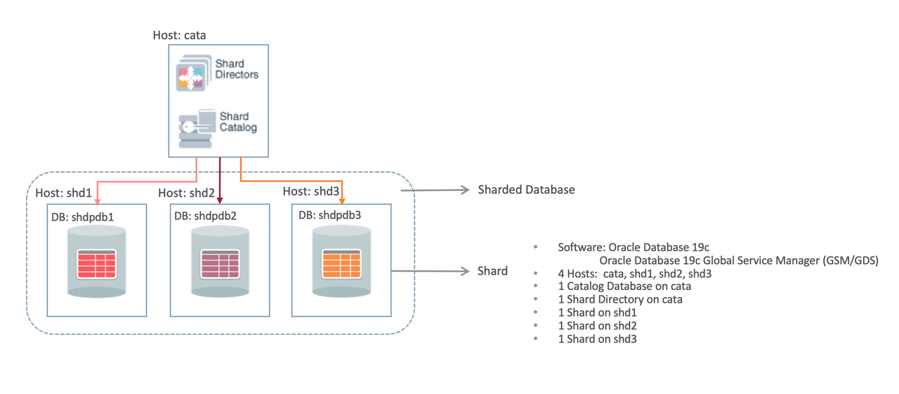

# Oracle Shard Database Deployment

## Introduction

Now, we have 4 database instances. We will use cata as the catalog database, shd1 and shd2 use as the shard database. The shd3 use as the third shard will be added to the shard database in the last lab.

The 4 database instances sample information like this:

| Public IP       | Private IP | Hostname | CDB Name | PDB Name |
| --------------- | ---------- | -------- | -------- | -------- |
| xxx.xxx.xxx.xxx | 10.0.0.151   | cata     | cata     | catapdb  |
| xxx.xxx.xxx.xxx | 10.0.0.152   | shd1     | shd1     | shdpdb1  |
| xxx.xxx.xxx.xxx | 10.0.0.153   | shd2     | shd2     | shdpdb2  |
| xxx.xxx.xxx.xxx | 10.0.0.154   | shd3     | shd3     | shdpdb3  |
{: title="Summary of container DBs (CDB) and Puggables DBs (PDB) by Host"}

Following is the topology used for System Managed Sharding we will create in this workshop:



*Estimated Lab Time:* 60 minutes.

Watch the video below for a quick walk through of the lab.
[Deployment the Sharded Database](videohub:1_m1amf8pg)

### Objectives

In this lab, you will deploy a sharded database with 2 shard.

### Prerequisites
This lab assumes you have:
- An Oracle Cloud account
- You have completed:
    - Lab: Prepare Setup (*Free-tier* and *Paid Tenants* only)
    - Lab: Environment Setup
    - Lab: Initialize Environment

## Task 1: Install Shard Director Software

In this workshop we choose to co-locate the shard director software on the same host as the shard catalog database, it must be installed in a separate Oracle Home.

1. From your remote desktop session connected to host *cata* as user **oracle**, open a Terminal session and the blocks below to create two config files needed to switch environment between catalog and GSM.

    - create a file named gsm.sh.

    ```
    <copy>
    cat >gsm.sh <<EOF
    export ORACLE_BASE=/opt/oracle
    export ORACLE_HOME=/opt/oracle/product/19c/gsmhome_1
    export LD_LIBRARY_PATH=\$ORACLE_HOME/lib
    export PATH=\$ORACLE_HOME/bin:\$PATH
    EOF
    </copy>
    ```

    - create a file named cata.sh.

    ```
    <copy>
    cat >cata.sh <<EOF
    export ORACLE_BASE=/opt/oracle
    export ORACLE_HOME=/opt/oracle/product/19c/dbhome_1
    export LD_LIBRARY_PATH=\$ORACLE_HOME/lib
    export PATH=\$ORACLE_HOME/bin:\$PATH
    EOF
    </copy>
    ```

2. Switch to the GSM environment.

    ```
    [oracle@cata ~]$ <copy>. ./gsm.sh</copy>
    [oracle@cata ~]$
    ```

3. Unzip the Installation package. For your convenience and in the interest of time, the *Oracle Database 19c Global Service Manager (GSM)* software package has been downloaded from Oracle E-Delivery platform and staged under */opt/oracle/stage*. It's also available from OTN like DB and other Oracle software.


    ```
    <copy>
    cd /opt/oracle/stage/
    unzip V982067-01.zip
    cd gsm
    ls -ltrh
    </copy>
    ```

4. Run the following block to create the response file needed for a silent install.

    ```
    <copy>
    cat >response/gsm_install_livelabs.rsp <<EOF

    ###############################################################################
    ## Copyright(c) Oracle Corporation 1998,2019. All rights reserved.           ##
    ##                                                                           ##
    ## Specify values for the variables listed below to customize                ##
    ## your installation.                                                        ##
    ##                                                                           ##
    ## Each variable is associated with a comment. The comment                   ##
    ## can help to populate the variables with the appropriate                   ##
    ## values.                                                                   ##
    ##                                                                           ##
    ###############################################################################

    #-------------------------------------------------------------------------------
    # Do not change the following system generated value.
    #-------------------------------------------------------------------------------
    oracle.install.responseFileVersion=/oracle/install/rspfmt_gsminstall_response_schema_v19.0.0

    #-------------------------------------------------------------------------------
    # Unix group to be set for the inventory directory.
    #-------------------------------------------------------------------------------
    UNIX_GROUP_NAME=oinstall
    #-------------------------------------------------------------------------------
    # Inventory location.
    #-------------------------------------------------------------------------------
    INVENTORY_LOCATION=/opt/oracle/oraInventory
    #-------------------------------------------------------------------------------
    # Complete path of the Oracle Home
    #-------------------------------------------------------------------------------
    ORACLE_HOME=/opt/oracle/product/19c/gsmhome_1

    #-------------------------------------------------------------------------------
    # Complete path of the Oracle Base.
    #-------------------------------------------------------------------------------
    ORACLE_BASE=/opt/oracle
    EOF
    ls -ltrh response/gsm_install_livelabs.rsp
    </copy>
    ```
5. Create the gsm home directory.

    ```
    [oracle@cata /opt/oracle/stage/gsm]$ <copy>mkdir -p /opt/oracle/product/19c/gsmhome_1</copy>
    [oracle@cata /opt/oracle/stage/gsm]$
    ```

6. Install the gsm

    ```
    [oracle@cata /opt/oracle/stage/gsm]$ <copy>./runInstaller -silent -responseFile /opt/oracle/stage/gsm/response/gsm_install_livelabs.rsp -showProgress -ignorePrereq</copy>
    ```

7. The progress screen will look like this. Ignore the warning.

    ```
    Starting Oracle Universal Installer...

    Checking Temp space: must be greater than 551 MB.   Actual 33580 MB    Passed
    Preparing to launch Oracle Universal Installer from /tmp/OraInstall2020-12-06_08-54-28AM. Please wait ...[oracle@cata ~]$ [WARNING] [INS-13014] Target environment does not meet some optional requirements.
       CAUSE: Some of the optional prerequisites are not met. See logs for details. /opt/oracle/oraInventory/logs/installActions2020-12-06_08-54-28AM.log
       ACTION: Identify the list of failed prerequisite checks from the log: /opt/oracle/oraInventory/logs/installActions2020-12-06_08-54-28AM.log. Then either from the log file or from installation manual find the appropriate configuration to meet the prerequisites and fix it manually.
    The response file for this session can be found at:
     /opt/oracle/product/19c/gsmhome_1/install/response/gsm_2020-12-06_08-54-28AM.rsp

    You can find the log of this install session at:
     /opt/oracle/oraInventory/logs/installActions2020-12-06_08-54-28AM.log

    Prepare in progress.
    ..................................................   8% Done.

    Prepare successful.

    Copy files in progress.
    ..................................................   13% Done.
    ..................................................   19% Done.
    ..................................................   27% Done.
    ..................................................   33% Done.
    ..................................................   38% Done.
    ..................................................   43% Done.
    ..................................................   48% Done.
    ..................................................   53% Done.
    ..................................................   58% Done.
    ..................................................   64% Done.
    ..................................................   69% Done.
    ..................................................   74% Done.
    ..................................................   79% Done.

    Copy files successful.

    Link binaries in progress.

    Link binaries successful.

    Setup files in progress.
    ........................................
    Setup files successful.

    Setup Inventory in progress.

    Setup Inventory successful.
    ..........
    Finish Setup in progress.
    ..................................................   84% Done.

    Finish Setup successful.
    The installation of Oracle Distributed Service and Load Management was successful.
    Please check '/opt/oracle/oraInventory/logs/silentInstall2020-12-06_08-54-28AM.log' for more details.

    Setup Oracle Base in progress.

    Setup Oracle Base successful.
    ..................................................   95% Done.

    As a root user, execute the following script(s):
    	1. /opt/oracle/product/19c/gsmhome_1/root.sh


    Successfully Setup Software with warning(s).
    ..................................................   100% Done.
    ```

    **Notes:** Ignore the warning in the *Prerequisites* part at the beginning of the output above. It's due to the swap size being lower than the recommended value based on available memory


8. Run the root.sh as **oracle** user using **SUDO**.

    ```
    [oracle@cata /opt/oracle/stage/gsm]$ <copy>sudo /opt/oracle/product/19c/gsmhome_1/root.sh</copy>
    Check /opt/oracle/product/19c/gsmhome_1/install/root_cata_2020-11-28_01-45-39-535370417.log for the output of root script
    [oracle@cata /opt/oracle/stage/gsm]$<copy>cd ~</copy>
    [oracle@cata ~]$
    ```

## Task 2: Setup Catalog Database

1. Make sure you are in the catalog database environment by running *`. .set-env-db.sh`* and selecting *cata* from the list.

    ```
    [oracle@cata ~]$ <copy>. .set-env-db.sh</copy>
    ```
    ```
    List of Database Instances

    #  ORACLE_SID
    -- ----------
    1) cata

    Select a number from the list (1-n): 1
    ================================================================================
        ___                 _        _     _           _          _
        / _ \ _ __ __ _  ___| | ___  | |   (_)_   _____| |    __ _| |__  ___
        | | | | '__/ _` |/ __| |/ _ \ | |   | \ \ / / _ \ |   / _` | '_ \/ __|
        | |_| | | | (_| | (__| |  __/ | |___| |\ V /  __/ |__| (_| | |_) \__ \
        \___/|_|  \__,_|\___|_|\___| |_____|_| \_/ \___|_____\__,_|_.__/|___/

    ================================================================================
                        ENV VARIABLES
    --------------------------------------------------------------------------------
    . ORACLE_BASE         = /opt/oracle
    . ORACLE_BASE_HOME    = /opt/oracle/product/19c/dbhome_1
    . ORACLE_HOME         = /opt/oracle/product/19c/dbhome_1
    . ORACLE_SID          = cata
    . PRIVATE_IP          = 10.0.0.151
    . PUBLIC_IP           = xxx.xxx.xxx.xxx
    . HOSTNAME            = cata.livelabs.oraclevcn.com
    --------------------------------------------------------------------------------
                        Database ENV set for cata

    Run this to reload/setup the Database ENV: source /usr/local/bin/.set-env-db.sh
    --------------------------------------------------------------------------------
    ================================================================================

    [oracle@cata ~]$
    ```

2. Connect to the catalog database with sysdba.

    ```
    [oracle@cata ~]$ <copy>sqlplus / as sysdba</copy>

    SQL*Plus: Release 19.0.0.0.0 - Production on Sun Nov 29 02:50:15 2020
    Version 19.11.0.0.0

    Copyright (c) 1982, 2020, Oracle.  All rights reserved.


    Connected to:
    Oracle Database 19c Enterprise Edition Release 19.0.0.0.0 - Production
    Version 19.11.0.0.0

    SQL>
    ```

3. Because the shard catalog database can run multi-shard queries which connect to shards over database links, the `OPEN_LINKS` and `OPEN_LINKS_PER_INSTANCE` database initialization parameter values must be greater than or equal to the number of shards that will be part of the sharded database configuration.

    ```
    SQL> <copy>alter system set open_links=20 scope=spfile;</copy>

    System altered.

    SQL> <copy>alter system set open_links_per_instance=20 scope=spfile;</copy>

    System altered.

    SQL>
    ```

4. Set the `DB_FILES` database initialization parameter greater than or equal to the total number of chunks and/or tablespaces in the system.

    ```
    SQL> <copy>alter system set db_files=1024 scope=spfile;</copy>

    System altered.

    SQL>
    ```

5. To support Oracle Managed Files, which is used by the sharding chunk management infrastructure, the `DB_CREATE_FILE_DEST` database parameter must be set to a valid value.

    ```
    SQL> <copy>alter system set db_create_file_dest='/opt/oracle/oradata' scope=spfile;</copy>    

    System altered.

    SQL>
    ```

6. Unlock the gsmcatalog user.

    ```
    SQL> <copy>alter user gsmcatuser account unlock;</copy>

    User altered.

    SQL> <copy>alter user gsmcatuser identified by Ora_DB4U;</copy>

    User altered.

    SQL>
    ```

7. Connect to the catalog pdb, Unlock the gsmcatalog user and create a shard catalog administrator account.

    ```
    SQL> <copy>show pdbs</copy>

        CON_ID CON_NAME			  OPEN MODE  RESTRICTED
    ---------- ------------------------------ ---------- ----------
    	 2 PDB$SEED			  READ ONLY  NO
    	 3 CATAPDB			  READ WRITE NO

    SQL> <copy>alter session set container=catapdb;</copy>

    Session altered.

    SQL> <copy>alter user gsmcatuser account unlock;</copy>

    User altered.

    SQL> <copy>create user mysdbadmin identified by Ora_DB4U;</copy>

    User created.

    SQL> <copy>grant gsmadmin_role to mysdbadmin;</copy>

    Grant succeeded.

    SQL>
    ```

8. Connect as sysdba. Check the database archivelog mode.

    ```
    SQL> <copy>connect / as sysdba</copy>
    Connected.

    SQL> <copy>archive log list</copy>
    Database log mode	       No Archive Mode
    Automatic archival	       Disabled
    Archive destination	       USE_DB_RECOVERY_FILE_DEST
    Oldest online log sequence     10
    Current log sequence	       12
    SQL>
    ```

9. Check the flashback status. Output will be similar to the one shown below depending on your environment.

    ```
    SQL> <copy>select flashback_on from v$database;</copy>

    FLASHBACK_ON
    ------------------
    NO

    SQL> <copy>show parameter db_recovery_file</copy>
    NAME				     TYPE	 VALUE
    ------------------------------------ ----------- ------------------------------
    db_recovery_file_dest		     string	     /opt/oracle/fast_recovery_area
    db_recovery_file_dest_size	     big integer 12732M

    SQL>
    ```

10. Enable archivelog and flashback on.

    ```
    SQL> <copy>!mkdir -p /opt/oracle/fast_recovery_area</copy>

    SQL> <copy>alter system set db_recovery_file_dest_size=50G scope=both;</copy>

    System altered.

    SQL> <copy>alter system set db_recovery_file_dest='/opt/oracle/fast_recovery_area' scope=both;</copy>

    System altered.

    SQL> <copy>shutdown immediate</copy>
    Database closed.
    Database dismounted.
    ORACLE instance shut down.

    SQL> <copy>startup mount;</copy>
    ORACLE instance started.

    Total System Global Area 4647286504 bytes
    Fixed Size		    9144040 bytes
    Variable Size		  855638016 bytes
    Database Buffers	 3774873600 bytes
    Redo Buffers		    7630848 bytes
    Database mounted.

    SQL> <copy>alter database archivelog;</copy>

    Database altered.

    SQL> <copy>alter database flashback on;</copy>

    Database altered.

    SQL> <copy>alter database open;</copy>

    Database altered.

    SQL>
    ```

11. Exit from SQLPLUS.

    ```
    SQL> <copy>exit</copy>
    Disconnected from Oracle Database 19c Enterprise Edition Release 19.0.0.0.0 - Production
    Version 19.14.0.0.0
    [oracle@cata ~]$
    ```

## Task 3: Setup Shard Databases

The following steps need to be done in all the shard databases. We only provide steps for shard1.

1. Duplicate the remote desktop browser tab connecting to host *cata* and replace the IP address in the address bar with the Public IP address of host *shd1*.

2. Make sure you are in the shd1 (or shd2/shd3) database environment by running *`. .set-env-db.sh`* and selecting the appropriate shard from the list.

    ```
    [oracle@cata ~]$ <copy>. .set-env-db.sh</copy>
    ```


3. Connect to the shard database as sysdba.

    ```
    [oracle@shd1 ~]$ <copy>sqlplus / as sysdba</copy>

    SQL*Plus: Release 19.0.0.0.0 - Production on Sun Nov 29 03:16:25 2020
    Version 19.11.0.0.0

    Copyright (c) 1982, 2020, Oracle.  All rights reserved.


    Connected to:
    Oracle Database 19c Enterprise Edition Release 19.0.0.0.0 - Production
    Version 19.11.0.0.0

    SQL>
    ```

4. Unlock the gsmrootuser user.

    ```
    SQL> <copy>alter user gsmrootuser account unlock;</copy>

    User altered.

    SQL> <copy>alter user gsmrootuser identified by Ora_DB4U;</copy>

    User altered.

    SQL> <copy>grant SYSDG, SYSBACKUP to gsmrootuser;</copy>

    Grant succeeded.

    SQL>
    ```


5. A directory object named `DATA_PUMP_DIR` must be created and accessible in the shard database from the `GSMADMIN_INTERNAL` account.

    ```
    SQL> <copy>select directory_path from dba_directories where directory_name='DATA_PUMP_DIR';</copy>

    DIRECTORY_PATH
    --------------------------------------------------------------------------------
    /opt/oracle/admin/shd1/dpdump/

    SQL> <copy>grant read, write on directory DATA_PUMP_DIR to gsmadmin_internal;</copy>

    Grant succeeded.

    SQL>
    ```


6. Unlock the gsmuser.

    ```
    SQL> <copy>alter user gsmuser account unlock;</copy>

    User altered.

    SQL> <copy>alter user gsmuser identified by Ora_DB4U;</copy>

    User altered.

    SQL> <copy>grant SYSDG, SYSBACKUP to gsmuser;</copy>

    Grant succeeded.

    SQL>
    ```


7. Set the `DB_FILES` database initialization parameter greater than or equal to the total number of chunks and/or tablespaces in the system.

    ```
    SQL> <copy>alter system set db_files=1024 scope=spfile;</copy>

    System altered.

    SQL>
    ```


8. Set the `dg_broker_start` to true for data guard replication. We will not use the data guard standby in this workshop.

    ```
    SQL> <copy>alter system set dg_broker_start=true scope=both;</copy>

    System altered.

    SQL>
    ```


9. (Optional) To support file movement from shard to shard, the `DB_FILE_NAME_CONVERT` database parameter must be set to a valid value. This location is used when standby databases are in use, as is typical with non-sharded databases, and the location can also be used during chunk movement operations. (**Note**: If you current host is shd2 or shd3, you should modify the command from SHDSTB1, SHD1 to SHDSTB2, SHD2 or SHDSTB3, SHD3)

    ```
    SQL> <copy>alter system set db_file_name_convert='/SHDSTB1/','/SHD1/' scope=spfile;</copy>

    System altered.

    SQL>
    ```


10. Connect to the shard pdb. (**Note**: If you current host is shd2 or shd3, you should change the pdb name from shdpdb1 to shdpdb2 or shdpdb3)

    ```
    SQL> <copy>show pdbs</copy>

        CON_ID CON_NAME			  OPEN MODE  RESTRICTED
    ---------- ------------------------------ ---------- ----------
    	 2 PDB$SEED			  READ ONLY  NO
    	 3 SHDPDB1			  READ WRITE NO

    SQL> <copy>alter session set container=shdpdb1;</copy>

    Session altered.

    SQL>
    ```


11. Unlock the gsmuser in pdb.

    ```
    SQL> <copy>alter user gsmuser account unlock;</copy>

    User altered.

    SQL> <copy>grant SYSDG, SYSBACKUP to gsmuser;</copy>

    Grant succeeded.

    SQL>
    ```


12. To support Oracle Managed Files, used by the sharding chunk management infrastructure, the `DB_CREATE_FILE_DEST` database parameter must be set to a valid value.

    ```
    SQL> <copy>show parameter db_create_file_dest</copy>

    NAME				     TYPE	 VALUE
    ------------------------------------ ----------- ------------------------------
    db_create_file_dest		     string

    SQL> <copy>alter system set db_create_file_dest='/opt/oracle/oradata' scope=both;</copy>

    System altered.

    SQL>
    ```


13. A directory object named `DATA_PUMP_DIR` must be created and accessible in the shard database from the `GSMADMIN_INTERNAL` account.

    ```
    SQL> <copy>grant read, write on directory DATA_PUMP_DIR to gsmadmin_internal;</copy>

    Grant succeeded.
    SQL>
    ```


14. Connect to the CDB. Enable achivelog and flashback on.

    ```
    SQL> <copy>connect / as sysdba</copy>
    Connected.

    SQL> <copy>!mkdir -p /opt/oracle/fast_recovery_area</copy>

    SQL> <copy>alter system set db_recovery_file_dest_size=50G scope=both;</copy>

    System altered.

    SQL> <copy>alter system set db_recovery_file_dest='/opt/oracle/fast_recovery_area' scope=both;</copy>

    System altered.

    SQL> <copy>shutdown immediate</copy>
    Database closed.
    Database dismounted.
    ORACLE instance shut down.

    SQL> <copy>startup mount;</copy>
    ORACLE instance started.

    Total System Global Area 4647286504 bytes
    Fixed Size		    9144040 bytes
    Variable Size		  855638016 bytes
    Database Buffers	 3774873600 bytes
    Redo Buffers		    7630848 bytes
    Database mounted.

    SQL> <copy>alter database archivelog;</copy>

    Database altered.

    SQL> <copy>alter database flashback on;</copy>

    Database altered.

    SQL> <copy>alter database open;</copy>

    Database altered.

    SQL>
    ```

15. (Optional)  If your shard database will use standby shard databases, you must enable the `FORCE LOGGING` mode.

    ```
    SQL> <copy>alter database force logging;</copy>

    Database altered.

    SQL>
    ```

16. Connect to the shard pdb and validate the shard. The `validateShard` procedure can and should be run against primary, mounted (unopened) standby, and Active Data Guard standby databases that are part of the sharded database configuration. (**Note**: If you current host is shd2 or shd3, you should change the container name from shdpdb1 to shdpdb2 or shdpdb3).

    ```
    SQL> <copy>alter session set container=shdpdb1;</copy>

    Session altered.

    SQL> <copy>set serveroutput on</copy>
    SQL> <copy>execute dbms_gsm_fix.validateShard</copy>
    ```

17. The result looks likes this. All output lines marked `ERROR` must be fixed before moving on to the next deployment steps.

    ```
    INFO: Data Guard shard validation requested.
    INFO: Database role is PRIMARY.
    INFO: Database name is SHD1.
    INFO: Database unique name is shd1.
    INFO: Database ID is 754825207.
    INFO: Database open mode is READ WRITE.
    INFO: Database in archivelog mode.
    INFO: Flashback is on.
    INFO: Force logging is on.
    INFO: Database platform is Linux x86 64-bit.
    INFO: Database character set is AL32UTF8. This value must match the character
    set of the catalog database.
    INFO: 'compatible' initialization parameter validated successfully.
    INFO: Database is a multitenant container database.
    INFO: Current container is SHDPDB1.
    INFO: Database is using a server parameter file (spfile).
    INFO: db_create_file_dest set to: '/opt/oracle/oradata'
    INFO: db_recovery_file_dest set to: '/opt/oracle/fast_recovery_area'
    INFO: db_files=1024. Must be greater than the number of chunks and/or
    tablespaces to be created in the shard.
    INFO: dg_broker_start set to TRUE.
    INFO: remote_login_passwordfile set to EXCLUSIVE.
    INFO: db_file_name_convert set to: '/SHDSTB1/, /SHD1/'
    INFO: GSMUSER account validated successfully.
    INFO: DATA_PUMP_DIR is
    '/opt/oracle/admin/shd1/dpdump/B5364F3921562851E0530300000A7D42'.

    PL/SQL procedure successfully completed.

    SQL>
    ```

18. If you use data guard, you need modify the parameters in the standby database and validate the shard configurations.

19. Repeat all previous steps of this task to set up all the remaining shard databases. Note you may need to modify the shard name in some copy statements


## Task 4: Configure the Shard Database Topology

1. Switch to the browser tab connecting to the remote desktop session for catalog database host (*cata*)


2. Switch to the GSM environment.

    ```
    [oracle@cata ~]$ <copy>. ./gsm.sh</copy>
    [oracle@cata ~]$
    ```

3. Launch `GDSCTL` to configure the sharded database topology.

    ```
    [oracle@cata ~]$ <copy>gdsctl</copy>
    GDSCTL: Version 19.0.0.0.0 - Production on Sun Nov 29 04:13:41 GMT 2020

    Copyright (c) 2011, 2019, Oracle.  All rights reserved.

    Welcome to GDSCTL, type "help" for information.

    Warning:  GSM  is not set automatically because gsm.ora does not contain GSM entries. Use "set  gsm" command to set GSM for the session.
    Current GSM is set to GSMORA
    GDSCTL>
    ```

4. Create the shard catalog using the System-Managed sharding method. In this workshop, we have no data guard environment, so just set one region. In this workshop, we set the chunks to 12, the default value is 120 for each of the shard database.

    ```
    GDSCTL> <copy>create shardcatalog -database cata:1521/catapdb -user mysdbadmin/Ora_DB4U -chunks 12 -region region1</copy>
    Catalog is created
    GDSCTL>
    ```

5. Add and start the shard director.

    ```
    GDSCTL> <copy>connect mysdbadmin/Ora_DB4U@cata:1521/catapdb</copy>
    Catalog connection is established

    GDSCTL> <copy>add gsm -gsm sharddirector1 -catalog cata:1521/catapdb -pwd Ora_DB4U -region region1</copy>
    GSM successfully added

    GDSCTL> <copy>start gsm -gsm sharddirector1</copy>
    GSM is started successfully

    GDSCTL> <copy>set gsm -gsm sharddirector1</copy>
    GDSCTL>
    ```

6. Add shard group, each shardspace must contain at least one primary shardgroup and may contain any number or type of standby shardgroups. In this workshop, we have only one primary shardgroup.

    ```
    GDSCTL> <copy>add shardgroup -shardgroup shardgroup_primary -deploy_as primary -region region1</copy>
    The operation completed successfully
    GDSCTL>
    ```

7. Verify the Sharding Topology. Before adding information about your shard databases to the catalog, verify that your sharding topology is correct before proceeding by using the various `GDSCTL CONFIG` commands.

    ```
    GDSCTL> <copy>config</copy>

    Regions
    ------------------------
    region1                       

    GSMs
    ------------------------
    sharddirector1                

    Sharded Database
    ------------------------
    orasdb                        

    Databases
    ------------------------

    Shard Groups
    ------------------------
    shardgroup_primary            

    Shard spaces
    ------------------------
    shardspaceora                 

    Services
    ------------------------

    GDSCTL pending requests
    ------------------------
    Command                       Object                        Status                        
    -------                       ------                        ------                        

    Global properties
    ------------------------
    Name: oradbcloud
    Master GSM: sharddirector1
    DDL sequence #: 0


    GDSCTL>
    ```

8. Add shard CDB. Repeat the `ADD CDB` command for all of the CDBs that contain a shard PDB in the configuration. In this lab, we only add shd1 and shd2.

    ```
    GDSCTL> <copy>add cdb -connect shd1:1521/shd1 -pwd Ora_DB4U</copy>
    DB Unique Name: shd1
    The operation completed successfully

    GDSCTL> <copy>add cdb -connect shd2:1521/shd2 -pwd Ora_DB4U</copy>
    DB Unique Name: shd2
    The operation completed successfully
    GDSCTL>
    ```

9. When all of the CDBs are added, run `GDSCTL CONFIG CDB` to display a list of CDBs in the catalog.

    ```
    GDSCTL> <copy>config cdb</copy>
    shd1                          
    shd2                          

    GDSCTL>
    ```

10. Add the primary shard information to the shard catalog. The shard group is `shardgroup_primary`.

    ```
    GDSCTL> <copy>add shard -connect shd1:1521/shdpdb1 -pwd Ora_DB4U -shardgroup shardgroup_primary -cdb shd1</copy>
    INFO: Data Guard shard validation requested.
    INFO: Database role is PRIMARY.
    INFO: Database name is SHD1.
    INFO: Database unique name is shd1.
    INFO: Database ID is 754825207.
    INFO: Database open mode is READ WRITE.
    INFO: Database in archivelog mode.
    INFO: Flashback is on.
    INFO: Force logging is on.
    INFO: Database platform is Linux x86 64-bit.
    INFO: Database character set is AL32UTF8. This value must match the character set of the catalog database.
    INFO: 'compatible' initialization parameter validated successfully.
    INFO: Database is a multitenant container database.
    INFO: Current container is SHDPDB1.
    INFO: Database is using a server parameter file (spfile).
    INFO: db_create_file_dest set to: '/opt/oracle/oradata'
    INFO: db_recovery_file_dest set to: '/opt/oracle/fast_recovery_area'
    INFO: db_files=1024. Must be greater than the number of chunks and/or tablespaces to be created in the shard.
    INFO: dg_broker_start set to TRUE.
    INFO: remote_login_passwordfile set to EXCLUSIVE.
    INFO: db_file_name_convert set to: '/SHDSTB1/, /SHD1/'
    INFO: GSMUSER account validated successfully.
    INFO: DATA_PUMP_DIR is '/opt/oracle/admin/shd1/dpdump/B5364F3921562851E0530300000A7D42'.
    DB Unique Name: shd1_shdpdb1
    The operation completed successfully

    GDSCTL> <copy>add shard -connect shd2:1521/shdpdb2 -pwd Ora_DB4U -shardgroup shardgroup_primary -cdb shd2</copy>
    INFO: Data Guard shard validation requested.
    INFO: Database role is PRIMARY.
    INFO: Database name is SHD2.
    INFO: Database unique name is shd2.
    INFO: Database ID is 1313358117.
    INFO: Database open mode is READ WRITE.
    INFO: Database in archivelog mode.
    INFO: Flashback is on.
    INFO: Force logging is on.
    INFO: Database platform is Linux x86 64-bit.
    INFO: Database character set is AL32UTF8. This value must match the character set of the catalog database.
    INFO: 'compatible' initialization parameter validated successfully.
    INFO: Database is a multitenant container database.
    INFO: Current container is SHDPDB2.
    INFO: Database is using a server parameter file (spfile).
    INFO: db_create_file_dest set to: '/opt/oracle/oradata'
    INFO: db_recovery_file_dest set to: '/opt/oracle/fast_recovery_area'
    INFO: db_files=1024. Must be greater than the number of chunks and/or tablespaces to be created in the shard.
    INFO: dg_broker_start set to TRUE.
    INFO: remote_login_passwordfile set to EXCLUSIVE.
    INFO: db_file_name_convert set to: '/SHDSTB2/, /SHD2/'
    INFO: GSMUSER account validated successfully.
    INFO: DATA_PUMP_DIR is '/opt/oracle/admin/shd2/dpdump/B536A936BC9D2A12E0530400000A912F'.
    DB Unique Name: shd2_shdpdb2
    The operation completed successfully
    GDSCTL>
    ```

11. Run `CONFIG SHARD` to view the shard metadata on the shard catalog.

    ```
    GDSCTL> <copy>config shard</copy>
    Name                Shard Group         Status    State       Region    Availability
    ----                -----------         ------    -----       ------    ------------
    shd1_shdpdb1        shardgroup_primary  U         none        region1   -            
    shd2_shdpdb2        shardgroup_primary  U         none        region1   -            

    GDSCTL>
    ```

12. Add all of the host names and IP addresses of your shard hosts to the shard catalog. First, View a list of trusted hosts.

    ```
    GDSCTL> <copy>config vncr</copy>
    Name                          Group ID                      
    ----                          --------                      
    10.0.0.151                                                    
    shd1.livelabs.oraclevcn.com                                             
    shd2.livelabs.oraclevcn.com                                             

    GDSCTL>
    ```

13. Run the `ADD INVITEDNODE` command to manually add all host names and IP addresses of your shard hosts( At this time add private IP address of shd1 and shd2) to the shard catalog metadata.

    ```
    GDSCTL> <copy>add invitednode 127.0.0.1</copy>
    GDSCTL> <copy>add invitednode cata</copy>
    GDSCTL> <copy>add invitednode 10.0.0.152</copy>
    GDSCTL> <copy>add invitednode 10.0.0.153</copy>
    GDSCTL>
    ```

14. View the list of trusted hosts again.

    ```
    GDSCTL> <copy>config vncr</copy>
    Name                          Group ID                      
    ----                          --------                      
    10.0.0.151                                                    
    10.0.0.152                                                    
    10.0.0.153                                                    
    127.0.0.1                                                   
    cata                                                        
    shd1.livelabs.oraclevcn.com                                            
    shd2.livelabs.oraclevcn.com                                             

    GDSCTL>
    ```

## Task 5: Deploy the Sharding Configuration

1. When the sharded database topology has been fully configured, run the `GDSCTL DEPLOY` command to deploy the sharded database configuration.

    ```
    GDSCTL> <copy>deploy</copy>
    deploy: examining configuration...
    deploy: requesting Data Guard configuration on shards via GSM
    deploy: shards configured successfully
    The operation completed successfully
    GDSCTL>
    ```

2. Check the shard status, It's may look similar to the following.

    ```
    GDSCTL> <copy>config shard</copy>
    Name                Shard Group         Status    State       Region    Availability
    ----                -----------         ------    -----       ------    ------------
    shd1_shdpdb1        shardgroup_primary  Ok        Deployed    region1   ONLINE       
    shd2_shdpdb2        shardgroup_primary  Ok        Deployed    region1   ONLINE       

    GDSCTL>
    ```

3. Observe all shard are registered.

    ```
    GDSCTL> <copy>databases</copy>
    Database: "shd1_shdpdb1" Registered: Y State: Ok ONS: N. Role: PRIMARY Instances: 1 Region: region1
       Registered instances:
         orasdb%1
    Database: "shd2_shdpdb2" Registered: Y State: Ok ONS: N. Role: PRIMARY Instances: 1 Region: region1
       Registered instances:
         orasdb%11

    GDSCTL>
    ```

4. Create and start a global service named `oltp_rw_srvc` that a client can use to connect to the sharded database. The `oltp_rw_srvc` service runs read/write transactions on the primary shards.

    ```
    GDSCTL> <copy>add service -service oltp_rw_srvc -role primary</copy>
    The operation completed successfully

    GDSCTL> <copy>start service -service oltp_rw_srvc</copy>
    The operation completed successfully
    GDSCTL>
    ```


5. Check the status of the service.

    ```
    GDSCTL> <copy>config service</copy>


    Name           Network name                  Pool           Started Preferred all
    ----           ------------                  ----           ------- -------------
    oltp_rw_srvc   oltp_rw_srvc.orasdb.oradbcloud orasdb         Yes     Yes                                                                             

    GDSCTL> <copy>status service</copy>
    Service "oltp_rw_srvc.orasdb.oradbcloud" has 2 instance(s). Affinity: ANYWHERE
       Instance "orasdb%1", name: "shd1", db: "shd1_shdpdb1", region: "region1", status: ready.
       Instance "orasdb%11", name: "shd2", db: "shd2_shdpdb2", region: "region1", status: ready.

    GDSCTL>
    ```

6. Exit the GDSCTL.

    ```
    GDSCTL> <copy>exit</copy>
    [oracle@cata ~]$
    ```


7. Check the shard director listener status. You can see listening on 1522 port there is a service named `oltp_rw_srvc.orasdb.oradbcloud` which we create previously and a service named `GDS$CATALOG.oradbcloud` which connect to the catalog instance.

    ```
    [oracle@cata ~]$ <copy>lsnrctl status SHARDDIRECTOR1</copy>

    LSNRCTL for Linux: Version 19.0.0.0.0 - Production on 30-NOV-2020 03:34:25

    Copyright (c) 1991, 2019, Oracle.  All rights reserved.

    Connecting to (DESCRIPTION=(ADDRESS=(HOST=cata)(PORT=1522)(PROTOCOL=tcp))(CONNECT_DATA=(SERVICE_NAME=GDS$CATALOG.oradbcloud)))
    STATUS of the LISTENER
    ------------------------
    Alias                     SHARDDIRECTOR1
    Version                   TNSLSNR for Linux: Version 19.0.0.0.0 - Production
    Start Date                29-NOV-2020 04:26:16
    Uptime                    0 days 23 hr. 8 min. 8 sec
    Trace Level               off
    Security                  ON: Local OS Authentication
    SNMP                      OFF
    Listener Parameter File   /opt/oracle/product/19c/gsmhome_1/network/admin/gsm.ora
    Listener Log File         /opt/oracle/diag/gsm/cata/sharddirector1/alert/log.xml
    Listening Endpoints Summary...
      (DESCRIPTION=(ADDRESS=(PROTOCOL=tcp)(HOST=cata)(PORT=1522)))
    Services Summary...
    Service "GDS$CATALOG.oradbcloud" has 1 instance(s).
      Instance "cata", status READY, has 1 handler(s) for this service...
    Service "GDS$COORDINATOR.oradbcloud" has 1 instance(s).
      Instance "cata", status READY, has 1 handler(s) for this service...
    Service "_MONITOR" has 1 instance(s).
      Instance "SHARDDIRECTOR1", status READY, has 1 handler(s) for this service...
    Service "_PINGER" has 1 instance(s).
      Instance "SHARDDIRECTOR1", status READY, has 1 handler(s) for this service...
    Service "oltp_rw_srvc.orasdb.oradbcloud" has 2 instance(s).
      Instance "orasdb%1", status READY, has 1 handler(s) for this service...
      Instance "orasdb%11", status READY, has 1 handler(s) for this service...
    The command completed successfully
    [oracle@cata ~]$
    ```


You may now proceed to the next lab.

## Acknowledgements
* **Author** - Minqiao Wang, DB Product Management, Dec 2020
* **Contributors** - Rene Fontcha, Shefali Bhargava
* **Last Updated By/Date** - Shefali Bhargava, DB Sharding Product Management, October 2022
