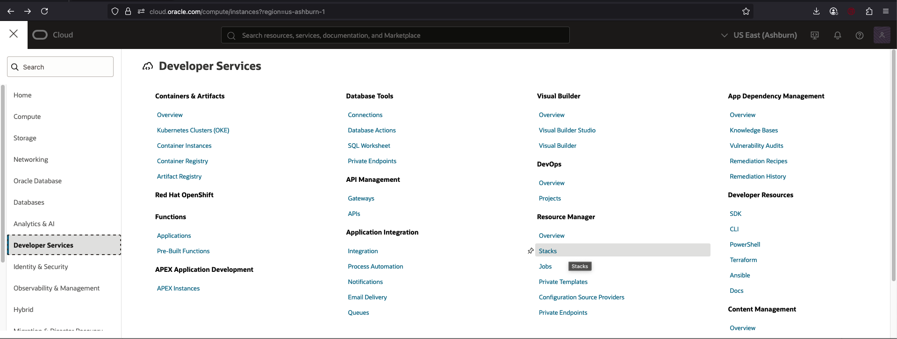

# Clean-up ORM Stack and Instances

## Introduction

You can permanently delete (terminate) instances that you no longer need. This can be achieved by using destroy job on the Stack in Resource Manager that you created in the Environment Setup Lab. This job will tear down the resources/instances and clean up your tenancy.
We recommend running a destroy job before deleting a stack to release associated resources first. When you delete a stack, its associated state file is also deleted, so you lose track of the state of its associated resources. Cleaning up resources associated with a deleted stack can be difficult without the state file, especially when those resources are spread across multiple compartments. To avoid difficult cleanup later, we recommend that you release associated resources first by running a destroy job.
Data cannot be recovered from destroyed resources.

This lab walks you through the steps to running a destroy job

Estimated Time - 5 minutes

### Objectives

- Terminate and tear down all resources/instances used in the Oracle Sharding Lab.

### Prerequisites

- You should have provisioned the **Achieving Data Sovereignty with Oracle Sharding** workshop using a podman container
- To provision this workshop, there are detailed instructions in Lab 1 of [Achieving Data Sovereignty with Oracle Sharding](https://apexapps.oracle.com/pls/apex/r/dbpm/livelabs/view-workshop?wid=866) workshop.

## Task 1: Terminate a provisioned Oracle Autonomous Database instance.

1. Login to Oracle Cloud

2. Open the navigation menu and click **Developer Services**. Under **Resource Manager**, click **Stacks**.
  

3. Choose the compartment that you chose in Lab 1 to install your stack (on the left side of the page).

4. Click the name of the stack that you created in Lab 1. The Stack details page opens.

5. Click **Destroy**.

6. In the Destroy panel that is presented, fill in the Name field with name of the destroy job.

7. Click **Destroy**.

8. The destroy job is created. The new job is listed under **Jobs**. Your instance and all resources used by it will begin to terminate

9. After a few minutes, once the instance is terminated, the Lifecycle state will change from Terminating to Terminated.

  You have successfully cleaned up your instance.

## Learn More

-  **Oracle Sharding - User-Defined Method**
[Oracle Sharding - User-Defined Method Documentation for more details] (https://docs.oracle.com/en/database/oracle/oracle-database/21/shard/oracle-sharding-architecture-and-concepts1.html#GUID-37F20817-EFD5-400B-A082-41171C0B6D1C)

You may now **proceed to the next lab**.

## Acknowledgements

* **Authors** - Ajay Joshi, Oracle Globally Distributed Database Product Management, Consulting Member of Technical Staff
* **Contributors** - Pankaj Chandiramani, Shefali Bhargava, Param Saini, Jyoti Verma
* **Last Updated By/Date** - Ajay Joshi, Oracle Globally Distributed Database Product Management, Consulting Member of Technical Staff, July 2025