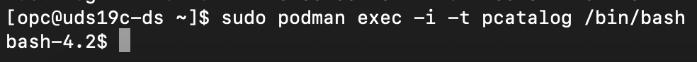

# Sample User-Defined Sharded Schema

## Introduction

The sharded database schema can be created when you are done configuring the user defined sharded environment, and you find the GDSCTL VALIDATE command result as expected without error. In this lab all DDL steps are for informational purposes only, and those are already done in the lab environment, so that you can query the sharded database and verify how you can achieve data sovereignty with Oracle's user-defined sharding method in the distributed databases.

*Estimated Time*:  30 minutes

### Objectives

In this lab, you will:

* Learn how to create a sharded database schema in the user-defined sharding environment, create sharded tables, duplicated tables, and run a few DMLs.
* Testing the use-cases

### Prerequisites

This lab assumes you have:

* An Oracle Cloud account
* You have completed:
  * Lab: Prepare Setup
  * Lab: Environment Setup
  * Lab: Initialize Environment
  * Lab: Explore User-Defined Sharding Topology

## Task 1: Check for containers in your VM and Connect to Catalog Database.

1. Open a terminal window and execute the following as **opc** user.

    ```
    <copy>
    sudo podman ps -a
    </copy>
    ```

     

2. Connect catalog image (pcatalog)

    ```
    <copy>
    sudo podman exec -it pcatalog /bin/bash
    </copy>
    ```

     

## Task 2: Connect as SYSDBA user to create a sharded database schema user

1. Create a sharded database schema user.

    ```
    sqlplus / as sysdba

    show pdbs
    alter session set container=PCAT1PDB;
    alter session enable shard ddl;

    -- If sharded user (transactions) already exists drop that before re-create user
    -- drop user transactions cascade;
    CREATE USER transactions IDENTIFIED BY WElcomeUDS19c##;
    ```

2. Grant roles to the user.

    ```
    GRANT CONNECT, RESOURCE, alter session TO transactions;
    GRANT SELECT_CATALOG_ROLE  TO transactions;
    GRANT UNLIMITED TABLESPACE TO transactions;
    GRANT CREATE DATABASE LINK TO transactions;
    GRANT EXECUTE ON DBMS_CRYPTO TO transactions;
    GRANT CREATE MATERIALIZED VIEW TO transactions;
    ```

3. Create tablespaces for shard1 and shard2 in the respective shardspaces for each shard. Also create a tablespace for duplicated tables.

    ```
    CREATE TABLESPACE tbs_shardspace1 IN SHARDSPACE shardspace1;
    CREATE TABLESPACE tbs_shardspace2 IN SHARDSPACE shardspace2;
    CREATE TABLESPACE tbs_dup;
    ```

4. Connect as the schema user to create sharded table(s), a duplicated table and populated them with data.

    ```
    sqlplus transactions/WElcomeUDS19c##@PCAT1PDB;
    ```

5. If sharded tables (payments and accounts) already exists, drop those before you re-create the tables.

    ```
    drop table payments cascade constraints;
    drop table accounts cascade constraints;
    ```

6. Create the root (parent) sharded table in the user-defined sharding table family for Data Sovereignty.

    ```
    CREATE SHARDED TABLE accounts
    (
    country_cd        VARCHAR2(10) NOT NULL
    ,account_id        NUMBER(38,0) NOT NULL
    ,user_id           NUMBER(38,0) NOT NULL
    ,balance           NUMBER       NOT NULL
    ,last_modified_utc TIMESTAMP    NOT NULL
    )
    PARTITION BY LIST (country_cd)
    (
    PARTITION p_shard1 VALUES
    ('USA','CAN','BRA','MEX') TABLESPACE tbs_shardspace1
    ,PARTITION p_shard2 VALUES
    ('IND','DEU','FRA','CHN','AUS','ZAF','JPN') TABLESPACE tbs_shardspace2
    );
    ```

7. Create a unique index explicitly while adding the primary key in parent table, Accounts.

    ```
    <copy>
    create unique index accounts_pk_idx ON accounts (account_id, country_cd) local;
    alter table transactions.accounts add constraint accounts_pk primary key (account_id, country_cd) using index accounts_pk_idx;
    ```

8. Create a child sharded table in the user-defined sharding table family for Data Sovereignty.

    ```
    CREATE SHARDED TABLE payments
    (
    country_cd      VARCHAR2(10) NOT NULL
    ,account_id     NUMBER(38,0) NOT NULL
    ,payment_id     NUMBER(38,0) NOT NULL
    ,amount         NUMBER(28,3) NOT NULL
    ,payment_type   VARCHAR2(10) NOT NULL
    ,created_utc    TIMESTAMP    NOT NULL
    )
    PARENT accounts
    PARTITION BY LIST (country_cd)
    (
    PARTITION p_shard1 VALUES
    ('USA','CAN','BRA','MEX') TABLESPACE tbs_shardspace1
    ,PARTITION p_shard2 VALUES
    ('IND','DEU','FRA','CHN','AUS','ZAF','JPN') TABLESPACE tbs_shardspace2
    );
    ```

9. Create unique index explicitly while adding Primary Key in child table payments

    ```
    create unique index payments_pk_idx ON transactions.payments (payment_id, account_id, country_cd) local;
    alter table transactions.payments add constraint payments_pk primary key (payment_id, account_id, country_cd) using index payments_pk_idx;
    ```

10. Add a foreign key in the Payments table that refers the Accounts table.

    ```
    alter table transactions.payments add constraint payments_fk foreign key (account_id, country_cd) references accounts(account_id, country_cd);
    ```

## Task 3. Insert data into the parent sharded table, Accounts.
1. From the same database connection (already connected to transactions user from the shard catalog database), insert a few sample records for each sharding key (country_cd) defined in the CREATE DDL statement for the Accounts table. Data is already inserted and the following DDLs are for reference.

    ```
    insert into accounts(COUNTRY_CD, ACCOUNT_ID, USER_ID, BALANCE, LAST_MODIFIED_UTC) values ('USA',1,1,10000,sysdate);
    insert into accounts(COUNTRY_CD, ACCOUNT_ID, USER_ID, BALANCE, LAST_MODIFIED_UTC) values ('CAN',2,2,10000,sysdate);
    insert into accounts(COUNTRY_CD, ACCOUNT_ID, USER_ID, BALANCE, LAST_MODIFIED_UTC) values ('IND',3,3,10000,sysdate);
    insert into accounts(COUNTRY_CD, ACCOUNT_ID, USER_ID, BALANCE, LAST_MODIFIED_UTC) values ('DEU',4,4,10000,sysdate);
    insert into accounts(COUNTRY_CD, ACCOUNT_ID, USER_ID, BALANCE, LAST_MODIFIED_UTC) values ('BRA',5,5,10000,sysdate);
    insert into accounts(COUNTRY_CD, ACCOUNT_ID, USER_ID, BALANCE, LAST_MODIFIED_UTC) values ('CHN',6,6,10000,sysdate);
    insert into accounts(COUNTRY_CD, ACCOUNT_ID, USER_ID, BALANCE, LAST_MODIFIED_UTC) values ('MEX',7,7,10000,sysdate);
    insert into accounts(COUNTRY_CD, ACCOUNT_ID, USER_ID, BALANCE, LAST_MODIFIED_UTC) values ('FRA',8,8,10000,sysdate);
    insert into accounts(COUNTRY_CD, ACCOUNT_ID, USER_ID, BALANCE, LAST_MODIFIED_UTC) values ('AUS',9,9,10000,sysdate);
    insert into accounts(COUNTRY_CD, ACCOUNT_ID, USER_ID, BALANCE, LAST_MODIFIED_UTC) values ('ZAF',10,10,10000,sysdate);
    insert into accounts(COUNTRY_CD, ACCOUNT_ID, USER_ID, BALANCE, LAST_MODIFIED_UTC) values ('USA',11,11,10000,sysdate);
    insert into accounts(COUNTRY_CD, ACCOUNT_ID, USER_ID, BALANCE, LAST_MODIFIED_UTC) values ('IND',12,12,10000,sysdate);
    insert into accounts(COUNTRY_CD, ACCOUNT_ID, USER_ID, BALANCE, LAST_MODIFIED_UTC) values ('JPN',13,13,10000,sysdate);
    insert into accounts(COUNTRY_CD, ACCOUNT_ID, USER_ID, BALANCE, LAST_MODIFIED_UTC) values ('JPN',14,14,10000,sysdate);
    insert into accounts(COUNTRY_CD, ACCOUNT_ID, USER_ID, BALANCE, LAST_MODIFIED_UTC) values ('JPN',15,15,10000,sysdate);
    commit;
    ```

## Task 4. Create a duplicated table.
1. Duplicated tables are created when your sharded database needs the same data on the shard catalog and all of the shards. Create a duplicated table, Account_type:

    ```
    create duplicated table account_type(id number(2) primary key, account_type_cd varchar2(10), account_desc varchar2(100)) tablespace tbs_dup;
    ```

## Task 5. Insert sample data in a duplicated table.
1. Data is already inserted in the table and the following DDLs are for reference.
    ```
    insert into account_type(id, account_type_cd, account_desc) values (1,'checking','Checking Account Type');
    insert into account_type(id, account_type_cd, account_desc) values (2,'savings','Savings Account Type');
    commit;
    ```

You may now **proceed to the next lab**.

## Acknowledgements

* **Authors** - Ajay Joshi, Oracle Globally Distributed Database Product Management, Consulting Member of Technical Staff
* **Contributors** - Pankaj Chandiramani, Shefali Bhargava, Param Saini, Jyoti Verma
* **Last Updated By/Date** - Ajay Joshi, Oracle Globally Distributed Database Product Management, Consulting Member of Technical Staff, November 2024
