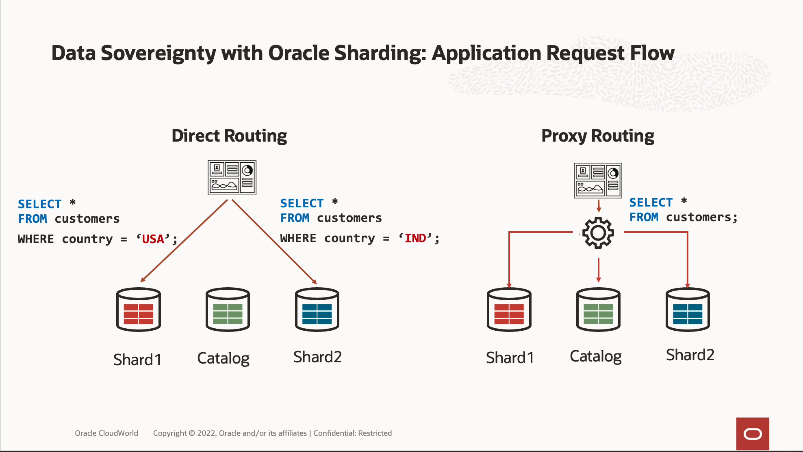

# Introduction

## About the Oracle Globally Distributed Database 19c Solution for Data Sovereignty

Data sovereignty generally refers to how data is governed by regulations specific to the region in which it originated. These types of regulations can specify where data is stored, how it is accessed, how it is processed, and the life-cycle of the data.

**Data Sovereignty**: Understanding Its Significance

Data sovereignty is a country- or region-specific requirement that data is subject to the laws of the country/region in which it is collected or processed and must remain within its borders / data centers. Therefore, organizations must pay close attention to how they manage their data with data localization.
Data sovereignty can also be referred to by other terms such as data residency, data locality, or data localization, and can be implemented across one or multiple regions based on the specific needs of the organization, while still adhering to the regulations set forth by monitoring authorities within that country or region.

**Oracle Sharding**: A Solution for Globally Distributed Systems

Oracle Sharding distributes segments of a data set across many databases (shards) on different computers, on-premises, or in the cloud. It enables globally distributed, linearly scalable, multi-model databases. It requires no specialized hardware or software.
Oracle Sharding does all of this while maintaining strong consistency, the full power of SQL, support for structured and unstructured data, and the Oracle Database ecosystem. It meets data sovereignty requirements and it supports applications that require low latency and high availability.

*Estimated Workshop Time:*  2 hours

### Objectives

In this workshop, you will gain first-hand experience in implementing the Data Sovereignty uses cases with Oracle's user-defined data distribution method, enabling Data Localization in an effective manner for robust distributed database solutions.

Once you complete your setup, the next lab will cover:

- Exploring the user-defined sharding method implementation for Data Sovereignty
- Testing the use-cases

We will use Docker containers and demonstrate multiple use cases.

### Prerequisites

- An Oracle Cloud Account - Please view this workshop's LiveLabs landing page to see which environments are supported

You may now **proceed to the next lab**

## Learn More

- [Achieving Data Sovereignty with Oracle Sharding : Release 23 Internal link](https://docs.oracle.com/en/database/oracle/oracle-database/21/shard/achieving-data-sovereignty-oracle-sharding1.html#GUID-4AA1D64A-F89B-462A-BA4E-F04038665999)

## Acknowledgements

* **Authors** - Ajay Joshi, Oracle Globally Distributed Database Product Management, Consulting Member of Technical Staff
* **Contributors** - Pankaj Chandiramani, Shefali Bhargava, Param Saini, Jyoti Verma
* **Last Updated By/Date** - Ajay Joshi, Oracle Globally Distributed Database Product Management, Consulting Member of Technical Staff, October 2023
