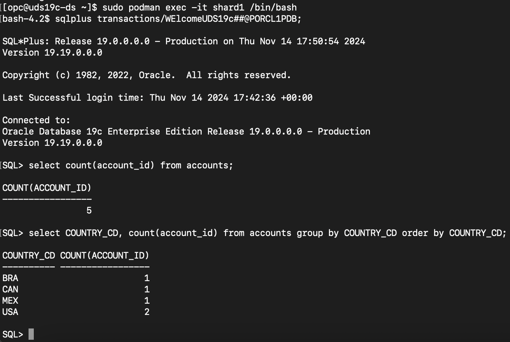
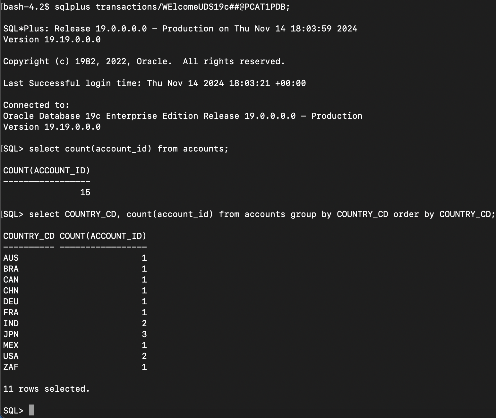

# Sample Queries to Validate for Sharded Databases

## Introduction

When the user-defined sharded database schema is ready, you can query the sharded tables on the shard catalog and on each shard to validate the data.

*Estimated Time*:  30 minutes

### Objectives

In this lab, you will:

* Learn how to validate a sharded database schema (already created) in a user-defined sharding environment, query sharded tables, and query duplicated tables.
* Testing the use-cases

### Prerequisites

This lab assumes you have:

* An Oracle Cloud account
* You have completed:
  * Lab: Prepare Setup
  * Lab: Environment Setup
  * Lab: Initialize Environment
  * Lab: Explore User-Defined Sharding Topology
  * Lab: Sample User-Defined Sharding Schema and Data insertion


## Task 1: Connect as the sharded database schema user to query sharded tables.

1. Check for containers in your VM. To do this, open a terminal window and execute the following as **opc** user.

    ```
    <copy>
    sudo docker ps -a
    </copy>
    ```

     


2. The user-defined sharded database schema and tables are created, and data is inserted for this lab. Connect to the Shard1, Shard2, and Catalog Databases and compare query results from sharded table Accounts on each database.
    ```
    <copy>
    -- Run a query to count accounts for all countries in Shard1 DB, Shard2 DB, Catalog DB and compare results.

    select count(account_id) from accounts;

    --Run a query to count accounts group by country in Shard1 DB, Shard2 DB, Catalog DB and compare results.

    select COUNTRY_CD, count(account_id) from accounts group by COUNTRY_CD order by COUNTRY_CD;
    </copy>
    ```

3. Connect to Shard1 and run queries on the sharded table Accounts. A total of 5 accounts and 4 Countries are in Shard1.

    ```
    <copy>
    sudo docker exec -it shard1 /bin/bash
    </copy>
    ```
     


    ```
    <copy>
    connect transactions/****************@PORCL1PDB;
    select count(account_id) from accounts;
    select COUNTRY_CD, count(account_id) from accounts group by COUNTRY_CD order by COUNTRY_CD;
    </copy>
    ```

    


4. Connect to Shard2 and run queries on the sharded table Accounts. A total of 7 accounts and 6 Countries are in Shard2.


    ```
    <copy>
    sudo docker exec -it shard2 /bin/bash
    </copy>
    ```
     


    ```
    <copy>
    connect transactions/****************@PORCL2PDB;
    select count(account_id) from accounts;
    select COUNTRY_CD, count(account_id) from accounts group by COUNTRY_CD order by COUNTRY_CD;
    </copy>
    ```

    


5. Connect to the Catalog and run cross shard queries on sharded table accounts. A total of 12 accounts and 10 countries are in the Catalog, which matches the sums for accounts (7+5=12) and countries (4+6=10) from both shards. This exercise confirms that Oracle Sharding with user-defined sharding allows you to implement Data Sovereignty use cases.

    ```
    <copy>
    sudo docker exec -it pcatalog /bin/bash
    </copy>
    ```
     


    ```
    <copy>
    connect transactions/****************@PCAT1PDB;
    select count(account_id) from accounts;
    select COUNTRY_CD, count(account_id) from accounts group by COUNTRY_CD order by COUNTRY_CD;
    </copy>
    ```

    


## Task 3: Validate a duplicated table query on each shard and on the catalog database.

1. Connect to each sharded DBs, run the same query for a duplicated table and results would be same from each sharded dbs. ALL DDL and DML operations for Duplicated table recommended to be performed at the catalog DB.

    ```
    <copy>
    select * from account_type;
    </copy>
    ```

2. Connect Shard1 and run a query on duplicated table to select rows.


    


3. Connect Shard2 and run a query on duplicated table to select rows.


    


4. Connect Catalog and run a query on duplicated table to select rows.


    


## Task 4: Connect Catalog DB using GSM local service : GDS$CATALOG.

1. Connect the Catalog using gsm service for proxy routing and run a cross shard query
    ```
    <copy>
    sqlplus transactions/****************@oshard-gsm1.example.com:1522/GDS\$CATALOG.oradbcloud
    </copy>
    ```

    


## Task 5: Connect and query using global services which were created by gdsctl add service command.

1. This kind of connections to be used from Application to provide a sharding key for runtime DB connection.

    ```
    <copy>
    -- Connect oltp_rw_svc service used with direct-routing by applications: randomly connect to a shard
    sqlplus transactions/****************@'(DESCRIPTION=(ADDRESS=(HOST=oshard-gsm1.example.com)(PORT=1522)(PROTOCOL=tcp))(CONNECT_DATA=(SERVICE_NAME=oltp_rw_svc.shardcatalog1.oradbcloud)))'
    </copy>
    ```

    


## Task 6: Connect Shard1 using gsm service for direct routing and run a query.

1. This kind of connections to be used from Application to provide a sharding key belongs to shard1 for DB connection to Shard1.

    ```
    <copy>
    connect oltp_rw_svc service used with direct-routing by applications: connects to shard1 using sharding_key=USA
    sqlplus transactions/****************@'(DESCRIPTION=(ADDRESS=(HOST=oshard-gsm1.example.com)(PORT=1522)(PROTOCOL=tcp))(CONNECT_DATA=(SERVICE_NAME=oltp_rw_svc.shardcatalog1.oradbcloud)(SHARDING_KEY=USA)))'
    </copy>
    ```


## Task 7: Connect Shard2 using gsm service for direct routing and run a query.

1. This kind of connections to be used from Application to provide a sharding key belongs to shard2 for DB connection to Shard2.

    ```
    <copy>
    connect oltp_rw_svc service used with direct-routing by applications: connects to shard2 using sharding_key=IND
    sqlplus transactions/****************@'(DESCRIPTION=(ADDRESS=(HOST=oshard-gsm1.example.com)(PORT=1522)(PROTOCOL=tcp))(CONNECT_DATA=(SERVICE_NAME=oltp_rw_svc.shardcatalog1.oradbcloud)(SHARDING_KEY=IND)))'
    </copy>
    ```


## Acknowledgements

* **Authors** - Ajay Joshi, Oracle Globally Distributed Database Product Management, Consulting Member of Technical Staff
* **Contributors** - Pankaj Chandiramani, Shefali Bhargava, Param Saini, Jyoti Verma
* **Last Updated By/Date** - Ajay Joshi, Oracle Globally Distributed Database Product Management, Consulting Member of Technical Staff, October 2023