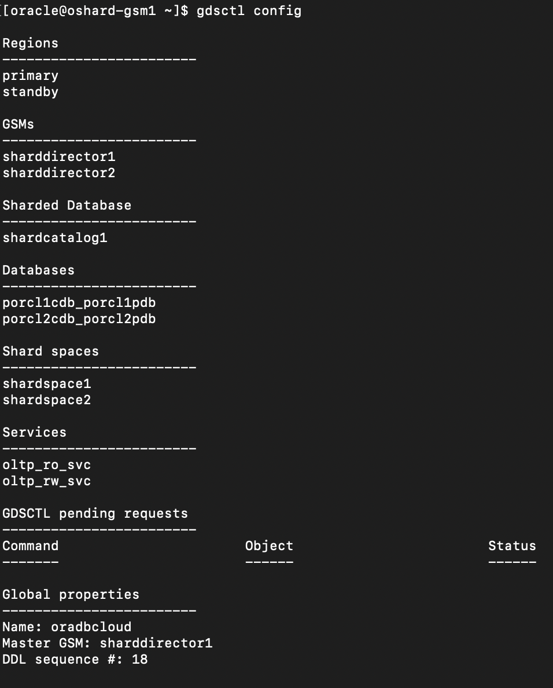
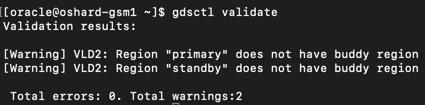

# Explore Oracle's User-Defined Sharding Method Topology to Achieve Data Sovereignty

## Introduction

User-defined sharding lets you explicitly specify the mapping of data to individual shards. It is used when, because of performance, regulatory, or other reasons, certain data needs to be stored on a particular shard, and the administrator needs to have full control over moving data between shards.

Oracle Sharding is a scalability and availability feature for custom-designed OLTP and OLAP applications that enables the distribution and replication of data across a pool of Oracle databases that do not share hardware or software. The pool of databases is presented to the application as a single logical database.

For a user-defined sharded database, two replication schemes are supported: Oracle Data Guard or Oracle Active Data Guard. Oracle GoldenGate can be used used as the incremental replication method. Oracle Data Guard with Oracle GoldenGate enables fast automatic failover with zero data loss.

This workshop is configured with a custom image that has all of the required Docker containers for Oracle Sharding using release 19c GSM and Database Images.

In this workshop, we attempt to use minimal resources to demonstrate the use cases, so you need only a single compute instance to install all of the Oracle Sharding components.

*Estimated Time*:  30 minutes

### Objectives

In this lab, you will:

* Explore user-defined Sharding configuration steps.
* Testing the use-cases

### Prerequisites

This lab assumes you have:
* An Oracle Cloud account
* You have completed:
  * Lab: Prepare Setup
  * Lab: Environment Setup
  * Lab: Initialize Environment


## Task 1: Explore the user-defined sharding

1. Check for containers in your VM. To do this, open a terminal window and execute the following as **opc** user.

    ```
    <copy>
    sudo docker ps -a
    </copy>
    ```

     

2. The user-defined sharding method provides a means to achieve regulatory compliance by enabling user-defined data placement It allows you to use a range or list of countries to partition data among the shards by letting you explicitly specify the mapping of data to individual shards.
    User-Defined Sharding Definitions
    Partition by list defines lists of sharding key values mapped to specific shards.
    Partition by range creates ranges of sharding keys  values mapped to specific shards.
    In user-defined sharding, a shardspace consists of a shard or a set of fully replicated shards. See Shard-Level High Availability for details about replication with user-defined sharding. For simplicity, assume that each shardspace consists of a single shard.
    For an overview and detailed sections of Oracle Sharding methods, visit Oracle Sharding Methods.

    For more details check [Configure the Sharded Database Topology] (<https://docs.oracle.com/en/database/oracle/oracle-database/21/shard/sharding-deployment.html#GUID-4DD37935-BA84-4817-99D6-5FB0BE607E3E>)

3. Run in the terminal as **oracle** user and connect to the shard director server.

    ```
    <copy>
    sudo docker exec -i -t gsm1 /bin/bash
    </copy>
    ```

    

4. Verify sharding topology using the  **CONFIG** command.

    ```
    <copy>
    gdsctl config shard
    </copy>
    ```

    

5. Display the sharding topology configuration.

    ```
    <copy>
    gdsctl config
    </copy>
    ```

    

6. Display the GSM status.

    ```
    <copy>
    gdsctl status gsm
    </copy>
    ```

    

7. Display the global services configured.

    ```
    <copy>
    gdsctl config service
    </copy>
    ```

    

8. Display the recent 10 DDLs.

    ```
    <copy>
    gdsctl show ddl
    </copy>
    ```

    

9. Display the DDLs by count.

    ```
    <copy>
    gdsctl show ddl -count 20
    </copy>
    ```

    

10. Display the failed DDLs only.

    ```
    <copy>
    gdsctl show ddl -failed_only
    </copy>
    ```

    

11. Lists all of the database shards and the chunks that they contain.

    ```
    <copy>
    gdsctl config chunks
    </copy>
    ```

    

12. Display the sharded database stored in the GDS catalog.

    ```
    <copy>
    gdsctl config sdb
    </copy>
    ```

    


13. Display the user defined sharding table family's root table. All sharded tables are children of this root table. Child tables can also be in hierarchical order from its child tables.

    ```
    <copy>
    gdsctl config table family
    </copy>
    ```

    

14. Display the sharding configuration validation result.

    ```
    <copy>
    gdsctl validate
    </copy>
    ```

    

15. Exit from gsm1.

16. Visit Lab 5: Sample User-Defined Sharding Schema, Data insertion and Queries.

### Appendix 1

- [Configure the Oracle Sharded Database Topology] (<https://docs.oracle.com/en/database/oracle/oracle-database/19/shard/sharding-deployment.html#GUID-4DD37935-BA84-4817-99D6-5FB0BE607E3E>)

* [Oracle Sharding Overview] (<https://docs.oracle.com/en/database/oracle/oracle-database/19/shard/sharding-overview.html#GUID-0F39B1FB-DCF9-4C8A-A2EA-88705B90C5BF>)

* [Oracle Sharding Architecture and Concepts] (<https://docs.oracle.com/en/database/oracle/oracle-database/19/shard/oracle-sharding-architecture-and-concepts1.html#GUID-9DC0048A-2D6E-4759-BA80-10F8855E6871>)

You may now **proceed to the next lab**.

## Acknowledgements

* **Authors** - Ajay Joshi, Oracle Globally Distributed Database Product Management, Consulting Member of Technical Staff
* **Contributors** - Pankaj Chandiramani, Shefali Bhargava, Param Saini, Jyoti Verma
* **Last Updated By/Date** - Ajay Joshi, Oracle Globally Distributed Database Product Management, Consulting Member of Technical Staff, October 2023