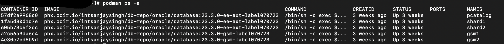
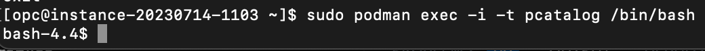

# Sample User Defined sharded schema

## Introduction

Once User defined sharded env configuration is done and you find the result of gdsctl validate command as expect without error, Sharded schema can be created. In this lab all DDL steps are for information purpose only and those are already done in the lab env so that we can query the sharded db and verify how we can achive data sovereignty with Oracle's user defined sharding in the distributed databases.

*Estimated Time*:  30 minutes

### Objectives

In this lab, you will:

* Find how to create a Sharded schema in User-Defined Sharding env, create Sharded tables, duplicated tables, and run a few DMLs.
* Testing the use-cases

### Prerequisites

This lab assumes you have:

* An Oracle Cloud account
* You have completed:
  * Lab: Prepare Setup
  * Lab: Environment Setup
  * Lab: Initialize Environment
  * Lab: Explore User-Defined Sharding Topology

## Task 1: Check for containers in your VM

1. Open a terminal window and execute below as **opc** user.

    ```
    <copy>
    sudo podman ps -a
    </copy>
    ```

     

2. Connect podman catalog image (pcatalog)

    ```
    <copy>
    podman exec -it pcatalog /bin/bash
    </copy>
    ```

     

## Task 2: Connect sysdba user to create a sharded schema user

1. Create a sharded schema user

    ```
    sqlplus / as sysdba

    show pdbs
    alter session set container=PCAT1PDB;
    alter session enable shard ddl;

    -- If sharded user (transactions) already exists drop that before re-create user
    -- drop user transactions cascade;
    CREATE USER transactions IDENTIFIED BY ****************;
    ```

2. Grant Roles

    ```
    GRANT CONNECT, RESOURCE, alter session TO transactions;
    GRANT SELECT_CATALOG_ROLE  TO transactions;
    GRANT UNLIMITED TABLESPACE TO transactions;
    GRANT CREATE DATABASE LINK TO transactions;
    GRANT EXECUTE ON DBMS_CRYPTO TO transactions;
    GRANT CREATE MATERIALIZED VIEW TO transactions;
    ```

3. Create tablespaces for shard1 and shard2 in respective shardspaces for each shard

    ```
    CREATE TABLESPACE tbs_shardspace1 IN SHARDSPACE shardspace1;
    CREATE TABLESPACE tbs_shardspace2 IN SHARDSPACE shardspace2;
    ```

4. Connect Schema user to create sharded table(s), a Synchronous Duplicated table and populated data

    ```
    connect transactions/****************@PCAT1PDB;
    ```

5. If sharded tables (payments and accounts) already exists drop those before re-create tables.

    ```
    drop table payments cascade constraints;
    drop table accounts cascade constraints;
    ```

6. Create First (parent) sharded table in user-defined-sharding table family for Data Sovereignty

    ```
    CREATE SHARDED TABLE accounts
    (
    country_cd        VARCHAR2(10) NOT NULL
    ,account_id        NUMBER(38,0) NOT NULL
    ,user_id           NUMBER(38,0) NOT NULL
    ,balance           NUMBER       NOT NULL
    ,last_modified_utc TIMESTAMP    NOT NULL
    )
    PARTITION BY LIST (country_cd)
    (
    PARTITION p_shard1 VALUES
    ('USA','CAN','BRA','MEX') TABLESPACE tbs_shardspace1
    ,PARTITION p_shard2 VALUES
    ('IND','DEU','FRA','CHN','AUS','ZAF') TABLESPACE tbs_shardspace2
    );
    ```

7. Create unique index explicitly while adding Primary Key in parent table accounts

    ```
    <copy>
    create unique index accounts_pk_idx ON accounts (account_id, country_cd) local;
    alter table transactions.accounts add constraint accounts_pk primary key (account_id, country_cd) using index accounts_pk_idx;
    ```

8. Create a Child sharded table in user-defined-sharding table family for Data Sovereignty

    ```
    CREATE SHARDED TABLE payments
    (
    country_cd      VARCHAR2(10) NOT NULL
    ,account_id     NUMBER(38,0) NOT NULL
    ,payment_id     NUMBER(38,0) NOT NULL
    ,amount         NUMBER(28,3) NOT NULL
    ,payment_type   VARCHAR2(10) NOT NULL
    ,created_utc    TIMESTAMP    NOT NULL
    )
    PARENT accounts
    PARTITION BY LIST (country_cd)
    (
    PARTITION p_shard1 VALUES
    ('USA','CAN','BRA','MEX') TABLESPACE tbs_shardspace1
    ,PARTITION p_shard2 VALUES
    ('IND','DEU','FRA','CHN','AUS','ZAF') TABLESPACE tbs_shardspace2
    );
    ```

9. Create unique index explicitly while adding Primary Key in child table payments

    ```
    create unique index payments_pk_idx ON transactions.payments (payment_id, account_id, country_cd) local;
    alter table transactions.payments add constraint payments_pk primary key (payment_id, account_id, country_cd) using index payments_pk_idx;
    ```

10. Add Foreign key in child table payments refers parent table accounts

    ```
    alter table transactions.payments add constraint payments_fk foreign key (account_id, country_cd) references accounts(account_id, country_cd);
    ```

## Task 3. Insert data in parent sharded table: accounts
1. From the same database connection (already connected to transactions user from the catalog database), insert a few sample records for each sharding key (country_cd) defined in the create ddl statement for parent sharded table Accounts. Data are already inserted and below are for reference.

    ```
    insert into accounts(COUNTRY_CD, ACCOUNT_ID, USER_ID, BALANCE, LAST_MODIFIED_UTC) values ('USA',1,1,10000,sysdate);
    insert into accounts(COUNTRY_CD, ACCOUNT_ID, USER_ID, BALANCE, LAST_MODIFIED_UTC) values ('CAN',2,2,10000,sysdate);
    insert into accounts(COUNTRY_CD, ACCOUNT_ID, USER_ID, BALANCE, LAST_MODIFIED_UTC) values ('IND',3,3,10000,sysdate);
    insert into accounts(COUNTRY_CD, ACCOUNT_ID, USER_ID, BALANCE, LAST_MODIFIED_UTC) values ('DEU',4,4,10000,sysdate);
    insert into accounts(COUNTRY_CD, ACCOUNT_ID, USER_ID, BALANCE, LAST_MODIFIED_UTC) values ('BRA',5,5,10000,sysdate);
    insert into accounts(COUNTRY_CD, ACCOUNT_ID, USER_ID, BALANCE, LAST_MODIFIED_UTC) values ('CHN',6,6,10000,sysdate);
    insert into accounts(COUNTRY_CD, ACCOUNT_ID, USER_ID, BALANCE, LAST_MODIFIED_UTC) values ('MEX',7,7,10000,sysdate);
    insert into accounts(COUNTRY_CD, ACCOUNT_ID, USER_ID, BALANCE, LAST_MODIFIED_UTC) values ('FRA',8,8,10000,sysdate);
    insert into accounts(COUNTRY_CD, ACCOUNT_ID, USER_ID, BALANCE, LAST_MODIFIED_UTC) values ('AUS',9,9,10000,sysdate);
    insert into accounts(COUNTRY_CD, ACCOUNT_ID, USER_ID, BALANCE, LAST_MODIFIED_UTC) values ('ZAF',10,10,10000,sysdate);
    insert into accounts(COUNTRY_CD, ACCOUNT_ID, USER_ID, BALANCE, LAST_MODIFIED_UTC) values ('USA',11,11,10000,sysdate);
    insert into accounts(COUNTRY_CD, ACCOUNT_ID, USER_ID, BALANCE, LAST_MODIFIED_UTC) values ('IND',12,12,10000,sysdate);
    commit;
    ```

## Task 4. Create a Synchronous duplicated table ( a new feature in 23c )
1. Duplicated tables are created when have same data needed on the catalog and all sharded DBs.

    ```
    -- drop table dup_sync_1 cascade constraints;
    create duplicated table dup_sync_1(payment_type_id number(5), payment_type varchar2(100),created_utc TIMESTAMP NOT NULL) SYNCHRONOUS;
    ```

## Task 5. Insert sample data in Synchronous duplicated table: dup_sync_1
1. Data are already inserted and below are for reference.
    ```
    insert into dup_sync_1 (payment_type_id, payment_type,created_utc) values(1,'Electronic Fund Transfer', systimestamp);
    insert into dup_sync_1 (payment_type_id, payment_type,created_utc) values(2,'Credit Card', systimestamp);
    commit;
    ```

You may now **proceed to the next lab**.

## Acknowledgements

* **Authors** - Ajay Joshi, Oracle Database Sharding Product Management, Sharding Solutions Architect
* **Contributors** - Pankaj Chandiramani, Shefali Bhargava, Param Saini, Jyoti Verma
* **Last Updated By/Date** - Ajay Joshi, Oracle Database Sharding Product Management, Sharding Solutions Architect, August 2023
