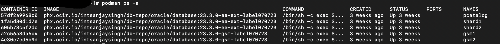
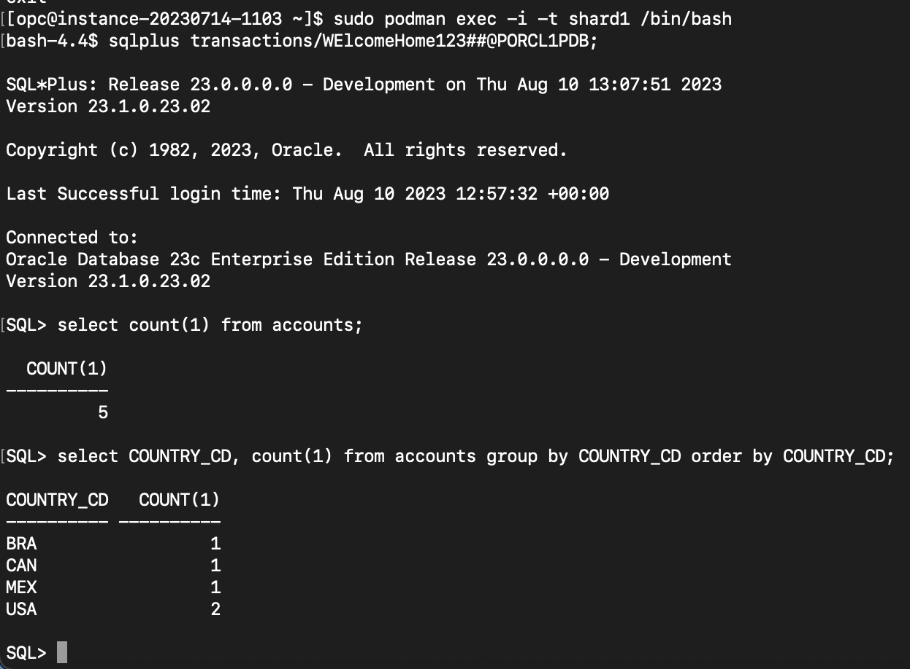
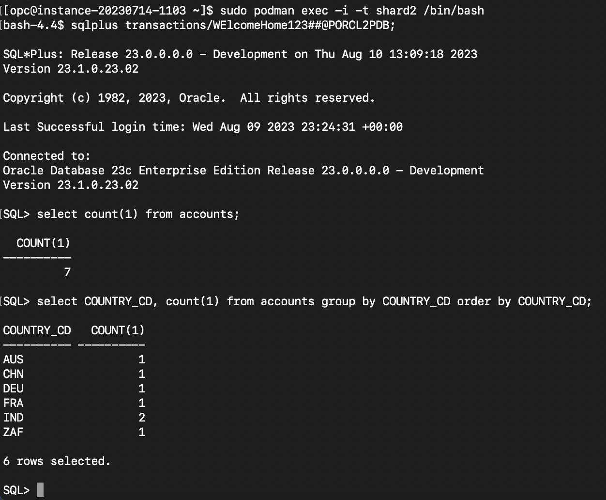
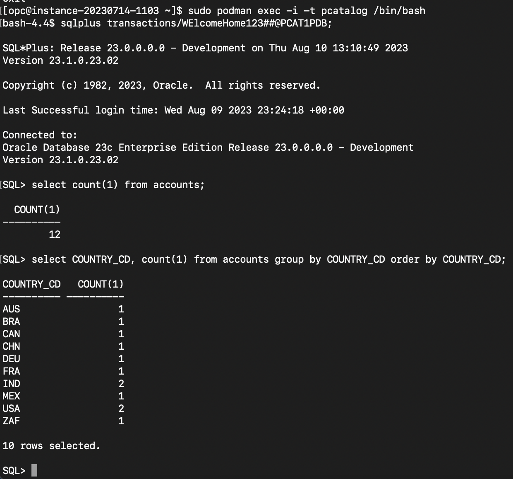
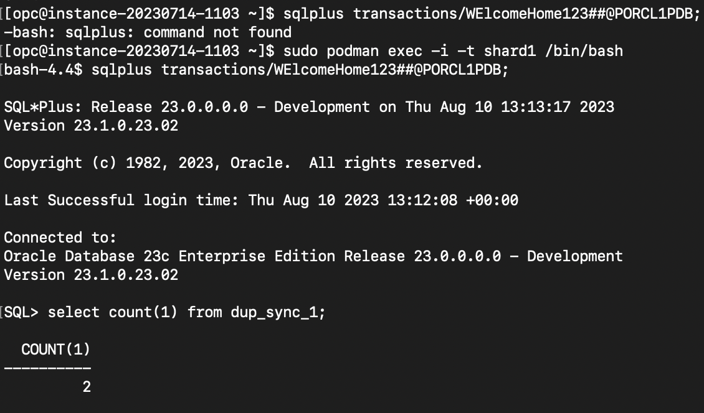
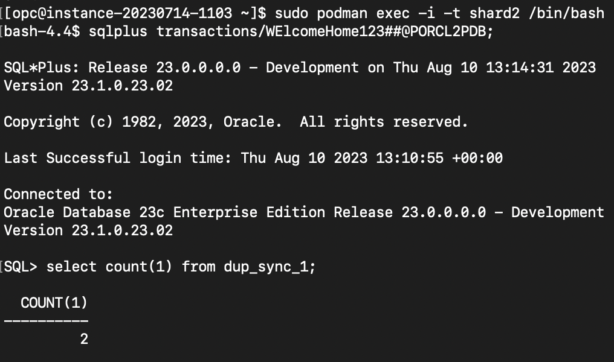
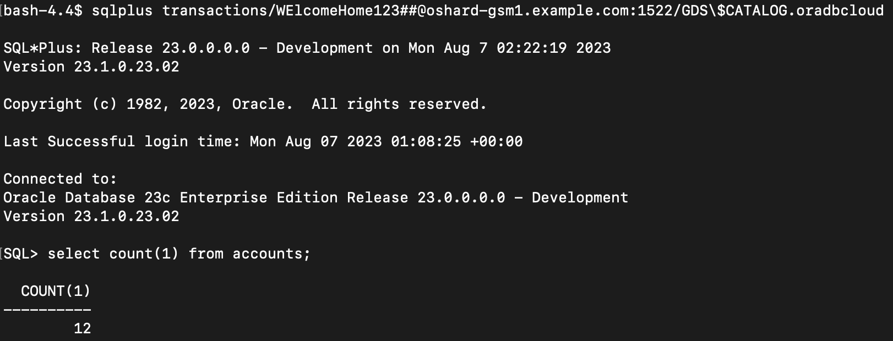
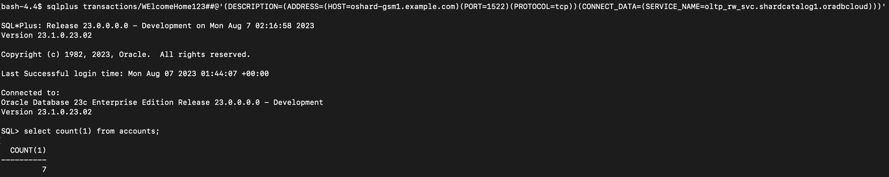
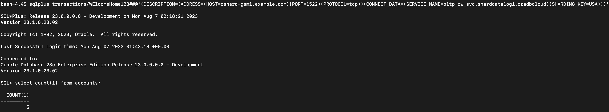
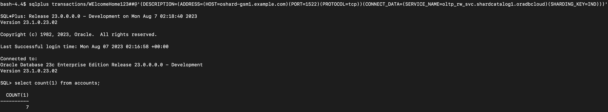

# Sample Queries to Validate for Sharded DBs

Once User defined sharded schema is ready, We can query the sharded tables from catalog and each shard to validate data.

*Estimated Time*:  30 minutes

### Objectives

In this lab, you will:

* Find how to validate a Sharded schema (already created) in User-Defined Sharding env, query Sharded tables, duplicated tables.
* Testing the use-cases

### Prerequisites

This lab assumes you have:

* An Oracle Cloud account
* You have completed:
  * Lab: Prepare Setup
  * Lab: Environment Setup
  * Lab: Initialize Environment

### Task 1: Check for containers in your VM

1. Open a terminal window and execute below as **opc** user.

    ```
    <copy>
    sudo podman ps -a
    </copy>
    ```

     


### Task 2: Connect Schema user to query sharded table(s)

2. User Defined sharded schema and tables are created and data are inserted for this lab. Connect Shard1 DB, Shard2 DB, Catalog DB and compare query results from sharded table accounts on each db.
    ```
    <copy>
    -- Run a query to count accounts for all countries in Shard1 DB, Shard2 DB, Catalog DB and compare results.

    select count(1) from accounts;

    --Run a query to count accounts group by country in Shard1 DB, Shard2 DB, Catalog DB and compare results.

    select COUNTRY_CD, count(1) from accounts group by COUNTRY_CD order by COUNTRY_CD;
    </copy>
    ```

3. Connect Shard1 and run queries on sharded table accounts. Total 5 accounts and 4 Countries are in Shard1.


    


4. Connect Shard2 and run queries on sharded table accounts. Total 7 accounts and 6 Countries are in Shard2.


    


5. Connect the Catalog and run cross shard queries on sharded table accounts. Total 12 accounts and 10 Countries are in the Catalog. Which matches to sums for accounts(7+5=12) and countries(4+6=10) from both shards. Its confirms that Oracle sharding with User-defined sharding allows to implement Data Sovereignty use cases.


    


### Task 3: Validate query for a Synchronous Duplicated table from catalog and each shard

6. Connect to each sharded DBs, run the same query for a Synchronous Duplicated table and results would be same from each sharded dbs. Synchronous Duplicated tables support two phase commit. ALL DDL and DML operations for Synchronous Duplicated table to be performed at the catalog DB
    ```
    <copy>
    select * from dup_sync_1;
    </copy>
    ```

7. Connect Shard1 and run a query on duplicated table to get row count.


    


8. Connect Shard2 and run a query on duplicated table to get row count.


    


9. Connect Catalog and run a query on duplicated table to get row count.


    


### Task 4: Connect Catalog DB using GSM local service : GDS$CATALOG

10. Connect the Catalog using gsm service for proxy routing and run a cross shard query
    ```
    <copy>
    sqlplus transactions/****************@oshard-gsm1.example.com:1522/GDS\$CATALOG.oradbcloud
    </copy>
    ```

    


### Task 5: connect and query using global services which were created by gdsctl add service command

11. This kind of connections to be used from Application to provide a sharding key for runtime DB connection.

    ```
    <copy>
    -- Connect oltp_rw_svc service used with direct-routing by applications: randomly connect to a shard
    sqlplus transactions/****************@'(DESCRIPTION=(ADDRESS=(HOST=oshard-gsm1.example.com)(PORT=1522)(PROTOCOL=tcp))(CONNECT_DATA=(SERVICE_NAME=oltp_rw_svc.shardcatalog1.oradbcloud)))'
    </copy>
    ```

    


### Task 6: Connect Shard1 using gsm service for direct routing and run a query

12. This kind of connections to be used from Application to provide a sharding key belongs to shard1 for DB connection to Shard1.

    ```
    <copy>
    connect oltp_rw_svc service used with direct-routing by applications: connects to shard1 using sharding_key=USA
    sqlplus transactions/****************@'(DESCRIPTION=(ADDRESS=(HOST=oshard-gsm1.example.com)(PORT=1522)(PROTOCOL=tcp))(CONNECT_DATA=(SERVICE_NAME=oltp_rw_svc.shardcatalog1.oradbcloud)(SHARDING_KEY=USA)))'
    </copy>
    ```



## Task 7: Connect Shard2 using gsm service for direct routing and run a query

13. This kind of connections to be used from Application to provide a sharding key belongs to shard2 for DB connection to Shard2.

    ```
    <copy>
    connect oltp_rw_svc service used with direct-routing by applications: connects to shard2 using sharding_key=IND
    sqlplus transactions/****************@'(DESCRIPTION=(ADDRESS=(HOST=oshard-gsm1.example.com)(PORT=1522)(PROTOCOL=tcp))(CONNECT_DATA=(SERVICE_NAME=oltp_rw_svc.shardcatalog1.oradbcloud)(SHARDING_KEY=IND)))'
    </copy>
    ```



## Acknowledgements

* **Authors** - Ajay Joshi, Oracle Database Sharding Product Management, Sharding Solutions Architect
* **Contributors** - Pankaj Chandiramani, Shefali Bhargava, Param Saini, Jyoti Verma
* **Last Updated By/Date** - Ajay Joshi, Oracle Database Sharding Product Management, Sharding Solutions Architect, August 2023
