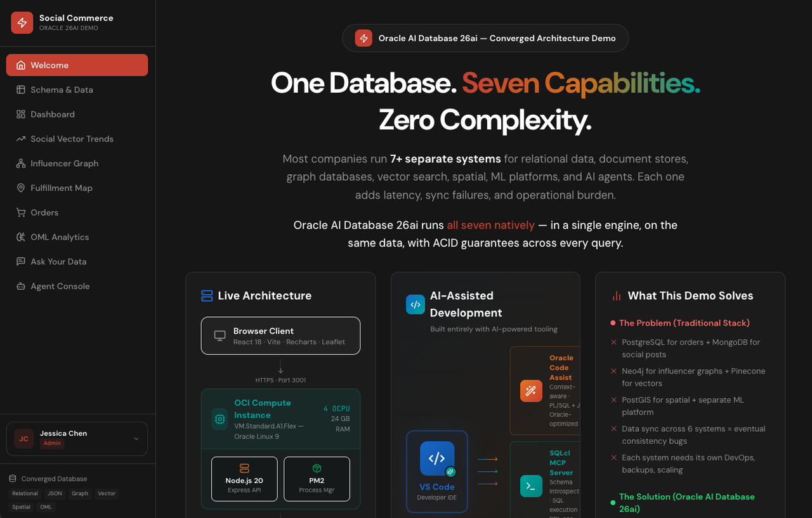

# Build a Social Commerce MVP with Oracle Database and FreeSQL

## Introduction

This workshop maps directly to the database workflow used in the Social Commerce Application (shown below) and uses FreeSQL SQL prompt capabilities to get you started with the basics quickly.

Estimated Workshop Time: 79 minutes

### Objectives

In this workshop, you will:
- Create and seed a social-commerce schema used by the application.
- Run KPI, graph-style, spatial, JSON, and agent-audit SQL patterns.
- Practice prompt-compatible SQL workflows that mirror real app operations.

## Walk Through the Application First

Before you start the labs, create a reservation for the application hosted on Oracle LiveStacks and follow the instructions in the Lab. Once you have done that, this lab will show you how the Oracle AI Database supports the application with a single, unified converged database reducing risk, complexity and cost:

[Social Commerce Application] (https://livelabs.oracle.com/ords/r/dbpm/livelabs/view-workshop?wid=4387&p180_gb_clicked=Y&session=5746148764389)

You can see these flows in action (based on the app source in `frontend/src/pages`):
- **Schema & Data**: interactive table model across relational, JSON, graph, vector, spatial, AI, and security tags.
- **Dashboard**: command-center KPIs for orders, revenue, trends, and operational status.
- **Social Vector Trends**: visible in the app, but omitted in this FreeSQL workshop because vector search support is limited.
- **Influencer Graph**: SQL/PGQ and network-style traversal patterns.
- **Fulfillment Map**: spatial routing, nearest-center logic, and delivery coverage.
- **Orders**: order lifecycle plus JSON duality-style projections.
- **Ask Your Data**: NL-to-SQL flow with generated SQL inspection.
- **Agent Console**: multi-agent actions, tool traces, and audit/event views.

Note that this lab uses FreeSQL so 2 of the items from the Social Commerce Application are ommited (Vector Search and OML). Here are the tab-to-lab mappings:

### Workshop Labs

1. Lab 1: Schema & Data
2. Lab 2: Dashboard
3. Lab 3: Influencer Graph
4. Lab 4: Fulfillment Map
5. Lab 5: Orders
6. Lab 6: Ask Your Data
7. Lab 7: Agent Console
8. Lab 8: Cleanup - remove artifacts in FreeSQL from running this lab.

> Note: Social Vector Trends and OML Analytics are intentionally omitted in this FreeSQL-only path.

## Acknowledgements

* **Author** - Pat Shepherd + Codex
* **Last Updated By/Date** - Codex, April 2026
