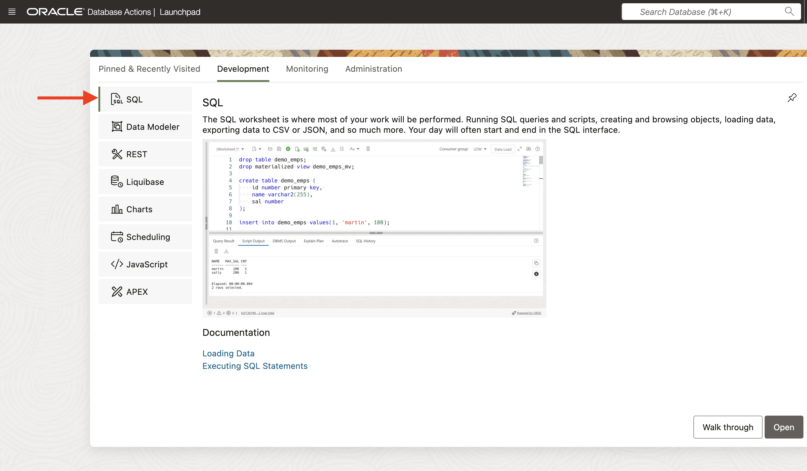
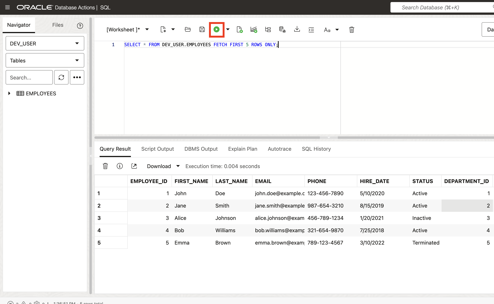
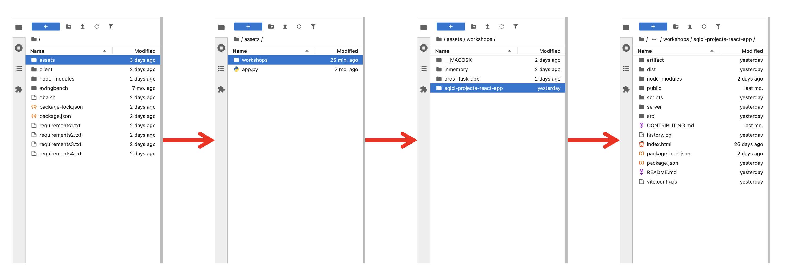
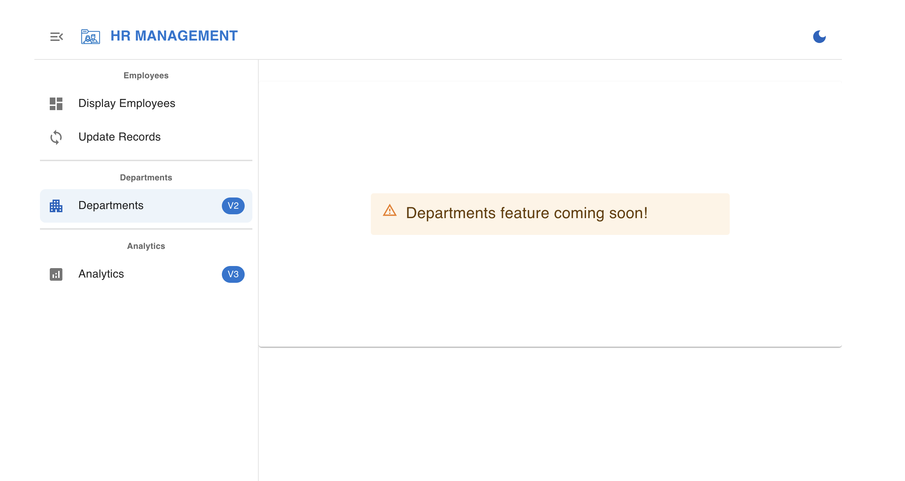

# Get Started

## Introduction

You have been provided with access to a Database Actions (*aka* SQL Developer Web), as well as a Jupyter Lab.

In this lab, you will configure, and then execute commands to start-up the HR Management application.

Some experience in shell commands, react, JavaScript, and HTML are helpful but not necessary. Although, we've designed this workshop so even the beginner can complete it!

Estimated Time: 10 minutes

### **Objectives**

In this lab, you will:

* Sign in to Database Actions as the `DEV_USER` user
* Create your ORDS APIs with the provided scripts
* Add your ORDS APIs to your project's files
* Start-up the HR Management react application

### **Prerequisites**

* Access to a LiveLabs-provided sandbox environment
* Access to Database Actions
* Beginner-level experience in javascript, HTML, and Integrated Developer Environments

This lab assumes you have:

* An Oracle account
* All previous labs successfully completed

## Task 1: Database Actions, Part I

1. You have been provided various URLs. One for accessing Database Actions, and another one for accessing a Jupyter lab. First, navigate to Database Actions using the provided URL. You can find these details by clicking **View Login Info** near the top of the Workshop outline.

    

    You’ve been provided with the necessary information for this workshop: 
    
     * **JupyterLab URL:** Click to access JupyterLab.
     * **Users with their password:** Use these to log in when needed.
     * **SQL Developer Web (Database Actions):** For database-related tasks.

    

2. Several users have been created for you, including a new `DEV_USER` user. Its schema has already been REST-enabled, meaning you will be able to Sign in to Database Actions.

    > **NOTE:** Depending on your lab configuration, you may be redirected to a SQL Developer Web Sign-in screen rather than the Oracle REST Data Services "landing page." In such cases, simply Sign in with the `DEV_USER` user's credentials.

    To Sign in, click the <button type="button" style="pointer-events: none;">Go</button> button under the SQL Developer Web card.

    

    Once the Sign-in screen appears, enter the following credentials, and click the <button type="button" style="pointer-events: none;">Sign-in</button> button:

   &nbsp;&nbsp;&nbsp;&nbsp;&nbsp;&nbsp;&nbsp;&nbsp;Username: `DEV_USER`
   &nbsp;&nbsp;&nbsp;&nbsp;&nbsp;&nbsp;&nbsp;&nbsp;Password: `[Can be found in your Reservation details - see image in Step 1 for reference]`

3. The Database Actions Launchpad will appear. Navigate to the `Development` category, then click `SQL`. A blank SQL Worksheet will appear.

   

      > **NOTE:** If this is your first time visiting the SQL Worksheet, a guided tour will appear. You may continue with the tour, or click the <button type="button" style="pointer-events: none;">X</button> (as seen in the image) to exit the tour.

4. You'll notice an `Employees` table has already been created for you. This table has also been pre-populated with DEV_USER data.

   To view a sample of the table's data<span class="fa fa-file-play" aria-hidden="true"></span> copy and paste the following SQL statement into the SQL Worksheet and click then `Run Statement` icon.

      ```sql
      <copy>
      SELECT * FROM EMPLOYEES FETCH FIRST 5 ROWS ONLY;
      </copy>
      ```

   You will see results similar to the following image:

   

5. You may notice the varied data types in this table. To take a closer look at how this `DEV_USER` table is structured, right-click on the `DEV_USER` table, then select `Edit...`. When the `Table Properties` slider appears, click `DDL`, then select the `Create` tab.  

   Note the data types:

   

      > **NOTE:** ORDS APIs will be able to handle all of these various data types and send them to your application.

6. Once you are satisfied, return to the Reservation information for this workshop.

   

## Task 2: Jupyter lab, Part I

1. Using the URL you were provided, log in to your Jupyter lab. *It is recommended you open the Juptyer Lab in a new tab or window.*

   

   Use the same password from the previous task.

   
  
2. Once logged in, you may see several directories. Navigate (i.e., a double or single click on the directory) to the `workshops` directory, then the `sqlcl-projects-react-app` directory.

   

<!--3. Next, navigate to the `scripts` directory, then open the `DEV_USERstream_resource_module_definitions.sql` file.  

    > **TIP:** You may open a file by clicking on the file name *or* right-clicking a file and choose to "Open with > Editor".  
    >
    > 

   This file contains the definitions for your Resource Module, Templates, and Handlers, which are your ORDS APIs.  

   
   *Navigate to `sqlcl-projects-react-app` then `scripts` then `DEV_USERstream_resource_module_definitions.sql`*

4. Select all contents and copy the contents to your clipboard. Then, return to the SQL Worksheet.

    > **TIP:** Refer to Task 1, Step 1 for keyboard shortcuts for copy and paste actions.

   -->

## Task 3: Database Actions, Part II

1. Navigate to the SQL Worksheet. Then paste (easily done with keyboard shortcuts) the contents of the `users.sql` file to the SQL Worksheet.
  
2. Click the `Run Script` icon. Upon completion, a `PL/SQL procedure successfully completed` message will appear in the `Script Output` tab.

3. You've just created the ORDS APIs for the `DEV_USER` user. To review the Resource Module, its Resource Templates and Resource Handlers, navigate to the REST Workshop.

    

   Click the hamburger menu from the top of Database Actions, then click REST.  

      

4. You'll notice a single AUTOREST in the Workshop's Object panel. Click it.

   

5. Next, copy this URI's to your clipboard. In a few moments, you will return to the Jupyter lab to input this into the application code.

   

## Task 4: Jupyter Lab, Part II

1. Navigate back to the Jupyter lab. Once again, locate the `sqlcl-projects-react-app` directory.

2. Replace the temporary URI with the one you captured in the previous lab. The ORDS URI ending in `/dev_user/employees` will go here.

3. Modify the `.env` file: In your application's root directory, update the hidden .env file, which stores essential configuration variables for runtime.

4. Add Environment Variables:
    - Edit the `.env` file with:
            ```
        <copy> 
            vi .env
        </copy>
        ``` 
    - Press Esc + I to enter insert mode.
    - Navigate to the placeholders and enter the variables.
    - Press Esc, then type :wq to save and exit.
    - Add the following variables, replacing placeholders with actual values:

        ```
        BASE_URL=your_oci_url
        DB_USERNAME=DEV_USER
        ```
        * `BASE_URL`: This variable stores the base URL for your ORDS REST service endpoint.
        * `DB_USERNAME`: This variable stores the username for your development database user. Ensure this username matches the one you configured in the previous lab.

   

      > **NOTE:** This should be in the form of: `http://Your Lab's IP:Your Lab's Port Number/ords/DEV_USER`. Make sure you double-quote the URI; as can be seen in the image below.

## Task 5: Start the React application

1. From the Jupyter Launcher, open a new Terminal.

   > **NOTE:** If a new Launcher window is not present, you can click the Blue Box (the box with the `+` inside) to open a new Launcher. Then you may 
   > open a new Terminal.

   

2. Verify you are in the correct directory by:

    

3. Next, issue the following command:

      ```sh
      <copy>npm run dev</copy>
      ```

    
    *The React development server will start up.*

4. Your application will be available on port `5000`. However, you will need to open the application in a new tab. Modify the URL, so you are using the one provided to you for this lab *plus* port `5000`.  

     

   
   *Open in a new tab or window.*

5. Navigate to the new tab and combine the lab's URI with port `5000`. Accept any warnings and your application will load.

   

6. The HR application will load. Scroll right left or up down to see all the infos.

   

   

   

   

<!--Oh, the departments page is missing! That's what will be the subject of the next lab. Let's jump to the next lab to implement this new feature. You may now [proceed to the next lab](#next).-->

<!--Oh no, the departments page is missing! But don’t worry—that’s exactly what we’ll tackle next. Get ready to dive into the [next lab](#next) and bring this feature to life!-->

<!--Wait… where’s the departments page? Looks like we’ve got some work to do! Jump into the [next lab](#next) and let’s unlock this new feature together!-->

Uh-oh! The departments page is missing! But here’s your chance to build it. Let’s dive into the [next lab](#next) and bring this feature to life!

## Learn More

* [ORDS RESTful services terminology](https://docs.oracle.com/en/database/oracle/oracle-rest-data-services/24.2/orddg/developing-REST-applications.html#GUID-50E24524-32BB-470D-8015-6C25C9B47A44)
* [Flask installation and configuration](https://flask.palletsprojects.com/en/3.0.x/installation/)
* [Visual Studio Code Flask tutorial](https://code.visualstudio.com/docs/python/tutorial-flask)

## Acknowledgements

* **Author** - Fatima AOURGA & Abdelilah AIT HAMMOU, Junior Members of The Technical Staff, SQLcl
* **Created By/Date** - Fatima AOURGA, Junior Member of Technical Staff, SQLcl, February 2025