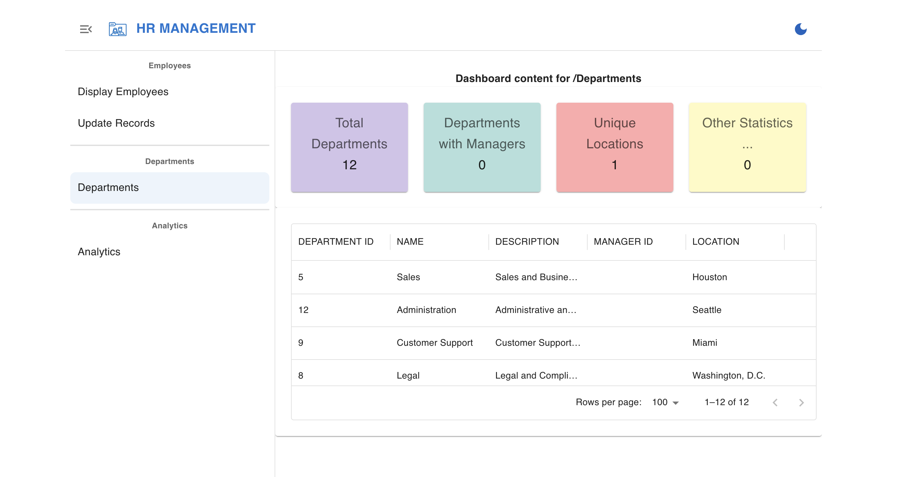

# Getting Started With The Application

## Introduction

Welcome aboard! You're about to embark on an exciting project: developing the "Departments" feature for the growing HR application at MoroccanTech Solutions in Casablanca.

### **The Challenge**

MoroccanTech Solutions is a thriving company experiencing rapid growth. Their current HR systems, while sufficient in the past, are now struggling to keep up with the increasing number of employees and departments. To address this, they need a Department Management system to improve efficiency and organization.

### **Your Mission**

Before we dive into the code, let's explore the existing HR application. In this lab, you'll:

* **Understand the Current System:** Understand existing functionalities and where the "Departments" feature fits.
* **Learn SQLcl and CI/CD:** Use SQLcl's project feature for the development and deployment process.

### **Focus on the Process**

Remember, the primary goal of this lab is to learn the principles of database development and deployment using SQLcl and CI/CD practices. The specific technology used in the application itself is not the main focus.


**Estimated Workshop Time:** 14 minutes


### **Objectives**

By the end of this lab, you will be able to:

* Add the new feature to the application with database and code changes.
* Use SQLcl to manage and deploy database changes.
* Practice and apply SQLcl project commands through hands-on exploration.
* Experience and understand the benefits of database CICD


### **Prerequisites**

* Completion of Lab 1 and Lab 2
* Basic understanding of Git

## Task 1: Understanding Environments and Database CICD Challenges

### **Environments Overview**

In this lab, we will focus on two environments:

* **Development (Dev):**
    * Where you create and fix database changes.
* **Production (Prod):**
    * Where you deploy stable and reliable database updates.
    * *Our goal in the current and next labs is to successfully deploy the “Departments” and “Analytics” features to the Prod environment.*

>**Note:** There are often other environments involved in the development lifecycle (Test, pre-prod, ...) but this workshop just those two ones above that we need.


### **Challenges of Traditional Database Deployments**
In traditional database deployments, especially in a manual process, several challenges arise:

* **Manual Interventions:** Prone to errors and time-consuming.
* **No Automation:** Slows down deployments and adds inconsistencies.
* **High Error Risks:** Bugs and data issues can disrupt production.

**Our Goal:**


Use SQLcl Projects CICD to:

* Deploy with minimal risk.
* Automate and ensure consistent deployments.
* Speed up feature delivery.
* Gain practical experience for real-world database projects.

## Task 2: Exploring the Initial Application
### **Getting Started With The Application**

Youssef, the HR director of MoroccanTech Solutions, has a vision: to streamline employee management by implementing a  "Departments" feature. Before diving into development, you'll need to thoroughly understand the existing HR application. 

**Your Mission:**

* **Run the application locally.** 
* **Identify existing features.** 
* **Pinpoint missing functionality.** 
 
By carefully analyzing the application, you'll gain valuable insights that will inform the development of the "Departments" feature, ensuring a smooth and seamless integration with the existing HR system.
 
**Let's begin!** 
 
* **Access the Application:** 
    * **Log in to the virtual machine.** 
    * **Navigate to the application directory:** Use the command line to navigate to the directory where the application code is located (e.g., `cd /path/to/hr-application`).
 
* **Run the Application:**
 
    * **Set Up Database Connection:**
        * **Create a `.env` file:** In the root directory of your application, create a file named `.env`. This file is used to store sensitive configuration variables that the application can access during runtime. It's important to **not** commit this file to version control, as it may contain sensitive credentials.
        * **Obtain OCI URL:** Refer to the **"Setting Up the ORDS REST Service"** section of the previous lab to retrieve the Object Cloud Infrastructure (OCI) URL for your database instance. 
        * **Add Environment Variables:** Edit the `.env` file and add the following variables, replacing the placeholders with your actual values:
            ```
            BASE_URL=your_oci_url (e.g.,(https://123-databasename.adb.eu-amsterdam.oraclecloudapps.com/ords/)
            DB_USERNAME=DEVUSER
            ```
            * `BASE_URL`: This variable stores the base URL for your ORDS REST service endpoint.
            * `DB_USERNAME`: This variable stores the username for your development database user. Ensure this username matches the one you configured in the previous lab.
 
    * **Install Dependencies:**
        * With the `.env` file properly configured, execute the following command to install the necessary project dependencies:
            ```
        <copy> 
            npm install
        </copy>
            ```
 
    * **Start the Development Server:**
        * Now that the database connection is set up, run the following command to launch the application in development mode:
                ```
        <copy> 
            npm run dev
        </copy>
            ```
        * This will typically start a local development server and open the application in your web browser.
        * **You are now interacting with the V1 of the HR application.**
* **Explore the Application:**
    
    * **Interact with the application:** Navigate through the different pages and sections of the application.
    * **Look for employee-related features:** Examine features related to employee profiles, employee lists, and any existing team assignments.
    * **Identify missing "Departments" functionality:**
    
Are there any options to create, view, or manage departments?
    

**Troubleshooting:**

* **Incorrect OCI URL:** Double-check that you've copied and pasted the OCI URL from the previous lab accurately. Ensure it includes the correct hostname, port, and path to your ORDS endpoint.
* **Database Configuration Mismatch:** Verify that the `DB_USERNAME` variable in your `.env` file matches the username you configured for your development database in the previous lab.

## Task 3: Implementing the Departments Feature with SQLcl and PROJECT CICD

### 3.1 Getting Started

* **Starting Point:** Our first task is to implement the "Departments" feature. This involves adding a new "Departments" table to the database and updating the application code to interact with this new table.

* **Project Initialization:**
    * Begin by initializing a new SQLcl project:
      ```
      <copy>
      project init -name HrManager -schema DEVUSER -verbose
      </copy>
      ```
     The `project init` command initializes a new SQLcl PROJECTS project, setting up the necessary directories and files for managing your database objects and changes within your current directory.

    <details>  <summary> **Screenshots:**</summary>
    
    </details>

    * Initialize git
        ```
        <copy>
        git init --initial-branch main
        </copy>
        ```

    * Create a new git branch and switch to it for this feature:
        ```
        <copy>
        git checkout -b TICKET-1-Departments
        </copy>
        ```
     This creates a new branch named "TICKET-1-Departments" where you will develop and test the "Departments" feature.
    

* **Project Structure:**
    * SQLcl Projects use a specific folder structure to manage database objects and changes. 
    * Key folders include:
        * **`.dbtools`:** This folder contains project configuration files, filters, and formatting rules.
        * **`src`:** This folder stores exported objects from the database, organized by schema and object type.
        * **`dist`:** This folder is used to store release artifacts generated by the `project stage` and `project release` commands.


    ```text
──.dbtools
│   ├── filters
│   │   └── project.filters
│   ├── project.config.json
│   └── project.sqlformat.xml
├── dist
│   ├── README.md
│   └── install.sql
└── src
    ├── README.md
    └── database
        ├── README.md
        └── hr
    ```


### 3.2 Database Changes

**Work on the New Feature: Activate the "Departments" Feature:**

- **Locate the Placeholder Component:** 
    * **Challenge:** 
        * Examine the application code to locate the placeholder component for the "Departments" section. This might be a simple message, a loading indicator, or a basic UI element. 
    * **Hint:** 
        * Look for comments in the code related to the "Departments" feature (e.g., "TODO: Implement Departments", "Departments feature not yet implemented").
        * Search for component names or file names that might relate to the "Departments" functionality (e.g HRPageContent...).
        * Inspect the application's UI for any areas where the "Departments" feature is expected to be displayed.
        
    <details><summary>**Solution:**</summary>
    * Find the placeholder component within the application's code, and replace it with Department implementation.
    * **Go to : `/Livelab-APP/src/components/pages/HRPageContentSwitcher.tsx`**
    * **Go to line 66**
    * **Implement Department by adding `<DepartmentPage />` and delete the placeholder component**

    </details>

- **Create the "Departments" Table:**

    * **Option 1: Using HR application:**
        * Go to the update Records page , and do your inserts: 
            

    * **Option 2: Using SQLcl:**
        * Open SQLcl with your connection.
        * Write and execute the following SQL statement to create the "Departments" table:
            ```sql
           -- Create Departments table:
            CREATE TABLE Abdelilah.Departments (
                department_id INT PRIMARY KEY,
                name VARCHAR2(50),
                description VARCHAR2(255),
                location VARCHAR2(100)
            );
            ```
        * **Insert Initial Data:**
         ```sql
           -- Create Departments table:
           INSERT INTO DevUSER.Departments (department_id, name, description, location)
            VALUES (1, 'HR', 'Human Resources Department', 'New York');

            INSERT INTO DevUSER.Departments (department_id, name, description, location)
            VALUES (2, 'IT', 'Information Technology Department', 'San Francisco');

            INSERT INTO DevUSER.Departments (department_id, name, description, location)
            VALUES (3, 'Finance', 'Finance and Accounting Department', 'Chicago');

            ```
    * **Option 3: Using OCI :**
        * In your OCI home page, go to **Oracle Database** -> **Autonomous Database**.
        * Click on your available Autonomous Database.
        * In the **Database Actions** section, click on **SQL**.
         
        * This will open the SQL Database Actions page where you can directly execute your SQL query.
         
        * Write and execute the same SQL statements in the option 1.

### 3.3 Exporting Database Changes with SQLcl

* **Export Database Objects:**
    * Execute the following command to export the newly created "Departments" table to the application folder:
        ```
    <copy>
     project export -schemas DEVUSER -verbose
    </copy>
        ```


* This command **exports database objects** into your repository. 
* More explination : ? 
* **Now that we have made the database changes, we export our objects to have them included in our project folders.**
  
 * **Test the Application:** 
    * **In the Development Environment:** 
        * Restart the application to ensure that the database changes and code modifications are reflected in the application's behavior.
        * Thoroughly test the application to verify that the "Departments" feature is working as expected. 
        * Check if you can view, add, or modify department information within the application.

### 3.5 Staging and Releasing Changes

* **Stage Changes:**
    * Execute the following command to stage the changes for release:
        * Add and commit changes before stage
        ```
    <copy>
    git add -A
    git commit -m "Added Departments feature"
    </copy>
        ```
        ```
    <copy> 
        project stage -verbose
    </copy> 
        ```
* This command prepares the staged changes for release by creating a release artifact in the `dist` folder.
    

* **Merge to main branch:**
        ```
    <copy>
    git checkout main
    git merge TICKET-1-Departments
    </copy>
        ```
    
* **Resolve any merge conflicts:** (If necessary)


* **Release Changes:**
    * Once your changes are merged into the main branch, execute the following command to create a release:
        <copy>project release -version 2.0 </copy> 
        
    * This command creates a release folder with the specified version.
        

* **Generate the deployable Artifact:**
    * The `project gen-artifact` command can be used to generate an artifact for your database changes. This artifact can then be easily deployed to different environments.
        


In the next section, we will learn how to deploy these changes to the production environment using SQLcl and explore advanced CICD concepts.


## Task 4: Deploying to Production

### 4.1 Preparing for Production

* **Update Environment Variables:**
    * Modify the `.env` file to use the production database credentials:
        ```
        BASE_URL=your_oci_url_prod
        DB_USERNAME=PRODUSER 
        ```
    * Replace `your_oci_url_prod` with the actual OCI URL for your production database.

### 4.2 Deploying to Production

* **Connect to the Production Database:**
    * Establish a connection to the production database using SQLcl.
    * Use the `connect` command with the `PRODUSER` credentials.

* **Deploy Changes to Production:**
    * **Check the `project.config.json` file:**
        * Locate the `emitSchema` property within the `project.config.json` file in '.dbtools' folder.
        * Verify that the `emitSchema` property is set to `false`. 
        * If it's set to `true`, modify the `project.config.json` file to set `emitSchema` to `false`.

    * Execute the following command to deploy the changes to the production database:
        ```
    <copy>
    project deploy -file artifact/HrManager-2.O.zip  -verbose
    </copy>
    ```
    
    * This command applies the changes defined in the release artifact to the production database without recreating existing schema objects.

### 4.3 Testing in Production

* **Run the Production Application:**
    * Restart the application using the production environment variables.
    * Verify that the "Departments" feature is functioning correctly in the production environment. 
    * Perform thorough testing to ensure that all aspects of the feature are working as expected.

* **The department section, should locks like this:**

    

**Congratulations!** You have successfully implemented and deployed the "Departments" feature using SQLcl and CICD practices. You have gained valuable experience in managing database changes, automating deployments, and working with a CICD pipeline.

## Learn More

Click [here](https://docs.oracle.com/en/database/oracle/sql-developer-command-line/24.3/sqcug/introduction.html?utm_source=pocket_shared) for documentation on using SQLcl Projects.

## Acknowledgements

- **Author** - Fatima AOURGA & hruser AIT HAMMOU, Junior Member of Technical Staff, SQLcl
- **Created By/Date** - Fatima AOURGA, Junior Member of Technical Staff, SQLcl, December 2024
