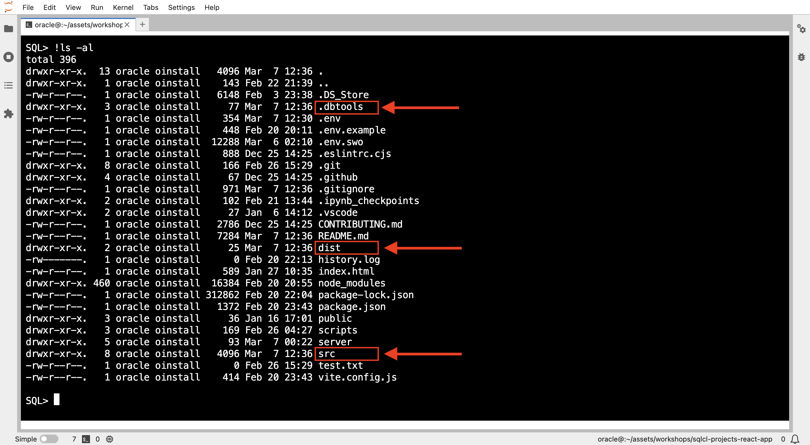
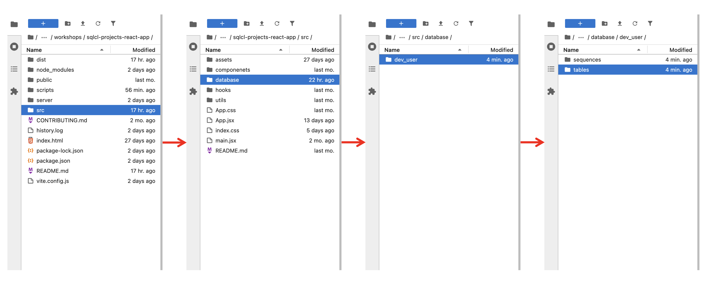
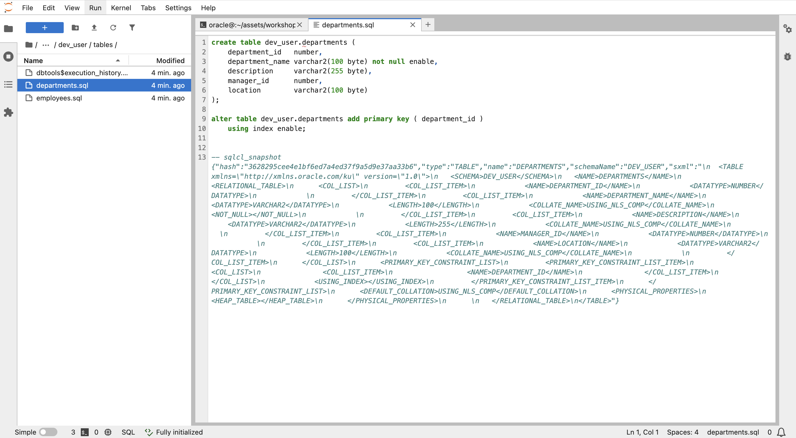
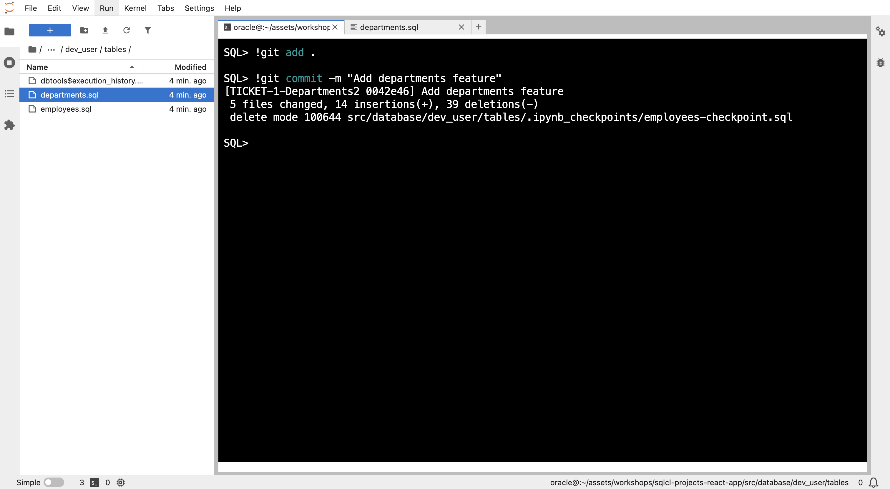
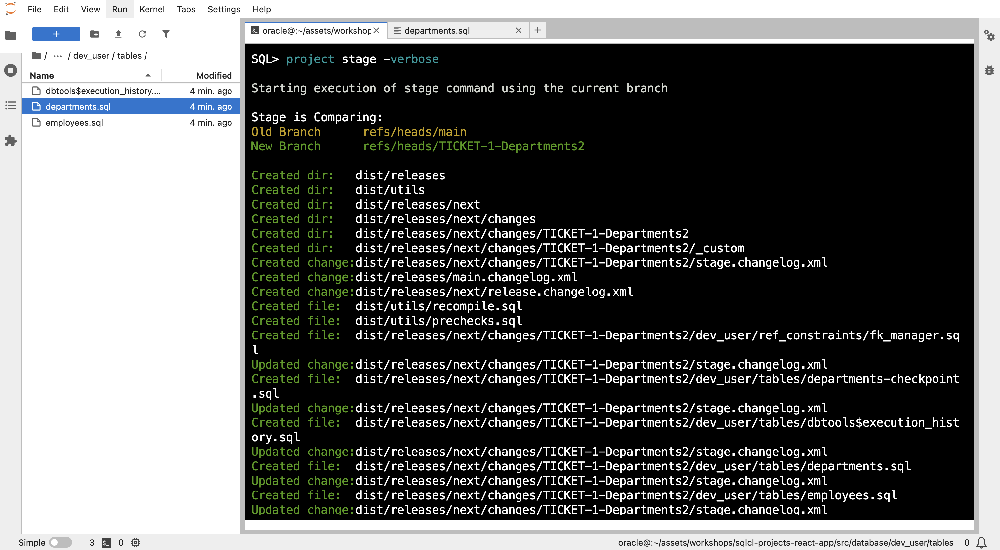
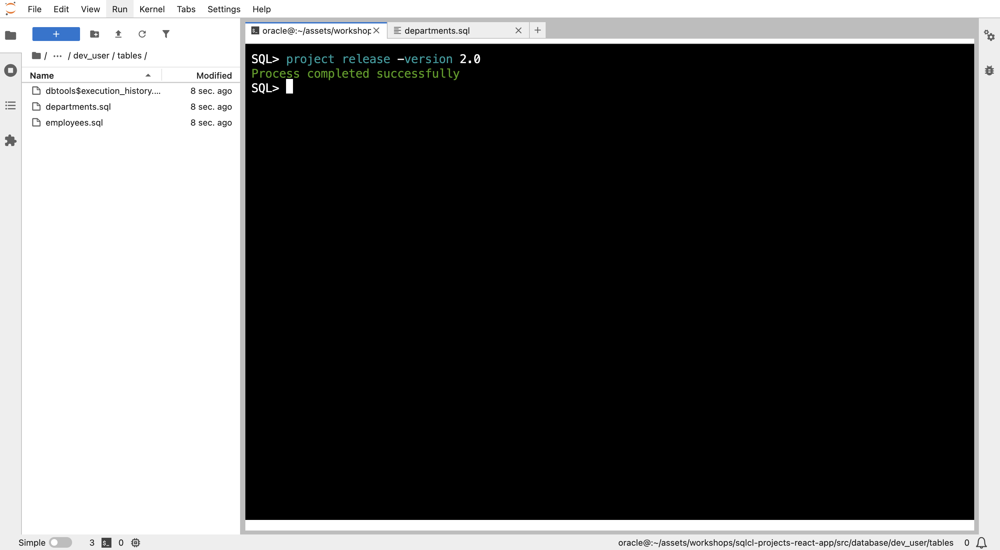
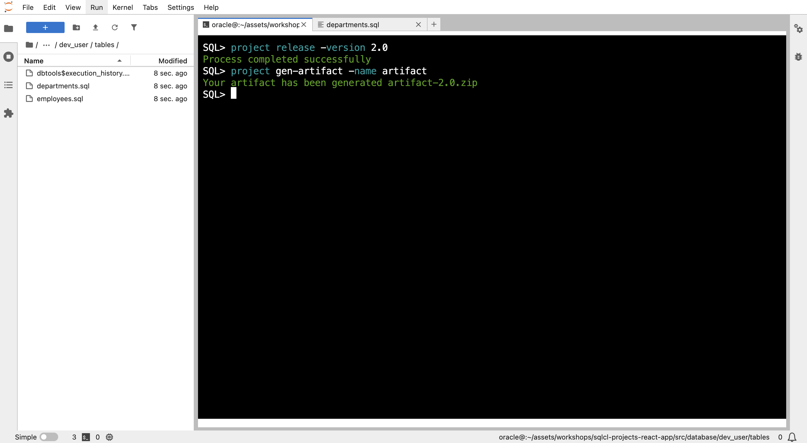
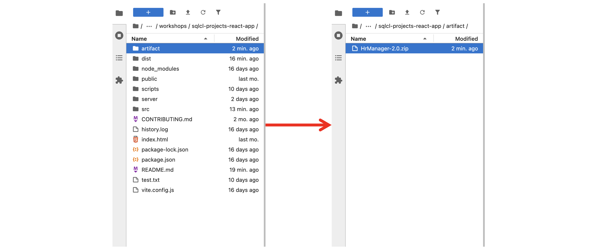
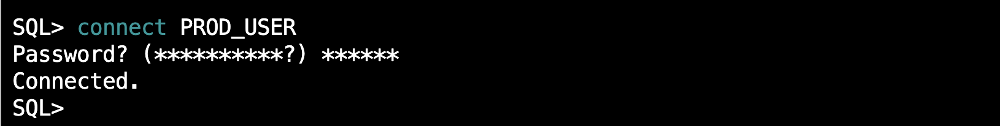

# CI/CD for Database Deployments

## Introduction

Welcome aboard! You're about to embark on an exciting project: developing the "Departments" feature for the growing HR application at MoroccanTech Solutions in Casablanca.
The SQLcl Projects contain many commands: we will explore them all in this lab

### **The Challenge**

MoroccanTech Solutions is a thriving company experiencing rapid growth. Their current HR systems, while sufficient in the past, are now struggling to keep up with the increasing number of employees and departments. To address this, they need a Department Management system to improve efficiency and organization.

### **Your Mission**

Before we dive into the code, let's explore the existing HR application. In this lab, you'll:

* **Understand the Current System:** Understand existing functionalities and where the "Departments" feature fits.
* **Learn SQLcl and CI/CD:** Use SQLcl's project feature for the development and deployment process.

### **Focus on the Process**

Remember, the primary goal of this lab is to learn the principles of database development and deployment using SQLcl and CI/CD practices. The specific technology used in the application itself is not the main focus.

**Estimated Workshop Time:** 14 minutes

### **Objectives**

By the end of this lab, you will be able to:

* Add the new feature to the application with database and code changes.
* Use SQLcl to manage and deploy database changes.
* Practice and apply SQLcl project commands through hands-on exploration.
* Experience and understand the benefits of database CICD

### **Prerequisites**

* Completion of Lab 1 and Lab 2
* Basic understanding of Git

## Task 1: Initialize Project (project init)

* **Connecting to DEV_USER via SQLcl:**
    1. Launch SQLcl in the jupyter terminal
            ```
      <copy>
        sql SYS/[PASSWORD]@[IP_ADD:PORT]/FREEPDB1 as sysdba
      </copy>
      ```
      

    2. Connect to the DEV_USER schema using connect command
            ```
      <copy>
        connect DEV_USER/[PASSWORD]
      </copy>
      ```
      

>**Note:** You can clear your screen anytime you want by using:
        ```
    <copy>
        cle scr
    </copy>
    ```

* **Project Initialization:**

    * Make sure you are it the application folder before running SQLcl Projects commands

        

    * Initializing project
    ```
      <copy>
        project init -name HrManager -schemas DEV_USER -verbose
      </copy>
      ```
      

      The `project init` command initializes a new SQLcl PROJECTS project, setting up the necessary directories and files for managing your database objects and changes within your current directory.

    * **Project Structure:**
        * SQLcl Projects use a specific folder structure to manage database objects and changes. 
        * Key folders include:
            * **`.dbtools`:** This folder contains project configuration files, filters, and formatting rules.
            * **`src`:** This folder stores exported objects from the database, organized by schema and object type.
            * **`dist`:** This folder is used to store release artifacts generated by the `project stage` and `project release` commands.


            ```text
            ──.dbtools
            │   ├── filters
            │   │   └── project.filters
            │   ├── project.config.json
            │   └── project.sqlformat.xml
            ├── dist
            │   ├── README.md
            │   └── install.sql
            └── src
                ├── README.md
                └── database
                    ├── README.md
                    └── hr
            ```
        * List all, to see the generated project folders
        
        

    <!--<details>  <summary> **Screenshots:**</summary>
    
    </details>-->

    * Initialize git
            ```
        <copy>
        !git init --initial-branch main
        </copy>
        ```

    * Create a new git branch and switch to it for this feature:
            ```
        <copy>
        !git checkout -b TICKET-1-Departments
        </copy>
        ```
     This creates a new branch named "TICKET-1-Departments" where you will develop and test the "Departments" feature.

## Task 2: Export Database Changes (project export)

* **Export Database Objects:**

    * Execute the following command to export the newly created "Departments" table to the application folder:
        ```
    <copy>
     project export -schemas DEV_USER -verbose
    </copy>
        ```

    

* This command **exports database objects** into your repository.

* Locate the exported object files in the database folder

    

* Double click on the 'departments.sql' to see its content

    

* **Now we have made the database changes, we export our objects to have them included in our project folders.**

## Task 3: Stage Changes (project stage)

* **Stage Changes:**

    * Add and commit changes before stage
        ```
    <copy>
        !git add .
    </copy>
        ```
    ```
    <copy>
        !git commit -m "Add departments feature"
    </copy>
        ```
    

    * Execute the following command to stage the changes for release
        ```
    <copy>
        project stage -verbose
    </copy>
        ```
    

This command prepares the staged changes for release by creating a release artifact in the `dist` folder.

* **Merge to main branch:**
        ```
    <copy>
        !git checkout main
    </copy>
        ```
    ```
    <copy>
        !git merge TICKET-1-Departments2
    </copy>
        ```
    

* **Resolve any merge conflicts:** (If necessary)

## Task 4: Release Changes (project release)

* Once your changes are merged into the main branch, execute the following command to create a release:
        ```
    <copy>
        project release -version 2.0
    </copy>
        ```
    

* This command creates a release folder with the specified version.

## Task 5: Generate Deployable Artifact (project gen-artifact)

* The `project gen-artifact` command can be used to generate an artifact for your database changes. This artifact can then be easily deployed to different environments.
     ```
    <copy>
        project gen-artifact -name artifact
    </copy>
        ```
    

* If you return to the application folder, you will fid an new folder **artifact** created, and it contains our generated zip artifact.

    

In the next section, we will learn how to deploy these changes to the production environment using SQLcl and explore advanced CICD concepts.

## Task 6: Deploying to Production (project deploy)

* **Connect to the Production Database:**
    * Establish a connection to the production database using SQLcl.
    * Use the `connect` command with the `PROD_USER` credentials.
    ```
    <copy>
        connect PROD_USER/[PASSWORD]
    </copy>
        ```
    

* **Deploy Changes to Production:**
    * **Check the `project.config.json` file:**
        * Locate the `emitSchema` property within the `project.config.json` file in '.dbtools' folder.
        * Verify that the `emitSchema` property is set to `false`.
        * If it's set to `true`, modify the `project.config.json` file to set `emitSchema` to `false`.

    * Execute the following command to deploy the changes to the production database:
        ```
    <copy>
        project deploy -file artifact/artifact-2.O.zip  -verbose
    </copy>
    ```
    
    * This command applies the changes defined in the release artifact to the production database without recreating existing schema objects.

* **Run the Production Application:**
    * Restart the application using the production environment variables.
    * Verify that the "Departments" feature is functioning correctly in the production environment.
    * Perform thorough testing to ensure that all aspects of the feature are working as expected.

* **The department section, should locks like this:**

    

**Congratulations!** You have successfully implemented and deployed the "Departments" feature and release the version 2 of the application using SQLcl and CICD practices. You have gained valuable experience in managing database changes, automating deployments, and working with a CICD pipeline.

## Learn More

Click [here](https://docs.oracle.com/en/database/oracle/sql-developer-command-line/24.3/sqcug/introduction.html?utm_source=pocket_shared) for documentation on using SQLcl Projects.

## Acknowledgements

- **Author** - Fatima AOURGA & hruser AIT HAMMOU, Junior Member of Technical Staff, SQLcl
- **Created By/Date** - Fatima AOURGA, Junior Member of Technical Staff, SQLcl, December 2024
