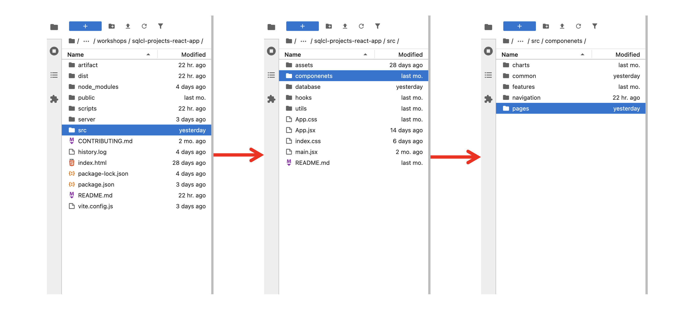
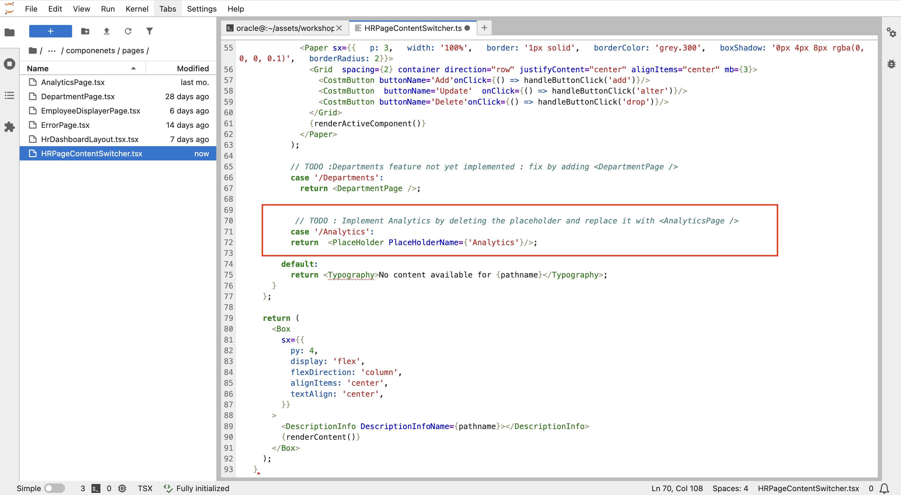
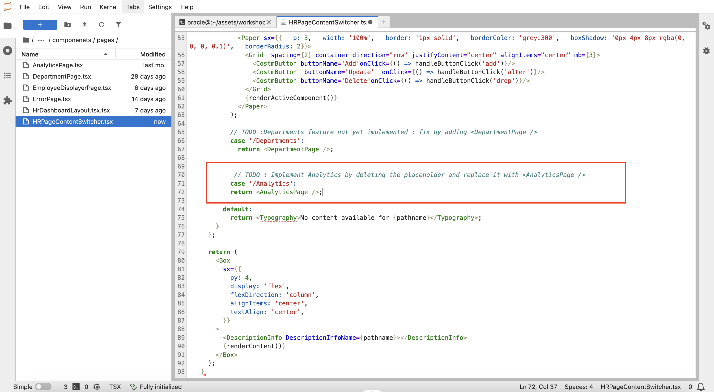

# Unveiling the Analytics Engine (Release 3.0)

## Introduction

You’ve just completed the "Departments" feature and deployed it successfully. But wait—it's time for an even bigger challenge: Unveiling the Analytics Engine!

In this bonus lab, you will release version 3 (V3) of the HR application, packed with the game-changing Analytics feature. This new feature will offer insights not only into employee and department data but also provide valuable analytics on attendance and performancereviews, giving you a complete picture of employee engagement and productivity.

**The Challenge** Unlock this page


While the Analytics feature was part of the original vision for the HR application, it wasn’t included in the initial release. Now, MoroccanTech Solutions is ready to take things to the next level by enabling this feature. Your mission is to uncover and activate the hidden Analytics functionality!


### **Objectives**

* Enable the Analytics feature
* Release the version 3 of the database for the application

### **Prerequisites**

* Complete successfully the previous labs

**Estimated Lab Time:** 14 minutes

Bring on the challenge! Let’s crush it!

## Challenge 1: Implement Analytics Page

Before making changes, we need to switch back to the development environment. To do this, update the **.env** file by changing PROD_USER to DEV_USER, ensuring the application connects to the development database.

Now, let's modify the application code to enable the Analytics page.

> **Challenge:** Identify and update the necessary code to bring the Analytics page to life.

<details><summary>**Hint**</summary>
    Remember where we made the change for the Departments page? Go to the same place—you’ll find the required change just below it, similar to what you did for Departments.
</details>

<details><summary>**Solution**</summary>

1. From the app folder, navigate to the pages

    

2. Double click on the pages folder then the 'HRPageContentSwitcher.tsx' file

3. Go to the line 72 where you will do the change

    

4. Remove the PlaceHolder after return and replace it with '< AnalyticsPage />'

    

5. Refresh the application and go to the Analytics section. It should appear now

    

>**Note:** If you lost your application window, run it again as you did the first time.

As you can see, only the Employees per Department analytics is working—the others are not. This is because the performancereviews and attendance tables are missing and haven’t been created yet.

</details>

## Challenge 2: Apply Database Changes

Your task is to update the database by adding the performancereviews and attendance tables to DEV_USER.

<!-- In this challenge, you will apply new database changes by adding the performancereviews and attendance tables to DEV_USER. -->

> **Challenge:** Create the necessary database tables (`attendance` and `performancereviews`) to support the "Analytics" feature.

<details><summary>**Hint**</summary>

Run the SQL scripts (attendance\_table.sql and performancereviews\_table.sql) in the scripts folder, just as you did previously for the employees and departments tables.

</details>

<details><summary>**Solution**</summary>

* **Step 1: Connect to DEV_USER**
    * **Using SQLcl:**
            ```sql
                connect DEV_USER/[PASSWORD]
                ```
    * **Using SQL Developer Web:**
    Signin with DEV_USER credentials

* **Step 2: Create Tables**

    * **Using SQLcl:**

        * Make sure you are in the scripts directory.

        * Execute the attendance\_table.sql and performancereviews\_table.sql

            ```sql
            <copy>
                @attendance_table.sql
            </copy>
            ```

            ```sql
            <copy>
                @performancereviews_table.sql
            </copy>
            ```

    * **Using SQL Developer Web:**

        Copy and past the content of the tabes scripts to SQL Developer Web sql worksheet and run the script.

* **Step 3: Refresh the application**

    Refresh the application window to view the Analytics page with the data.

    

</details>

## Challenge 3: Deploy The Database Changes To The Target Database

Our target database in this case is the PROD_USER schema (production database), though it could be any other database.

To deploy changes, we will follow the SQLcl Projects workflow, just like in the previous lab.

The project is already initialized, we will now directly export the desired objects using `project export`.

> **Challenge:** Deploy to production (PROD_USER)

<details><summary>**Hint**</summary>
Follow the same steps as in the previous lab (starting from `project export`), applying SQLcl Projects commands until you deploy and get the Analytics feature working.

</details>

<details><summary>**Solution**</summary>

1. Change the username in the .env file from DEV\_USER to PROD\_USER.
2. Refresh the application window. The Analytics page will not work as PROD_USER doesn’t contain the two new tables yet. Which you will ensure using SQLcl Projects.
3. In SQLcl, connect as DEV_USER and navigate to the application folder `sqlcl-project-react-app`.
        ```sql
    <copy>
        connect DEV_USER/[PASSWORD]
    </copy>
        ```
        ```sql
    <copy>
        cd /home/oracle/assets/workshops/sqlcl-projects-react-app
    </copy>
        ```
4. Create a new branch from the main branch and check out to it for upcoming changes.
        ```sql
        <copy>
            !git checkout -b Ticket-2-Analytics
        </copy>
        ```
5. Export the new objects from DEV_USER.
    ```sql
    <copy>
        project export -objects attendance,performancereviews -verbose
    </copy>
        ```
    <!---->
6. Add, commit then stage

    * Add and commit your changes

        ```sql
        <copy>
            !git add --all
        </copy>
        ```

        ```sql
        <copy>
            !git commit -m "Add attendance and performancereviews tables"
        </copy>
        ```

        ```sql
        <copy>
            project stage -verbose
        </copy>
        ```
        <!--
        -->

7. Add custom scripts

    ```sql
    <copy>
        project stage add-custom -file att_data.sql -verbose
    </copy>
    ```

    ```sql
    <copy>
        project stage add-custom -file perf_data.sql -verbose
    </copy>
    ```

    Copy the inserts from the tables scripts in the scripts folder and paste them into the newly created custom scripts, just as you did previously with dept_data.sql.

8. Checkout to main and then merge the previous branch to it.

    ```sql
    <copy>
        !git checkout main
    </copy>
    ```

    ```sql
    <copy>
        !git merge Ticket-2-Analytics
    </copy>
    ```

    <!---->

9. Project release and gen-artifact

    * Project release

    ```sql
    <copy>
        project release -version 3.0 -verbose
    </copy>
    ```
    <!---->
    * Project gen-artifact

    ```sql
    <copy>
        project gen-artifact -verbose
    </copy>
    ```
    <!---->

10. Connect to PROD_USER and run the deploy command to apply the changes.

    ```sql
    <copy>
        connect PROD_USER/[PASSWORD]
    </copy>
    ```

    ```sql
    <copy>
        project deploy -file artifact/HrManager-3.O.zip  -verbose
    </copy>
    ```

11. Refresh the application. The Analytics page should work correctly.


</details>

## Challenge 4: Final Step


There is no Challenge 4 :), you've reached the end of this workshop and this journey. We’d like to say you:

**Congratulations, Developer!** You've successfully navigated this challenging lab and created a valuable system for this Tech Company Solutions. By completing the labs , you've demonstrated a strong understanding of database development, version control, and deployment practices. You've also gained valuable experience with SQLcl and its powerful project management capabilities.

This lab has equipped you with the essential skills to effectively develop and deploy database-driven features within a real-world application environment. Keep practicing and exploring new challenges, and continue to enhance your skills as a skilled developer.

## Learn More

Click [here](https://docs.oracle.com/en/database/oracle/sql-developer-command-line/24.3/sqcug/introduction.html?utm_source=pocket_shared) for documentation on using SQLcl Projects.

## Acknowledgements

* **Author** - Fatima AOURGA & Abdelilah AIT HAMMOU, Junior Members of The Technical Staff, SQLcl
* **Created By/Date** - Fatima AOURGA, Junior Member of Technical Staff, SQLcl, February 2025