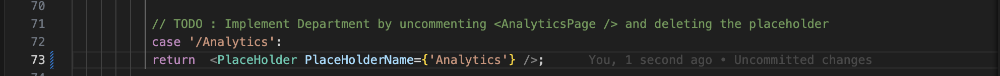
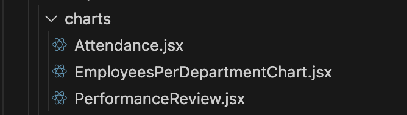
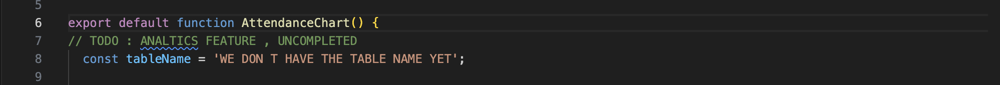

## Bonus Lab: Unveiling the Analytics Engine

**Introduction**

Congratulations! You've successfully implemented and deployed the "Departments" feature. Now, let's embark on a more challenging task: **"Unveiling the Analytics"**. 

**The Challenge**

The "Analytics" feature was initially planned for the HR application but was not included in the initial release. To prepare for the next phase of growth, MoroccanTech Solutions wants to enable this feature. Your mission is to uncover and activate the hidden "Analytics" functionality.

**Before we begin:**

* **Database Considerations:** 
    * The application requires two new database tables to support the "Analytics" feature: 
        * **`attendance`:** Stores employee attendance records.
        * **`performancereviews`:** Stores employee performance review data.
        Let's create a new branch and start working !

**Remember**: This is a bonus lab, so feel free to explore and experiment. The goal is to challenge yourself and learn new skills. 

## Challenge 1: Prepare the Database for Analytics

* **Challenge:** Create the necessary database tables (`attendance` and `performancereviews`) to support the "Analytics" feature. 
   * **Hint:**
        * Use SQLcl to create the tables with appropriate columns and data types. 
    ### `attendance` Table

    | Column Name      | Data Type       | Constraints             |
    |------------------|-----------------|------------------------|
    | ATTENDANCE_ID    | NUMBER(38)      | NOT NULL PRIMARY KEY   |
    | EMPLOYEE_ID      | NUMBER(38)      |                        |
    | CHECK_IN         | TIMESTAMP(6)    |                        |
    | CHECK_OUT        | TIMESTAMP(6)    |                        |
    | STATUS           | VARCHAR2(20)    |                        |
    * **`performancereviews` Table

    | Column Name         | Data Type       | Constraints            |
    |----------------------|-----------------|-----------------------|
    | REVIEW_ID           | NUMBER(38)      | NOT NULL PRIMARY KEY   |
    | EMPLOYEE_ID         | NUMBER(38)      |                        |
    | REVIEW_DATE         | DATE            |                        |
    | PERFORMANCE_SCORE   | NUMBER(3,2)     |                        |
    | GOALS_ACHIEVED      | VARCHAR2(255)   |                        |
    | AREAS_IMPROVEMENT   | VARCHAR2(255)   |                        |
    | REVIEWER_ID         | NUMBER(38)      |                        |
    | NEXTREVIEWDATE      | DATE            |                        |

     * Consider adding sample data to the tables to test the analytics functionality. 

    <details>
         <summary>Solution</summary>
    * **Step 1: Connect to DEV Schema**
        * **Using Named Connection:**
                ```sql
                connect <your_named_connection> 
                ```
        * **Using Wallet:**
                ```sql
                SQL> set cloudconfig directory/client_credentials.zip 
                Wallet Password:  **********
                ``` 
                ```sql
                SQL> connect username@servicename
                password
                ```
            * **Refer to the previous lab for detailed instructions on connecting to the database using a wallet.**

        * **Step 2: Create Tables**
            ```sql
            CREATE TABLE attendance (
                ATTENDANCE_ID NUMBER(38) NOT NULL PRIMARY KEY, 
                EMPLOYEE_ID NUMBER(38),
                CHECK_IN TIMESTAMP(6),
                CHECK_OUT TIMESTAMP(6),
                STATUS VARCHAR2(20)
            );

            CREATE TABLE performancereviews (
                REVIEW_ID NUMBER(38) NOT NULL PRIMARY KEY,
                EMPLOYEE_ID NUMBER(38),
                REVIEW_DATE DATE,
                PERFORMANCE_SCORE NUMBER(3,2),
                GOALS_ACHIEVED VARCHAR2(255),
                AREAS_IMPROVEMENT VARCHAR2(255),
                REVIEWER_ID NUMBER(38),
                NEXT_REVIEW_DATE DATE
            );
            ```
            -- Insert sample data into tables
            ```
            INSERT INTO attendance (EMPLOYEE_ID, CHECK_IN, CHECK_OUT, STATUS) VALUES (1, TO_DATE('2024-07-01', 'YYYY-MM-DD'), TO_DATE('2024-07-01 17:00', 'YYYY-MM-DD HH24:MI'), 'Present'); 
            -- Insert more sample data as needed
            ```
        
    </details>

## Challenge 2: Unearthing the Analytics Code

* **Challenge:** Your goal is to complete and activate the "Analytics" feature by identifying incomplete code sections, resolving placeholders, integrating missing components, and bringing the feature from a fragmented state to full functionality.

    <details> <summary>Hint</summary>
    * Create a new Git branch for the "Analytics" feature.
    * Look for comments within the code that mention or contain "TODO" "UNCOMPLETED" "Analytics," "charts," or similar terms. 
    * Search for file or folder names that might contain "analytics" keywords.
    * Utilize your code editor's search functionality to locate relevant code sections. 
    </details>
    <details> <summary>Solution</summary>
        * **Example Solution:** 
        * check out to your feature branch : 
        ```
          git checkout -b TICKET-2-Analytics
        ```
        * Search for files or folders with names like "analytics" or "Charts".
        * Use your code editor's search functionality to find code blocks that are commented out or appear to be incomplete.
        * **Specifically, look for comments like `// TODO: ANALYTICS FEATURE` and lines where placeholder values are used.**
        * look at the screenshots bellow and make the necessary changes to make your code work:
    
    in line 73 , delete the place golder component "<PlaceHolder PlaceHolderName={'Analytics'}/>" and replace it with Analytics component <AnalyticsPage>.
    
    there's also few changes to do in the charts components files ...
    
    change the name of the Variable tableName with your new table name : Attendance.
    
    change the name of the Variable tableName with your new table name : PerformanceReview.

        Great , now run your application to see your changes, and Verify that the displayed analytics data is accurate and reflects the current state of the employee data.
         ```sql
         <copy>
         npm run dev 
        </copy>
        ```
    </details>


## Challenge 3: Enhance the Analytics Arsenal (Optional)

* **Challenge:** Go beyond the current implementation by exploring innovative database objects and advanced analytics capabilities:

    - Create additional tables that could enhance HR analytics
    - Develop database procedures or views to generate complex insights
    - Experiment with different database objects in SQLcl
    - Implement these new features in the frontend application

  <details>
      <summary>Hint</summary>
      * Consider creating tables like:
          - Skills inventory
          - Training and development records
          - Compensation and benefits tracking
      * Explore creating database views that aggregate complex employee data
      * Design stored procedures for advanced analytics calculations
      * Use SQLcl to implement and test your database objects
  </details>
  <details>
      <summary>Solution</summary>
        * **Creative Exploration:**
          * Design and implement additional database objects
          * Experiment with data analysis techniques
          * Integrate new database features into the application
          * Demonstrate innovative approaches to HR analytics
          * Consider using database queries to calculate the required metrics.
          * Utilize charting libraries to visualize the data effectively.
          * Explore options for exporting data to different formats (e.g., CSV, PDF).
  </details>

## Challenge 4: Preparing for Release

* **Challenge:** Prepare the "Analytics" feature for release by following proper version control and staging procedures.
    * **Hint:**
        * Make sure you are on your feature branch.
        * Commit your code changes using Git.
        * Export your database objects 
        * Stage the changes using the project stage command.
        * Merge the "Analytics" branch into the main branch.

    <details>
    <summary>Solution</summary>
    - Commit your changes:
            ```
            git add -A
            git commit -m "Added basic Analytics functionality"
            ```
    - Make code changes and commit them:
            ```
            # Make necessary code changes (uncommenting, modifying, etc.)
            git add -A 
            git commit -m "Added basic Analytics functionality"
            ```
    - Export your database objects:
            ```
            project export 
            ```
    - Stage the changes:
            ```
            project stage
            ```
    -   Merge the "Analytics" branch into the main branch:
            ```
            git checkout main
            git merge TICKET-2-Analytics
            ```
            * **Resolve any merge conflicts:** (If necessary)
    </details>


## Challenge 5: Creating a Release Artifact

  * **Challenge:** Create a release artifact containing the changes for the "Analytics" feature.
    * **Hint:**
        * Use the `project release` command to generate the release artifact.

    <details>
        <summary>Solution</summary>
        * **Release Changes:**
            ```
            project release -version 3.0
            ``` 
        * ** Generate your New release artifact:**
        ```
            project gen-artifact  -v
            ``` 
    </details>

## Challenge 6: Deploying Analytics to Production

* **Challenge:** Deploy the "Analytics" feature to the production environment.
    * **Hint:**
        * **1. Connect to the Production schema:**
            ```sql
            connect <your_named_connection_to_PRODUSER> 
            ```
        * **2. Deploy to Production:** 
            ```
            project deploy -file NameOfyourArtifact.zip
            ``` 
* Congratulations, Developer! You've successfully navigated this challenging lab and created a valuable system for MoroccanTech Solutions. By completing the labs , you've demonstrated a strong understanding of database development, version control, and deployment practices. You've also gained valuable experience with SQLcl and its powerful project management capabilities.

* This lab has equipped you with the essential skills to effectively develop and deploy database-driven features within a real-world application environment. Keep practicing and exploring new challenges, and continue to enhance your skills as a skilled developer.**