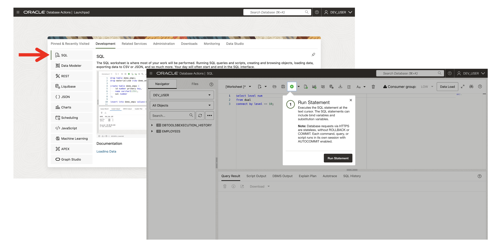
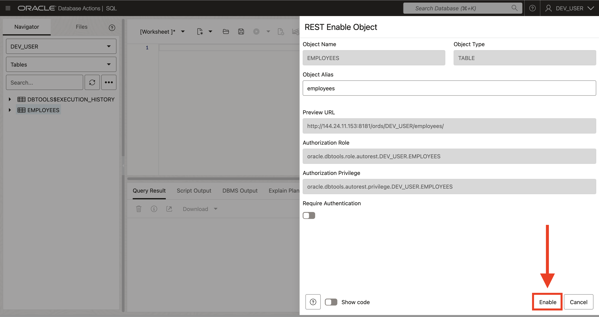
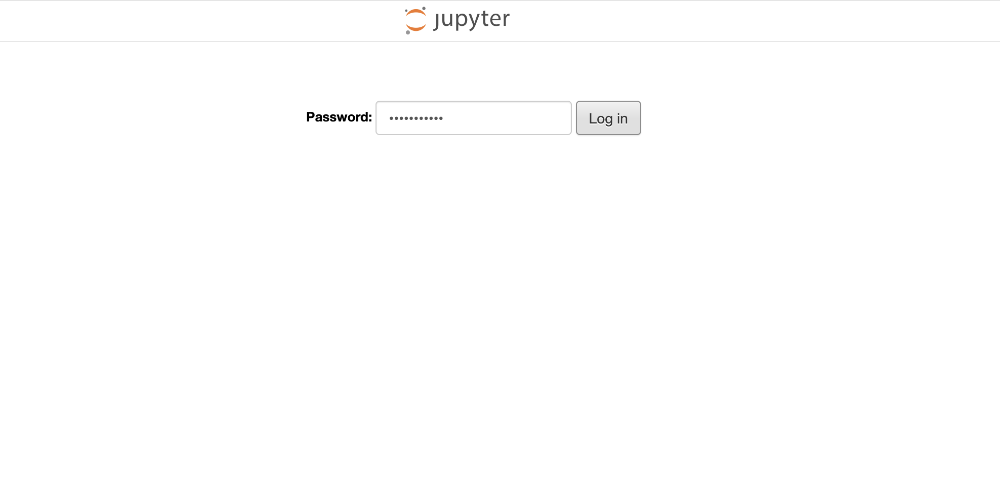
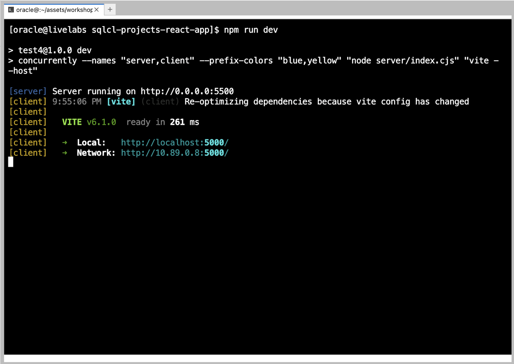
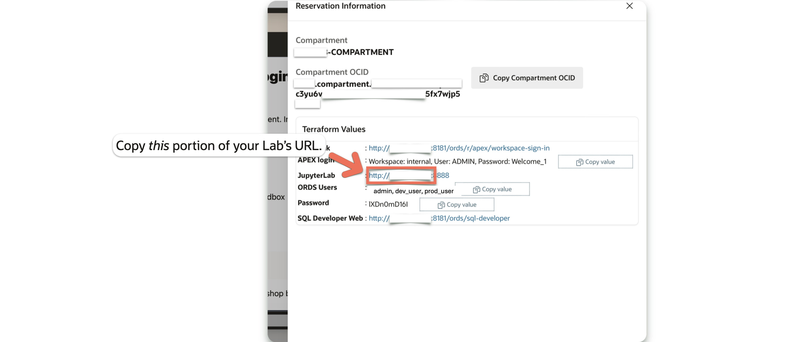
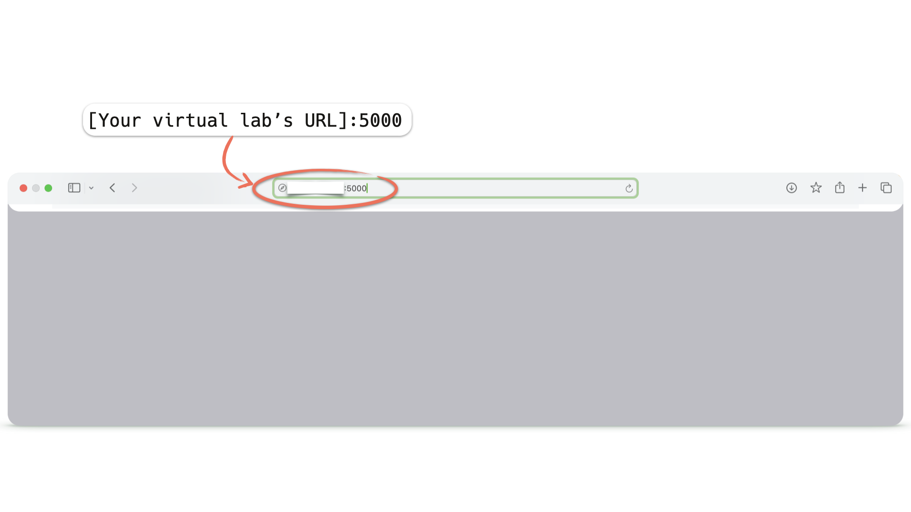
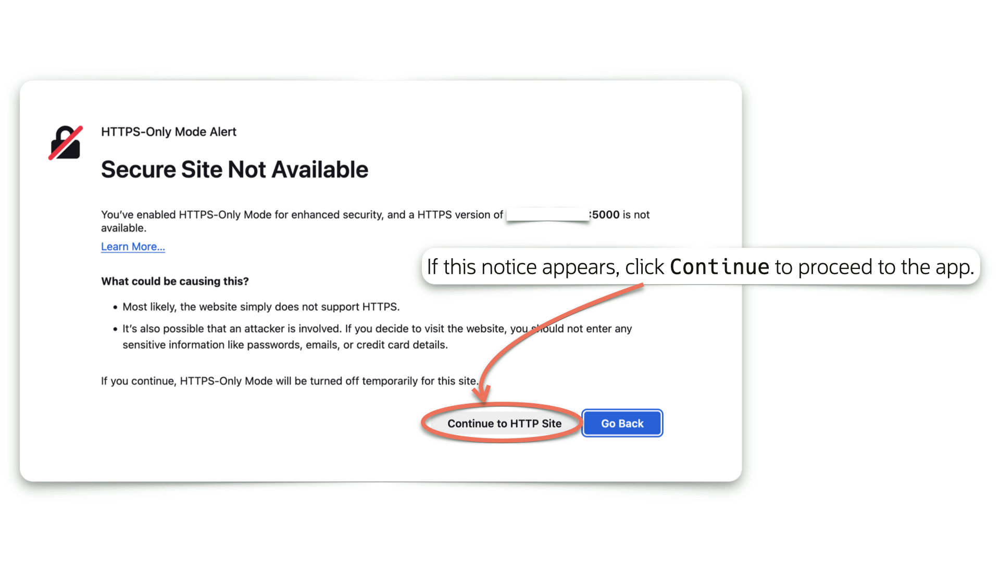
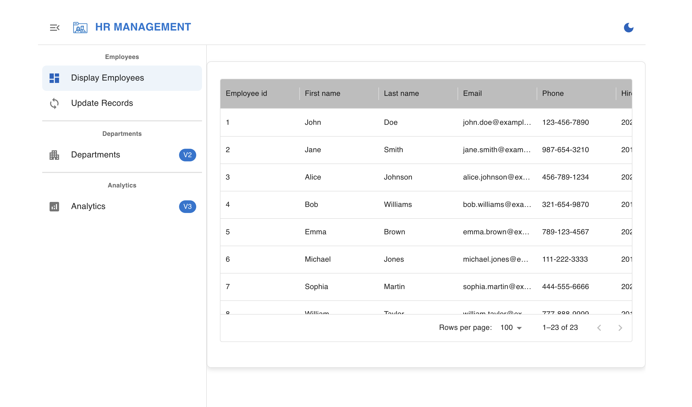
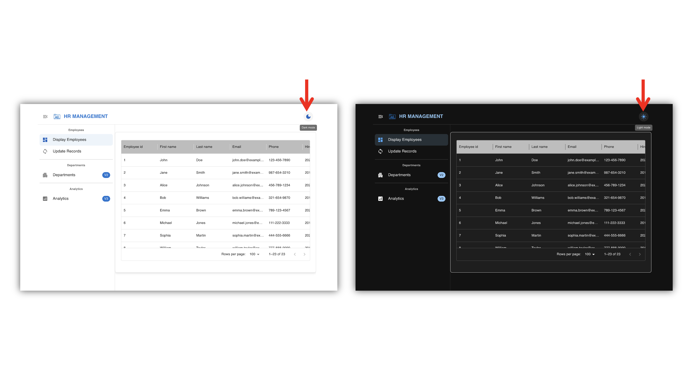

# Get Started

## Introduction

In this lab, you will be introduced to the environment, tools, and resources you’ll be working with throughout the workshop. You’ll also configure and run the necessary components to launch the HR Management application.

You have been provided with access to an Oracle Database Actions (*aka* Oracle SQL Developer Web), as well as a Jupyter Lab.

<!--Some experience in shell commands, react, JavaScript, and HTML are helpful but not necessary. Although, we've designed this workshop so even the beginner can complete it!-->


Estimated Lab Time: 15 minutes

### **Objectives**

In this lab, you will:

* Get to know your workshop environment
* Sign in to Database Actions as the `DEV_USER` user <!--* Create your ORDS APIs with the provided scripts-->
* Log in to jupyterLab
* Start-up the HR Management react application

### **Prerequisites**

* Access to a LiveLabs-provided sandbox environment
* Access to Database Actions
* Beginner-level experience in javascript, HTML, and Integrated Developer Environments

## Task 1: Get To Know Your Workshop Environment

Before diving into the workshop, take a moment to familiarize yourself with the tools and resources available.

1. Accessing Your Workshop Tools

   You have been provided various URLs. One for accessing Database Actions, and another one for accessing a Jupyter lab. First, navigate to Database Actions using the provided URL. You can find these details by clicking **View Login Info** near the top of the Workshop outline.

    

2. Workshop Credentials

   You’ve been provided with the necessary details for this workshop:

     * **JupyterLab:** Click the provided URL to access JupyterLab.
     * **ORDS Users:** The list of users we’ll be working with during the workshop.
     * **Password:** A single password used for JupyterLab and all ORDS users.
     * **SQL Developer Web (Database Actions):** Click the provided URL to access Database Actions.

    

## Task 2: Sign in Oracle Database Actions

1. Click the SQL Developer Web URL in the Reservation information to access it.

   

2. Several users have been created for you, including a new `DEV_USER` user. Its schema has already been REST-enabled, meaning you will be able to Sign in to Database Actions.

    > **Note:** Depending on your lab configuration, you may be redirected to a SQL Developer Web Sign-in screen rather than the Oracle REST Data Services "landing page." In such cases, simply Sign in with the `DEV_USER` user's credentials.

    To Sign in, click the <button type="button" style="pointer-events: none;">Go</button> button under the SQL Developer Web card.

    

    Once the Sign-in screen appears, enter the following credentials, and click the <button type="button" style="pointer-events: none;">Sign-in</button> button:

   &nbsp;&nbsp;&nbsp;&nbsp;&nbsp;&nbsp;&nbsp;&nbsp;**Username:** `DEV_USER`
   &nbsp;&nbsp;&nbsp;&nbsp;&nbsp;&nbsp;&nbsp;&nbsp;**Password:** `[Can be found in your Reservation details - see image in Step 1 for reference]`

3. The Database Actions Launchpad will appear. Navigate to the `Development` category, then click `SQL`. A blank SQL Worksheet will appear.

   

      > **NOTE:** If this is your first time visiting the SQL Worksheet, a guided tour will appear. You may continue with the tour, or click the <button type="button" style="pointer-events: none;">X</button> (as seen in the image) to exit the tour.

4. You'll notice an `Employees` table has already been created for you. This table has also been pre-populated with data.

   To view a sample of the table's data<span class="fa fa-file-play" aria-hidden="true"></span> copy and paste the following SQL statement into the SQL Worksheet and click then `Run Statement` icon.

      ```sql
      <copy>
      SELECT * FROM EMPLOYEES FETCH FIRST 5 ROWS ONLY;
      </copy>
      ```

   You will see results similar to the following image:

   

5. You may notice the varied data types in this table. To take a closer look at how this `EMPLOYEES` table is structured, right-click on the `EMPLOYEES` table, then select `Edit...`. When the `Table Properties` slider appears, click `DDL`, then select the `Create` tab.

   Note the data types:

   

      > **Note:** ORDS APIs will be able to handle all of these various data types and send them to your application.

## Task 3: Enable REST Endpoints Using ORDS

To interact with the EMPLOYEES table from your application, you need to enable a REST endpoint. This will allow you to fetch and post data directly to the database using standard HTTP requests.

Oracle REST Data Services (ORDS) provides a simple and efficient way to expose database objects as RESTful services. Instead of building custom APIs from scratch, ORDS allows you to instantly enable REST access to your tables with minimal effort and eliminate the need for complex backend development while ensuring secure and scalable database access.

In this task, you will use ORDS to enable a REST endpoint for the Departments table, making it accessible through standard HTTP requests, simplifying data integration and allowing your application to interact with the database smoothly.

1. Open Oracle Database Actions
2. Connect as DEV_USER
3. Select **Tables**, right-click on **`EMPLOYEES`**, choose **REST**, and then click **Enable**
    
4. Click **Enable** at the bottom right
    
5. The **EMPLOYEES** table is **REST enabled** now
    

    >**Note:** The icon next to the table name indicates that the table is REST-enabled.

6. Click the hamburger menu at the top of Oracle Database Actions, then select REST.

   

7. In the Workshop's Object panel, you will see a single AUTOREST. Click it.

   

There, you will find all the REST-enabled objects for the user along with their corresponding endpoints. Since this user only has the EMPLOYEES table REST-enabled, it will be the only one displayed.

Once you are satisfied, return to the Reservation information for this workshop.

   
<!--1. Navigate to the SQL Worksheet. Then paste (easily done with keyboard shortcuts) the contents of the `users.sql` file to the SQL Worksheet.

2. Click the `Run Script` icon. Upon completion, a `PL/SQL procedure successfully completed` message will appear in the `Script Output` tab.-->

<!--1. We have created the ORDS APIs for the DEV_USER user and REST-enabled the EMPLOYEES table.

      >**Note:** The icon next to the table name indicates that the table is REST-enabled.

   

2. Click the hamburger menu at the top of Oracle Database Actions, then select REST.

   

3. In the Workshop's Object panel, you will see a single AUTOREST. Click it.

   

There, you will find all the REST-enabled objects for the user along with their corresponding endpoints. Since this user only has the EMPLOYEES table REST-enabled, it will be the only one displayed.-->

<!--5. Next, copy this URI's to your clipboard. In a few moments, you will return to the Jupyter lab to input this into the application code.

   -->

## Task 4: Open Jupyter Lab

1. Using the URL you were provided, log in to your Jupyter lab. *It is recommended you open the Juptyer Lab in a new tab or window.*

   

   Use the same password from the previous task.

   
2. Once logged in, you may see several directories. Navigate (i.e., double or single-click on the directory) to the `workshops` directory, then to the `sqlcl-projects-react-app` directory. This last directory is the folder containing the application you will use and work with throughout this workshop. Take a moment to locate it, explore its contents, and get familiar with its structure.

   

<!--3. Next, navigate to the `scripts` directory, then open the `DEV_USERstream_resource_module_definitions.sql` file.  

    > **TIP:** You may open a file by clicking on the file name *or* right-clicking a file and choose to "Open with > Editor".  
    >
    > 

   This file contains the definitions for your Resource Module, Templates, and Handlers, which are your ORDS APIs.  

   
   *Navigate to `sqlcl-projects-react-app` then `scripts` then `DEV_USERstream_resource_module_definitions.sql`*

4. Select all contents and copy the contents to your clipboard. Then, return to the SQL Worksheet.

    > **TIP:** Refer to Task 1, Step 1 for keyboard shortcuts for copy and paste actions.

   -->

## Task 5: Prepare Your Application Environment Variables

In this task, you will navigate back to JupyterLab and locate the `sqlcl-projects-react-app` directory once again.

Next, you will modify the .env file, which is located in your application's root directory (`sqlcl-projects-react-app`). This file contains essential configuration variables required at runtime.

   >**Note:** The .env file is hidden by default because filenames that begin with a dot (.) are not displayed in the folder structure.

   Click on the triangle icon or **More** below for more insights.

   <details><summary>**More**</summary>

   Files and folders that start with a dot (.) in a computer system (especially in Linux, macOS, and other Unix-like operating systems) are called hidden files or dotfiles. For example **.gitconfig** file that stores settings for Git.

   **What Are They?**
      * These files and folders are not shown by default when you list files in a directory.
      * They are often used to store settings, configurations, and user preferences for different programs.

   **How to See Dotfiles?**

   By default, these files are hidden so you cannot see them explicitly in between your files or directories, but you can view them using:
            ```sh
         <copy>
            ls -la
         </copy>
         ```
   Otherwise, enable "Show hidden files" in File Explorer settings.

   **Why Are They Hidden?**
      * To keep the file system clean by hiding unnecessary details from users.
      * To prevent accidental modification of important configuration files.

   </details></br>

1. Open the terminal
   
      >**Tip:** You can reduce the font size by pressing **Ctrl + Minus (-)** on Windows/Linux or **Command (⌘) + Minus (-)** on Mac.

2. Edit the `.env` file with:
      ```sql
      <copy>
         vi .env
      </copy>
      ```
      

3. Press Esc + I to enter insert mode.

4. Navigate to the placeholders. Replace [THE PLACEHOLDER] with your instance links in the following variables:

      ```text
      <copy>
      VITE_API_URL=http://[Your Lab's IP]:5500/api/connection
      VITE_BASE_URL=http://[ORDS LINK]:8181/ords/
      VITE_DB_USERNAME=dev_user
      </copy>
       ```

     * **`VITE_API_URL`:** The base URL for your API connection, replace placeholder with your jupyter IP address.

     * **`VITE_BASE_URL`:** The base URL for your ORDS REST service. You can obtain this URL using either of these methods:
          - Method 1: Use your terminal and run the following command: 
            ```text
            <copy>
               echo $ORDSURL
            </copy>
            ```
         

          - Method 2: Retrieve the URL from SQL Developer Web:
            1. Access SQL Developer Web using the link provided in the login info page
            2. Log in with username "dev_user" and the Database Password (found in the login info page)
            3. Copy the URL from your browser's address bar
            4. Remove the final "dev\_user/\_sdw/" portion from the URL
            


     * **`VITE_DB_USERNAME`:** The database username which should be in lowercase.

    ***Important!*** If you find VITE\_DB\_USERNAME (dev_user) in uppercase, make sure to convert it to lowercase. This value is used in the ORDS endpoints within the application, and it must be lowercase for the endpoints to function correctly.

     
     <!---->

5. Press Esc, then type :wq to save and exit.

>**Note:** In a React app using Vite, the **VITE_** prefix in environment variables is a Vite requirement to expose them to your front-end code.

<details><summary>**More**</summary>

Vite is a fast modern build tool and development server for JavaScript frameworks like React, Vue. It improves app performance with instant reloading and optimized production builds.

**Explanation of VITE_ in .env**

Vite automatically loads environment variables from a .env file only if they start with VITE_. This is a security measure to prevent unintended exposure of sensitive backend credentials.
</details>

<!-- > **Note:** This should be in the form of: `http://Your Lab's IP:Your Lab's Port Number/ords/DEV_USER`. Make sure you double-quote the URI; as can be seen in the image below.-->

## Task 6: Start Your React Application

1. From the Jupyter Launcher, open a new Terminal.

   

      > **Note:** If a new Launcher window is not present, you can click the Blue Box (the box with the `+` inside) to open a new Launcher. Then you may open a new Terminal.

2. Verify you are in the correct directory by:

    

    >**Tip:** You can clear your terminal screen using **clear** command.

      ```sh
      <copy>clear</copy>
      ```

3. Next, issue the following command:

      ```sh
      <copy>npm run dev</copy>
      ```

    

    *The React development server will start up.*

4. Your application will be available on port `5000`. However, you will need to open the application in a new tab. Modify the URL, so you are using the one provided to you for this lab *plus* port `5000`.

   

   
   *Open in a new tab or window.*

5. Navigate to the new tab and combine the lab's URI with port `5000`. Accept any warnings and your application will load.

   

6. The HR application will load. Scroll right left or up down to see all the infos.

   

7. You can switch from the light mode to dark mode

   

8. Check the Update Records page.

   

9. Move to the Departments page.

   

**Uh-oh!** The departments page is missing! But here’s your chance to build it. Let’s dive into the [**next labs**](#next) and bring this feature to life!

You may now [**proceed to the next lab**] (#next)

## Learn More

* [Oracle REST Data Services (ORDS) Doc](https://docs.oracle.com/en/database/oracle/oracle-rest-data-services/24.4/orddg/introduction-to-Oracle-REST-Data-Services.html)
* [Oracle Database Actions (SQL Developer Web) Doc](https://docs.oracle.com/en/database/oracle/sql-developer-web/sdwad/sql-developer-web.html)
* [Vite guide](https://vite.dev/guide/)

## Acknowledgements

* **Author** - Fatima AOURGA & Abdelilah AIT HAMOU, Junior Members of The Technical Staff, Database Tooling, SQLcl developers
* **Created By/Date** - Fatima AOURGA & Abdelilah AIT HAMOU, Software Developers, February 2025