# Migrate Your Application to SQLcl Projects

## Introduction

Before starting development on the Departments feature, you need to migrate your application to use SQLcl's project feature.

This lab will guide you through the process of integrating SQLcl Projects into your existing application. By adopting this approach, you’ll benefit from better database versioning and the ability to deploy database and application changes simultaneously.

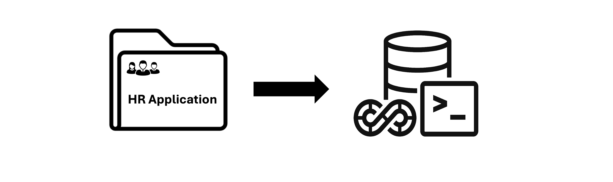

Estimated Lab Time: 15 minutes

### **Objectives**

* Practice and apply SQLcl project commands through hands-on exploration
* Experience and understand the benefits of database CICD
* Successfully migrate the HR Application to SQLcl Projects
* Synchronize DEV\_USER and PROD\_USER

### **Prerequisites**

* Completion of previous labs
* Basic understanding of Git

## Task 1: Understand Environments and Database CICD Challenges

### **Environments Overview**

Database CI/CD ensures synchronization between two databases, allowing you to deploy changes from a source database to a target database and keep them in sync.


From this lab, you will work with these two environments:

* **Development (Dev):**
    * Where you create and fix database changes.
* **Production (Prod):**
    * Where you deploy stable and reliable database updates.
    * *Our goal in the current and next labs is to successfully deploy the “Departments” and “Analytics” features to the Prod environment.*

    

In this workshop, we will use:

* **DEV_USER schema** to represent the development/source database (environment).
* **PROD_USER schema** to represent the production/target database (environment).

>**Note:** There are often other environments involved in the development lifecycle (Test, pre-prod, ...) but this workshop just those two ones above that we need.


### **Challenges of Traditional Database Deployments**
In traditional database deployments, especially in a manual process, several challenges arise:

* **Manual Interventions:** Prone to errors and time-consuming.
* **No Automation:** Slows down deployments and adds inconsistencies.
* **High Error Risks:** Bugs and data issues can disrupt production.

**Our Goal:**

Use SQLcl's **project** command to:

* Create your local database application work environments
* Track changes and create database install and upgrade scripts
* Automate and ensure consistent deployments

<!--* Deploy with minimal risk.
* Automate and ensure consistent deployments.
* Speed up feature delivery.
* Gain practical experience for real-world database projects.-->

## Task 2: Project Initialization

* **Connecting to DEV_USER via SQLcl:**

    1. Setup "TNS\_ADMIN" :

        We are connecting to an Autonomous Database, so we set TNS_ADMIN to /wallet to tell SQLcl where to find the wallet and network configuration files for secure connection.

        ```sql
        <copy>
            export TNS_ADMIN=/wallet
        </copy>
        ```

    2. Connect to the DEV_USER schema using :
            ```sql
            <copy>
                sql dev_user/$DBPASSWORD@"$DBCONNECTION"
            </copy>
            ```
            

        >**Tip:** You can clear your screen anytime you want by using **clear screen** command or just its short format **cle scr**:
            ```sql
            <copy>
                cle scr
            </copy>
            ```

* **Project Initialization:**

    1. Make sure you are in the application folder before running **project** commands

        

    2. **Initialize git**

        ```sql
        <copy>
            !git init --initial-branch main
        </copy>
        ```

        >**Note:** We use a bang or exclamation mark (**!**) at the beginning of hosted commands (non-SQLcl commands) to run them within SQLcl.
        <!--In SQLcl, it is used as a shell escape to run external (non-SQLcl) commands.-->

    3. Add and commit

        Before committing to Git, make sure to configure your user identity. Run the following commands to set your name and email address, which Git uses to track your commits:

        ```sql
        <copy>
            !git config --global user.name "Your Name"
        !git config --global user.email "your.email@example.com"
        </copy>
        ```

        ```sql
        <copy>
            !git add --all
        </copy>
        ```

        ```sql
        <copy>
            !git commit -m "Initial commit"
        </copy>
        ```

        
        <!---->

        >**Tip:** Press Tab to view completions, then keep pressing Tab or use the arrow keys to navigate. Press Enter when you find the desired option.
        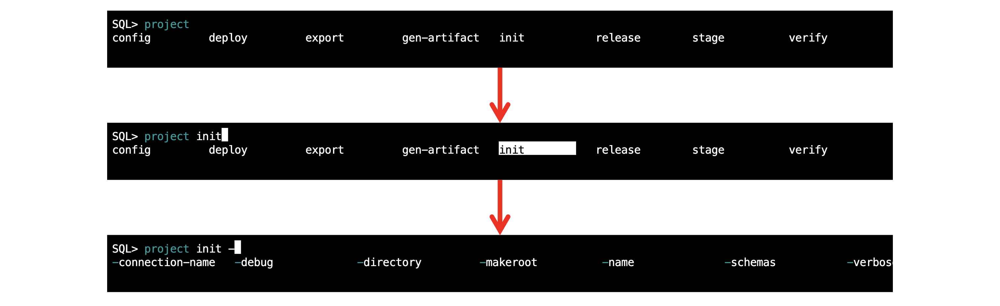

    4. **Initialize project**

        ```sql
        <copy>
            project init -name HrManager -schemas DEV_USER -verbose
        </copy>
        ```

        

        The **`project init`** command creates a specific folder structure, setting up the necessary directories and files for managing your database objects and changes within your current directory. If you add the **-makeroot** flag to your init command, a folder with the project name will be created under your current directory and will hold all the project files and folders.

        >**Note:** Use `help project` for more info

        ```sql
        <copy>
            help project
        </copy>
        ```

        

        * **Project Structure:**
            * SQLcl Project feature use a specific folder structure to manage database objects and changes.
            * Key folders include:
                * **`.dbtools`:** contains project configuration files, filters, and formatting rules. It's a hidden folder.
                * **`src`:** stores exported objects from the database, organized by schema and object type.
                * **`dist`:** contains the distributable for each release.

                ```text
                <copy>
                ──.dbtools
                │   ├── filters
                │   │   └── project.filters
                │   ├── project.config.json
                │   └── project.sqlformat.xml
                ├── dist
                │   └── install.sql
                └── src
                    └── database
                </copy>
                ```

            * List all, to see the generated project folders
            

            >**Note:** The project init command creates a src folder. However, since the application already has a src folder, SQLcl Projects merges its newly created src folder with the existing one. As a result, the database project folder will be located inside src, ensuring seamless integration.

            <!--<details>  <summary> **Screenshots:**</summary>
            
            </details>-->

    5. Add and commit

        ```sql
        <copy>
            !git branch
        </copy>
        ```

        ```sql
        <copy>
            !git status
        </copy>
        ```

        ```sql
        <copy>
            !git add --all
        </copy>
        ```

        ```sql
        <copy>
            !git status
        </copy>
        ```

        ```sql
        <copy>
            !git commit -m "Add project files"
        </copy>
        ```

        
        >**Note:** You can click the image if it is not visible for you.

    6. Create a new git branch and switch to it

        ```sql
        <copy>
            !git checkout -b SQLcl-Projects-Migration
        </copy>
        ```

        ```sql
        <copy>
            !git branch
        </copy>
        ```

        ```sql
        <copy>
            !git status
        </copy>
        ```

        

        >**Note:** You can choose the name you want for your branch. It doesn’t have to match this one.

## Task 3: Set Project Configuration

Since the source and target databases use different schemas, we need to set emitSchema to false in project.config.json (inside .dbtools). By default, this setting is true, meaning exported DDL includes fully qualified object names in the format schema.object (e.g., dev_user.departments). Disabling it ensures objects are created without schema prefixes in the target database.

You will use the project config command to view and edit this configuration item.

<!--Since the source and target databases have different schemas, we need to set emitSchema (a setting in the project.config.json file under the .dbtools folder) to false. This setting determines whether the object name will be prefixed with its schema (fully qualified).-->

```sql
<copy>
    project config -list -name export.setTransform.emitSchema
</copy>
```

```sql
<copy>
    project config set -name export.setTransform.emitSchema -value false -verbose
</copy>
```

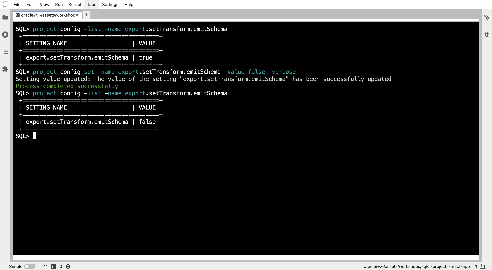
<!---->

## Task 4: Export from the Source Environment

For exporting, we have two options:

* Export the entire schema, including all its objects, using the -schemas option, which accepts a list of schemas to export (in our case, just one: "DEV_USER").
* Export specific objects using the -objects option.

    

>**Note:** Use `help project export` for more details on the export command.
    ```sql
    <copy>
     help project export
    </copy>
    ```

In this task, you will export the DEV_USER schema.

But before proceeding, we need to add a filter in `.dbtools/filters/project.filters` to exclude the auto-generated objects that were not our proper stuff.

>**Notes:** Project filters are used to filter out objects that will be exported or exclude specific ones. <!--to control what gets exported and what is excluded. Find more details in [Oracle SQLcl Project & CI/CD Docs](https://docs.oracle.com/en/database/oracle/sql-developer-command-line/24.3/sqcug/database-application-ci-cd.html#GUID-6A942F42-A365-4FF2-9D05-6DC2A0740D24)-->

1. Open the filters configuration file

    ```sql
    <copy>
        !vi .dbtools/filters/project.filters
    </copy>
    ```

    

2. Insert this line **"not (object_name like 'DBTOOLS$%'),"** as the following:

    * Press **Esc** + **I** to enter insert mode

    * Copy and paste this line in the location shown in the image below

        ```sh
        <copy>
            not (object_name like 'DBTOOLS$%'),
        </copy>
        ```

        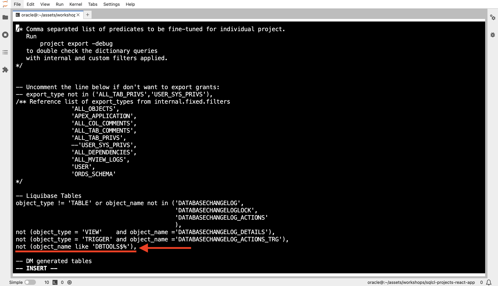

    * Press **Esc**, then type **:wq** to save and exit

    Now, we are ready to export our schema cleanly.

3. Export the DEV_USER schema to the application folder

    Run the following command to export objects from the schemas defined during project init. The specified schema is used by default, so you don’t need to specify it again.

    ```sql
    <copy>
        project export -verbose
    </copy>
    ```

    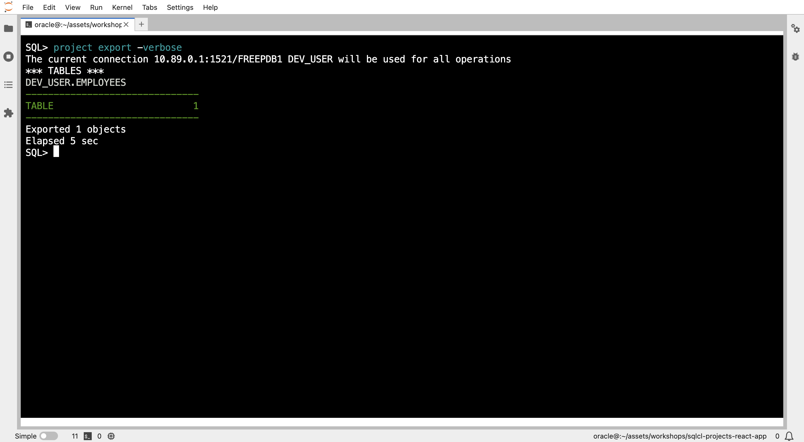
    <!---->
    <!---->
    <!---->

    >**Note:** To export a different schema, provide it explicitly in the project export command.

    This command **exports database objects** into your repository.

4. Find the exported schema folder and its database object files inside the database folder under src.

    
    <!---->
    <!---->

5. Double click on the 'employees.sql' to see its content.

    
    <!---->
    <!---->

Now, we export our objects to have them included in our project folders.

## Task 5: Project Stage

1. You need to add and commit changes before stage

    ```sql
    <copy>
        !git status
    </copy>
    ```

    ```sql
    <copy>
        !git add --all
    </copy>
    ```

    ```sql
    <copy>
        !git status
    </copy>
    ```

    ```sql
    <copy>
        !git commit -m "Export dev_user schema"
    </copy>
    ```

    
    <!---->

2. By default, the **dist** folder is ignored in many React projects because it contains generated build files. However, you need to track it in Git by removing dist in the .gitignore file.

    * Open .gitignore, search for **dist**, and remove the line if it's present. If you don't find it there, you can skip this step and move on to step 3.

        >**Note:** Make sure you are in the application folder /home/oracle/assets/workshops/**sqlcl-projects-react-app**

        ```sql
        <copy>
            vi .gitignore
        </copy>
        ```

    * Save the file.

3. Execute the following command to stage the changes for release

    ```sql
    <copy>
        project stage -verbose
    </copy>
    ```

    
    <!---->
    <!---->

    This command generates Liquibase changelogs for all source (src) and custom SQL files by comparing the current branch (`SQLcl-Projects-Migration`) to the base branch (`main`). It creates a structured folder (dist/releases/next/) for staged files and allows adding custom changesets with SQL and SQLcl commands.

4. Add and commit the files

    ```sql
    <copy>
        !git status
    </copy>
    ```

    ```sql
    <copy>
        !git add --all
    </copy>
    ```

    ```sql
    <copy>
        !git status
    </copy>
    ```

    ```sql
    <copy>
        !git commit -m "Add stage files"
    </copy>
    ```

    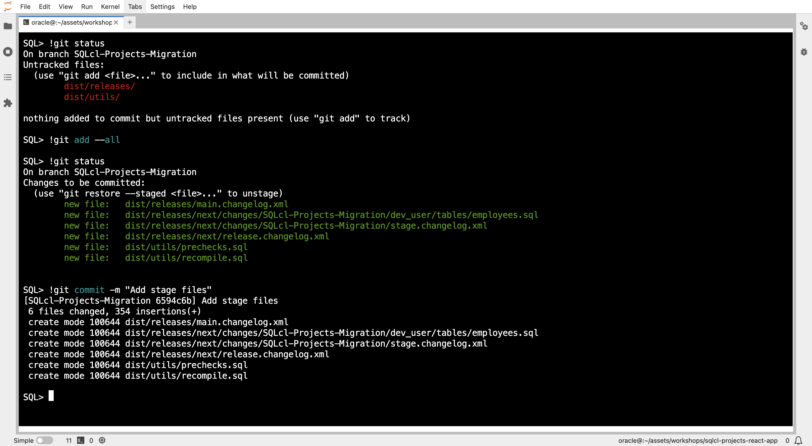

5. Merge to main branch

    This is typically done via a Merge Request or Pull Request, depending on your Git provider. However, since this is a local repository, you can merge directly into the main branch.

    ```sql
    <copy>
        !git checkout main
    </copy>
    ```

    ```sql
    <copy>
        !git merge SQLcl-Projects-Migration
    </copy>
    ```

    

## Task 6: Generate Release 1.0.0

1. Once your changes are merged to the main branch, execute the following command to create a first release

    ```sql
    <copy>
        project release -version 1.0.0 -verbose
    </copy>
    ```

    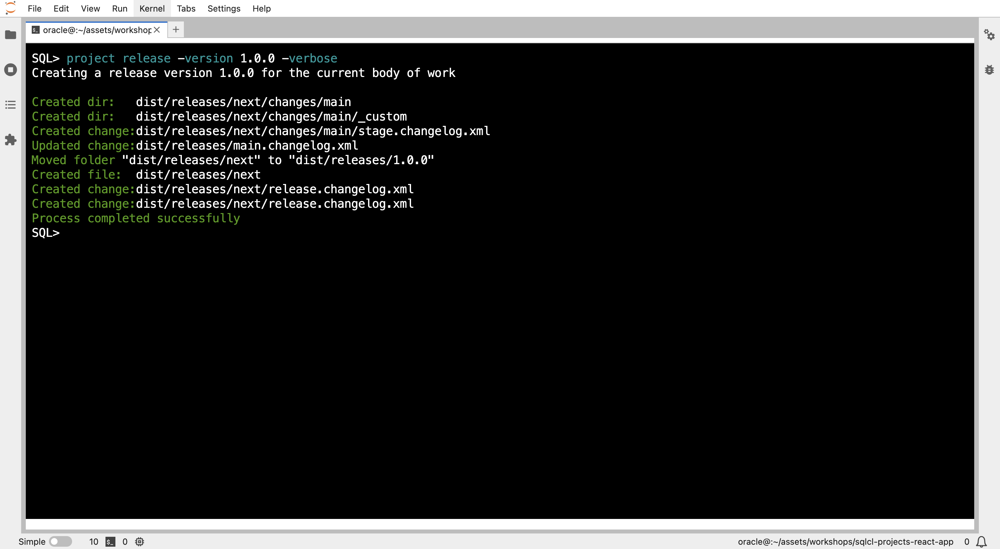

    This command renames the contents of dist/releases/next to the specified version number and then creates a new next folder under dist.

2. Add the changed files and commit:

    ```sql
    <copy>
        !git add --all
    </copy>
    ```

    ```sql
    <copy>
        !git commit -m "Release 1.0.0"
    </copy>
    ```

    

## Task 7: Generate Deployable Artifact

Before generating the artifact, you need to establish a new database baseline by syncing the two environments (schemas). We need to do this because the employees table already exists in the target environment and is in the same state as the source. So we need just to sync them. If your target environment was empty during migration, you don't need to do that and just skip this step.

1. Open the dist/install.sql file

    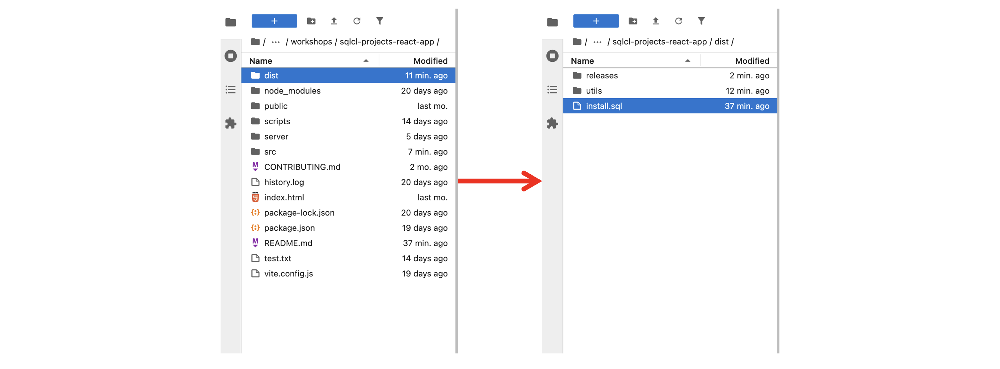

2. Go to line 17 and replace **lb update** with **lb changelog-sync** (liquibase commands)

    <!---->
    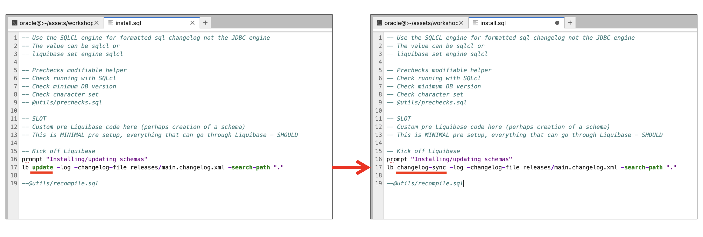

3. Save the **install.sql** file by pressing **Cmd + S** on Mac or **Ctrl + S** on Windows/Linux.

4. Add and commit

    ```sql
    <copy>
        !git add --all
    </copy>
    ```

    

    ```sql
    <copy>
        !git commit -m "updated installer to do a changelog-sync"
    </copy>
    ```

5. The `project gen-artifact` command can be used to generate an artifact for your database changes. This artifact can then be easily deployed to different environments.

    ```sql
    <copy>
        project gen-artifact -verbose
    </copy>
    ```

    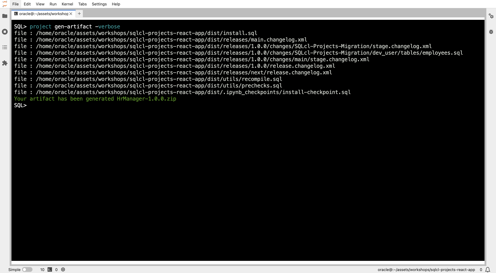
    <!---->
    <!---->

6. Returning to the application folder, you will find a new folder named artifact, which contains the generated zip artifact.

    >**Note:** The artifact is created with the provided name to the project at the moment of its initialization , as the default name, in case no specific name was specified using the **-name** option with the **project gen-artifact** command.

    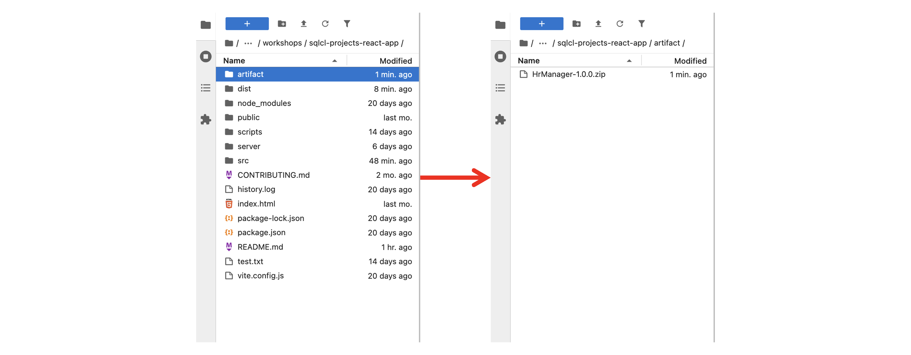

In the next task, we will learn how to deploy these changes to the production environment using SQLcl's project command and explore advanced CICD concepts.

## Task 8: Deploy to Target Environment

1. **Connect to the Production Database:**

    * Establish a connection to the production database using SQLcl.
    * Use the `connect` command with the `PROD_USER` credentials.

        ```sql
        <copy>
            connect PROD_USER/[PASSWORD]
        </copy>
        ```

        

2. **Deploy to Production:**

    * Execute the following command to deploy the changes to the production database:

        ```sh
        <copy>
            project deploy -file artifact/HrManager-1.0.0.zip  -verbose
        </copy>
        ```

        >***Note:** If it returns the help when pasting this command in SQLcl, try typing it manually. Use tab for completion.*

        <!---->
        

    * This command applies the changes defined in the release artifact to the production database without recreating existing schema objects.

    When you check the schema tables, you'll notice two new tables. These are **Liquibase** tables used for tracking database changes.
    ```sql
    <copy>
        tables
    </copy>
    ```
    

* **SQLcl Liquibase**

    SQLcl Liquibase is the engine behind the SQLcl Project feature, executing the `liquibase update` command in the background. It compares the source and target databases, applying necessary changes only if differences exist.

    During the first deployment using the project deploy command, Liquibase creates two key tables:

    * **DATABASECHANGELOG** – Tracks executed changesets, including timestamps and checksums.

    * **DATABASECHANGELOGLOCK** – Prevents concurrent deployments.

    Before applying changes, Liquibase checks database changelog to see if a changeset has already been executed. If not, it processes them in the order defined in the changelog file.

    <!--The other three created tables are liquibase tables. Liquibase is the engine of the SQLcl Projects tool that apply its command 'liquibase update' behiend scens to check if there is any differences between the source and target database, if they are it apply the changes to get them synched, if they are not, it does't do anything. So it checks that there are diffs before doing anything.-->

    

**Well done!** Migration completed successfully.

Now, it's time for some code changes! Let’s jump into the [**next lab**](#next) and kickstart our application development to bring the departments feature to life!

You may now [**proceed to the next lab**] (#next)

## Learn More

* [Oracle SQLcl Doc](https://docs.oracle.com/en/database/oracle/sql-developer-command-line/24.3/sqcug/working-sqlcl.html)
* [Oracle SQLcl Project & CI/CD Docs](https://docs.oracle.com/en/database/oracle/sql-developer-command-line/24.3/sqcug/database-application-ci-cd.html#GUID-6A942F42-A365-4FF2-9D05-6DC2A0740D24)
* [Oracle SQLcl Liquibase Docs](https://docs.oracle.com/en/database/oracle/sql-developer-command-line/24.3/sqcug/using-liquibase.html)
* [Video overview and demonstration for SQLcl Projects](https://youtu.be/qCc-f24HLCU?si=3z-aRBdzu_QhixJ9&t=182)

## Acknowledgements

* **Author** - Fatima AOURGA & Abdelilah AIT HAMOU, Junior Members of The Technical Staff, Database Tooling, SQLcl developers
* **Created By/Date** - Fatima AOURGA & Abdelilah AIT HAMOU, Software Developers, February 2025