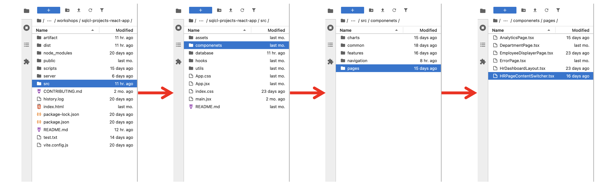
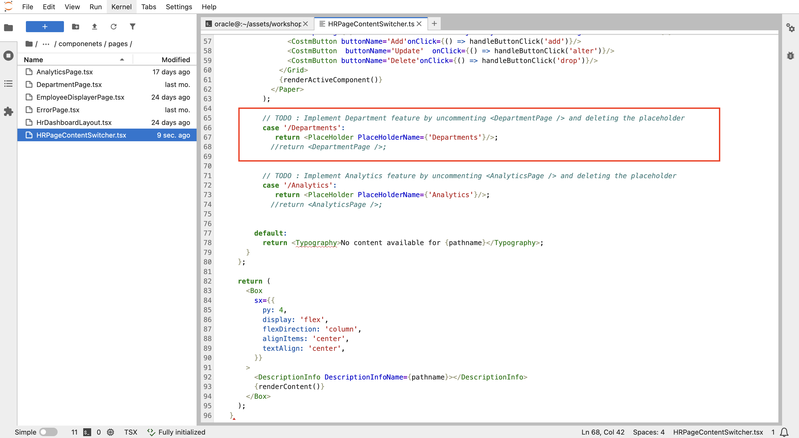
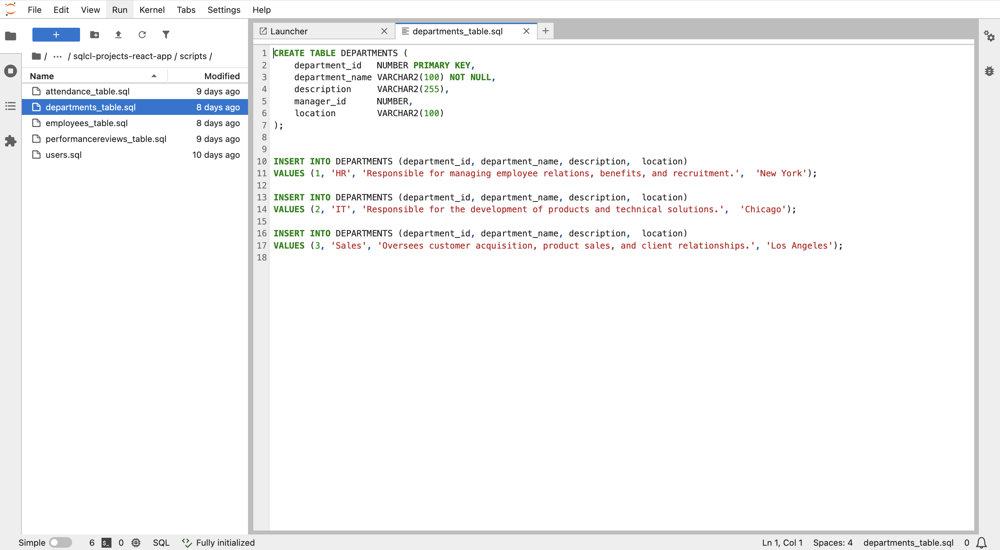
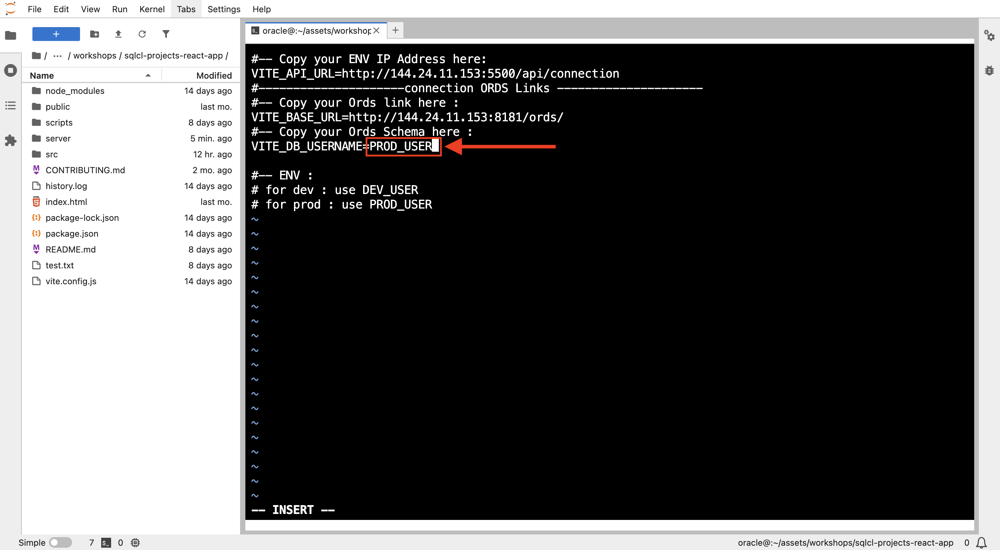

# Application development & deployment

## Introduction

Now that your application is migrated to SQLcl Projects and running from the Get Started lab, it’s time to develop the Departments feature for Tech Solutions Company to help it keep up with its growing workforce.

In this lab, you’ll enable the departments feature by updating both the application and database, ensuring they work seamlessly with SQLcl Projects and CI/CD principles.

<!---->

Estimated Lab Time: 15 minutes

### **Objectives**

* Identify and apply the required changes in the application code.
* Create the department table in the DEV_USER schema (development environment).
* Switch to the production environment and explore the database challenge.

### **Prerequisites**

* HR application up and running.
* Basic knowledge of SQL and coding.
* Completion of the previous lab.

## Task 1: Unlock Departments Page

Find the placeholder component within the application's code, and replace it with Department implementation.

1. Go to : `/sqlcl-projects-react-app/src/componenets/pages/HRPageContentSwitcher.tsx`
    

2. Find Departments change location in the code (line 65)
    

3. Implement Departments by removing the line 67 and uncomment line 68 just below
    

4. Save the file change (Cmd + S for Mac or Ctrl + S for Linux/Windows)

5. Now, refresh the application window and head to the departments section. Your new feature is live!

    >**Note:** *if it doesn't appear just wait a little bit and refresh again until it appears*

    

But the table is empty, with no rows, and all the statistics show 0. Let's fix that in the next task!

## Task 2: Database change (Create Departments Table)

The last issue in the previous task occurred because the departments table is missing. This will be resolved by creating it in the DEV_USER schema.

* Database Changes: Create the "Departments" Table

    <details><summary>**Option 1: Using SQLcl**</summary>
    * Go to the application folder in the left side and double click on the **scripts** folder
    
    * Double click on departments_table.sql to see the table ddl and data to insert
    
    <!---->
    * Connect to DEV_USER in SQLcl then execute the previous sql file, starting by the ddl then the inserts.

        >**Note:** Make sure you are in the scripts directory before executing the sql file in SQLcl.

        ```
        <copy>
            cd /home/oracle/assets/workshops/sqlcl-projects-react-app/scripts/
        </copy>
        ```
        ```
        <copy>
            @departments_table.sql
        </copy>
        ```
        

    </details>

    <details><summary>**Option 2: Using Database Actions**</summary>
    * Open to Database Actions
    * Connect as DEV_USER
    * Copy all the content of `departments-table.sql` file, then past it in the worksheet there and click on the run script button
        
    </details>

    <details><summary>**Result**</summary>
    
    * The table is created and data inserted in now, so the data should appear now in the Departments page. Refresh the app to check.

        <details><summary>***Check ...***</summary>

        **Oops!** It doesn’t appear yet!

        

        This is expected because the ***REST*** endpoint for the table hasn’t been enabled yet.

        Don’t worry, we’ll easily configure it in the next task using ***ORDS***, which simplifies the process.
        </details>

    </details>

## Task 3: Enable ORDS Endpoint For Departments Table

>**Note:** If you are still connected to DEV_USER in Database Actions, skip to step 3.

1. Open Oracle Database Actions
2. Connect as DEV_USER
3. Select **Tables**, right-click on **`DEPARTMENTS`**, choose **REST**, and then click **Enable**

4. Click **Enable** at the bottom right

5. The **DEPARTMENTS** table is **REST enabled** now


## Task 4: Check the Departments Page After Database Update

* Go to the application, refresh the page, and head to the departments section—you'll see the data appearing now!


## Task 5: Deploy the application to production

Now, our application is ready for the next release (version 2), and will be deployed to production.

>**Note:** We will just simulate and imagine this process of deployments due to time constant of the workshop and also to avoid diverging from the workshop main goal (Explore Project command in SQLcl)

When moving to production, we will no longer be working with the development database (DEV\_USER). Instead, the application will use the **production database**, which, in this workshop, is represented by the **PROD\_USER** schema.

Let's assume our production database is PROD_USER for all the next operations.

All right, so now we will go to the .env file and replace **DEV\_USER** with **PROD\_USER**

1. In the terminal, make sure you are in the application directory.

2. Edit the `.env` file with:
            ```
        <copy>
            vi .env
        </copy>
        ```

3. Press Esc + I to enter insert mode.

4. Replace **DEV\_USER** with **PROD\_USER**. Use the Up, Down, Left, and Right arrow keys to navigate to your target.

    

5. Press **Esc**, then type **:wq** and press **Enter** to save and exit.

6. Go to the application and refresh

7. Click on the Departments section


There are no rows at the moment, which is expected because we switched from DEV\_USER (development environment) to PROD\_USER (production environment), where the departments table doesn’t exist yet. You can verify this by connecting to the PROD_USER schema and checking its tables.


**What would be the next ?**

In a traditional approach, we would manually apply changes to the production database, increasing the risk of errors and inconsistencies. But with **SQLcl's project command**, we can automate database changes and bring the power of **CI/CD** to database management!


Ready to fix this issue and explore **SQLcl Project feature** and get the databases synched? Let's jump into the [**next lab**](#next) and get it done!

<!--Let's fix this issue and dive into SQLcl Projects in the next lab!-->

## Learn More

* [Oracle SQLcl Doc](https://docs.oracle.com/en/database/oracle/sql-developer-command-line/24.3/sqcug/working-sqlcl.html)
* [Oracle SQLcl Project & CI/CD Docs](https://docs.oracle.com/en/database/oracle/sql-developer-command-line/24.3/sqcug/database-application-ci-cd.html#GUID-6A942F42-A365-4FF2-9D05-6DC2A0740D24)
* [Oracle SQLcl Liquibase Docs](https://docs.oracle.com/en/database/oracle/sql-developer-command-line/24.3/sqcug/using-liquibase.html)
* [Video overview and demonstration for SQLcl Projects](https://youtu.be/qCc-f24HLCU?si=3z-aRBdzu_QhixJ9&t=182)

* [Oracle Cloud Doc](https://www.oracle.com/cloud/)

## Acknowledgements

* **Author** - Fatima AOURGA & Abdelilah AIT HAMMOU, Junior Members of The Technical Staff, Database Tooling, SQLcl developers
* **Created By/Date** - Fatima AOURGA, Junior Member of The Technical Staff, Database Tooling, SQLcl developer, February 2025