# CI/CD for Database Deployments

## Introduction

Since the table is missing in PROD, the next step is to synchronize the two environments. Traditionally, this would mean manually applying changes to the production database, a process prone to errors and inconsistencies. However, with SQLcl's project command, we can automate this process, making database changes faster, safer, and more reliable. This is where CI/CD principles come into play, bringing the same efficiency and consistency of modern application deployment pipelines to database management.


**Focus on the Process**

Remember, the main goal of this workshop is to understand the principles of database development and deployment using project command in SQLcl and CI/CD practices, regardless of the technology used in the application.

Estimated Lab Time: 15 minutes

### **Objectives**

* Utilize SQLcl to manage and deploy database changes.
* Deploy database changes to the production environment and verify application functionality.
* Practice and apply SQLcl's project commands.
* Gain hands-on experience with database CI/CD and understand its benefits.

### **Prerequisites**

* Completion of previous labs
* Basic understanding of Git

## Task 1: Export Database Changes (project export)

First, you have to be connect to DEV_USER in SQLcl and make sure you are in the application folder </br> /home/oracle/assets/workshops/**sqlcl-projects-react-app**.

```sql
<copy>
    sql sys/Welcome23ai@10.89.0.1:1521/FREEPDB1 as sysdba
</copy>
```

```sql
<copy>
    connect DEV_USER
</copy>
```

```sql
<copy>
    cd /home/oracle/assets/workshops/sqlcl-projects-react-app/
</copy>
```


>**Note:** You must be in the project folder (in your case **sqlcl-projects-react-app** is your project/application folder) to execute project commands; otherwise, an error will occur.

Before exporting, create a new git branch from main branch and switch to it for this feature:

```sql
<copy>
    !git branch
</copy>
```

```sql
<copy>
    !git checkout -b Ticket-1-Departments
</copy>
```


<!--For exporting, we have two options:

1. Export the entire schema, including all its objects, using the -schemas option, which accepts a list of schemas to export (in our case, just one: "DEV_USER").
2. Export specific objects using the -objects option.

Since we only need the departments table from "DEV_USER", we will use the -objects option.

>**Note:** Use `help project export` for more details on the export command.
    ```sql
    <copy>
     help project export
    </copy>
    ```

**Export Database Objects:**

To see what's happen when exporting the whole schema drop down **Export schema** just below. But for this task you will not export the whole schema, you will export just the departments object.
    <details><summary>**Export schema**</summary>
        * Execute the following command to export the newly created "Departments" table to the application folder:
            ```sql
        <copy>
        project export -schemas DEV_USER -verbose
        </copy>
            ```
        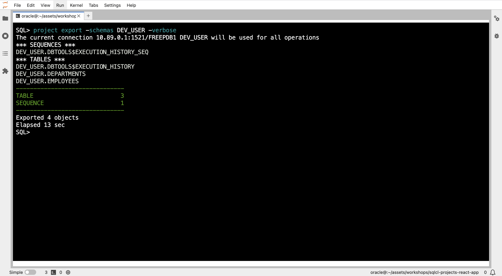
        This command **exports database objects** into your repository.
    </details>

* Execute the following command to export the newly created "Departments" table to the application folder:
            ```sql
        <copy>
            project export -objects DEPARTMENTS -verbose
        </copy>
            ```
        
        This command **exports database objects** into your repository.

>**Note:** In the export command the object is not fully qualified (DEV_USER.DEPARTMENTS) since you are currently connected to its schema (DEPARTMENTS).

* Locate the exported object files in the database folder

    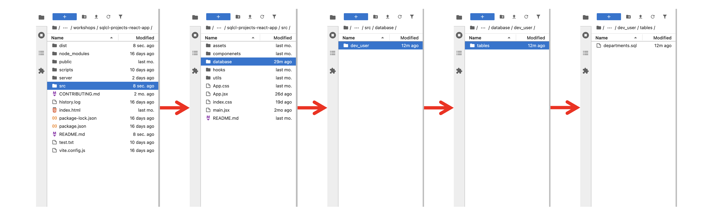

* Double click on the 'departments.sql' to see its content

    

* **Now we have made the database changes, we export our objects to have them included in our project folders.**-->

**Export Database Objects:**

1. Execute the following command to export the departments table database object to the application folder:

    ```sql
    <copy>
        project export -objects DEPARTMENTS -verbose
    </copy>
    ```

    
    <!--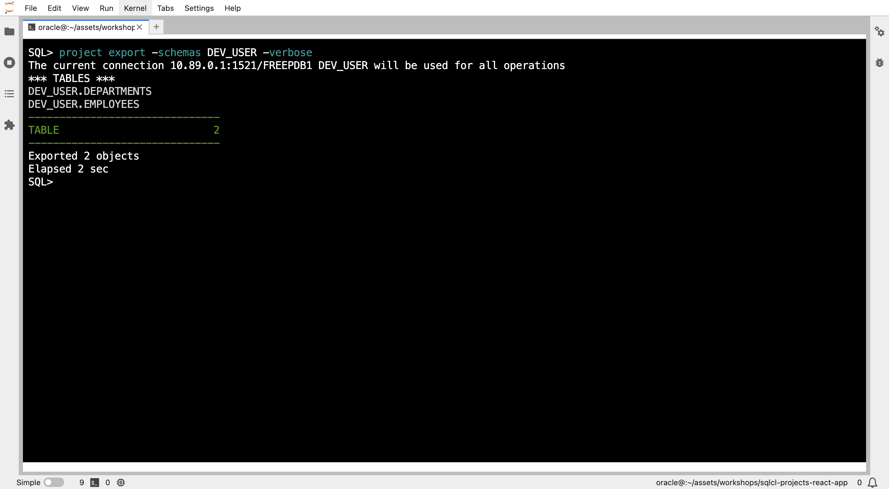-->
    <!---->
    <!---->

2. Find the exported departments table inside the database folder under src/database/dev_user/tables.

    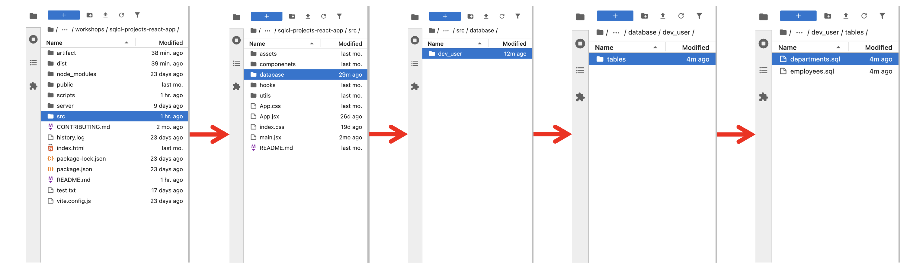
    <!---->
    <!---->

3. Double click on the 'departments.sql' to see its content.

    
    <!---->
    <!---->

## Task 4: Stage Changes (project stage)

* **Stage Changes:**

    * Add and commit changes before stage

        ```sql
        <copy>
            !git status
        </copy>
        ```

        ```sql
        <copy>
            !git add --all
        </copy>
        ```

        ```sql
        <copy>
            !git status
        </copy>
        ```

        ```sql
        <copy>
            !git commit -m "Export departments table"
        </copy>
        ```

        
        <!--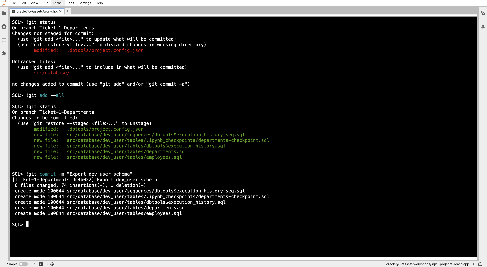-->

    * Execute the following command to stage the changes for release

        ```sql
        <copy>
            project stage -verbose
        </copy>
        ```

        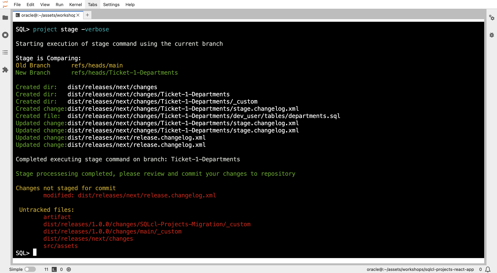
        <!---->
        <!--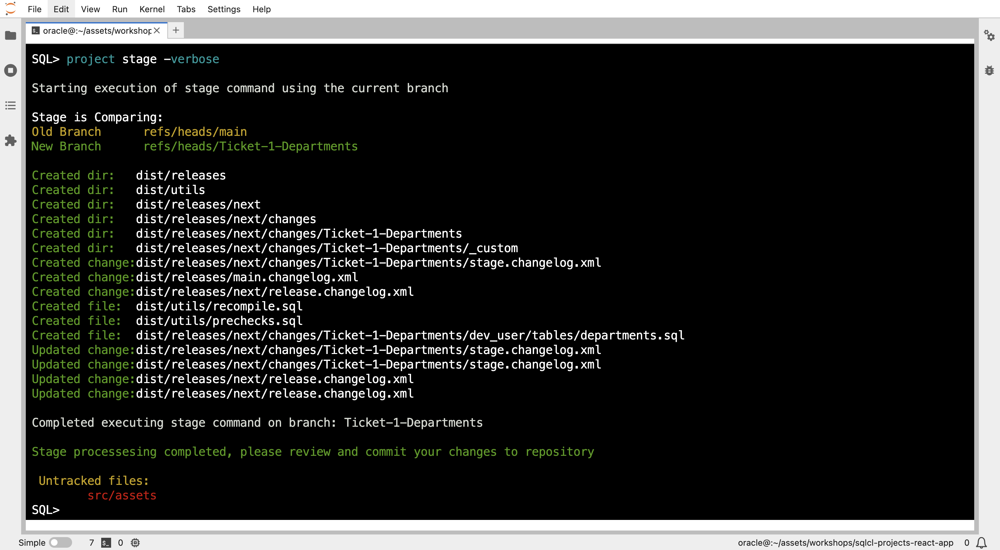-->

* **Add custom scripts**

    You can add custom scripts using the **add-custom** sub-command of the stage command.

    * Add the custom file to the stage

        ```sql
        <copy>
            project stage add-custom -file-name dept-data.sql -verbose
        </copy>
        ```

        

        This will create a custom sql file in the dist/_custom folder.

    * Navigate to the scripts folder

        

    * Copy the insert statements from `departments_table.sql`

        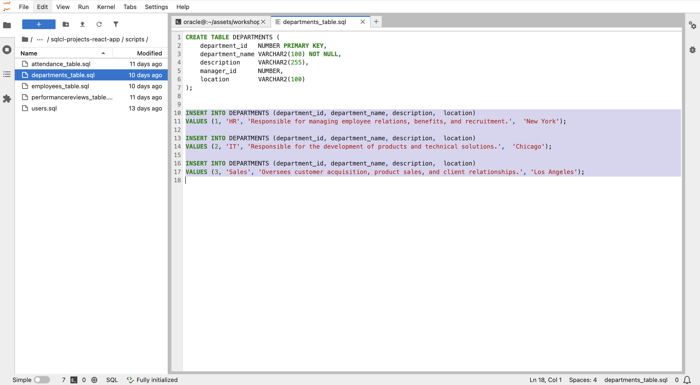

    * Locate the newly created dept_data.sql file

        The file can be found at:

        `sqlcl-projects-react-app/dist/releases/next/changes/Ticket-1-Departments/_custom/dept-data.sql`

        

    * Open the dept_data.sql file and paste the insert statements

        Double-click the file and paste the copied inserts inside and save it (Command + S or Ctrl + S).

        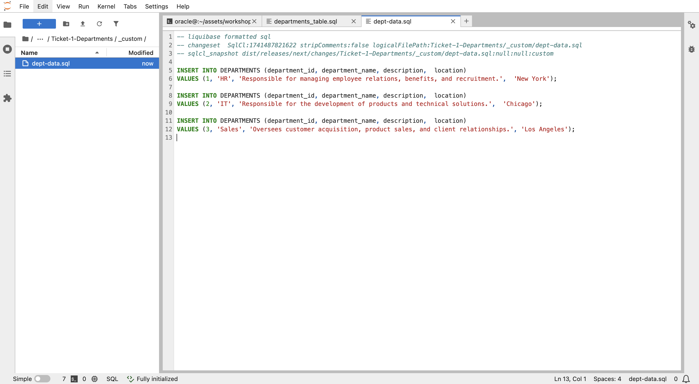

        <!--TODO: add commit-->

* **Add and commit:**

    ```sql
    <copy>
        !git add .
    </copy>
    ```

    ```sql
    <copy>
        !git commit -m "Add stage files"
    </copy>
    ```

    

* **Merge to main branch:**

    ```sql
    <copy>
        !git checkout main
    </copy>
    ```

    ```sql
    <copy>
        !git merge Ticket-1-Departments
    </copy>
    ```

    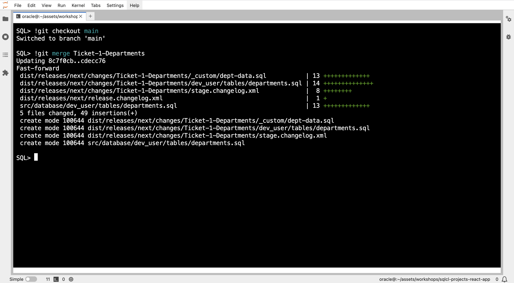
    <!---->

## Task 5: Release Changes (project release)

* Once your changes are merged into the main branch, execute the following command to create a second release:

    ```sql
    <copy>
        project release -version 2.0.0 -verbose
    </copy>
    ```

    

* Add and commit

    ```sql
    <copy>
        !git add .
    </copy>
    ```

    ```sql
    <copy>
        !git commit -m "Release 2.0.0"
    </copy>
    ```

## Task 6: Generate Deployable Artifact (project gen-artifact)

Before generating the artifact, you need to return the install.sql file to its initial state containing **lb update**.

* Open the dist/install.sql file

    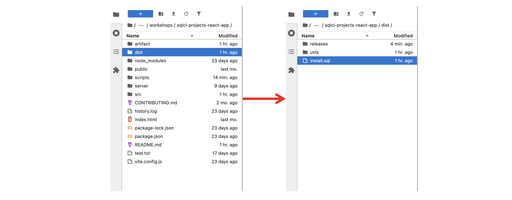

* Go to line 17 and replace **lb changelog-sync** with **lb update**

    <!---->
    

* Save the **install.sql** file by pressing **Cmd + S** on Mac or **Ctrl + S** on Windows/Linux.

* Add and commit.

* Run `project gen-artifact`

    ```sql
    <copy>
        project gen-artifact -verbose
    </copy>
    ```

    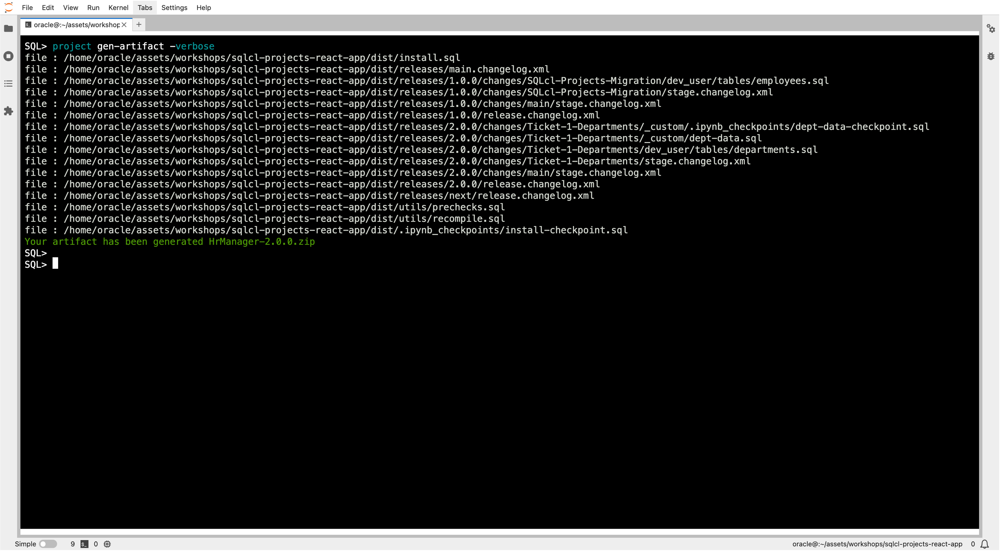
    <!--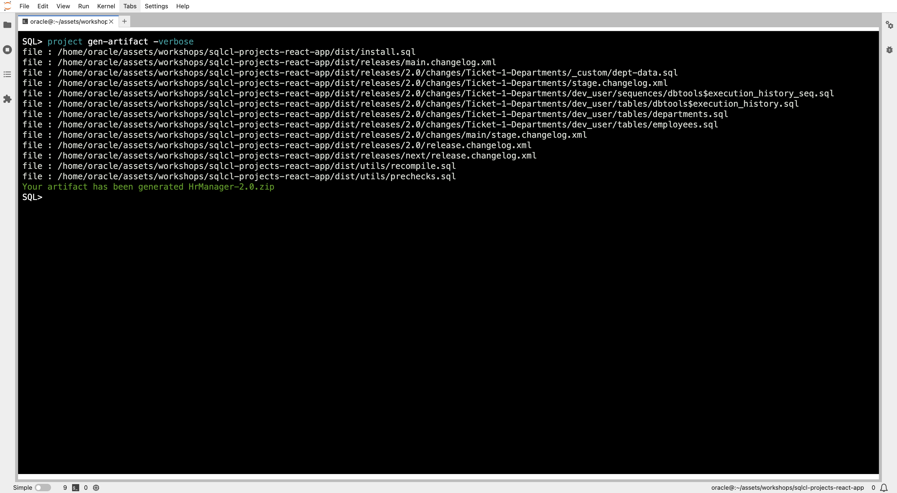-->
    <!--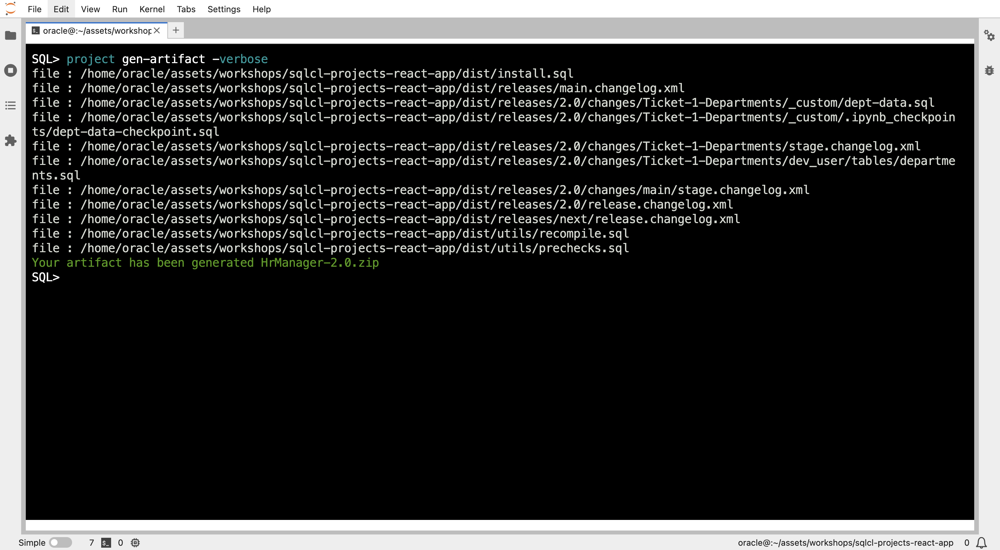-->

* If you go back to the **artifact** folder, you will find a new artifact generated.

    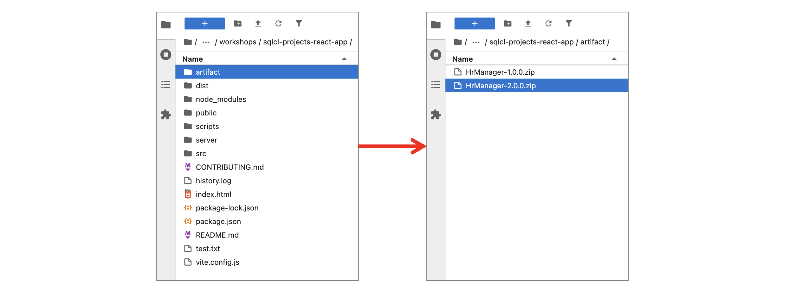

## Task 7: Deploying to Production (project deploy)

* **Connect to the Production Database:**

    * Establish a connection to the production database using SQLcl.

    * Use the `connect` command with the `PROD_USER` credentials.

    ```sql
    <copy>
        connect PROD_USER/[PASSWORD]
    </copy>
    ```

    

* **Deploy Changes to Production:**

    * Execute the following command to deploy the changes to the production database:

        ```sql
        <copy>
            project deploy -file artifact/HrManager-2.O.0.zip  -verbose
        </copy>
        ```
        <!---->
        

    * This command applies the changes defined in the release artifact to the production database without recreating existing schema objects.

    * If you check now you find the departments table in the PROD_USER. But what are the other tables ?

        

    <!--The other three created tables are liquibase tables. Liquibase is the engine of the SQLcl Projects tool that apply its command 'liquibase update' behiend scens to check if there is any differences between the source and target database, if they are it apply the changes to get them synched, if they are not, it does't do anything. So it checks that there are diffs before doing anything.-->

* **Enable REST Endpoints**

    To expose the Departments table in PROD\_USER as a REST endpoint, follow the same steps you performed for DEV\_USER in **Lab 2 → Task 3**.

    1. Open Database Actions
    2. Connect as PROD_USER
    3. Locate the Departments table, right-click on it.
    4. Select REST, then click Enable.

    </br>

* **Run the Production Application:**

    1. Restart the application using the production environment variables.
    2. Verify that the "Departments" feature is functioning correctly in the production environment.
    3. Perform thorough testing to ensure that all aspects of the feature are working as expected.

    </br>

* **The department section should look like this:**

    

**You did it!** You have successfully implemented and deployed the "Departments" feature and released the version 2 of the application using SQLcl and CICD practices. You have gained valuable experience in managing database changes, automating deployments, and working with a CICD pipeline.

After you gain this some experience, it's time for some challenges! Head to the [**next lab**](#next) and take your skills to the next level!

You may now [**proceed to the next lab**] (#next)

## Learn More

* [Oracle SQLcl Doc](https://docs.oracle.com/en/database/oracle/sql-developer-command-line/24.3/sqcug/working-sqlcl.html)
* [Oracle SQLcl Project & CI/CD Docs](https://docs.oracle.com/en/database/oracle/sql-developer-command-line/24.3/sqcug/database-application-ci-cd.html#GUID-6A942F42-A365-4FF2-9D05-6DC2A0740D24)
* [Oracle SQLcl Liquibase Docs](https://docs.oracle.com/en/database/oracle/sql-developer-command-line/24.3/sqcug/using-liquibase.html)
* [Video overview and demonstration for SQLcl Projects](https://youtu.be/qCc-f24HLCU?si=3z-aRBdzu_QhixJ9&t=182)

## Acknowledgements

* **Author** - Fatima AOURGA & Abdelilah AIT HAMOU, Junior Members of The Technical Staff, Database Tooling, SQLcl developers
* **Created By/Date** - Fatima AOURGA & Abdelilah AIT HAMOU, Software Developers, February 2025
