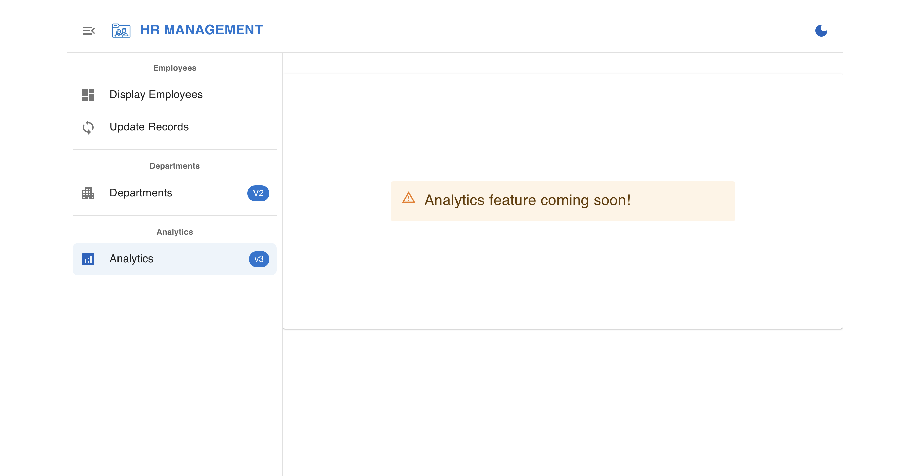
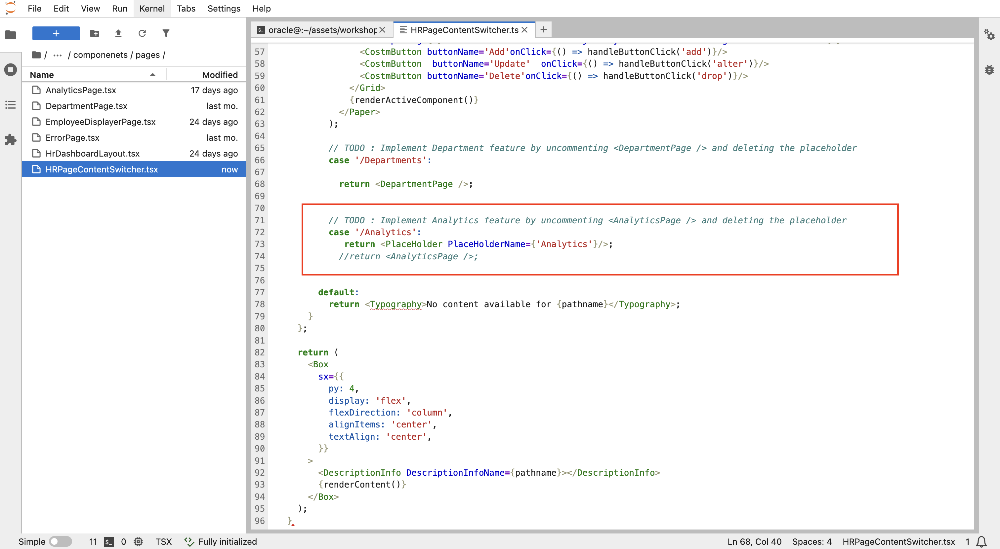
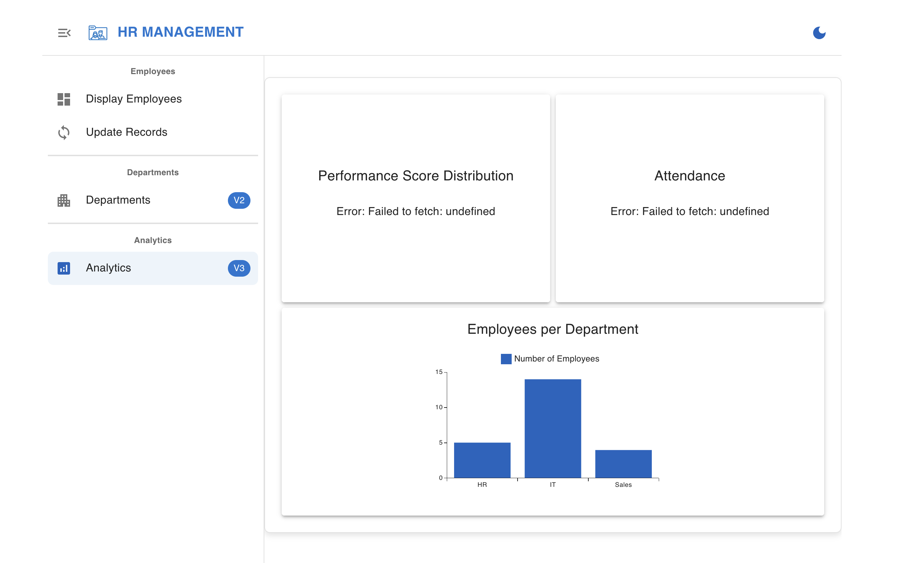

# Unveiling the Analytics Feature (Release 3.0.0)

## Introduction

You’ve just completed the "Departments" feature and deployed it successfully. But wait, it's time for an even bigger challenge: Unleashing the Analytics Engine!

In this phase, you will release version 3 (V3) of the HR application. This new feature will offer insights not only into employee and department data but also provide valuable analytics on attendance and performance reviews, helping you visualize employee engagement and productivity.

The Analytics feature was always planned but left inactive in the initial release. Now, Tech Solutions Company is ready to bring it to life, and it’s up to you to make it happen!

**The Challenge:** Unlock this page


This lab has a game-challenge approach. First, you'll get an overview of the goal. Try to solve it on your own! If you need help, you'll get a hint. Still stuck? A step-by-step solution will guide you through.

Estimated Lab Time: 15 minutes

### **Objectives**

* Assess your understanding of the project feature from previous labs and reinforce your knowledge
* Enable the Analytics feature
* Release the version 3 of the database and the application
* Overcome all the challenges successfully

### **Prerequisites**

* Complete successfully the previous labs

*Bring on the challenge! **Let’s crush it!***

## Task 1: Implement Analytics Page

When you check the Analytics page, you will find it locked, not working. In this challenge you will unlock it.



Before making changes, we need to switch back to the development environment. To do this, update the **.env** file by changing prod\_user to dev\_user, ensuring the application connects to the development database.

Now, let's modify the application code to enable the Analytics page.

> **Challenge:** Identify and update the necessary code to bring the Analytics page to life.

<details><summary>**Hint**</summary>
    Remember where we made the change for the Departments page? Go to the same place—you’ll find the required change just below it, similar to what you did for Departments.
</details>

<details><summary>**Solution**</summary>

1. From the app folder, navigate to the pages

    

2. Double click on the pages folder then the 'HRPageContentSwitcher.tsx' file

3. Find Analytics change location in the code (line 71)

    

4. Implement Analytics by removing the line 73 and uncomment line 74 just below

    

5. Refresh the application and go to the Analytics section. It should appear now

    

>**Note:** If you lost your application window, run it again as you did the first time.

As you can see, only the Employees per Department analytics is working—the others are not. This is because the performancereviews and attendance tables are missing and haven’t been created yet.

</details>

## Task 2: Apply Database Changes & Enable ORDS Endpoints

Your task is to update the database by adding the performancereviews and attendance tables to DEV_USER.

<!-- In this challenge, you will apply new database changes by adding the performancereviews and attendance tables to DEV_USER. -->

> **Challenge:** Create the necessary database tables (`attendance` and `performancereviews`) to support the "Analytics" feature.

<details><summary>**Hint**</summary>

Run the SQL scripts (attendance\_table.sql and performancereviews\_table.sql) from the scripts folder to create the required tables and populate them with data, just as you did earlier for the departments table. Once the tables are created, make sure to enable the REST endpoints for both tables to allow API access (If you need a refresher, refer to **Lab 1 → Task 4**).

</details>

<details><summary>**Solution**</summary>

1. **Step 1: Connect to DEV_USER**
    * **Using SQLcl:**

        ```sql
        <copy>
            sql dev_user/$DBPASSWORD@"$DBCONNECTION"
        </copy>
        ```

    * **Using SQL Developer Web:**
    Signin with DEV_USER credentials

2. **Step 2: Create Tables**

    * **Using SQLcl:**

        * Make sure you are in the scripts directory.

        * Execute the attendance\_table.sql and performancereviews\_table.sql

            ```sql
            <copy>
                @attendance_table.sql
            </copy>
            ```

            ```sql
            <copy>
                @performancereviews_table.sql
            </copy>
            ```

    * **Using SQL Developer Web:**

        Copy and past the content of the tabes scripts to SQL Developer Web sql worksheet and run the script.

3. **Step 3: Enable ORDS Endpoints For The New Tables**

    To make the Attendance and PerformanceReviews tables in PROD\_USER accessible as REST endpoints, repeat the steps you followed for DEV\_USER in **Lab 1 → Task 4**.

    * Open Database Actions
    * Connect as DEV_USER
    * Locate the Departments table, right-click on it.
    * Select REST, then click Enable.

4. **Step 3: Refresh the application**

    Refresh the application window to view the Analytics page with the data.

    

</details>

## Task 3: Deploy The Database Changes To The Target Database

Our target database in this case is the PROD_USER schema (production database), though it could be any other database.

To deploy changes, we will follow the SQLcl Projects workflow, just like in the previous lab.

The project is already initialized, we will now directly export the desired objects using `project export`.

> **Challenge:** Deploy to production (PROD_USER)

<details><summary>**Hint**</summary>
Follow the same steps as in the previous lab (starting from `project export`), applying **project** commands until you deploy and get the Analytics feature working.

</details>

<details><summary>**Solution**</summary>

1. Change the username in the .env file from dev\_user to prod\_user.
2. Refresh the application window. Only the "Employees per Department" chart appears since PROD_USER lacks the two new tables. You'll fix this with **project** commands.
3. In SQLcl, connect as DEV_USER and navigate to the application folder `sqlcl-project-react-app`.

    ```sql
    <copy>
        sql dev_user/$DBPASSWORD@"$DBCONNECTION"
    </copy>
    ```

    ```sql
    <copy>
        cd /home/assets/assets/workshops/sqlcl-projects-react-app
    </copy>
    ```

4. Create a new branch from the main branch and check out to it for upcoming changes.
        ```sql
        <copy>
            !git checkout -b Ticket-2-Analytics
        </copy>
        ```
5. Export the new objects from DEV_USER.

    ```sql
    <copy>
        project export -objects attendance,performancereviews -verbose
    </copy>
        ```
    <!---->
6. Add, commit then stage

    * Add and commit your changes

        ```sql
        <copy>
            !git add --all
        </copy>
        ```

        ```sql
        <copy>
            !git commit -m "Add attendance and performancereviews tables"
        </copy>
        ```

        ```sql
        <copy>
            project stage -verbose
        </copy>
        ```

        <!--
        -->

7. Add custom scripts using add-custom sub-command of stage command.

    * Add custom script for **attendance** table.

        ```sql
        <copy>
            project stage add-custom -file-name att_data.sql -verbose
        </copy>
        ```

    * Add custom script for **performancereviews** table.

        ```sql
        <copy>
            project stage add-custom -file-name perf_data.sql -verbose
        </copy>
        ```

    Copy the inserts from the tables sql files in the scripts folder and paste them into the newly created custom scripts (attendance inserts in the att\_data.sql custom file and performancereviews inserts in the perf_data.sql custom file), just as you did previously with dept\_data.sql.

8. Add and commit.

    ```sql
    <copy>
        !git add --all
    </copy>
    ```

    ```sql
    <copy>
        !git commit -m "Add stage files"
    </copy>
    ```

9. Checkout to main and then merge the previous branch to it.

    ```sql
    <copy>
        !git checkout main
    </copy>
    ```

    ```sql
    <copy>
        !git merge Ticket-2-Analytics
    </copy>
    ```

    <!---->

10. Project release and gen-artifact

    * Project release

    ```sql
    <copy>
        project release -version 3.0.0 -verbose
    </copy>
    ```

    * Add and commit

    ```sql
    <copy>
        !git add --all
    </copy>
    ```

    ```sql
    <copy>
        !git commit -m "Release 3.0.0"
    </copy>
    ```

    <!---->
    * Project gen-artifact

    ```sql
    <copy>
        project gen-artifact -verbose
    </copy>
    ```
    <!---->

11. Connect to PROD_USER and run the deploy command to apply the changes.

    ```sql
    <copy>
        connect PROD_USER/[PASSWORD]
    </copy>
    ```

    ```sql
    <copy>
        project deploy -file artifact/HrManager-3.0.0.zip  -verbose
    </copy>
    ```

12. Enable ORDS Endpoints

    To **enable** the **REST endpoints** for the **Attendance** and **PerformanceReviews** tables in PROD\_USER, follow the same procedure you used for DEV\_USER in Lab 2 → Task 3.

    * Open Database Actions
    * Connect as PROD_USER
    * Locate the Departments table, right-click on it.
    * Select REST, then click Enable.

13. Refresh the application. The Analytics page should work correctly in production environment.


</details>

## Task 4: Final Step

There is no Challenge 4 **:)** , you've reached the end of this workshop **(^_^)** and this journey. We’d like to say you:

**Congratulations, Developer!** You've successfully navigated this challenging lab and created a valuable system for this Tech Solutions Company. By completing the labs , you've demonstrated a strong understanding of database development, version control, and deployment practices. You've also gained valuable experience with SQLcl and its powerful project management capabilities.

This lab has equipped you with the essential skills to effectively develop and deploy database-driven features within a real-world application environment. Keep practicing and exploring new challenges, and continue to enhance your skills as a skilled developer.

## Learn More

* [Oracle SQLcl Doc](https://docs.oracle.com/en/database/oracle/sql-developer-command-line/24.3/sqcug/working-sqlcl.html)
* [Oracle SQLcl Project & CI/CD Docs](https://docs.oracle.com/en/database/oracle/sql-developer-command-line/24.3/sqcug/database-application-ci-cd.html#GUID-6A942F42-A365-4FF2-9D05-6DC2A0740D24)
* [Oracle SQLcl Liquibase Docs](https://docs.oracle.com/en/database/oracle/sql-developer-command-line/24.3/sqcug/using-liquibase.html)
* [Video overview and demonstration for SQLcl Projects](https://youtu.be/qCc-f24HLCU?si=3z-aRBdzu_QhixJ9&t=182)

## Acknowledgements

* **Author** - Fatima AOURGA & Abdelilah AIT HAMOU, Junior Members of The Technical Staff, Database Tooling, SQLcl developers
* **Created By/Date** - Fatima AOURGA & Abdelilah AIT HAMOU, Software Developers, February 2025