# Setup and Configure Always On Availability Group

## Introduction

This lab walks you through the steps to create the Always On Availability Group in SQL Server.

Estimated Time:  1 hour

### Objectives
In this lab, you will learn to :
* Create Sample database creation
* Enable the Always-on feature for SQL Server Engine
* Create Always On Availability Group Read-Scale Replica

### Prerequisites  

This lab assumes you have:
- A Free or LiveLabs Oracle Cloud account
- IAM policies to create resources in the compartment

##  Task 1: Create Sample Database

1. RDP to the Bastion host server using the username **.\opc** and password. From the Bastion host, opens the Remote Desktop and connect to the Node1 server using the private IP Address.

2. Open SSMS from **Windows Start Menu**, once opened choose the Server type **Database Engine**, provide the Node1 server name, Choose the **Authentication** type Windows Authentication, and then click on **Connect**.

  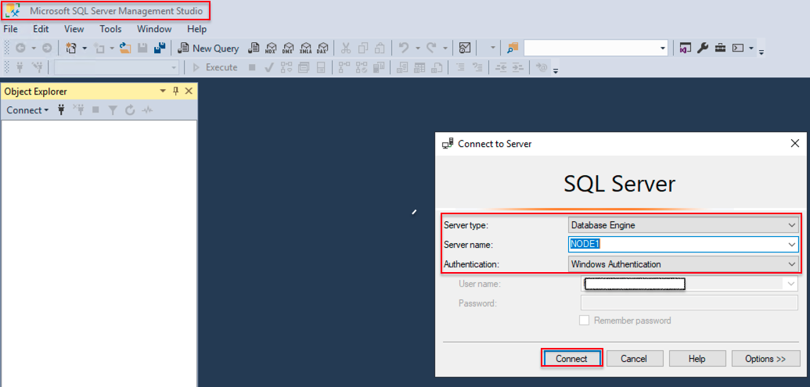

3. Once successfully connected to the database engine, click on **New Query** and create the sample database using the following script. Click on the **Execute** command to create the sample database.  

    **Create database TestAOAG;**

  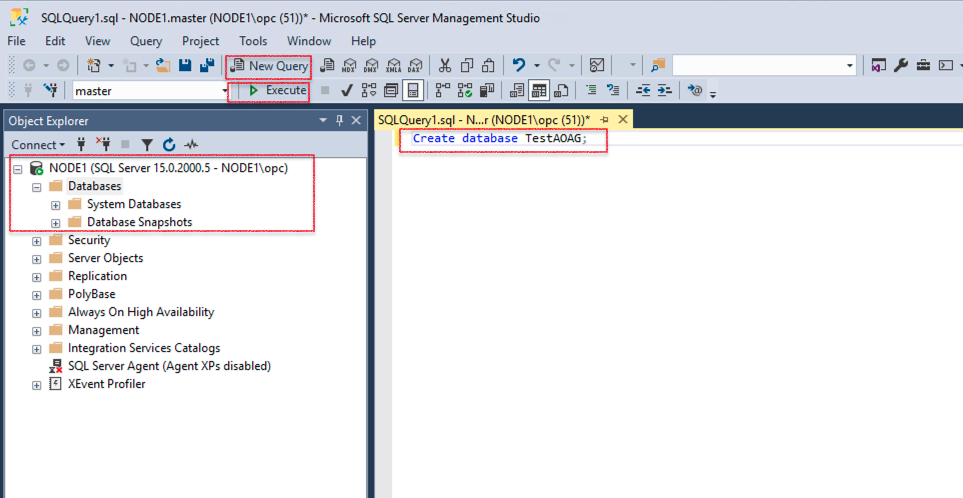

4. The database will be visible in the following image.

  

5. Select **databases**, right-click on newly created database, and then select **tasks**, choose **Backup**

  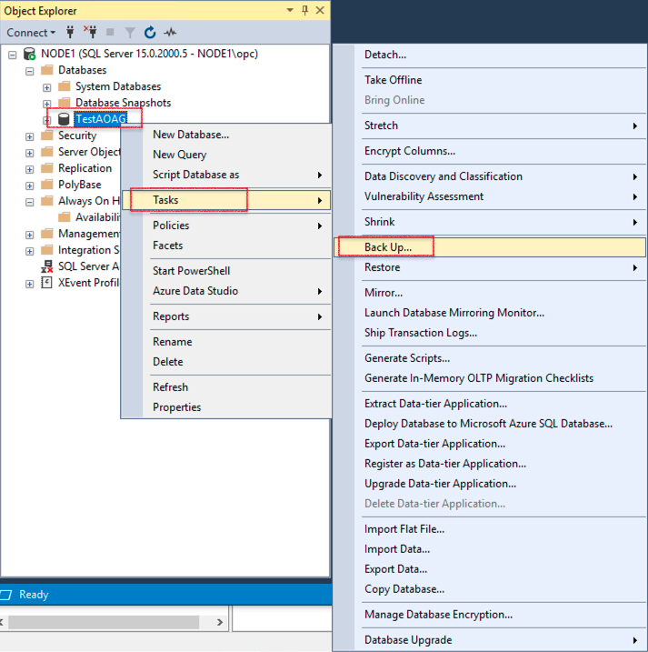

6. Choose the backup location and click on **OK**.

  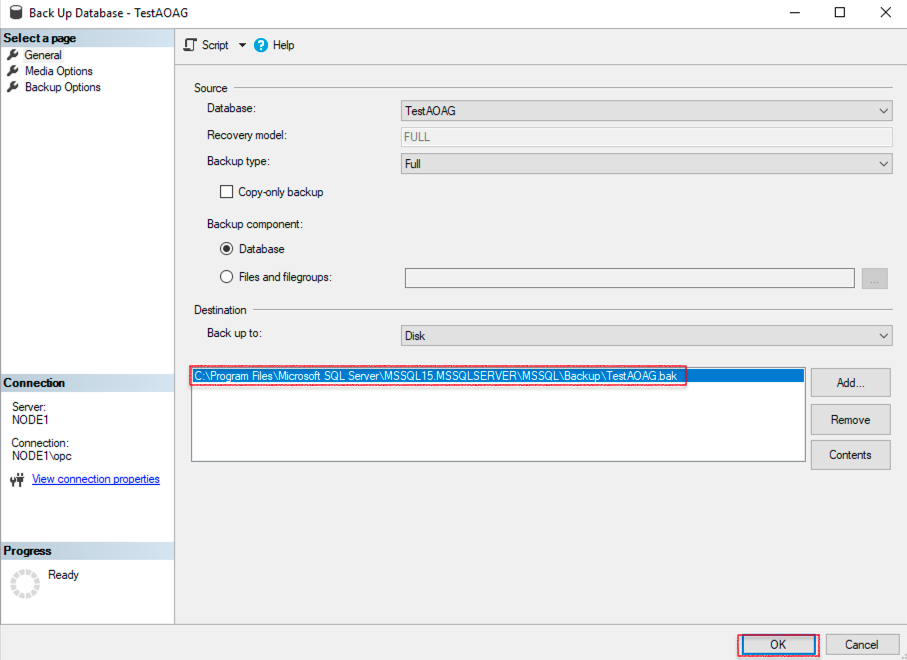

  You may now **proceed to the next lab**.

##  Task 2: Enable the Always-On feature for Primary Replica Database Engine

1. From the Windows taskbar, click the search button, search for **SQL Server 2019 Configuration Manager**, and click on the SQL Server 2019 Configuration Manager app.

  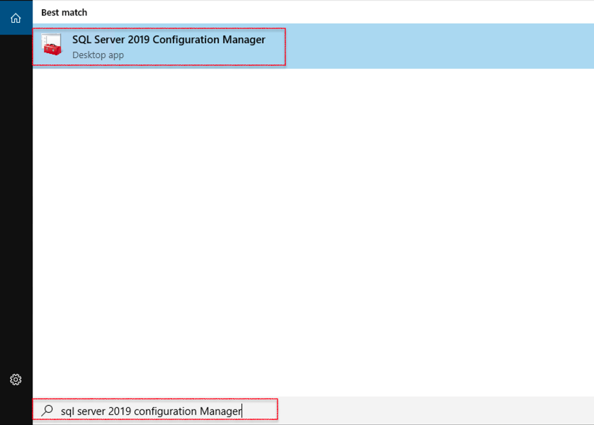

2. Right-click on database Engine **SQL Server (MSSQLSERVER)**, and then click on **Properties**.

  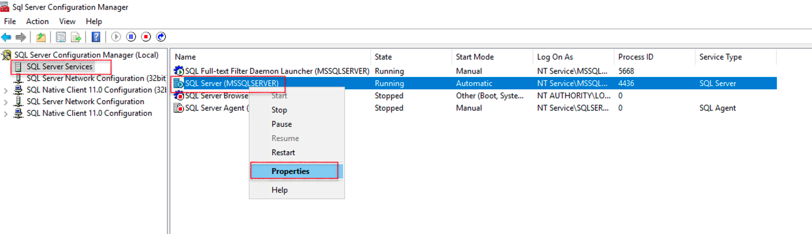

3. Click on **Always on Availability Groups**, select the check box **Enable Always on Availability Groups**, and then click on Apply.

  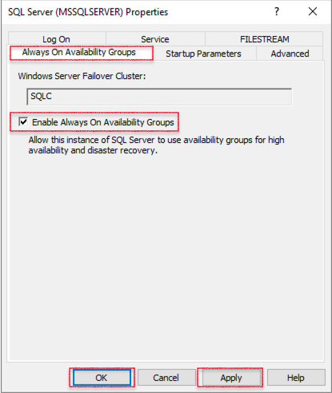

4. The following **Warning** message will appear on the screen, and then click on **OK**.

  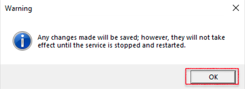

5. Finally, click on **OK** to apply the changes.

  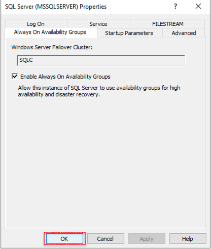

6. To apply the changes, restart the SQL Engine, Right-click on database Engine **SQL Server (MSSQLSERVER)**, and then click Restart.

  

7. To create the SQL service domain service account: From the taskbar, click the search button and search for the run command. Once the run command opens, type **dsa.MSC** to open the Active Directory users and computer, then click on **users**.

    

8. Provide the username details, and then click on **Next**.

  

9. Provide the password and confirm the password, then click on **Next** and click on **Finish** to close the create window.

  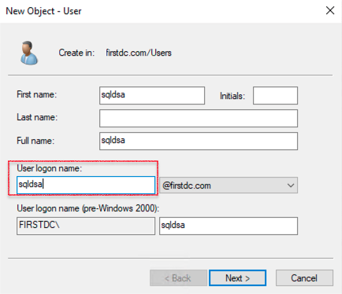

  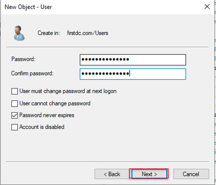

11. From the taskbar, click the search button, search for **SQL Server 2019 Configuration Manager**, and click on the SQL Server 2019 Configuration Manager app.

12. Right-click on database Engine **SQL Server (MSSQLSERVER)** and then click on **Properties**. Click on **Log On** and provide the user name and password created in the above step, and then click on **apply** and **OK** to apply changes.

 

##  Task 3: Enable the Always-On feature for Secondary Replica Database Engine

  * Repeat all the steps from Task 2 to enable the **Always On feature for Node2**.
  
##  Task 4: Configure Always On Availability Group Read-Scale Replica without a Cluster

1. Open SSMS from **Windows Start Menu**, once opened choose the Server type **Database Engine**, provide the Node1 server name, Choose the **Authentication** type Windows Authentication, and then click on **Connect**.

  

2. Navigate to **Always On High Availability**, right-click, and click on **New Availability Group Wizard**.

  

3. This screen shows the **Introduction** of setup Wizard.

  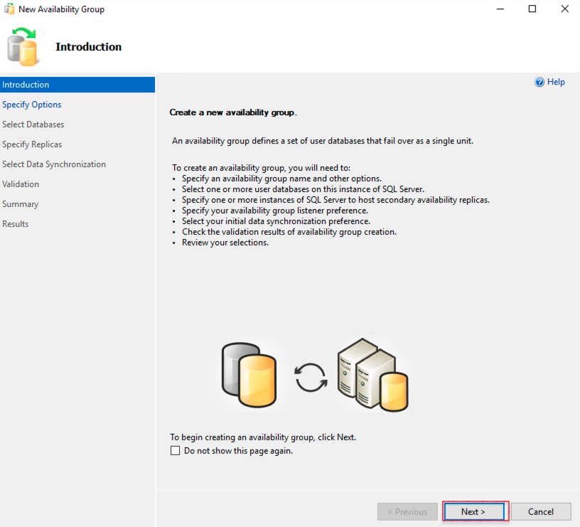

4. In **Specify Options**, provide the **Availability group name**, and then click on **Next**.

  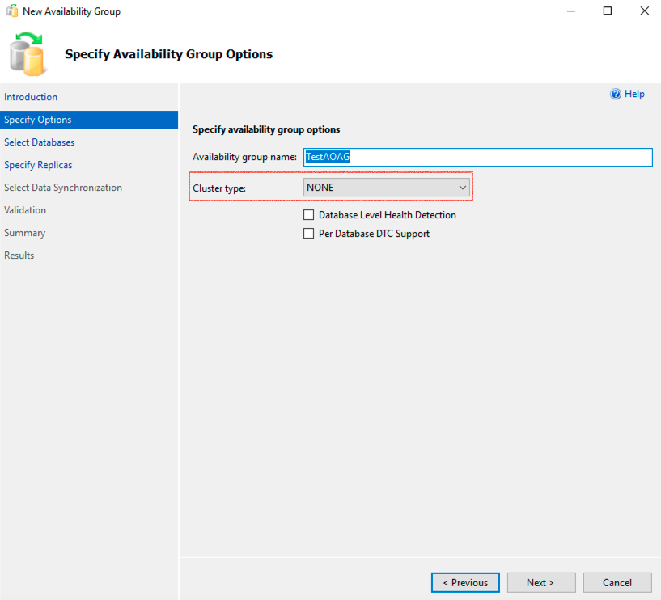

5. Select the database you need to create in the **Select Databases** section.

  

6. In **Specify Replicas**, click on **Replicas**, and then click on **Add Replica**. The setup will pop up **Connect to Server**.

  

7. click on **Connect**.

  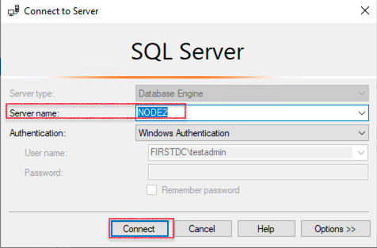

8. The **Replicas** screen is shown as follows.

  

9. In **Select Data synchronization**, and then select the **Automatic Seeding**.

  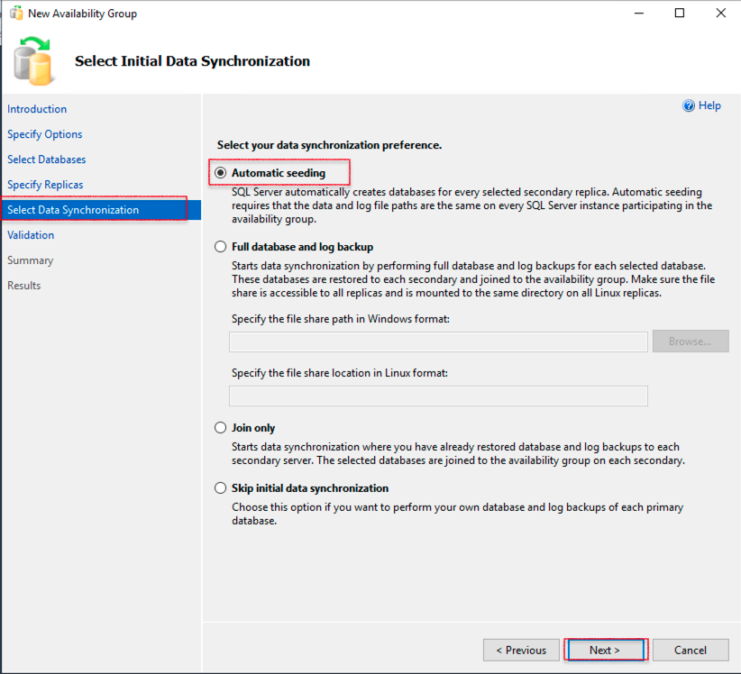

10. The **Validation** screen shown as follows.

  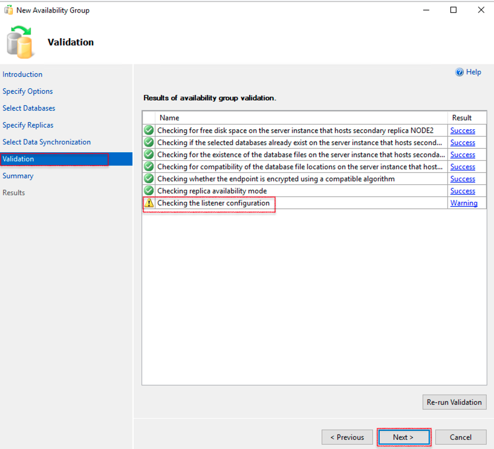

11. The **Summary** screen shows as follows, and then click on **Finish**

  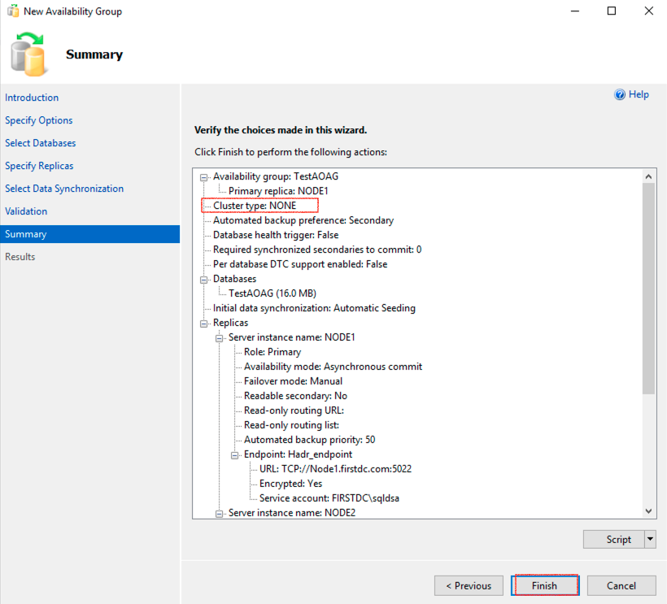

12. The **Results** section shows the **The wizard completed successfully** message as shown in the following image, and then click on **Close**.

  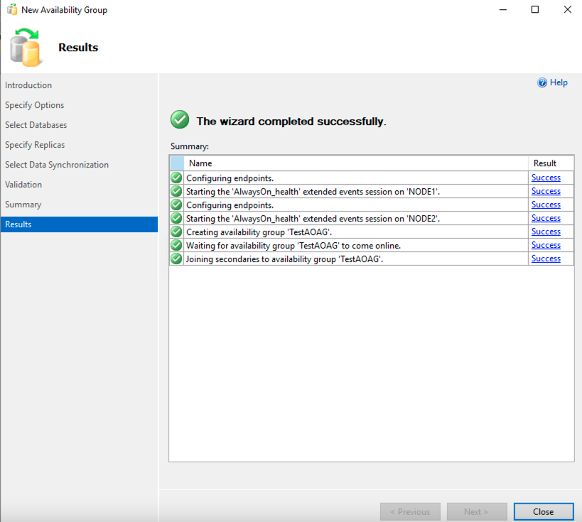

13. Open the show dashboard on the newly created Availability Group. You can see the successfully primary and read replica shown in the following image.

  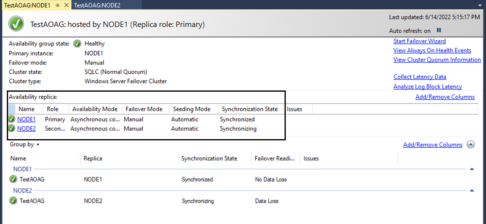

  Congratulations !!! You Have Completed Successfully The Workshop. 

## Acknowledgements
* **Author** - Devinder Pal Singh, Senior Cloud Engineer, NA Cloud Engineering
* **Contributors** -  Ramesh Babu Donti, Principal Cloud Architect, NA Cloud Engineering
* **Last Updated By/Date** - Devinder Pal Singh, Senior Cloud Engineer, NA Cloud Engineering, July 2022