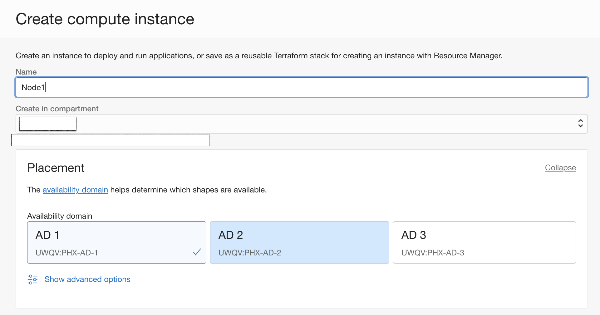
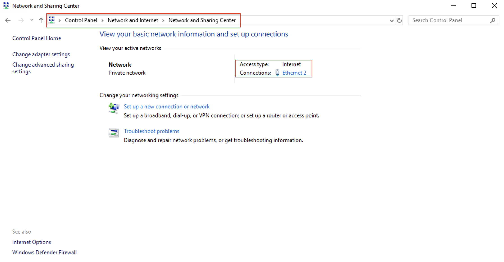
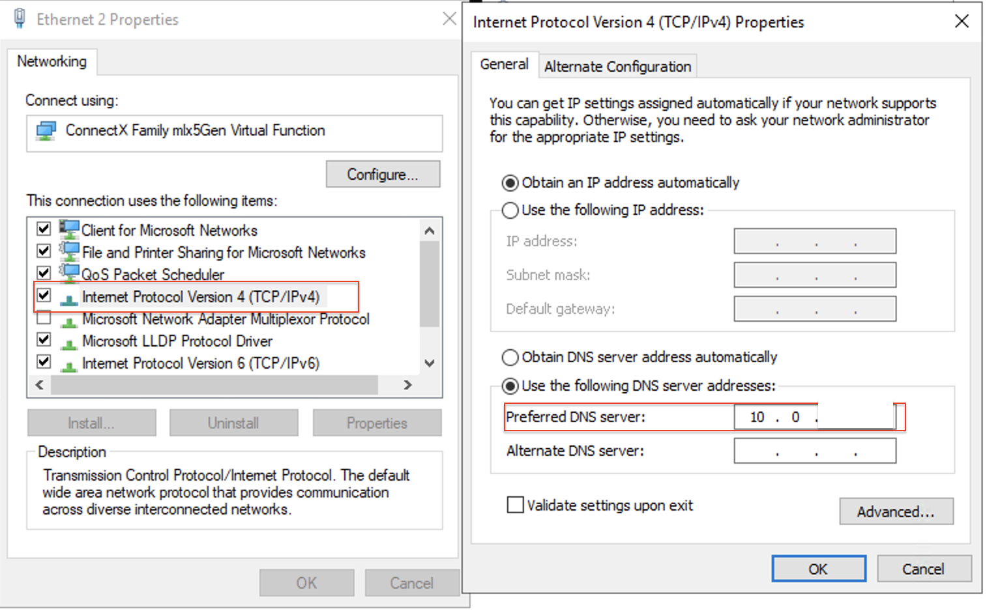
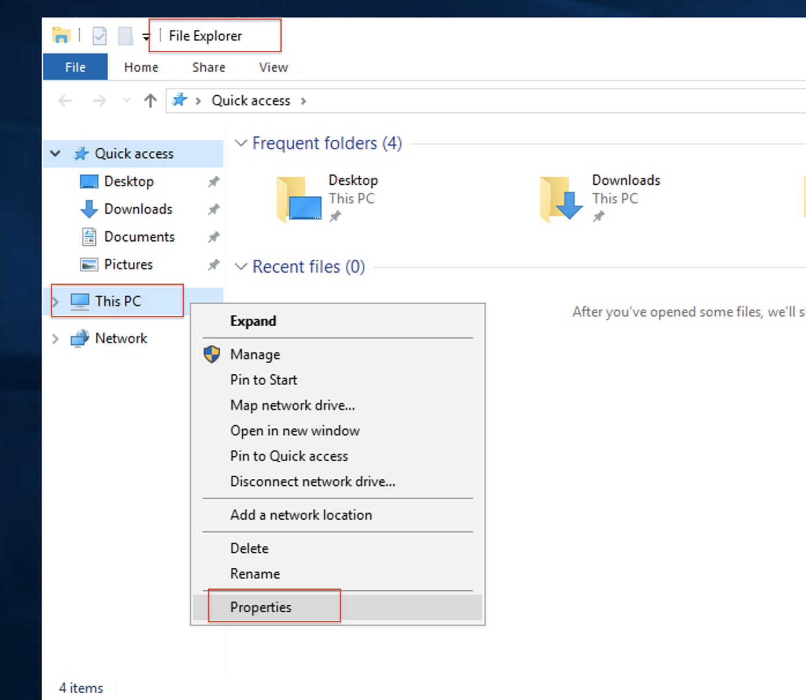
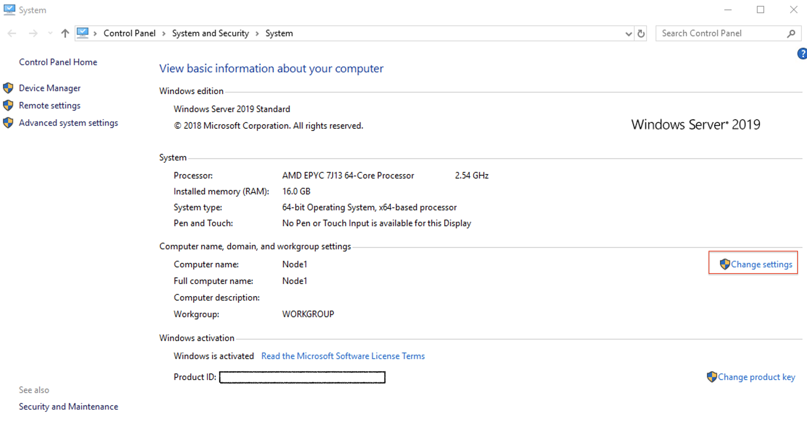
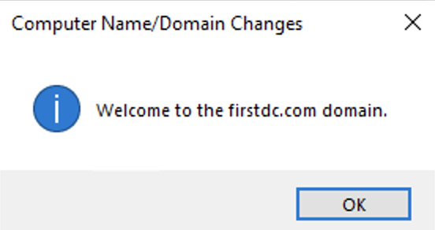
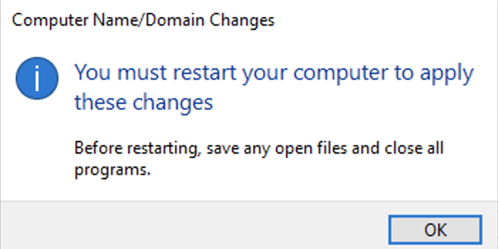
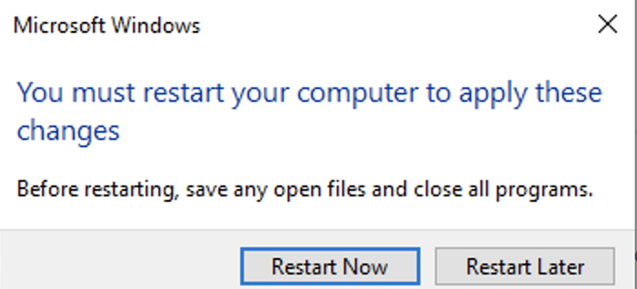

# Provision of the Compute Instance from Market Place Image for SQL Server 2019

## Introduction

This lab demonstrates how to provision Microsoft SQL Server 2019 from the Market Place Image in a Compute Instance.

Estimated Time:  1 hour 30 min

### Objectives
In this lab, you will learn to:
* Deploy Microsoft SQL Server 2019 from the marketplace image
* Register the Computer Instances to Active Directory Domain Controller

### Prerequisites

This lab assumes you have:
- A Free or LiveLabs Oracle Cloud account
- IAM policies to create resources in the compartment
- Required Subnets are available in VCN

##  Task 1: Provision the SQL Server 2019 from Market Place for Primary Replica

1. Open the navigation menu, click **Marketplace**, and then click **All Applications**.

  

2. Marketplace **All Applications** will be shown below. Search for **SQL Server 2019** image and select the desired edition for SQL Server. The marketplace image is available in Enterprise and Standard Edition. Always On Basic Availability Groups provide a high availability solution for SQL Server from version 2016 and above on Standard Edition. An Availability Group supports a failover environment for a single database in Standard Edition.

  

3. Choose the compartment and click on **Launch Instance**. It will take the screen to the launch Compute Instance.

  

> **Note: You will be charged a minimum of 744 hours for the MS SQL Server Marketplace image.

4. Choose the Instance name and compartment, and select the desired Availability Domain.

  

5. Click on **Change Shape** to select the shape of the Instance.

  

6. Choose the compartment where the Compute Instance should reside, and then choose the private subnet as shown below the image.

  

7. Choose the default values and click on the **Create** Instance.

  

8. Once the Compute Instance is provisioned, you can see the Instance state is running.

  

##  Task 2: Add the Primary Replica Server to Active Directory Domain

1. RDP to the bastion host and login to the Node1 server using the private IP.

2. Open **Control Panel**and navigate to **Network and Internet\Network and Sharing Center**.

  

3. Click on **Ethernet** connection, then click on **properties**.

  
4. Click on **IPv4**, and then click on **properties**. Choose the ****Use the following DNS Server Addresses:** and enter the private IP address of the Domain you created in Lab1, then click **OK** to save the changes.

  

5. Open the File Explorer, right-click on **This PC**, and then click on **properties**.
  

6. The following popup will be opened, and click on **Change Settings**.

  

7. Click on **Computer Name**, and then click on **Change**. Choose **Domain** and enter the domain name, then click **OK** to save the changes.

  

8. The system will prompt for the domain administrator **username** and **password**. Provide the **domainname\username**and **password**, and then click on **OK** to apply the changes.

  

9. On successfully adding the server to the Domain, you can see the successful message shown below.

  

10. The system will ask for a restart popup message on the screen. Click on "OK" to reboot the system.

  

11. The system will prompt the popup on the screen, and then click on **Restart Now**.  

  

12. To view the **complete computer name**, open the **Control Panel** and then go to **System and SecuritySystem**.

  

##  Task 3: Provision the SQL Server 2019 from Market Place for Secondary Replica

* Repeat all steps from **Task 1** to provision the Microsoft SQL Server from Marketplace for Secondary Replica in the different private subnet.

##  Task 4: Add the Secondary Replica Server to Active Directory Domain

* Repeat all steps from **Task 2** to add the Secondary Replica Server to Active Directory Domain in the different private subnet.

##  Task 5: Download and install SQL Server Management Studio in Primary as well as Secondary Replica servers

1. Download and install SQL Server Management Studio [link](https://go.microsoft.com/fwlink/?linkid=2195969&clcid=0x409) from the browser.

  

2. Click on **SSMS-Setup-ENU.exe** to install the SQL Server Management Studio. The installation process is shown in the following image. 

  

3. The successful installation process is shown in the following image. 

  

  You may now **proceed to the next lab.**

## Learn More
- You can find more information about Launching a Windows Instance [here](https://docs.oracle.com/en-us/iaas/Content/GSG/Tasks/launchinginstanceWindows.htm)

## Acknowledgements
* **Author** - Devinder Pal Singh, Senior Cloud Engineer, NA Cloud Engineering
* **Contributors** -  Ramesh Babu Donti, Principal Cloud Architect, NA Cloud Engineering
* **Last Updated By/Date** - Devinder Pal Singh, Senior Cloud Engineer, NA Cloud Engineering, July 2022