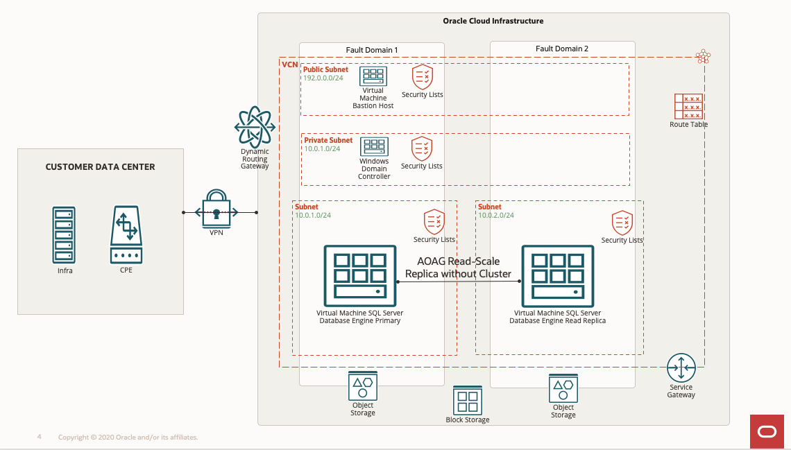

# Introduction

## About this Workshop

This hands-on workshop provides users with step-by-step instructions on installing and configuring the MS SQL Server 2019 Read-Scale Availability Group without a cluster in Windows. 

**Architecture:**
This reference architecture includes a Microsoft SQL Server Read-Scale Availability Group between two Microsoft SQL Servers and the Bastion Host server hosted on Oracle Cloud Infrastructure.

The Oracle Cloud Infrastructure region provides object storage (for backup) for the Region. The Region includes a single availability domain with two fault domains. 

The Availability Domain provides block storage for the Availability Domain. It also contains a virtual cloud network (VCN) with four regional subnets and a service gateway. The VCN provides routing tables for each subnet, and each subnet provides its security list access.

* Bastion host layer: A Bastion host resides in one fault domain. An internet gateway provides a public connection.
* Microsoft SQL Server Always On Availability Read-Scale Group: A primary Microsoft SQL Server Database resides in one fault domain and communicates with a Read-Scale Replica Microsoft SQL Server database in another fault domain. 
* Domain controller layer: A domain controller resides in a single fault domain to which Compute Instances are attached.
  

Estimated Time: 4 Hours

**Workshop Objectives**
In this workshop, you will learn how to:
* Setup the Windows bastion host
* Installation of Microsoft SQL Server 2019 from MarketPlace images
* Setup and Configure the Microsoft SQL Server 2019 Read-Scale Availability Group

**Prerequisites**
* An Oracle Free Tier, Always Free, Paid, or LiveLabs Cloud Account
* Some understanding of cloud and security terms is helpful
* Familiarity with Oracle Cloud Infrastructure (OCI) is helpful
* Required Subnets: One public subnet for the Bastion host and three private subnets to host the Domain Controller, Microsoft SQL Server Nodes, and Quorum Server

## Acknowledgements
* **Author** - Devinder Pal Singh, Senior Cloud Engineer, NA Cloud Engineering
* **Contributors** -  Ramesh Babu Donti, Principal Cloud Architect, NA Cloud Engineering
* **Last Updated By/Date** - Devinder Pal Singh, Senior Cloud Engineer, NA Cloud Engineering, July 2022