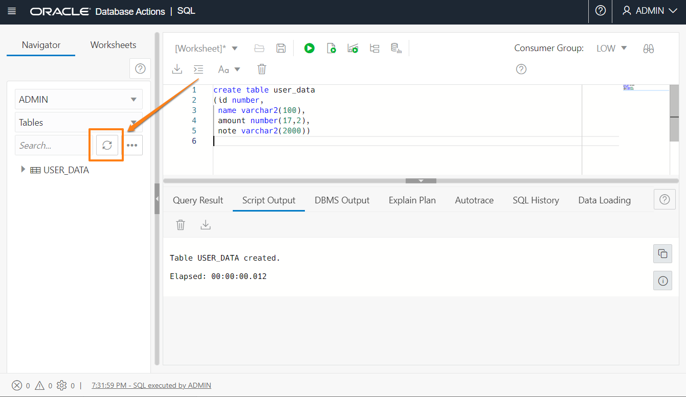
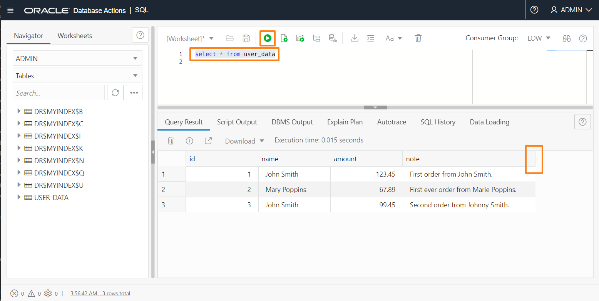
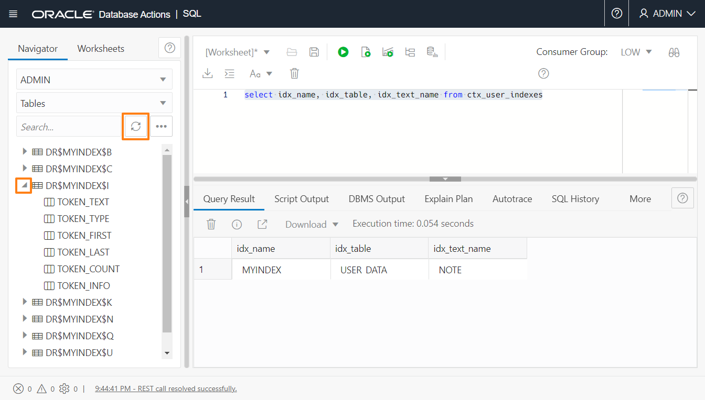
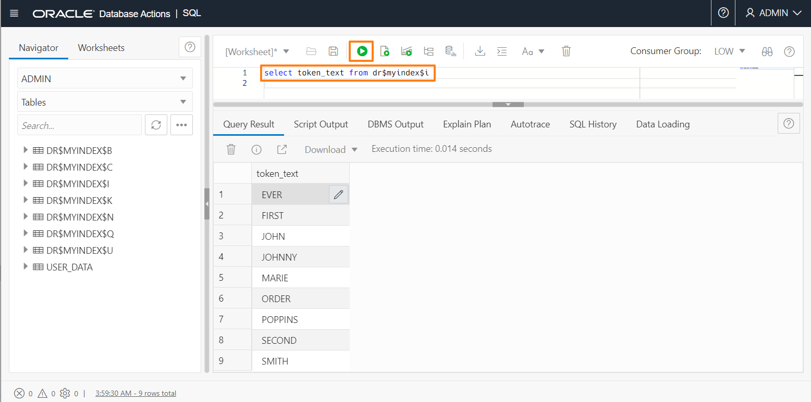

# Create an Oracle Text index

## Introduction

This lab will use the SQL Workshop in Database Actions from the Autonomous Transaction Processing page. It will create a simple Oracle table with a textual column in it, and create an Oracle Text index on that table.

We will then briefly explore information about the index before moving on to queries in the next lab.

Estimated Time: 10 minutes

### Objectives

In this lab, you will:

* Create and populate a table with a textual column
* Create a text index on that table
* Examine the created index

### Prerequisites

* Be logged into your Oracle Cloud Account

## Task 1: Open Database Actions

1. Log in to the Oracle Cloud.

<if type="freetier">

2. If you are using a Free Trial or Always Free account, and you want to use Always Free Resources, you need to be in a region where Always Free Resources are available. You can see your current default **Region** in the top, right-hand corner of the page.

    

</if>
<if type="livelabs">

2. If you are using a LiveLabs account, you need to be in the region your account was provisioned in. You can see your current default **Region** in the top, right-hand corner of the page. Make sure that it matches the region on the LiveLabs Launch page.

    

</if>

3. Click the navigation menu in the upper left to show top-level navigation choices.

4. Click on **Oracle Database** and choose **Autonomous Transaction Processing**.
<if type="livelabs">

    

5. Use the __List Scope__ drop-down menu on the left to select the same compartment where you created your Autonomous Database in Lab 1. Make sure your workload type is __Transaction Processing__. <if type="livelabs">Enter the first part of your user name, for example `LL185` in the Search Compartments field to quickly locate your compartment.

    

</if>
<if type="freetier">
5. If using FreeTier, your compartment should be the root compartment for your tenancy.

    
</if>

<if type="freetier">
   **Note:** Avoid the use of the ManagedCompartmentforPaaS compartment as this is an Oracle default used for Oracle Platform Services.
</if>

<if type="freetier">
6. You should see your database **TEXTDB** listed in the center. Click on the database name "TEXTDB".
</if>

<if type="livelabs">
6. You should see your database **TEXTDBnnnnn** (where nnnn represents your LiveLabs user id) listed in the center. Click on the database name "TEXTDBnnnn".
</if>

    

7.  On the database page, choose __Database Actions__.

    

8.  You are now in Database Actions.

    Database Actions allows you to connect to your Autonomous Database through various browser-based tools. We will just be using the SQL workshop tool.

## Task 2: Create and populate a simple table

1. You should be in the Database Actions panel. Click on the **SQL** card

    

    When you first enter SQL, you will get a tour of the features. We recommend you step through it, but you can skip the tour by clicking on the "X". The tour is available at any time by clicking the tour button.

    


2. We will create a simple table to keep mock user sales records. It contains a numeric column for record ID, a varchar column for customer name, another numeric column for sales amount, and another varchar column for note. Copy the following into the 'Worksheet' area and press the "Run Statement" button:

    ```
    <copy>
    create table user_data
    (id number,
     name varchar2(100),
     amount number(17,2),
     note varchar2(2000)
    )
    </copy>
    ```

    

    You should see a message "Table USER_DATA created". On the left side of the screen, click the "Refresh" button to see your new table in the table list.

    

3. Populate the table with a few rows.

    Copy the following SQL into the worksheet area. Make sure you *highlight the whole statement* with your mouse, and press the "Run Statement" button:

    ```
    <copy>
    insert into user_data
        select 1, 'John Smith', 123.45, 'First order from John Smith.' from dual
            union
        select 2, 'Mary Poppins', 67.89, 'First ever order from Marie Poppins.' from dual
            union
        select 3, 'John Smith', 99.45, 'Second order from Johnny Smith.' from dual
    </copy>
    ```

    

    **Note:** You should see "3 rows inserted" at the bottom. If you just see the values listed, you didn't highlight the statement, and SQL Workshop only run the SELECT rather than the INSERTs. You can try again.

4.  Check that we have rows in the table

    Copy the following simple SELECT into the worksheet area and press "Run Statement".

    ```
    <copy>
    select * from user_data
    </copy>
    ```

    You should see the rows you inserted. You can expand the view to see the whole text column by adjusting the column header.

    If there are no rows shown, return to Step 3.

    

## Task 3:  Create a Text Index

Text indexes are an example of a **domain index**. Domain indexes are specialized indexes for particular types of data (or 'domains'). To tell the kernel what type of index to create, we use the special syntax "INDEXTYPE IS ...". The most common type of text index, and what we shall use here, is a CONTEXT indextype. 

1. Copy, and run, the following SQL which will create an index on the TEXT column of our table.

    ```
    <copy>
    create index myindex on user_data(note) indextype is ctxsys.context
    </copy>
    ```

    You should see "Index MYINDEX created" in the message area.

2. Examine database views for the index

    Copy and run the following query:

    ```
    <copy>
    select index_name, index_type, status from user_indexes
    where index_name = 'MYINDEX'
    </copy>
    ```

    

    So there is your index, with an index_type of 'DOMAIN' and a status of 'VALID'. A Text index must be VALID for you to use it. An index being created on a large table may show as INPROGRS, meaning index creation is in progress, and it's not yet ready to use.

    We can also look in the "Text Data Dictionary". That's a set of views owned by the user CTXSYS, and is specifically for Oracle Text indexes. The views are all prefixed 'CTX_' and are viewable by all users. Run the following:

    ```
    <copy>
    select idx_name, idx_table, idx_text_name from ctx_user_indexes
    </copy>
    ```

    

    That tells us that our index MYINDEX is created on table USER_DATA, column NOTE.

3.  Look at the underlying tables created.

    Text indexes are implemented as a set of underlying tables. These usually have the form DR$&lt;indexname&gt;$&lt;suffix&gt;, where the suffix indicates the particular type of table. There's normally no need to know what is in these indexes, but one in particular (the "dollar I" table) is interesting.

    Refresh the list of tables on the left side of the screen.

    

    You should see several tables listed. Open the table definition for DR$MYINDEX$I by clicking on the triangle next to it.

    We see a list of columns. The main one we're interested in is TOKEN_TEXT.

    We discussed earlier how Oracle Text uses "word-based" indexes. To be more accurate, it uses "token-based" indexes, because a token is not necessarily a word (though it usually is).  The "$I" table contains a list of all the indexed tokens, and we can view them with the following query:

    ```
    <copy>
    select token_text from dr$myindex$i
    </copy>
    ```

    

    You may want to expand the output window upwards so you can see the full list of indexed words.

    Notice anything about the list? Not all the words in the text appear - "from" is missing. That's because it is designated "stop word" - common words that are not very useful in searches, but are likely to take up a lot of space
    in the index. By default, we don't index them - though using advanced options we can tell the system to index all words,
    or provide a "custom stoplist" of words we don't want to be indexed. The default list of stopwords will vary with language and
    will depend on the default language setting for the database (always English for Autonomous Database).
    You can customize your stop word list following the examples here: [Create Stop List](https://docs.oracle.com/en/database/oracle/oracle-database/19/ccref/CTX_DDL-package.html#GUID-3336B8E9-13FB-4997-A9AD-8D9A207B10C4) and [Add Stop Word] (https://docs.oracle.com/en/database/oracle/oracle-database/19/ccref/CTX_DDL-package.html#GUID-5D27665E-8ECC-4703-94CC-83387BB7ABCD).
    We don't need to know anything about the underlying index tables at the moment. But it's useful to see the words that are indexed,
    and it can sometimes be worth referring to this list when trying to figure out why a particular query acts as it does (queries
    are covered in the next lab).

You may now continue to the next lab.

## Acknowledgements

- **Author** - Roger Ford, Principal Product Manager
- **Contributors** - Alexandra Czarlinska, James Zheng, Arabella Yao
- **Last Updated By/Date** - Arabella Yao, Database Product Manager, July 2022