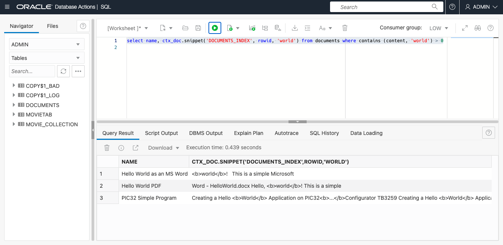

# Index Files

## Introduction

In the previous labs, we've shown you how to index simple VARCHAR2 text. But Oracle Text is capable of far more than that. For example, it can automatically recognise and handle around 150 different binary file formats. Got a PDF document? No problem. Want to index all the text out of your Powerpoint presentations? Sure, why not?

Oracle Text can handle files which are held on the file system or at URLs, but for this example, we're going to load the file(s) directly into the database, in a BLOB (Binary Long OBject) column.

This lab is optional once you've completed all the previous labs. You can index your own files, or use a simple Microsoft Word file provided by us.

Estimated Time: 15 minutes

### Objectives

In this lab, you will:

* Copy files to Object Store
* Create "pre-authorized request" URLs to access those files
* Load the files into the database using **DBMS\_CLOUD.GET\_OBJECT**
* Create a preference telling Text to use the *AUTO_FILTER*
* Index the files and search using content words

### Prerequisites

* Be logged into your Oracle Cloud Account
* Have completed at least Lab 2, Creating Indexes

## Task 1: Open Database Actions

We'll assume you're already in Database Actions having just completed the previous lab. If not, then follow Task 1 in Lab 3: Queries.

## Task 2: Load files to Object Store

1. Go to the Home menu in Oracle Cloud (note this is *not* the same as the menu for Database Actions - it's probably open in a different tab).

    Open the "hamburger" menu and choose **Storage** then **Buckets** under "Object Storage and Archive Storage".

    

    In the Buckets page, choose your root compartment from the "Search Compartments" box:

    

    Then click "Create Bucket"

    
    
    You can provide a name or just leave the default. Click **Create**

    Now click on the newly-created bucket

    

    Scroll to the bottom of the page to find **Objects** and click on **Upload**

    

    In the "Upload Objects" panel, you can use the file selector to choose some Office or PDF files from your machine, or drag-and-drop them to the page.

    If you don't have any suitable files, you can download a simple Microsoft word document from [here](https://objectstorage.uk-london-1.oraclecloud.com/p/-fze7nd2MPH98MRC1FfwSMTbyffQ5up0LBJY1N5t4wFzEhNnN3x5JDR7W2plIhgW/n/adwc4pm/b/TextLiveLab/o/HelloWorld.docx)

    A note about PDF files: Oracle Text cannot deal with PDF files which are pure images (even if they are images of text - we don't have OCR capabilities). The PDF files must have text embedded. Occasionally PDF files are protected against text access, or use special "bitmap" fonts which cannot be read. However, the vast majority of PDF files will work.

    Once you've chosen your files, click the "Upload" button to finish. Then click **Close** and you should see your files listed in the bucket.

    

2.  Create Pre-Authenticated Requests (PARs) for the files

    For each file in the bucket, we will need to create a "Pre-Authenticated Request". This is a special URL which contains an embedded access key for the file. It means anyone with access to that URL can access the file, but it is virtually impossible to guess the URL.

    Click on the "three dots" menu at the right of the file, then choose **Create Pre-Authenticated Request**

    

    On the panel that pops up, leave "Object" selected and click the **Create Pre-Authenticated Request** button

    You will see a panel "Pre-Authenticated Request Details" Click on the Copy button to copy the URL, and then save it to a text file for later use. Repeat for each file you want to index.

    Note: Don't worry about the scary "It will not be shown again". You can create another PAR whenever you like.


## Task 3: Load the files into Autonomous Database

Open the Database Actions tab in your browser (or reopen it using earlier instructions if you need to) and go to SQL.

1.    Create a table to hold file data. Run the following statement:

    ```
    <copy>
    create table documents (name varchar2(50), content blob)
    </copy>
    ```

2.   Load the files from Object Store into your table. 

    Run this once for each file you've stored, substituting in the PAR URL (that you saved in the previous step) and a short name or description.

    ```
    <copy>
    declare
       body blob;
    begin
       body := dbms_cloud.get_object(null, 'https://objectstorage.uk...HelloWorld.docx');
       insert into documents values ('Hello World as an MS Word file', body);
    end;
    </copy>
    ```
3.  Check the files have loaded properly by fetching the name, and the size of the LOB column

    ```
    <copy>
    select name, dbms_lob.getlength(content) from documents    
    </copy>
    ```

    

## Task 4: Index the documents

1.   Create a FILTER preference

    Oracle Text is clever enough to figure out that if it's indexing a BLOB column, it is clearly dealing with binary files, which need to be passed through the *AUTO\_FILTER* to be recognised and converted into text. So actually we could just create a straightforward text index as we did before. But to illustrate how we can customize index options, we're going to show you how to create a *preference* which explicitly tells text to use AUTO\_FILTER, overriding any defaults for the type of data that it's indexing. We'll also set a TIMEOUT attribute for our preference, telling it not to spend more than 10 seconds filtering any particular file.

    We need to create a *preference* and then set the *attributes* for that preference. These are all done using a package called *ctx_ddl* which is executable by any user with the *CTXAPP* role. As there are two statements here it's easiest to run them with the "Run Script" button. Alternatively, highlight both statements and press "Run".

    ```
    <copy>
    exec ctx_ddl.create_preference ('my_filter_pref', 'AUTO_FILTER')
    exec ctx_ddl.set_attribute ('my_filter_pref', 'TIMEOUT', 10)
    </copy>
    ```

    (should you need to run that again you can call *ctx\_ddl.drop\_preference* with just the preference name as an argument)

2.  Create the index using our filter preference

    For any index with non-standard options, we use the *PARAMETERS* clause (we saw it before with SYNC options). The clause takes a single string which is mostly a list of preference types and preference names. Here, our preference type is 'filter' and our preference name is 'my\_filter\_pref'. We'll also include *sync(on commit)* in case we want to add some more files.

    ```
    <copy>
    create index documents_index on documents(content)
      indextype is ctxsys.context
      parameters ('filter my_filter_pref sync(on commit)')
    </copy>
    ```
    If anything goes wrong with that statement - like you've mis-spelled your preference, it may create a failed index. You'll need to *drop* that index before you create a new one.

## Task 5: Search the files

1.    Our *CONTAINS* will run against the indexed CONTENT column, but since that's binary there's no point selecting it, so we'll just select the NAME column. You can substitute in your own search string here if you're not indexing the HelloWorld document. 

    ```
    <copy>
    select name from documents where contains (content, 'world') > 0
    <copy>
    ```

2. Optional: fetch the snippets (highlighted search terms in context)

    We can't read the binary document in the table, but we can get Text to do a few things with it. The *CTX\_DOC* package has various procedures which work on indexed documents. Let's look at *CTX\_DOC.SNIPPET* which fetches chunks of our document around the search term. It's normally called from PL/SQL, but we can also call it from a SQL SELECT query if we pass in the index name and the ROWID value for the row we're looking at. We also have to tell it the search term used. So we get:

    ```
    <copy>
    select name, ctx_doc.snippet('DOCUMENTS_INDEX', rowid, 'world') from documents where contains (content, 'world') > 0
    <copy>
    ```

    Don't forget to change 'world' twice in there if you're searching some other documents.

    

    *CTX\_DOC* contains many functions for processing single documents. It's worth a look through the documentation

If you've completed this optional module, you'll know that Oracle Text can handle much more than just short texts in the database. Why not experiment with more files? Perhaps load all the files from your Documents folder into the database, so finally, you'll be able to find that elusive Powerpoint that you wrote years ago but can't remember the filename for it.

There is much more to Oracle Text than we were able to cover here, so look out for an advanced Oracle Text LiveLab coming soon.

## Acknowledgements

- **Author** - Roger Ford, Principal Product Manager
- **Contributors** - Kamryn Vinson, Andres Quintana, James Zheng
- **Last Updated By/Date** - Roger Ford, March 2022
