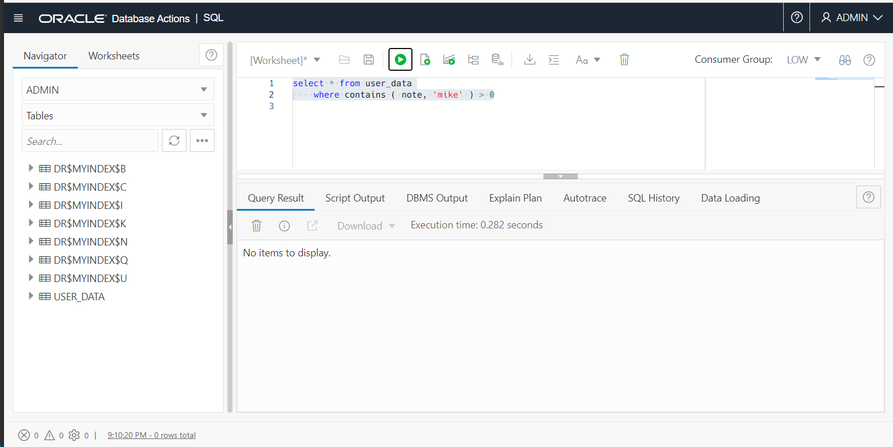
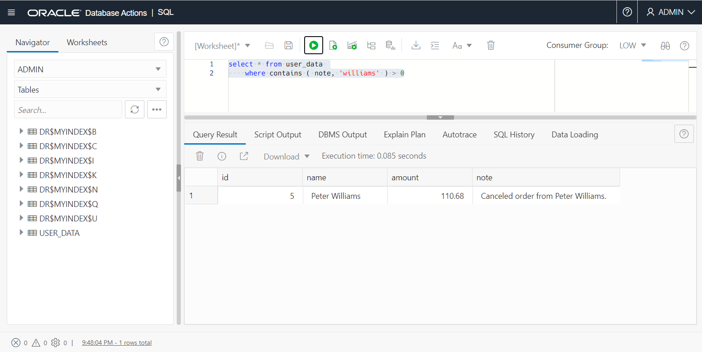
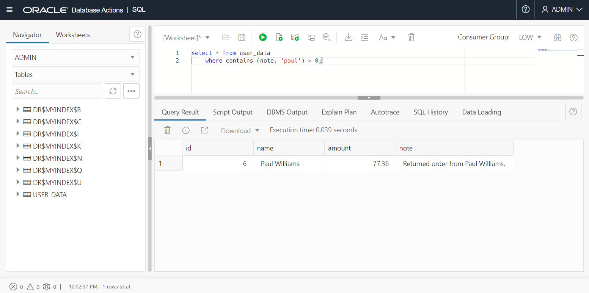

# Maintain Indexes

## Introduction

So far we've seen how to create and query an Oracle Text index. That's the basics of Oracle Text, but we need to cover a couple of topics under index maintenance.

Oracle Text indexes are not, by default transactional. After changes to the indexed table, the index must be **synchronized** before the new data can be found by a search.

After many changes to an Oracle Text index, it will perform less than ideally, because of fragmentation of the index and garbage (deleted) data accumulating in the index. To get the index to its best state, we must **optimize** it.

Estimated Time: 20 minutes

### Objectives

In this lab, you will:

* See that indexes are not updated automatically
* Learn how to synchronize an index, either manually or automatically
* See that indexes get fragmented over time
* Learn how to optimize the index

### Prerequisites

* Be logged into your Oracle Cloud Account
* Have completed at least Lab 2, Creating Indexes

## Task 1: Open Database Actions

We'll assume you're already in Database Actions having just completed the previous lab. If not, then follow Task 1 in Lab 3: Queries.

## Task 2: Synchronization

1.  Let's insert a new row into USER_DATA. Copy the following a click on the "Run Statement" button:

    ```
    <copy>
    insert into user_data values (4, 'Mike Smith', 98.76, 'Third one from Mike Smith.')
    </copy>
    ```

    Now try a query for the data you just inserted:

    ```
    <copy>
    select * from user_data
        where contains ( note, 'mike' ) > 0
    </copy>
    ```
    

    When you run that you will get no results. Remember CONTAINS *only* works with a CONTEXT index. And if that index isn't up-to-date, neither will the results be. To get the right results, we must __SYNC__hronize the index. The basic way to do this is to call a PL/SQL procedure __CTX\_DDL.SYNC\_INDEX__ (your user will need to have CTXAPP role to access that, or have been explicitly granted __EXECUTE ON CTXSYS.CTX\_DDL__). The index name is passed in as a parameter to the procedure.

 2. Synchronize the index. Run this:

    ```
    <copy>
    execute ctx_ddl.sync_index ('myindex')
    </copy>
    ```

    Now try the previous query for 'mike' again and it will work.

    

## Task 3: Automatic SYNC on commit

Running __SYNC\_INDEX__ manually is efficient, and gives you full control. However, you can have the index synchronize automatically, either by specifying that it should be synchronized on commit, or by specifying a regular time period (such as every minute) to perform the synchronization.

1.    Drop the current index first:

    ```
    <copy>
    drop index myindex
    </copy>
    ```

2.    Whenever non-default index behavior is required, we use a PARAMETERS clause with the index. Here we're going to specify __SYNC(ON COMMIT)__ to have it sync automatically at COMMIT time:

    ```
    <copy>
    create index myindex on user_data(note) indextype is ctxsys.context
        parameters ('sync (on commit)')
    </copy>
    ```

3.    Now we'll add a new row to the table, and search for it:

    ```
    <copy>
    insert into user_data values (5, 'Peter Williams', 110.68, 'Canceled order from Peter Williams.' )
    </copy>
    ```

    The SQL Workshop in Autonomous Database commits automatically, so our insert should be immediately available. Run a and we will find the new row without having to call __CTX\_DDL.SYNC\_INDEX__.

    ```
    <copy>
    select * from user_data 
        where contains ( note, 'williams' ) > 0
    </copy>
    ```

    

## Task 4: Automatic SYNC at time intervals

SYNC(ON COMMIT) is convenient, but not ideal in high transaction-rate situations. It can lead to transactions getting delayed as they wait for the previous SYNC to complete. Instead, you can choose to have SYNC performed at a specific time period.

The longer that time period is (five minutes is often chosen) the less your index will need to be optimized. However, if you need near-real-time syncs, you can choose a period as low as one second.

Time interval SYNCs use the database scheduler, so in 19c and before you must have __CREATE JOB__ privilege to use it.

1.  Drop the existing index:

    ```
    <copy>
    drop index myindex
    </copy>
    ```

2.  Now create the index again, but this time specify that it should be SYNC'd every minute. The syntax for the time period comes from DBMS\_SCHEDULER.

    ```
    <copy>
    create index myindex on user_data(note) indextype is ctxsys.context
        parameters ('sync (every "freq=minutely; interval=1")')
    </copy>
    ```

3.  Now insert a new row

    ```
    <copy>
    insert into user_data values (6, 'Paul Williams', 77.36, 'Returned order from Paul Williams.' )
    </copy>
    ```

4.  Search for the new row. Initially, you'll probably find that it doesn't find the new row, but keep repeating the query and it will work 
    within one minute.

    ```
    <copy>
    select * from user_data 
        where contains (note, 'paul') > 0;
    </copy>
    ```
    

## Task 5: Optimization

1.  Examine the "dollar I" table.

    Now we've done an update to the index, let's take another look at the list of indexed words in the $I table. Run the following:

    ```
    <copy>
    select token_text from dr$myindex$i
    </copy>
    ```

    You should see that there are now two entries for the wors 'order' and 'williams. We won't worry about exactly why (though note they were used in the last update), but let's just say it's an example of index fragmentation. 
    
    
2.  Optimize the index

    We can optimize the index using another PL/SQL command in the ctx_ddl package: ctx\_ddl.optimize\_index. That takes two mandatory parameters, the name of the index and the type of optimization to perform. Common values are 'FULL' or 'REBUILD'. We'll go with 'FULL':

    

    ```
    <copy>
    execute ctx_ddl.optimize_index('myindex', 'FULL')
    </copy>
    ```

    Now try the previous select from the $I table again. There is now only one entry for 'order' and one entry for 'williams' - the index information for those words have been condensed into a single row for each word.

    

You should now have a good grounding in creating Oracle Text indexes, running basic queries against those indexes, and maintaining those indexes.

There is much more to Oracle Text than we were able to cover here, so look out for an advanced Oracle Text LiveLab coming soon.

## Acknowledgements

- **Author** - Roger Ford, Principal Product Manager
- **Contributors** - Kamryn Vinson, Andres Quintana, James Zheng
- **Last Updated By/Date** - Roger Ford, March 2022
