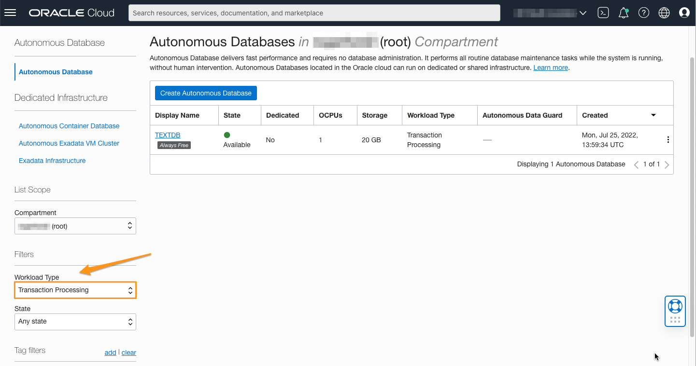
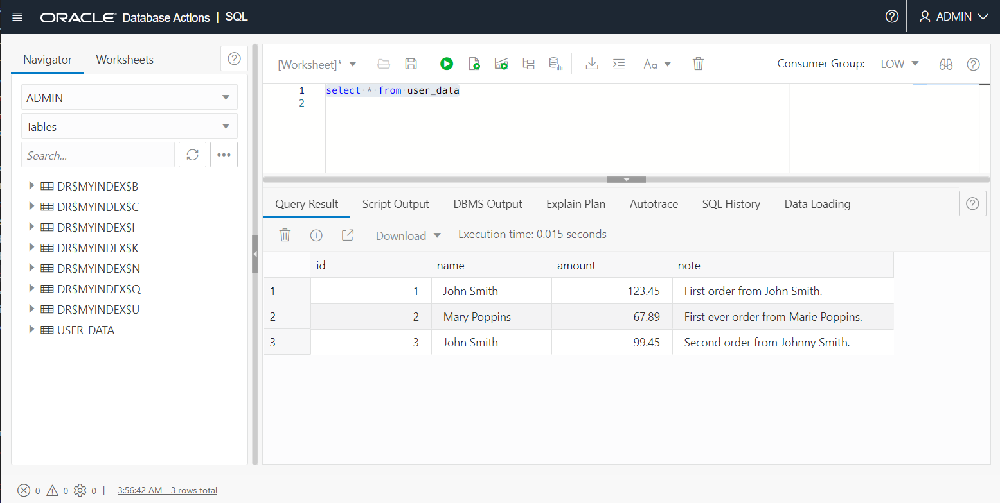
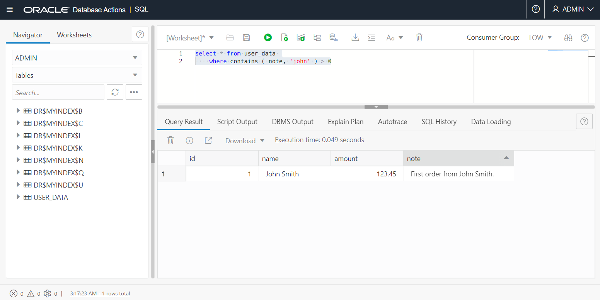
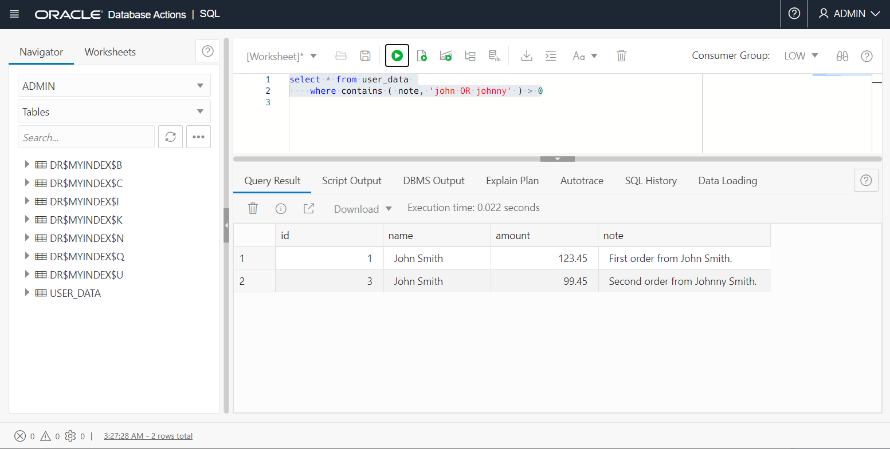
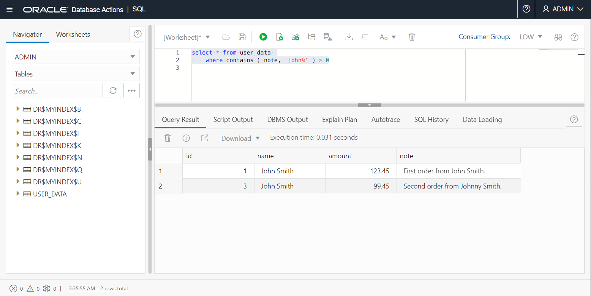
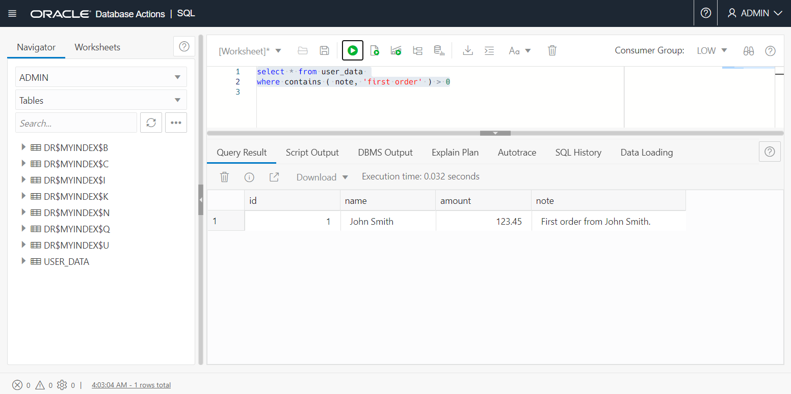
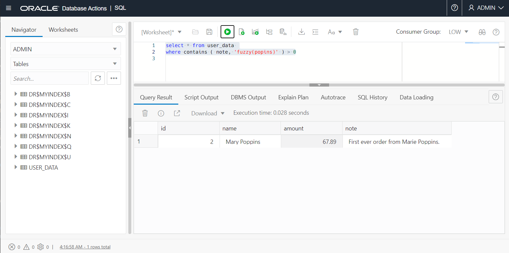
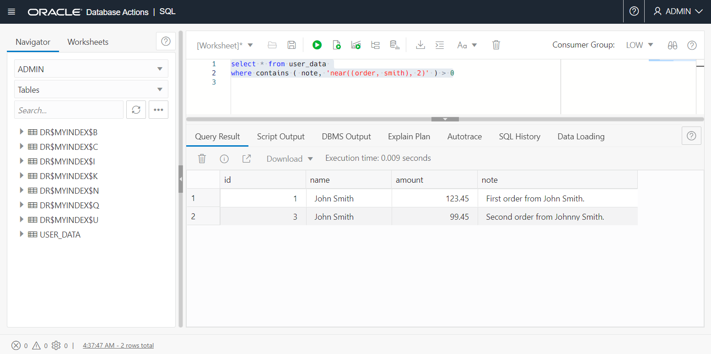

# Run Queries

## Introduction

This lab will use the SQL Workshop in Database Actions from the Autonomous Transaction Processing page. We will explore the CONTAINS operator, used to query Oracle Text indexes.

Estimated Time: 10 minutes

### Objectives

In this lab, you will:

* Explore the CONTAINS text query operator
* Look at various basic text searches
* See how the SCORE() operator helps you rank your query results

### Prerequisites

* Be logged into your Oracle Cloud Account
* Have completed the previous lab to create an index

## Task 1: Open Database Actions

1. If you have just completed the previous lab, you can skip this task as you will already be in Database Actions.
Otherwise, log in to the Oracle Cloud.

<if type="freetier">

2. If you are using a Free Trial or Always Free account, and you want to use Always Free Resources, you need to be in a region where Always Free Resources are available. You can see your current default **Region** in the top, right-hand corner of the page.

    

</if>
<if type="livelabs">

3. If you are using a LiveLabs account, you need to be in the region your account was provisioned in. You can see your current default **Region** in the top, right-hand corner of the page. Make sure that it matches the region on the LiveLabs Launch page.

    

</if>

4. Click the navigation menu in the upper left to show top level navigation choices.

5. Click on **Oracle Database** and choose **Autonomous Transaction Processing**.

    

6. Use the __List Scope__ drop-down menu on the left to select the same compartment where you created your Autonomous Database in Lab 2. Make sure your workload type is __Transaction Processing__. <if type="livelabs">Enter the first part of your user name, for example `LL185` in the Search Compartments field to quickly locate your compartment.
<if type="livelabs">

    

</if>
<if type="freetier">
    
</if>
    

<if type="freetier">
   > **Note:** Avoid the use of the ManagedCompartmentforPaaS compartment as this is an Oracle default used for Oracle Platform Services.
</if>

7. You should see your database **TEXTDB** listed in the center. Click on the database name "JSONDB".

    

8.  On the database page, choose __Database Actions__.

    

9.  You are now in Database Actions.

    Database Actions allows you to connect to your Autonomous Database through various browser-based tools. We will just be using the SQL workshop tool.
    

10. You should be in the Database Actions panel. Click on the **SQL** card

    

## Task 2: Run Text Queries

1.  First familiarize yourself with the text contained in USER_DATA. Copy the following and press the "Run Command" button.

    ```
    <copy>
    select * from user_data
    </copy>
    ```

    

    There are three rows in our table. Take a minute to review each one.


2.  The CONTAINS operator

    To search an Oracle Text CONTEXT index you must use the CONTAINS operator. CONTAINS is specific to that type of index.
    Unlike 'ordinary' indexes, you can't get the same results with or without an index. CONTAINS simply won't work if there is no CONTEXT index present.

    CONTAINS is a function returning a number. It is almost always used in the form __WHERE CONTAINS(...) > 0__. If the return value is greater than zero, there's a match for the row, if it's zero there isn't.

    CONTAINS takes two or three arguments. The third is optional and we'll leave it for later. The two required arguments are:

    1.  The name of the column to be searched
    2.  A string value to search for. The string can be a literal string, or anything that evaluates to a string (VARCHAR2 or CLOB).
    
    Let's try a simple example. We'll look for the word 'John':

    ```
    <copy>
    select * from user_data 
        where contains ( note, 'john' ) > 0
    </copy>
    ```
    

    Notice that we found the one row with the word "John". However, we didn't find the row which contains "Johnny". This illustrates one of the many differences between an Oracle Text search and a simple LIKE search such as __WHERE TEXT LIKE '%John%'__.  LIKE does substring searches, whereas CONTAINS is looking (by default) for whole words.

    You could also try searching for upper-case JOHN. You'll get the same result. CONTAINS searches (at least for an English index) are not case-sensitive, unlike LIKE searches.

3.  Mixed Queries

    CONTAINS is a SQL operator. So you can, of course, combine it with any other WHERE clause. For example, we can look for the word 'Smith' where the value of AMOUNT is less than 100. Let's try that:

    ```
    <copy>
    select * from user_data
        where amount < 100
        and   contains ( note, 'smith' ) > 0
    </copy>
    ```

    

4.  An OR search

    The search string argument to CONTAINS has its own syntax, with various internal operators such as __AND__, __OR__, __NEAR__ and many others. We'll just show one example here, for more information you should refer to the [Documentation](https://docs.oracle.com/en/database/oracle/oracle-database/19/ccref/oracle-text-CONTAINS-query-operators.html).

    Before, we searched for "John" but didn't find "Johnny". Let's search for either:

    ```
    <copy>
    select * from user_data 
        where contains ( note, 'john OR johnny' ) > 0
    </copy>
    ```

    Sure enough, now we find both.

    

5.  Wildcards

    An alternative way to run the previous search would be to use the wildcard operator __%__. As with standard SQL, a percentage sign __%__ matches any string of characters, and an underscore _____ character matches any single character.

    So __john%__ will match "john", "johnny", "johnnie", "johnston", and so on.  __l_se__ will match "lose", but not "loose".

    Since the wildcards apply only to indexed words, they will never match a space. So __qui%step__ will match "quickstep" but it will **not** match the phrase "quick step".

    Let's try it:

    ```
    <copy>
    select * from user_data 
      where contains ( note, 'john%' ) > 0
    </copy>
    ```

    

6.  Phrase searches

    If you want to find two words in the same document, you can do an __AND__ search, similar to the __OR__ you did above. If you want to find two words together, you just enter them as a phrase. No need to add quotes or anything, two words together automatically constitute a phrase search and will match only if they appear together in the indexed text.

    ```
    <copy>
    select * from user_data 
      where contains ( note, 'first order' ) > 0
    </copy>
    ```

    Note that only matches the first row where the actual phrase "first order" appears, and not the other row where the two words appear, but not as a phrase.

    

7.  Fuzzy searches

    If you make a mistake or simply don't remember the exact spelling, you can do a __FUZZY__ search. It will find not only the original search word, but also all those similar to it.

    ```
    <copy>
    select * from user_data 
      where contains ( note, 'fuzzy(popins)' ) > 0
    </copy>
    ```

    Note that there is a spelling mistake in the search word "popins". But with __FUZZY__ search, it actually finds the result with the correct word "Poppins".

    

8.  Near searches

    You can find words close to each other using the __NEAR__ operator. It will find words within specified distance of each other. For example, the following query doesn't find any result. Because there are two words between "order" and "smith", but we specified that we wanted a maximum of 1 word between them.

    ```
    <copy>
    select * from user_data 
      where contains ( note, 'near((order, smith), 1)' ) > 0
    </copy>
    ```

    

    While the next query finds the result since it correctly specifies the distance 2 between "order" and "smith".

    ```
    <copy>
    select * from user_data 
      where contains ( note, 'near((order, smith), 2)' ) > 0
    </copy>
    ```

    

    Please note that by default the order of the words within a near operator doesn't matter, unless the ORDER parameter is explicitly set to TRUE. But in a phrase search, the order of the words does matter.


This is as far as well go in exploring queries in this lab, but feel free to experiment further.

You can find a list of query operators here: [Contains Query Operators](https://docs.oracle.com/en/database/oracle/oracle-database/19/ccref/oracle-text-CONTAINS-query-operators.html).

You may now continue to the next lab.

## Acknowledgements

- **Author** - Roger Ford, Principal Product Manager
- **Contributors** - Kamryn Vinson, Andres Quintana, James Zheng
- **Last Updated By/Date** - Roger Ford, March 2022
