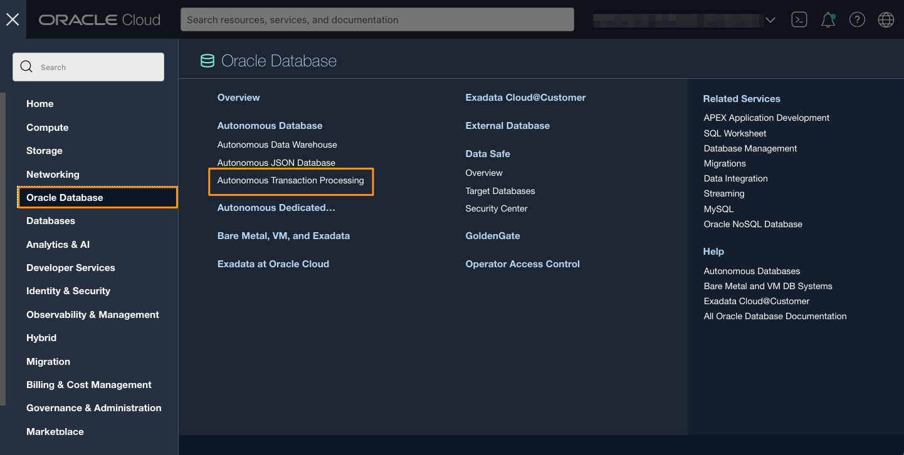
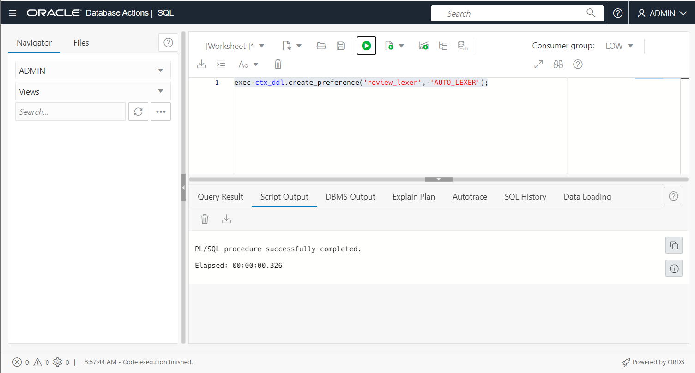
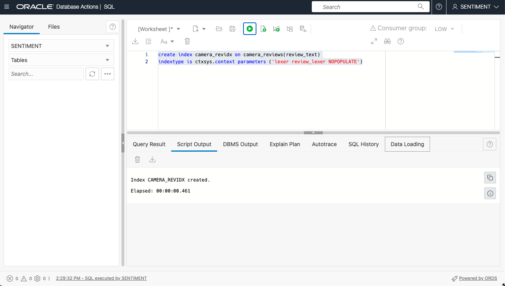
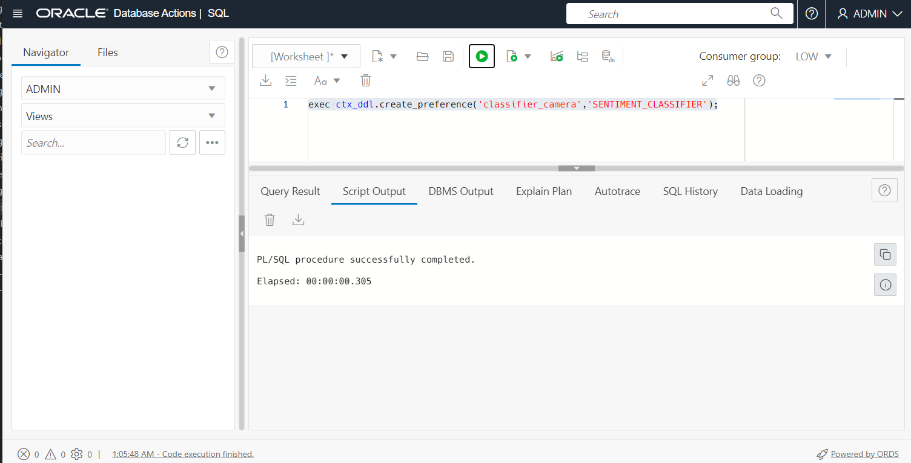
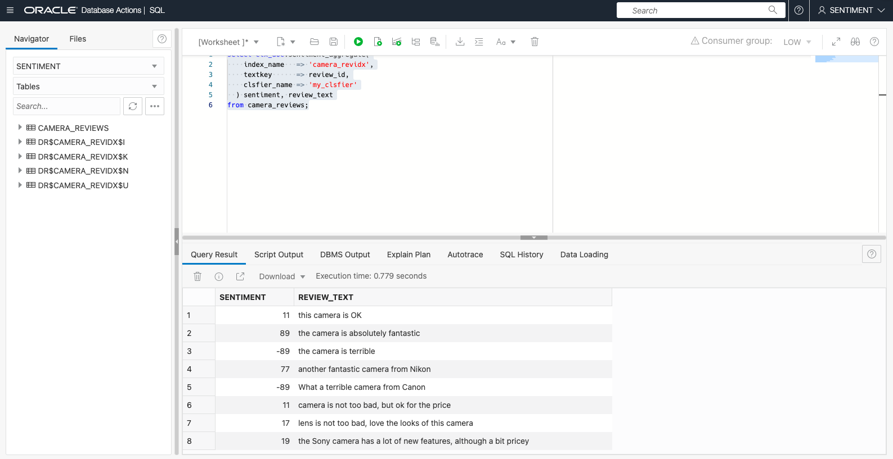
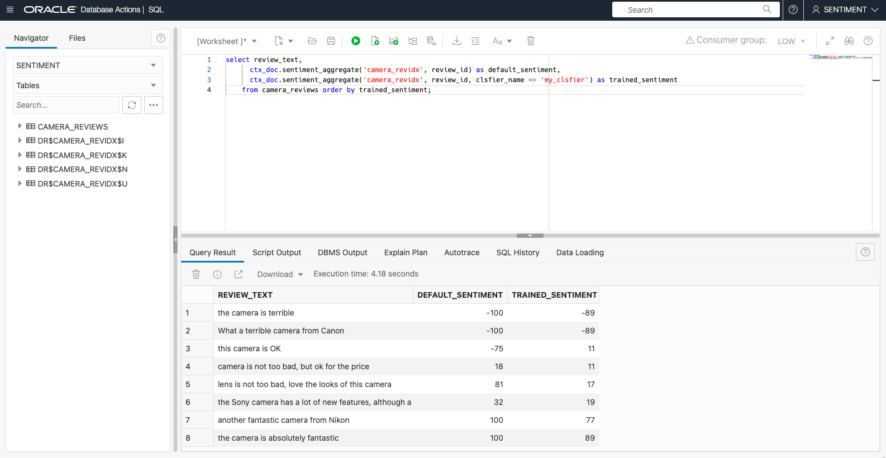

# Optional Lab - Sentiment Analysis

## Introduction

Sentiment analysis provides answers to questions such as "Is a product review positive or negative?" or "Is the customer satisfied or dissatisfied?" For example, from a document set consisting of multiple reviews for a particular product, you can determine an overall sentiment that indicates if the product is good or bad.

Oracle Text enables the user to perform sentiment analysis for a topic or document by using sentiment classifiers that are trained to identify sentiment metadata. It

Oracle Text can perform sentiment analysis using a basic, built-in "bag of words" classifier (for English text). For better results, or to work with other languages, you can train your own classifier using a set of training documents.

This lab will use the SQL Workshop in Database Actions from the Autonomous Transaction Processing page. It will create a classifier and use it to analyze the sentiment of a set of documents about camera reviews.

The lab is optional if you have completed all the other labs.

Estimated Time: 20 minutes

Watch the video below for a quick walk-through of the lab.
[Sentiment Analysis](videohub:1_s4lnxfw5)

### Objectives

In this lab, you will:

* Analyze documents for sentiments using the built-in default classifier
* Train a custom classifier using a separate training set of documents
* Use the trained classifier to analyze the documents
* Compare the accuracy of two analysis approaches

### Prerequisites

* Be logged into your Oracle Cloud Account
* Have completed the previous lab to create an index

## Task 1: Open Database Actions

1. If you have just completed the previous lab, you can skip this task as you will already be in Database Actions.
Otherwise, log in to the Oracle Cloud.

2. Click the navigation menu in the upper left to show top-level navigation choices.

3. Click on **Oracle Database** and choose **Autonomous Transaction Processing**.

    

4. Use the __List Scope__ drop-down menu on the left to select the same compartment where you created your Autonomous Database in Lab 2. Make sure your workload type is __Transaction Processing__. <if type="livelabs">Enter the first part of your user name, for example `LL185` in the Search Compartments field to quickly locate your compartment.

5. You should see your database **TEXTDB** listed in the center. Click on the database name "JSONDB".

    

6.  On the database page, choose __Database Actions__.

    

7.  You are now in Database Actions.

    Database Actions allows you to connect to your Autonomous Database through various browser-based tools. We will just be using the SQL workshop tool.
    

8. You should be in the Database Actions panel. Click on the **SQL** card

    

## Task 2: Use the Default Classifier

1.  Load review data for analysis

    This is the actual data that you want to analyze. In this case, we'll create a "camera_review" table and load review text into this table.
	
	Create review table

    ```
    <copy>
    create table camera_reviews(review_id number primary key, review_text varchar2(2000))
    </copy>
    ```
	
	

	Insert review data. You'll need to select all the lines before running this, or else use the "Run SQL Script" button 

    ```
    <copy>
    insert into camera_reviews values (1, 'this camera is OK');
	insert into camera_reviews values (2, 'the camera is absolutely fantastic');
	insert into camera_reviews values (3, 'the camera is terrible');
	insert into camera_reviews values (4, 'another fantastic camera from Nikon');
	insert into camera_reviews values (5, 'What a terrible camera from Canon');
	insert into camera_reviews values (6, 'camera is not too bad, but ok for the price');
	insert into camera_reviews values (7, 'lens is not too bad, love the looks of this camera');
	insert into camera_reviews values (8, 'the Sony camera has a lot of new features, although a bit pricey');
    </copy>
    ```
	
	

    Check that all rows have loaded. You should see 8 rows.

    ```
    <copy>
    select * from camera_reviews
    </copy>
    ```

2. Create a Text index on review data

    Before we can use sentiment analysis, we must create an Oracle Text index on the table. The index doesn't need to be populated, it is intended only to provide metadata information (for example datastore and filter information) so sentiment analysis knows how to process the data. For using the default classifier, we *must* use AUTO\_LEXER. So we need to 

    - Create a preference which uses AUTO_LEXER
    - Use the NOPOPULATE keyword 

    Create the required AUTO\_LEXER preference as follows:

    ```
    <copy>
    exec ctx_ddl.create_preference('review_lexer', 'AUTO_LEXER')
    </copy>
    ```
	
	

	Create the index on review data using the preference we just created and the NOPOPULATE keyword

    ```
    <copy>
    create index camera_revidx on camera_reviews(review_text)
    indextype is ctxsys.context 
    parameters ('lexer review_lexer NOPOPULATE');
    </copy>
    ```

	

3. Run sentiment analysis

    Sentiment analysis runs on a row-by-row basis, using the PL/SQL procedure **CTX\_DOC.SENTIMENT\_AGGREGATE**. That returns a numeric value indicating the sentiment of the document in the range -100 to 100, where -100 is maximally negative, 0 is neutral, and 100 is maximally positive. The function takes the name of an index, and a **TEXTKEY** which is either the unique key value for the row, or if the table has no unique key, a *ROWID* value (we can swap between using keys and rowids using **CTX\_DOC.SET\_KEY\_TYPE**.

    So to get each review text together with its calculated sentiment, we can run the following:

    ```
    <copy>
    select ctx_doc.sentiment_aggregate(
        index_name => 'camera_revidx',
        textkey    => review_id 
      ) sentiment, review_text
    from camera_reviews;
    </copy>
    ```

	

## Task 3: Use a Trained Classifier

Training a classifier involves providing a set of training documents which are already known to be positive, neutral or negative. Such documents may have been reviewed by a human, or you might use additional metadata (such as star rating) provided by users. 

Training uses a machine learning algorithm called Support Vector Machine, or SVM.

The more training documents you can provide, the better the classifier will be. Since we're only going to provide a very few sample documents here, the classifier will be very crude.

1. Load the training data

    We'll load a training table of reviews. In the next step, we'll label each review with its associated sentiment.

    First, create a table called "training\_camera" to hold the training data

    ```
    <copy>
    create table training_camera(train_id number primary key, train_text varchar2(2000))
    </copy>
    ```
    

    Insert training data into the training table

    ```
    <copy>
    insert into training_camera values( 1,'this camera is OK');
	insert into training_camera values( 2,'the camera is absolutely fantastic');
	insert into training_camera values( 3,'the camera is terrible');
	insert into training_camera values( 4,'i love the lens, but overall ok camera');
	insert into training_camera values( 5,'the camera has mediocre lens, but a lot of nice features');
    </copy>
    ```
    

2.  Label the training data with sentiments

    We use a separate table to hold the sentiments associated with each row in the ‘training\_camera’ table:

    ```
    <copy>
    create table training_category(doc_id number, category number, category_desc varchar2(100))
    </copy>
    ```

    
	
    For each row in the training data table, we must insert a row which indicates the category for that row. A category is an integer value representing neutral, positive or negative as listed in the following table. The 'categoy_desc' column is included here as a human readible comment, and is neither necessary, nor used in the classification process.

    | Integer  |  Meaning |

    |  0       | neutral  |

    |  1       | positive |

    |  2       | negative |

	Given that, we can create category rows as follows (you may wish to refer back to the training table to check the text involved for each line)

    ```
    <copy>
    insert into training_category values( 1, 0, 'neutral');
	insert into training_category values( 2, 1, 'positive');
	insert into training_category values( 3, 2, 'negative');
    insert into training_category values( 4, 0, 'neutral');
    insert into training_category values( 5, 0, 'neutral');
    </copy>
    ```
    	
	

3.  Create an SVM sentiment classifier.

    The first step is to create a SENTIMENT\_CLASSIFIER preference called "classifier\_camera".

    ```
    <copy>
    exec ctx_ddl.create_preference('classifier_camera','SENTIMENT_CLASSIFIER')
    </copy>
    ```

    

    You can optionally set attributes for the classifier "classifier\_camera".

    ```
    <copy>
    exec ctx_ddl.set_attribute('classifier_camera','MAX_FEATURES','1000');
	exec ctx_ddl.set_attribute('classifier_camera','NUM_ITERATIONS','600');
    </copy>
    ```

    

4.  Index the training set

    Create an index on the training table. This index is only used for its associated metadata and therefore can be created using the "nopopulate" option and is very fast. For a trained classifier, you do <not> need to use AUTO\_LEXER, we will allow it to use the default English lexer (BASIC\_LEXER).

    ```
    <copy>
    create index training_idx on training_camera(train_text) 
	indextype is ctxsys.context parameters ('nopopulate');
    </copy>
    ```

    

5.  Train the classifier

    The procedure SA\_TRAIN\_MODEL (SA for Sentiment Analysis) takes information about the training and category tables (and their various columns), plus the names of the index and classifier preference we just created. This will then generate a *model* with the name given in the first argument - in this case, 'my_clsfier'
 
    ```
    <copy>
    begin
	  ctx_cls.sa_train_model (
        clsfier_name => 'my_clsfier',
		index_name   => 'training_idx',
		docid        => 'train_id',
        cattab       => 'training_category',
		catdocid     => 'doc_id',
        catid        => 'category', 
		pref_name    => 'classifier_camera'
        );
    end;
    </copy>
    ```

    


6. Run sentiment analysis using the trained classifier

    The process to run sentiment analysis is very similar to last time, except that this time we need to provide the classifier name, rather than allowing it to default.

    Remember we already have a 'nopopulate' text index on the **camera\_reviews** table - if we hadn't created it in the previous step we'd need to create it here before using the new classifier.
    ```
    <copy>
    select ctx_doc.sentiment_aggregate(
        index_name   => 'camera_revidx',
        textkey      => review_id,
        clsfier_name => 'my_clsfier'
      ) sentiment, review_text
    from camera_reviews;
    </copy>
    ```

	

7.  Compare Classifier Accuracy against Dictionary Approach

    We can also run both the trained and untrained classifiers in the same query, to compare the efficiency of the two. Of course, this is a contrived example with carefully chosen training words, but in the real world, you should see significantly better performance from the trained classifier, assuming a reasonably-sized training set. 

    ```
    <copy>
    select review_text,
	  ctx_doc.sentiment_aggregate('camera_revidx', review_id) as default_sentiment,
	  ctx_doc.sentiment_aggregate('camera_revidx', review_id, clsfier_name => 'my_clsfier') as trained_sentiment
    from camera_reviews order by trained_sentiment;
    </copy>
    ```
	
    


This is as far as well go in exploring sentiment analysis in this lab, but feel free to experiment further.

You can find more details of sentiment analysis here: [Sentiment Analysis](https://docs.oracle.com/en/database/oracle/oracle-database/19/ccapp/performing-sentiment-analysis-using-oracle-text.html).

You may now continue to the next lab.

## Acknowledgements

- **Author** - Roger Ford, Principal Product Manager
- **Contributors** - Kamryn Vinson, Andres Quintana, James Zheng
- **Last Updated By/Date** - Roger Ford, August 2022
