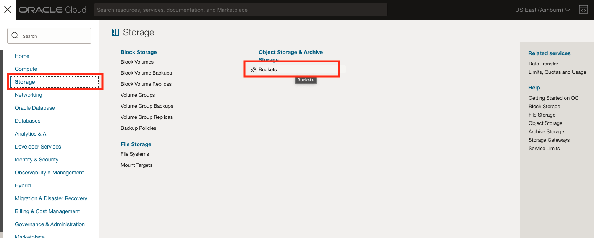

# Index binary files

## Introduction

As well as plain text files, an external index can be configured to index binary files, such as Microsoft Office files (Word, Excel, Powerpoint) and PDF files. It can even index many types of multi-file archives, such as zip or tar files.

When processing binary files, the files are first *filtered* to extract their textual content, and that content is indexed. 

The filter knows about around 150 different file formats. Not everything can usefully be indexed - the filtering doesn't do optical character recognition (OCR), so an image file showing text will not be indexed. Likewise, some scanned PDF files will just be images and so will not have extractable text.

If multi-file archives are indexed, each file is extracted from the archive, filtered (if necessary) and then the text content of all the files in the archive is combined for indexing. A query can't tell you which individual file in the archive contains a particular word or words, just that those words appear somewhere in the set of files.

Estimated Time: 10 minutes

### Objectives

In this lab, you will:

* Load additional files to your bucket
* Drop the existing external text index
* Create a new index with the **"binary_files": true** setting
* Search for the contents of binary files

### Prerequisites

* Be logged in to your Oracle Cloud Account
* Have the URI for your bucket that you created in Lab 2
* Have the name of the credential you created in Lab 3

## Task 1: Download the sample files

We have two simple binary files, a PDF file of pangrams, and a zip file containing four text files. Download these to a location on your local machine.

* [pangrams.pdf](https://objectstorage.us-ashburn-1.oraclecloud.com/p/1ggC2PFheJunfA30X-MYL-3Rm8vS_9zyoqOahli8yXV_fD3cM5dP2QlKiizCGvsX/n/c4u04/b/livelabsfiles/o/data-management-library-files/pangrams.pdf "pangrams.pdf download")
* [files.zip](https://objectstorage.us-ashburn-1.oraclecloud.com/p/VEKec7t0mGwBkJX92Jn0nMptuXIlEpJ5XJA-A6C9PymRgY2LhKbjWqHeB5rVBbaV/n/c4u04/b/livelabsfiles/o/data-management-library-files/files.zip "files.zip download")

I suggest you take a look at those files before we continue. You will find that the PDF file contains the usual list of pangrams, and the zip file consists of three files, with the following text in them:

* file1.txt : hello world
* file2.txt : goodbye world
* file3.txt : now is the time for all good men to come to the aid of the party

## Task 2: Upload files to your existing bucket

1. Log in to the Oracle Cloud.

<if type="freetier">

2. If you are using a Free Trial or Always Free account, and you want to use Always Free Resources, you need to be in a region where Always Free Resources are available. You can see your current default **Region** in the top, right-hand corner of the page.

    

</if>
<if type="livelabs">

2. If you are using a LiveLabs account, you need to be in the region your account was provisioned in. You can see your current default **Region** in the top, right-hand corner of the page. Make sure that it matches the region on the LiveLabs Launch page.

    

</if>

3. Click the navigation menu in the upper left to show top-level navigation choices.

4. Click on **Storage** and choose **Buckets** under the heading "Object Storage and Archive Storage.

    

5. Use the __List Scope__ drop-down menu on the left to select the same compartment where you created your Autonomous Database in Lab 1.

<if type="livelabs">Enter the first part of your user name, for example `LL185` in the Search Compartments field to quickly locate your compartment.

    

</if>
<if type="freetier">
5. If using FreeTier, your compartment should be the root compartment for your tenancy.

    
</if>

<if type="freetier">
   **Note:** Avoid the use of the ManagedCompartmentforPaaS compartment as this is an Oracle default used for Oracle Platform Services.
</if>

6. In the list of buckets, choose the bucket name you created earlier. 

    

    You can now upload the two new documents (downloaded in Task 1) to the bucket. Click the **Upload** button near the bottom of the page, then drag and drop your documents, or use the file selector. Finally, click the **Upload** button, and close the panel once all your files are uploaded.

    

## Task 2: Drop the existing External Text Index

Once an index has been created, we can't change it to allow for binary files. So we'll need to drop it before we recreate it with the correct options.

1. Open Database Actions - SQL

    You may already have Database Actions open in another browser tab. If you don't, reopen it, following the instruction in task 1 of Lab 5 (Run Queries).

2. Drop the existing external text index:

    Copy the following text into the **Worksheet** panel, and click the **Run Statement** button.

    ```
    <copy>
    begin
        dbms_cloud.drop_external_text_index (
            index_name      => 'mydocs'
        );
    end;
    </copy>
    ```
    You should see "PL/SQL procedure successfully completed" at the bottom.

    If you refresh the list of tables on the left you will see that MYDOCS$TXTIDX, along with its associated index tables, have all disappeared.

    

## Task 3: Create a new index with **binary_files: true**

In order to include binary files, we just have to modify the 'format' parameter when creating the index. All other parameters are the same as before. Remember to modify the SQL below to use your own bucket URI.

Note that in the format parameter, we have a new option for **'binary_files'**. Be careful not to put quotes around **true**, it is a special property in JSON, not a string value.

If we don't specify **binary_files: true** then the indexing process will simply ignore all files that it detects as binary.

1. Run the following SQL:

    ```
    <copy>
    begin
        dbms_cloud.create_external_text_index (
            credential_name => 'mycredential',
            location_uri    => 'https://objectstorage.uk-london-1.oraclecloud.com/n/lrqmxecwz64w/b/mydocs/o/',
            index_name      => 'mydocs',
            format          => JSON_OBJECT('refresh_rate' value '1', 'binary_files' value true)
        );
    end;
    </copy>
    ```
    You should see "PL/SQL procedure successfully completed" at the bottom.

    

3. List the indexed files

    In the **Worksheet** area, enter the following SQL and click the *Run Statement* button

    ```
    <copy>
    select * from mydocs$txtidx
    </copy>
    ```

    Once again, you may have to wait a short while for the table to be populated. If you still don't see anything after a few minutes, then it's likely that either the location_uri was incorrect, or the credential is not valid. See Lab 4 task 4 for troubleshooting steps.

4. Run queries

    Let's repeat our simple query from before.

    ```
    <copy>
    select * from mydocs$txtidx 
    where contains (object_name, 'jump') > 0
    </copy>
    ```

    This time we'll see that there's the PDF file in our list. So even though it's a binary file, we've extracted the text from it and identified that it contains the word 'jump'.

    Now we'll try to find some terms in our zip file.

    ```
    <copy>
    select * from mydocs$txtidx 
    where contains (object_name, 'hello AND goodbye') > 0
    </copy>
    ```

    

    If you recall from earlier, the zip file contains three files. 'hello' and 'world' are present, but in different files within the archive. But since the file contents are concatenated together, we can find the two words with a simple AND query.

    It should be noted that indexing binary files is a fairly expensive process. If you try to index a large collection of binary files, particularly one that contains lots of archives, it will take a lot of resources. That's the reason that 'binary_files' is not the default option when creating an external text index.

## Acknowledgements

- **Author** - Roger Ford, Principal Product Manager, Oracle Database
- **Last Updated By/Date** - Roger Ford, November 2022
